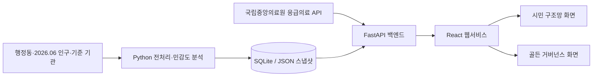

# 대구 골든타임

대구 시민에게 현재 위치 기반 응급의료기관 정보와 길찾기를 제공하고,
대구광역시 150개 행정동의 소아·고령층 응급의료 접근성 격차를 분석하는
공공데이터 기반 응급의료 웹서비스입니다.

이 프로젝트는 두 개의 핵심 기능으로 구성됩니다.

- **시민 구조망:** 최근 조회 응급실·병상정보, 가까운 병원, 전화 및 길찾기 제공
- **골든 거버넌스:** 의료 사각지대 분석 및 응급의료 자원배치 우선순위 도출

## 30초 요약

| 항목 | 현재 검증본 |
|---|---|
| 시민 문제 | 가까운 응급의료기관의 위치·거리·예상 이동시간·전화·길찾기와 최근 조회 병상정보를 한 화면에서 확인 |
| 정책 문제 | 150개 행정동의 소아·고령층 수요와 실제 도로 접근성 격차를 비교하고 자원배치 후보를 검토 |
| 분석 범위 | 2026.06 인구, 소아 6개·어르신 19개 기준 기관, 안정 후보 9곳 |
| 검증 규모 | K-Means 민감도 소아 240회·어르신 240회, 실제 도로 경로 5,100건·누락 0건 |
| 의사결정 모델 | 후보군 내부의 시설 1~3개 조합을 p-median·MCLP 목적함수로 전수 비교 |
| 재현성 | 입력·산출물 SHA-256, 단일 정책 릴리스, Pytest·Vitest·GitHub Actions |

## 🔗 바로가기

- 🌐 [배포 서비스 이용하기](https://ssg-sak.github.io/golden-project/)
- 🚑 [시민 구조망: 가까운 응급의료기관 및 최근 조회 정보](#1-시민-구조망)
- 🗺️ [골든 거버넌스: 의료 접근성 및 정책분석](#2-골든-거버넌스)
- 📊 [분석 방법론](docs/methodology.md)

---

## 🧐 문제 정의

이 프로젝트는 서로 연결된 두 가지 문제에서 출발했습니다.

### 시민 관점의 문제
응급상황에서 시민은 단순히 병원 위치만 필요한 것이 아닙니다.
- 현재 위치에서 어떤 병원이 가까운가
- 차량으로 얼마나 걸리는가
- 소아·야간·휴일 진료가 가능한가
- 최근 조회된 응급실 또는 병상 정보가 확인되는가
- 실제 방문 전에 어디로 전화해야 하는가
공공데이터는 여러 기관과 API에 분산되어 있어 시민이 직접 확인하기 어렵습니다.

### 정책 관점의 문제
응급의료기관이 존재하더라도 모든 행정동이 동일한 수준의 의료 접근성을 갖는 것은 아닙니다.
- 소아와 고령층 인구가 많은 지역
- 병원과 멀리 떨어진 지역
- 의료기관의 기능과 공급이 부족한 지역
- 기존 배치만으로 충분히 커버되지 않는 지역
따라서 시민에게 현재 의료정보를 제공하는 기능과, 장기적으로 의료자원 배치를 개선하기 위한 정책분석 기능을 함께 구축했습니다.

---

## 🎯 핵심 분석 질문
*   취약인구와 일반 차량 도로 ETA를 함께 볼 때 어떤 행정동을 우선 확인해야 하는가?
*   K·난수 시드·거리 상한·군위 처리 조건을 바꿔도 반복해서 나타나는 후보는 어디인가?
*   안정 후보 9곳 안에서 시설 1~3개를 선택할 때 평균 ETA와 15분·30분 접근권은 어떻게 달라지는가?
*   현재 VDI 산식에서 취약인구와 ETA가 결과에 미치는 구조적 영향은 균형적인가?

---

## 🔑 주요 기능

### 1. 시민 구조망
*   사용자 위치 기반 가까운 응급의료기관 조회
*   병원별 거리 및 예상 이동시간 제공
*   지도와 병원 목록 연동
*   병원 상세정보 확인
*   전화 문의 기능
*   길찾기 API 연동
*   최근 조회 응급실·병상정보 제공
*   소아·야간·휴일 진료 조건 안내
*   119 및 1339 긴급 안내
*   API 장애 시 기본 병원 정보 fallback 제공

### 2. 골든 거버넌스
*   대구 150개 행정동 의료 접근성 분석
*   소아·고령층 분석 모드
*   취약인구·일반 차량 ETA 기반 VDI 산출
*   K=2~5 조건을 포함한 모드별 240회 후보 민감도 분석
*   반복 출현 중심점을 병합한 안정 후보 9곳 도출
*   5,100개 실제 도로 경로 기반 접근성 재계산
*   후보군 내부 p-median·MCLP 조합 비교
*   단일 정책 릴리스·SHA-256·테스트 기반 결과 검증

---

## 📸 서비스 화면 구성

### 시민 구조망
현재 위치를 기준으로 가까운 응급의료기관의 거리와 예상 이동시간을 제공하고,
병원 선택 시 전화번호, 진료 조건 및 길찾기 기능을 확인할 수 있습니다.
최근 병상 정보 조회에 실패한 경우에는 기본 병원 정보를 유지하면서 사용자에게 직접 전화 확인을 안내합니다.


### 골든 거버넌스
대구광역시 150개 행정동별 소아·고령층 취약도(VDI)를 시각화한 지도입니다.
민감도 분석에서 반복된 안정 후보와 실제 도로 ETA 기반 접근성 지표를 함께 보여주며, 후보군 내부의 p-median·MCLP 비교 결과를 정책 검토 자료로 제공합니다.


데스크톱·모바일 핵심 동선 반복 검증 결과와 캡처 조건은 [데모 검증 보고서](docs/DEMO_VALIDATION_REPORT_20260724.md)에 기록했습니다.

---

## 💾 사용 데이터

| 데이터 | 주요 변수 | 분석 목적 | 출처 | 기준 시점 |
| --- | --- | --- | --- | --- |
| **기준 의료기관** | 기관명, 모드, 좌표, 전화 | 소아 6개·어르신 19개 공급 기준 | NEMC 계열 수집 결과·대구시 달빛어린이병원 기준정보 | 현재 검증본 고정 |
| **응급의료기관 최근 조회 정보** | 조회 시점 가용 병상, 장비 상태 | 시민 구조망 최근 조회 병상 안내 | 국립중앙의료원(NEMC) API | API 조회 시점 |
| **행정동별 인구 통계** | 0~9세, 65세 이상 인구 | 계층별 의료 수요와 VDI 산출 | 주민등록인구 처리 자료 | 2026.06 |
| **행정동 경계·중심점** | 150개 행정동 경계, 대표점 | 공간 결합과 도로 경로 출발점 | 저장된 검증 GeoJSON | 현재 검증본 고정 |
| **도로 경로** | 거리, 일반 차량 ETA | 기존 기관·후보 접근성 비교 | Kakao Mobility 경로 API 결과 | 단일 수집 스냅샷 |

> *참고: 개인정보는 일체 사용되지 않았으며, 최근 조회값을 제공하는 NEMC API 데이터를 제외한 공간 분석용 원본 데이터는 재현성을 위해 SQLite DB 및 로컬 스냅샷(JSON)으로 저장소에 포함되어 있습니다.*

---

## ⚙️ 데이터 처리 과정

```text
150개 행정동·2026.06 연령별 인구·기준 기관 25개 정규화
→ 직선거리 기반 초기 VDI와 사각지대 수요점 구성
→ EPSG:5179 동일 가중 K-Means 후보 생성
→ K=2~5·시드·거리 상한·군위 조건을 조합한 모드별 240회 민감도 분석
→ 반복 출현 중심점의 공간 병합과 안정 후보 9곳 승격
→ 150개 행정동 × (25개 기준 기관 + 9개 후보) = 실제 도로 경로 5,100건
→ 일반 차량 ETA 기반 현재 VDI 재계산
→ 후보군 내부 시설 1~3개 p-median·MCLP 전수 비교
→ 해시·계약 검증을 통과한 단일 정책 릴리스 생성
→ FastAPI·React 정책 화면과 PDF에 동일 결과 제공
```

---

## 📈 분석 방법론

### 1. 2단계 VDI
*   **후보 생성 전:** `ln(1 + 최근접 직선거리 km) × 취약인구`로 초기 공간 격차를 확인합니다.
*   **현재 공개 지표:** `ln(1 + 일반 차량 ETA 분) × 취약인구`로 도로 우회와 이동 부담을 반영합니다.
*   **해석 한계:** VDI는 프로젝트 내부의 상대 비교 지표이며 의료적 위험함수나 법정 기준이 아닙니다.

### 2. 동일 가중 K-Means와 민감도 분석
*   사각지대 수요점을 EPSG:5179로 투영하고 개별 점을 동일 가중치로 처리해 1차 중심을 생성합니다.
*   K=2~5, 시드 5개, 거리 상한 4개, 군위 처리 3개를 조합해 소아·어르신 각각 240회 실행합니다.
*   반복 출현 중심점을 3km 병합 반경으로 묶어 안정·보류·별도 권역 후보를 구분하고 최종 후보 9곳을 구성합니다.

### 3. 실제 도로 ETA와 후보 조합 비교
*   5,100개 일반 차량 경로를 이용해 행정동별 기존 기관·후보 접근성을 같은 기준으로 비교합니다.
*   안정 후보군에서 시설 수 1~3개의 모든 조합을 열거하고, 취약인구 가중 평균 ETA를 최소화하는 p-median과 15분·30분 커버 인구를 최대화하는 MCLP 결과를 비교합니다.
*   이 결과는 9개 후보군 내부의 정확 조합 비교이며 대구 전역 모든 좌표의 전역 최적해가 아닙니다.

### 4. 재현성과 실패 안전성
*   150개 행정동·25개 기관·9개 후보·5,100개 성공 경로·누락 0건을 릴리스 계약으로 검사합니다.
*   후보·추적·도로 행렬·최적화 산출물의 SHA-256을 단일 정책 릴리스에 연결합니다.
*   테스트나 데이터 계약이 실패하면 새 결과를 공개본으로 승격하지 않습니다.

---

## 💡 주요 분석 결과 및 정책 제안

### 검증된 분석 결과
*   현재 VDI와 취약인구의 피어슨 상관은 0.915, 도로 ETA와의 상관은 0.034입니다. 두 변수는 VDI 산식의 구성요소이므로 독립적인 인과 발견이 아니라 현재 분포에서의 구조적 민감도 점검으로 해석합니다.
*   소아 240회·어르신 240회의 민감도 분석에서 반복된 중심점을 병합해 안정·보류·별도 권역을 포함한 후보 9곳을 구성했습니다.
*   150개 행정동에서 기준 기관 25개와 후보 9곳까지의 일반 차량 경로 5,100건을 검증했으며 성공 5,100건·누락 0건입니다.
*   시설 3개 MCLP 30분 조합의 모델 커버율은 소아 89.9%, 어르신 82.1%입니다.

### 정책적 해석
*   인구가 많은 도시권과 ETA가 긴 외곽권을 같은 순위만으로 판단하지 않고 함께 검토해야 합니다.
*   p-median과 MCLP가 서로 다른 후보 조합을 선택할 수 있으므로 평균 이동시간과 시간권 커버리지는 별도 목적함수로 제시합니다.
*   후보는 현장 조사, 부지, 예산, 인력, 법적 조건을 검토하기 전의 우선 확인 대상이며 시설 신설 효과나 실제 환자 수용 성과를 뜻하지 않습니다.

---

## 🛠 기술 스택

| 구분 | 기술 | 역할 |
| --- | --- | --- |
| **데이터 분석** | Python, pandas, GeoPandas | 공공데이터 정제, 좌표계 변환, 버퍼 생성 및 공간 조인 |
| **모델링** | scikit-learn, Python 조합 탐색 | 동일 가중 K-Means 후보 생성·민감도 분석, 후보군 내부 p-median·MCLP 비교 |
| **백엔드** | Python, FastAPI, SQLite | 분석 결과 데이터 캐싱 제공 및 공공 API 중계 (CORS 회피) |
| **프론트엔드** | React, TypeScript, Zustand, TailwindCSS | 사용자 위치 기반 지도 시각화, 모바일 반응형 대시보드 구현 |
| **배포** | GitHub Pages (Front), Render (Back) | 시민·정책 대시보드와 API 서빙 |

---

## 🏛 시스템 및 API 배포 구조

이 서비스는 시민들이 직접 사용하는 환경을 고려하여 구축되었습니다.



### 최근 조회 데이터와 스냅샷의 분리
*   **최근 조회 처리:** 백엔드는 병상 보고값을 조회·검증·캐시하고 프론트엔드에 전달합니다. 이 값은 조회 시점의 참고 정보이며 특정 환자의 진료·수용 가능 여부를 확정하지 않습니다.
*   **고정 데이터:** 병원의 절대 위치나 행정동 인구 통계 등 잦은 변동이 없는 데이터는 로컬 스냅샷(SQLite/JSON)으로 고정하여 분석 속도와 재현성을 보장합니다.

### 장애 대응 및 Fallback (호출 한도 초과 시)
외부 응급의료 API 서버가 다운되거나 일일 호출 한도를 초과할 경우, **시민용 서비스가 다운되지 않도록 Fallback 매커니즘을 구현**했습니다.
*   기본 병원 정보(이름, 주소)와 유클리드 거리 및 길찾기, 전화 기능은 자체 캐시 스냅샷으로 계속 유지됩니다.
*   단, 수용 가능(병상) 여부는 '미확인'으로 전환되며, 사용자에게 직접 병원에 전화하여 확인하도록 안전 문구를 노출시킵니다. 데이터가 없는 상황에서 '진료 가능'으로 단정하는 치명적 오류를 차단했습니다.

---

## 🔒 보안 및 API 키 관리
*   `DATA_GO_KR_API_KEY`, `KAKAO_REST_API_KEY` 같은 서버용 비밀값은 백엔드 환경 변수로만 주입합니다.
*   브라우저에서 사용하는 카카오맵 JavaScript 키는 클라이언트에 노출되는 공개 식별자이므로 카카오 개발자 콘솔의 허용 도메인 제한이 필요합니다.
*   `.env` 파일은 Git에서 제외하고 `.env.example`에는 변수명과 빈 값만 공개합니다.

---

## 📂 프로젝트 폴더 구조

```text
├── ai-model/       # 공간 분석(GeoPandas), VDI 산출, K-Means 시뮬레이션 파이프라인
├── backend/        # FastAPI 기반 공공 API 조회·중계 및 로컬 DB 캐싱 서버
├── frontend/       # React 기반 시민 구조망 / 골든 거버넌스 프론트엔드 애플리케이션
├── data/           # SQLite DB 파일 및 가공 완료된 스냅샷 JSON 데이터
└── docs/           # 정책 제안서, 분석 방법론, 회고록, 캡처 이미지 등 문서 관리
```

---

## 🚀 실행 방법

### 1. 요구 환경 및 환경 변수
루트 디렉토리에 `.env`를 생성하고 `.env.example`을 참조하여 키를 입력합니다.
```env
VITE_KAKAO_MAP_APP_KEY=your_kakao_map_app_key
VITE_API_BASE_URL=http://localhost:8000
DATA_GO_KR_API_KEY=your_data_go_kr_api_key
KAKAO_REST_API_KEY=your_kakao_rest_api_key
```

### 2. 프론트엔드 설치 및 실행
```bash
cd frontend
npm install
npm run dev
```

### 3. 백엔드 설치 및 실행
```bash
cd backend
python -m venv .venv
source .venv/bin/activate  # (Windows: .venv\Scripts\activate)
pip install -r requirements.txt
uvicorn main:app --reload --host 0.0.0.0 --port 8000
```

---

## 👤 개인 기여

본 프로젝트는 100% 1인 기여로 기획부터 배포까지 수행되었습니다.
*   **문제 정의 및 설계:** 병원 개수 위주의 행정 지표 한계를 파악하고, 소아·고령층 거주지와 이동 거리를 반영한 독자적인 취약성 지표(VDI)를 직접 고안했습니다.
*   **데이터 파이프라인:** 위경도를 EPSG:5179로 변환하고 공간 조인을 통해 안전망 버퍼 바깥의 고립 지역을 식별하는 파이프라인 전 과정을 직접 구현했습니다.
*   **분석 결과 해석:** 단일 K-Means 중심을 확정안으로 사용하지 않고 민감도 반복률, 실제 도로 ETA, p-median·MCLP 목적함수와 한계를 함께 설명했습니다.
*   **프론트엔드/백엔드 구현:** 공공 API 장애를 고려한 Fallback 상태 관리(Zustand)와 FastAPI 로컬 캐시 구조를 설계 및 구현했습니다.
*   *AI 활용 명시:* 데이터 검증 기준 설계, 공간 필터링 조건 설정, 예외 처리 로직은 본인이 직접 판단하고 주도했으나, 일부 보일러플레이트 코드 작성 및 React 컴포넌트 마이그레이션 과정에서 생산성 향상을 위해 AI 어시스턴트를 보조 도구로 활용했습니다.

---

## ⚠️ 한계와 향후 개선

*   **도로 ETA의 한계:** 현재 5,100개 경로는 단일 수집 시점의 일반 차량 기준이며 시간대별 정체, 119 우선통행, 출동 준비시간과 실제 환자 이송을 반영하지 않습니다.
*   **최근성의 한계:** 소아청소년과 전문의 야간 상주 여부 등 민감한 임상 정보는 공공 API의 조회·갱신 주기에 따라 실제 현장 상황과 시차가 발생할 수 있습니다.
*   **VDI 구성요소 민감도:** 현재 150개 행정동 분포에서는 취약인구의 영향이 ETA보다 강하게 나타납니다. 대안 스케일링과 순위 안정성 검증 전에는 외곽 지역의 중요도를 과소평가할 수 있습니다.
*   **후보군 내부 최적화:** p-median·MCLP는 안정 후보 9곳 중 시설 1~3개 조합을 비교하며 대구 전역의 전역 최적해가 아닙니다.
*   **현실적 제약 미반영:** 후보에는 부지, 예산, 의료인력, 법적 조건과 실제 환자 흐름이 반영되지 않았으므로 정책 의사결정을 위한 1차 검토 자료로만 활용해야 합니다.

---

## 📚 상세 문서
프로젝트에 관한 세부 기록은 아래 문서에서 확인할 수 있습니다.
*   [정책분석 보고서 (PDF)](frontend/public/data/reports/daegu-golden-time-policy-analysis-report.pdf)
*   [접근성 모델 분석 방법론](docs/methodology.md)
*   [탐색적 데이터 분석(EDA)](docs/EDA_REPORT.md)
*   [전처리 및 데이터 사전](docs/data_dictionary.md)
*   [프로젝트 구조와 정본 위치](docs/PROJECT_STRUCTURE.md)
*   [장애 대응 및 회고록](docs/03_Troubleshooting_and_Daily_Reports.md)
*   [기업 관계자 방문 대비 데모 검증 보고서](docs/DEMO_VALIDATION_REPORT_20260724.md)
