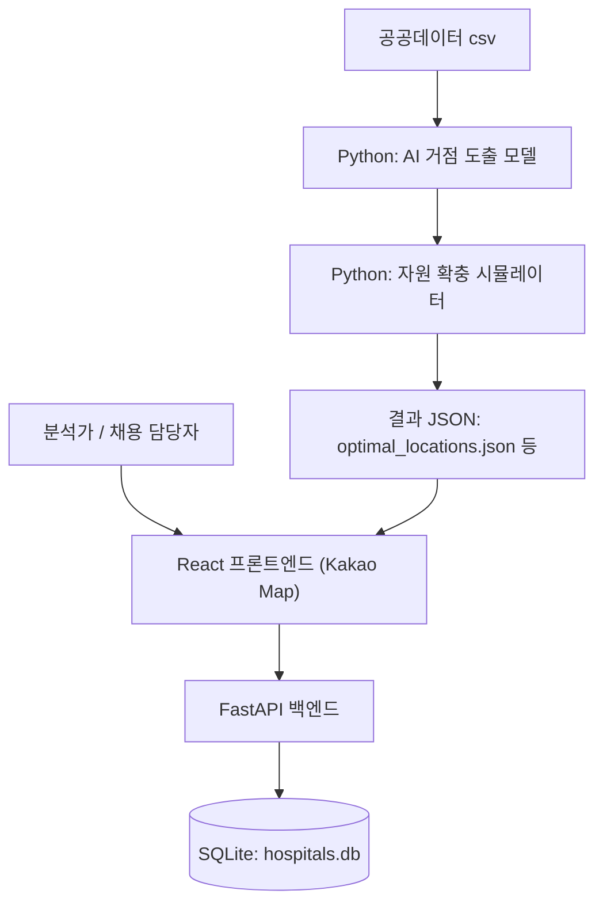

# 대구 골든타임: 골든 거버넌스
Daegu Golden Time: Golden Governance

대구광역시 행정동별 응급의료 접근성과 취약성을 분석해 의료자원 배치 우선순위를 제안하는 정책 데이터 분석 프로젝트


---

## 프로젝트 요약

| 구분 | 내용 |
| --- | --- |
| **분석 지역** | 대구광역시 |
| **분석 단위** | 수요 지점 (유치원, 취약 행정동 중심점) 및 5km 반경 의료 인프라 |
| **주요 대상** | 소아(달빛어린이병원 수요), 고령층(권역/지역응급 수요) |
| **핵심 방법** | GIS 3km 반경 공간 필터링, 3중 복합 가중치 산출, K-Means 군집분석 |
| **결과물** | 최적 의료 거점 JSON 데이터, 자원 확충 권고 리포트, 시각화 대시보드 |
| **현재 상태** | 분석 파이프라인 및 백엔드/프론트엔드 연동 구현 완료 |

---

## 프로젝트를 시작한 이유

1. **병원의 개수와 실제 접근성의 괴리**  
   단순히 행정동 내 의료기관 개수가 많다고 해서 실제 중증 응급상황 시 적절한 조치를 받을 수 있는 것은 아닙니다. 
2. **계층별 차별화된 의료 수요**  
   소아에게는 야간 진료가 가능한 달빛어린이병원이, 고령층에게는 중증 질환 대응이 가능한 권역/지역응급센터가 필요합니다. 
3. **가짜 안전망 판별**  
   지리적으로는 병원 반경 내에 있더라도 전문의가 부족하거나 필수 장비(MRI, CT)가 없다면 사실상 사각지대입니다.
4. **정책적 의사결정 지원**  
   막대한 예산이 드는 신규 병원 건립 이전에, 기존 인근 병원에 의사를 충원하거나 장비를 배치하는 효율적인 자원 확충(기능 재배치) 시나리오를 찾고자 했습니다.

---

## 핵심 질문

* 대구에서 소아와 고령층의 실질적 응급의료 사각지대(3km 밖)는 각각 어디인가?
* 병원과의 지리적 거리뿐만 아니라, 기존 병원의 전문의 수와 장비 부재를 종합적으로 고려할 때 가장 위험한 지역은 어디인가?
* 사각지대 인구를 커버하기 위해 새로운 거점을 마련한다면 그 최적 위치는 어디인가?
* 도출된 최적 위치 주변 병원의 인프라 상태를 볼 때, 의사 충원과 신규 시설 건립 중 어떤 조치가 더 우선적으로 필요한가?

---

## 주요 기능

| 기능 | 설명 | 상태 |
| --- | --- | --- |
| **계층별 사각지대 도출** | 소아(Tier 3)와 고령층(Tier 1,2)을 분리해 병원 반경 3km 외부의 수요 지점을 필터링 | 구현 완료 |
| **3중 복합 가중치 기반 군집분석** | 지리적 소외 지수(VDI), 인프라 패널티, 취약 인구 비율을 K-Means 가중치로 적용해 최적 거점 탐색 | 구현 완료 |
| **자원 확충 시뮬레이션** | 도출된 거점 반경 5km 내 기존 병원 인프라를 분석해 필요 자원(의사, MRI/CT) 및 우선순위(HIGH/MED/LOW) 자동 계산 | 구현 완료 |
| **AI 센터 시각화 대시보드** | React와 Kakao Maps SDK를 이용해 분석 파이프라인 결과물을 인터랙티브 지도로 제공 | 구현 완료 |
| **교통망 기반 이동시간 적용** | 직선거리가 아닌 실제 내비게이션 기반 이동시간 분석 | 향후 개발 예정 |

---

## 분석 프레임워크


1. **데이터 셋업**: 유치원(소아 수요), 행정동 중심점(고령층 수요), 심평원 병원 덤프 데이터를 로드하고 EPSG:5179로 투영 변환.
2. **사각지대 필터링**: 병원 위치를 기준으로 반경 3km 버퍼를 생성한 뒤, Spatial Join(`sjoin`)을 통해 버퍼 외부에 있는 진짜 사각지대 수요만 추출.
3. **가중치 산출**: 각 사각지대 포인트 반경 5km 내 병원들의 전문의 수 및 장비(MRI, CT) 유무를 바탕으로 `인프라 부실 패널티` 산출.
4. **군집분석**: 3중 복합 가중치를 K-Means 모델의 `sample_weight`로 전달. 단순 지리적 중심이 아닌 **의료 취약도가 가장 높은 곳**으로 군집 중심(거점)이 이동하도록 유도.
5. **자원 역산**: 거점 주변 병원 데이터를 스캔하여 부족한 의사 수와 장비를 역산, 자연어 형태의 정책 추천문 생성.

---

## 핵심 지표와 분석 방법

### 1. 3중 복합 가중치 공식
거점 탐색의 핵심 지표로 사용되며 다음과 같이 계산됩니다.

```text
종합 가중치 = VDI (지리적 소외 지수) × (1 + 인프라 패널티) × 계층별 인구 배수
인프라 패널티 평균 = Σ[ (1 / 전문의 수) × 장비 패널티 배수 ] / 주변 병원 수
```
* 장비 패널티 배수: MRI 부재 시 2.0배, CT 부재 시 1.5배 부과.
* 이 공식에 따라 병원은 있지만 인프라가 부실한 지역의 가중치가 높아져 AI 모델의 우선순위가 올라갑니다.

### 2. K-Means 기반 정책 개입 군집 탐색
* **사용 목적**: 사각지대 공간을 효율적으로 커버할 수 있는 가상의 신규 병원 거점 위치를 도출하기 위함.
* **군집 수 결정**: SSE(오차제곱합) 추세를 분석하는 Elbow Point 함수를 자체 구현하여 최적의 거점 수 자동 탐색.
* **가중치 반영**: `sklearn.cluster.KMeans` 훈련 시 산출한 종합 가중치를 반영하여 고위험군 클러스터링.

---

## 데이터

| 데이터 | 주요 컬럼 | 활용 목적 | 출처 |
| --- | --- | --- | --- |
| **병원 인프라 데이터** | 위/경도, tier, doctors_count, MRI, CT | 병원 위치 확인 및 인프라 부실 패널티 산출 | 심평원 / 공공데이터포털(추정) |
| **유치원 위치 정보** | 유치원명, latitude, longitude | 소아 응급의료 사각지대 수요 지점 역할 | 확인 필요 |
| **취약성 지수 (VDI)** | vulnerability_index, geometry | 고령층 수요 지점 및 기본 가중치 | 확인 필요 |

> **데이터 참고사항**: 병원 전문의 수와 보유 장비 데이터는 AI 시뮬레이션을 위해 백엔드 오프라인 덤프(`hira_data_bridge.py`)로 재구성된 수치이며, 현장의 실시간 데이터와 시점 차이가 있을 수 있습니다.

---

## 프로젝트 화면

> 프로젝트 화면 스크린샷은 추후 `docs/images` 경로에 추가할 예정입니다. 대시보드를 통해 도출된 거점 위치(별표)와 행정동별 위험도를 지도에서 확인할 수 있습니다.

---

## 기술 스택

| 영역 | 기술 | 사용 목적 |
| --- | --- | --- |
| **데이터 분석/공간** | Python, Pandas, Numpy, GeoPandas | 데이터 전처리, 거리 역산, 3km/5km 버퍼 생성 및 Spatial Join |
| **머신러닝** | Scikit-learn (K-Means) | 복합 가중치를 고려한 최적 사각지대 거점 군집분석 |
| **프론트엔드** | React 19, TypeScript, Vite, Zustand, TailwindCSS 4 | 카카오맵 기반 지리정보 시각화 및 UI 렌더링 |
| **백엔드/DB** | FastAPI, Uvicorn, SQLAlchemy, SQLite | 분석 기반 병원 데이터 및 클러스터 메타데이터 제공 API |

---

## 시스템 구조



---

## 폴더 구조

```text
project-root/
├── ai-model/          # K-Means 군집분석 및 자원 시뮬레이션 파이프라인 (핵심 로직)
├── backend/           # FastAPI 기반 API 서버 및 로컬 DB
├── frontend/          # React + Vite 기반 사용자 대시보드 화면
├── golden-data-lab/   # 기초 데이터 분석용 SQL/Jupyter Notebook 저장소
├── data/              # 원시(raw) 및 가공(processed) 데이터셋 폴더
├── scripts/           # DB 마이그레이션 등 편의 스크립트
└── README.md
```

---

## 설치 및 실행

프로젝트를 로컬 환경에서 테스트하려면 아래 단계를 순서대로 실행하세요.

```bash
git clone <repository-url>
cd <repository-name>
```

### 1. 분석 파이프라인 실행 (결과 데이터 생성)
```bash
cd ai-model
# 백엔드의 환경과 동일한 분석 라이브러리 설치
pip install -r ../backend/requirements.txt
# 계층별 최적 거점(클러스터) 추출
python golden_governance_pipeline.py
# 도출된 거점 기준 반경 5km 병원 인프라 시뮬레이션 가동
python resource_simulator.py
```

### 2. 백엔드 실행
```bash
cd ../backend
uvicorn main:app --reload --host 0.0.0.0 --port 8000
```

### 3. 프론트엔드 실행
환경변수에 카카오맵 API 키를 설정한 후 실행합니다.
```env
VITE_KAKAO_MAP_API_KEY=your_kakao_api_key
VITE_API_BASE_URL=http://localhost:8000
```
```bash
cd ../frontend
npm install
npm run dev
```

---

## 분석 결과

### 주요 발견
* **가짜 안전망 현상 확인**: 지도상으로는 거리가 가까워 보이나, 실제 전문의 수 부족과 필수 장비(MRI 등) 부재로 인해 인프라 패널티가 치솟는 숨겨진 사각지대가 존재했습니다.
* **소아와 고령층의 공간 분리**: 소아 진료(달빛어린이병원) 수요는 특정 행정구역에 밀집하는 반면, 고령층 중증 응급(권역/지역응급) 취약지는 지리적 외곽으로 넓게 퍼지는 군집 양상을 보였습니다.
* **복합 가중치 쏠림 현상**: K-Means 시각화 결과, 군집의 중심(Center)이 단순한 거리 중심이 아닌 취약 지수와 장비 패널티가 높은 거점 쪽으로 뚜렷하게 이동함을 검증했습니다.

### 해석
* AI 파이프라인을 통해 인프라가 완전히 없는 오지(HIGH Priority)와, 인프라는 있으나 충원이 필요한 지역(MEDIUM Priority)을 명확히 구분할 수 있었습니다.
* 이는 막대한 세금을 투입한 무조건적 '신규 병원 건립'보다 기존 의료 기관에 장비 지원금과 전문의 충원 예산을 배정하는 것이 예산 효율성 측면에서 우월한 대안임을 시사합니다.

---

## 정책적 활용 가능성

1. **응급의료 예산 집행 근거 보조**: 민원 중심의 인프라 배치가 아닌 데이터(의료진/장비 역산 결과) 기반의 예산 편성 지원.
2. **달빛어린이병원 및 중증 응급 거점 우선순위 도출**: 시뮬레이션에서 '최우선(HIGH)'으로 분류된 클러스터 주변을 실제 행정 조사의 첫 타겟으로 지정.
3. **자원 기능 재배치 시나리오**: 무조건적인 병원 신축이 불가능할 경우, 클러스터 5km 이내 기존 병원에 어떤 기능을 추가해야 사각지대를 해소할 수 있는지 파악.

> **주의**: 이 분석은 정책 의사결정을 자동화하거나 대체하는 것이 아니라, 현장 조사와 의료/행정 전문가의 심도 있는 판단이 필요한 지역을 과학적으로 선별하는 **데이터 기반 보조자료**로 활용하는 것을 목표로 합니다.

---

## 검증 방법

* **공간 연산 유효성 검증**: GeoPandas를 이용해 버퍼 생성 및 Spatial Join 전 원본 데이터의 좌표계를 한국 표준 투영 좌표계(EPSG:5179)로 변환해 거리 연산 오차 방지.
* **단독 스크립트 테스트**: `hira_data_bridge.py` 파일 내에 경북대병원 인근(도심)과 오지 지역에 대한 가중치 산출 단독 테스트 코드를 작성해 설계한 공식의 정확도 사전 검증.
* **K-Means 최적 K 검증**: 개발자가 임의로 K를 결정하지 않고, Elbow Method의 WCSS(Within-Cluster Sum of Square)를 산출해 통계적 근거에 기반하여 K값 선정.

---

## 한계

* **도메인 전문성의 부재 (PoC 목적)**: 작성자는 의료 보건 및 행정 전문가가 아닌 소프트웨어/데이터 개발자입니다. 따라서 본 프로젝트에서 제시된 3중 복합 가중치 설계나 자원 시뮬레이션 로직은 실제 현장의 복잡한 의료법적, 행정적 제약을 모두 반영하지 못한 기술적 가설(Proof of Concept)입니다. 본 프로젝트는 완벽한 정책 제안보다는 **'데이터 파이프라인과 대시보드 시스템을 기획하고 구현해 내는 엔지니어링 역량'**을 보여주는 데 주된 목적이 있습니다.
* **이동거리의 한계**: Haversine 및 버퍼 중심의 직선거리를 사용하므로 실제 도로망 여건(산악 지형 등), 대중교통 노선, 특정 시간대의 교통 체증이 반영되지 않았습니다.
* **자원 데이터의 실시간성 부재**: 사용된 전문의 수 및 장비 현황(hira dump)은 모델링을 위한 스냅샷 수치로, 병원의 당일 당직 시스템이나 실시간 응급실 혼잡도를 대변하지 않습니다.
* **주관적 패널티 배수**: 장비 부재 시 곱해지는 패널티 배수(MRI 2.0배, CT 1.5배)는 분석 실험 과정에서 임의로 설계된 값이며, 실제 정책 도입 시 의료 전문가의 자문 파라미터 조정이 필수적입니다.

---

## 향후 개선 계획

* **단기**: 산출된 AI 거점과 시뮬레이션 자연어 리포트를 프론트엔드 대시보드 화면상에 컴포넌트 단위로 연동.
* **중기**: 카카오 모빌리티(Kakao Navi API) 또는 OSRM을 연동해 실측 주행 시간(Driving Time) 기반의 사각지대 필터링 모델 고도화.
* **장기**: 자원 확충(예: 특정 병원 전문의 5명 추가) 데이터를 가상으로 입력했을 때, 전체 행정동의 사각지대 지수가 얼마나 감소하는지 시각적으로 보여주는 '양방향 정책 시뮬레이터' 기능 추가.

---

## 프로젝트에서 배운 점

* 서로 다른 출처의 공공데이터(유치원, 병원, 행정동 GIS)를 다룰 때 **좌표계 통일(EPSG:4326 ↔ 5179)과 결측치 처리의 중요성**을 몸소 경험했습니다.
* 지표 설계 과정에서 "병원과의 거리가 가깝다 = 무조건 안전하다"라는 가설의 오류를 발견하고, 이를 해결하고자 **3중 복합 가중치(VDI + 인프라 패널티 + 취약인구)**를 직접 고안하는 논리적 데이터 모델링 역량을 키웠습니다.
* Scikit-learn의 K-Means 알고리즘이 단순 분류가 아닌, 정책적 `sample_weight`를 줌으로써 우선순위 도출의 훌륭한 도구가 됨을 확인했습니다.
* 행정학적 마인드를 바탕으로, 백엔드/프론트엔드 시스템과 Python 데이터 파이프라인을 하나로 결합해 **단순 분석 보고서를 넘어 실제 의사결정자를 설득할 수 있는 대시보드 서비스**를 구축하는 법을 배웠습니다.

---

## AI 활용 및 기여 범위

> 이 프로젝트에서는 생성형 AI를 코드 초안 작성, 오류 탐색, 리팩터링 및 문서 정리 보조 도구로 활용했습니다. 
> 핵심이 되는 **문제 정의, 소아/고령층 지표 차별화, 3중 복합 가중치 공식 설계, 데이터 파이프라인 구조 설계, 분석 결과의 정책적 해석 여부는 작성자가 직접 판단하고 결정**했으며, 생성된 결과물은 단독 테스트 및 시각화 검증을 거쳐 최종 시스템에 반영했습니다.

---

## 작성자 역할

* **문제 정의 및 지표 설계**: 단순 공간 분할의 한계를 극복하기 위해 인프라 패널티를 포함하는 3중 가중치 모델 기획.
* **데이터 수집 및 전처리**: GeoPandas를 이용한 공간 데이터 병합 및 3km 외부 사각지대 수요 필터링 코드 구현.
* **AI 모델링**: Scikit-learn 기반 K-Means에 복합 가중치를 접목하여 고위험 클러스터 도출 파이프라인 작성 (`ml_blind_spot_filtering.py` 등).
* **시뮬레이션 개발**: 도출된 거점 기반으로 주변 인프라를 역산하여 병원 자원 권고안을 제시하는 모델 작성 (`resource_simulator.py`).
* **서비스 구현**: 분석 결과를 제공하는 FastAPI 서버와 React 카카오맵 대시보드 연동 개발.

---

## 라이선스와 데이터 이용 조건

> 소스코드 라이선스는 현재 별도로 지정되지 않았습니다. 공공데이터(심평원 병원 정보, 유치원 위치 정보, 행정동 등)의 이용 조건 및 지적재산권은 데이터 오픈 API를 제공하는 각 제공기관의 정책을 따릅니다.

---

## Contact

- **Portfolio**: 추후 추가
- **Email**: 추후 추가
