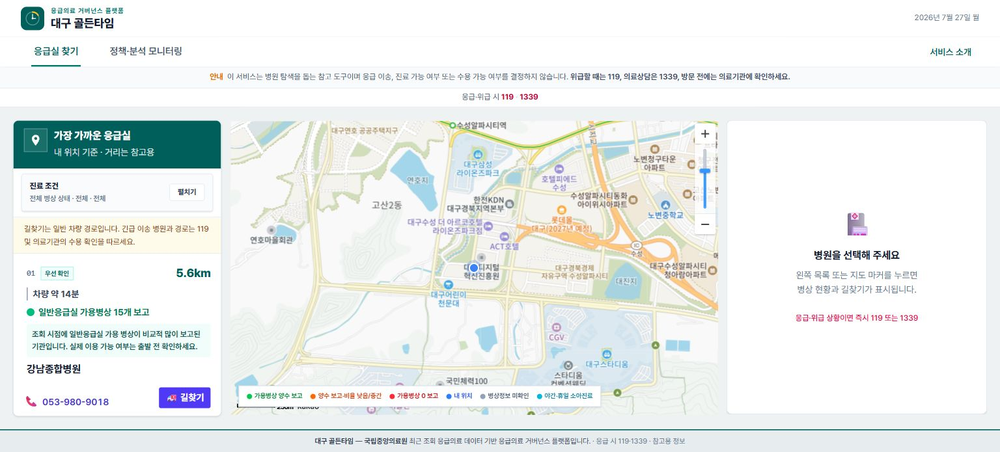
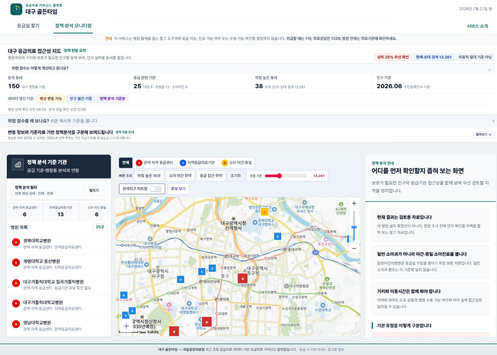

# 대구 골든타임

시민용 응급의료기관 탐색과 대구 150개 행정동의 소아·고령층 의료 접근성 분석을 연결한 공공데이터 기반 웹서비스입니다. 시민에게는 현재 위치에서 확인할 응급의료기관 정보를 제공하고, 행정·정책 검토자에게는 실제 도로 이동시간과 보호가 필요한 인구를 함께 고려한 취약지역·정책 후보 비교를 제공합니다.

[서비스 바로가기](https://ssg-sak.github.io/golden-project/) · [정책분석 공식 PDF](frontend/public/data/reports/daegu-golden-time-policy-analysis-report.pdf) · [KPI 운영 보고서](docs/core/kpi.md) · [데이터 품질 보고서](docs/reports/DATA_QUALITY_REPORT.md)

> 병상·진료·수용 정보는 조회 시점의 참고값입니다. 응급상황에서는 119·1339 또는 의료기관에 직접 확인해야 합니다.

## 1. 대표 화면

| 시민 응급의료기관 탐색 | 골든 거버넌스 정책 분석 |
|---|---|
|  |  |
| 현재 위치를 기준으로 기관·예상 이동시간·전화·길찾기를 확인합니다. | 행정동별 취약도와 정책 검토 후보·조합을 비교합니다. |

화면 동선, 모바일 표시와 API 장애 시 동작은 [공개 데모 검증 보고서](docs/reports/DEMO_VALIDATION_REPORT_20260724.md)에서 확인할 수 있습니다.

## 2. 프로젝트 개요

| 항목 | 내용 |
|---|---|
| 프로젝트 형태 | 개인 프로젝트 |
| 분석 지역 | 대구광역시 150개 행정동 |
| 대상 집단 | 소아(0~9세)·고령층(65세 이상) |
| 담당 범위 | 데이터 수집·전처리, GIS 공간분석, VDI 설계, 민감도 검증, 입지 시뮬레이션, 백엔드·프론트엔드, 배포·문서화 |
| 전공 연계 | 행정학의 공간적 형평성·증거기반 정책·정책대안 비교를 GIS 분석과 지표 설계로 구체화 |
| 현재 분석 정본 | Release `2026-07-r1` · Population `2026.07` |

코드와 문서 작성에는 생성형 AI를 보조적으로 활용했으며, 문제 정의·분석 방법 선택·결과 검토와 최종 내용에 대한 책임은 프로젝트 작성자에게 있습니다.

이 프로젝트는 예측 정확도를 겨루는 AI 모델이 아니라, **공간분석·시설입지 최적화 기반 정책 의사결정 지원 프로젝트**입니다. K-Means는 1차 후보권 생성에, p-median·MCLP는 후보군 내부 조합 비교에 사용합니다.

## 3. 문제 정의와 대상 사용자

응급의료 접근성을 직선거리나 병원 목록만으로 판단하면 강·철도·간선도로 우회, 생활권 단절, 대상 인구 분포를 충분히 반영하기 어렵습니다. 시민 화면 역시 병원명만 제공하면 중증질환 수용 가능 여부나 정보의 최신성을 판단하기 어렵습니다.

외곽·취약지역의 응급의료는 수익성만으로 충분히 공급되기 어려울 수 있습니다. 이 프로젝트는 시장실패 자체를 입증하기보다, 한정된 공공자원을 어디부터 보강할 것인지 비교할 수 있는 검토 근거를 만드는 데 초점을 둡니다.

- **시민:** 현재 위치에서 가까운 응급의료기관, 예상 이동시간, 전화·길찾기와 조회 가능한 운영정보를 확인합니다.
- **행정·정책 검토자:** 행정동별 취약지역, 보호가 필요한 인구, 도로 기반 접근성과 정책 후보 조합을 비교합니다.

## 4. 핵심 기능

- 현재 위치 기반 응급의료기관 탐색과 예상 차량 이동시간 제공
- 전화·길찾기 연계, 운영정보의 조회 시점과 미확인 상태 구분
- 대구 150개 행정동의 소아·고령층 의료 접근성 비교
- 도로 ETA와 취약인구를 결합한 VDI 기반 상대 취약도 분석
- K-Means를 활용한 1차 후보권 생성과 민감도 분석을 통한 안정성 검토
- 도로 ETA 기반 p-median·MCLP 후보 조합 비교
- 시민용 탐색 화면과 정책 검토용 분석 화면의 분리

## 5. 주요 분석 결과

**비교 기준:** Release `2026-07-r1` / Population `2026.07` / 모드별 기존 기준 기관 유지 + p-median 3개 후보 / 대상 인구 가중 일반 차량 도로 ETA

| 결과 | 현재 정본에서 확인된 값 |
|---|---|
| 후보 안정성 | 소아·어르신 각각 240개 조건, 총 480개 민감도 조건 완료 |
| 도로 접근성 | 150개 행정동 × 34개 기관·후보, 총 5,100건 성공·누락 0건 |
| 소아 가중 평균 ETA | 16.237분 → 13.286분, 2.951분 감소(-18.18%) |
| 어르신 가중 평균 ETA | 12.034분 → 11.269분, 약 0.766분 감소(-6.36%) |
| 소아 15분 전체 체계 커버율 | 41.44% → 64.01%, 22.57%p 증가 |
| 어르신 15분 전체 체계 커버율 | 79.19% → 84.00%, 4.81%p 증가 |

가중 평균 ETA를 1차 최적화 목적으로, 기존 기관을 포함한 전체 체계의 15분 커버율을 의사결정 보조 KPI로 사용합니다. 30분 커버율은 기준선부터 높아 외곽권 누락을 확인하는 가드레일로 구분합니다. 정의·분모·현재 상태는 [KPI 운영 보고서](docs/core/kpi.md), 재산출 로직은 [`kpi_metrics.py`](scripts/kpi_metrics.py)에서 확인할 수 있습니다.

이 수치는 일반 차량 ETA를 이용한 정책 시뮬레이션 결과이며 승인된 사업 목표가 아닙니다. 후보지 확정, 실제 환자 이송 성과, 의료기관 수용 가능성이나 대구 전역의 절대적 최적해를 의미하지 않습니다.

## 6. 행정학·정책분석 관점

이 프로젝트는 응급의료 접근성을 단순한 거리 문제가 아니라, 한정된 공공자원을 어떤 지역과 집단에 우선 배분할 것인가의 정책문제로 정의했습니다.

| 정책 관점 | 프로젝트 적용 | 구현 근거 |
|---|---|---|
| 공간적 형평성 | 소아·고령층 인구와 도로 이동시간을 함께 사용해 지역 간 접근 격차 비교 | 인구 가중 ETA·VDI, 외곽·별도 권역 후보 구분 |
| 효율성과 형평성의 조정 | 평균 이동시간, 제한시간 내 인구와 취약집단 우선순위를 하나의 값으로 합치지 않고 병렬 비교 | p-median·MCLP·VDI의 역할 분리, 목적함수별 후보 조합 비교 |
| 증거기반 정책 | 인상이나 단순 민원 빈도 대신 재현 가능한 공간 연산으로 조사 우선순위 제안 | 480개 민감도 조건, 도로 경로 5,100건, 데이터 계약·릴리스 해시 |
| 설명가능성과 행정 책임성 | 지표 산식·가정·데이터 상태를 공개하고 모델의 권한을 제한 | K-Means를 1차 후보 생성기로 사용, 로그 보정과 후보 근거 추적 |
| 정책결정 지원 | 모델 결과를 현장조사·예산·부지·의료자원 검토의 출발점으로 한정 | 후보를 확정 부지가 아닌 정책 검토 자료로 표시 |

현재는 시민이 공공데이터를 분석해 정책 대안을 제안하는 시민주도형 분석 단계입니다. 향후 행정기관의 검토·공동 검증·결과 환류가 이루어질 경우 정책 공동생산으로 발전할 수 있습니다. 신공공서비스론·사회적 자본 등 상세 논의는 [정책분석 보고서](frontend/public/data/reports/daegu-golden-time-policy-analysis-report.pdf)에 남겼습니다.

## 7. 데이터와 분석 방법

### 분석 범위

| 항목 | 현재 저장소 릴리스 |
|---|---:|
| 분석 지역 | 대구광역시 |
| 행정동 | 150개 |
| 기준 응급의료기관 | 25개 |
| 정책 검토 후보 | 9곳 |
| 도로 경로 | 5,100건 성공, 누락 0건 |
| 후보 민감도 분석 | 소아 240회, 어르신 240회 |

### 주요 데이터와 용도

| 데이터 | 용도 | 상태 |
|---|---|---|
| 행정동 경계·중심점 | 분석 단위와 출발점 정의 | 정책 분석 입력 |
| 인구 자료 | 소아·고령층 등 보호가 필요한 인구 산출 | 기준월이 기록된 분석본 |
| 응급의료기관 자료 | 기준 기관과 시민용 기관 정보 구성 | 공공 원천·정제본 |
| 도로 이동시간 | 행정동에서 기관·후보까지의 차량 ETA 비교 | 저장된 분석 결과 |
| 정책 릴리스 JSON | 분석 결과의 단일 정본과 해시 관리 | `data/processed/policy_release.json` |

데이터 계보, 컬럼 의미, 단위, JOIN 규칙, 결측값 해석은 [데이터 사전](docs/core/data_dictionary.md)에 정리했습니다. 원천의 최신성 검증과 품질 이슈는 [데이터 품질 보고서](docs/reports/DATA_QUALITY_REPORT.md)를 참고하세요.

### 공개 판본 안내

서비스의 정책분석 PDF는 논문식 검증본 Release `2026-07-18-r2`, Population `2026.06`의 고정 스냅샷입니다. README·KPI·대시보드는 최신 정적 릴리스 `2026-07-r1`, Population `2026.07`을 사용하므로 일부 수치가 다를 수 있습니다. PDF는 정책분석의 문제 정의·방법론·해석을 담은 보고서이고, 화면은 최신 데이터 릴리스를 보여주는 서비스로 역할을 분리합니다.

### 분석 흐름


```mermaid
flowchart LR
    A[공공데이터 수집] --> B[정제·좌표·키 품질검사]
    B --> C[보호가 필요한 인구와 VDI 산출]
    C --> D[K-Means 1차 후보권 생성]
    D --> E[모드별 240개 민감도 조건]
    E --> F[도로 ETA 5,100건 구축]
    F --> G[p-median·MCLP 조합 비교]
    G --> H[정책 릴리스 검증·제공]
```

- VDI는 `ln(1 + 일반 차량 ETA 분)`과 보호가 필요한 인구를 결합한 프로젝트 내부 상대 비교 지표입니다.
- K-Means는 실제 부지를 확정하지 않고, 후속 검토가 필요한 1차 후보권을 생성합니다.
- p-median은 취약인구 가중 평균 ETA를, MCLP는 15분·30분 내 모델 커버 인구를 기준으로 후보군 내부 조합을 비교합니다.
- 데이터 계약과 해시 검사를 통과한 결과만 정책 릴리스로 승격합니다.

자세한 산식과 해석 경계는 [접근성 분석 방법론](docs/core/methodology.md)에 기록했습니다.

## 8. 기술 선택과 구조

| 영역 | 기술 | 선택 이유 |
|---|---|---|
| 데이터·공간분석 | Python, pandas, GeoPandas, Shapely | 인구·기관 데이터 정제와 행정동·수요지점의 공간 관계 분석 |
| 후보·입지 분석 | scikit-learn, 자체 조합 탐색 모듈 | K-Means 후보권 생성과 p-median·MCLP 후보군 내부 비교 |
| 백엔드 | FastAPI, SQLite, SQLAlchemy | 분석 결과·기관 정보 API와 정제 데이터·조회 결과 관리 |
| 프론트엔드 | React, TypeScript, Zustand, Tailwind CSS | 시민용·정책용 화면 분리와 상태·타입 기반 UI 구현 |
| 검증 | Pytest, Vitest, Playwright | 분석 산식·API·화면 흐름의 회귀 검증 |
| 실행·배포 | Uvicorn, Render, GitHub Actions, GitHub Pages | API 실행, 자동 검사와 공개 데모 배포 |

### 저장소 구조

```text
.
├─ ai-model/       정책 분석·도로 접근성·릴리스 생성(역사적 경로명)
├─ analysis/       EDA 노트북과 분석 산출물
├─ backend/        FastAPI 앱과 SQLite 조회·캐시 로직
├─ data/           원천·가공·정책 릴리스·데이터베이스
├─ docs/           방법론·데이터 사전·검증·운영 문서
├─ frontend/       React 시민 화면·정책 분석 화면
├─ scripts/        EDA·보고서·KPI 생성 보조 스크립트
└─ tests/          백엔드·분석·데이터 계약 테스트
```

상세 실행 경로와 데이터 계층은 [프로젝트 구조 문서](docs/core/PROJECT_STRUCTURE.md)에서 확인할 수 있습니다.

## 9. 검증과 재현성

- 행정동·기관·후보·경로 개수와 키, 좌표, VDI 산식과 KPI를 데이터 계약으로 검사합니다.
- [`policy_release.json`](data/processed/policy_release.json)에 분석 버전과 입력·경로·영역별 SHA-256 해시를 기록합니다.
- 모드별 240개 민감도 조건과 5,100개 도로 경로의 완전성을 검증합니다.
- 분석·백엔드·프론트엔드·E2E 검증 기록을 별도 문서로 보존합니다.
- 저장된 도로 결과를 사용하는 오프라인 파이프라인으로 공개 분석본을 재현할 수 있습니다.
- 대구소방안전본부 공개 관제 표본 2,010행에서 구급차 출동→현장도착 400쌍을 재구성해 시간대별 분포를 점검했습니다.

현재 판정은 **정적 정책분석·EDA·KPI 공유 가능 / 실제 이송시간·최신 운영정보 기반 판단은 조건부**입니다. 외부 관제자료는 시간 변동 가능성의 보조 근거이며 사고 좌표·병원 목적지가 없어 행정동→병원 ETA를 직접 검증하지 않습니다. 구체적인 검사 결과는 [데이터 품질 보고서](docs/reports/DATA_QUALITY_REPORT.md), [외부 운영자료 참고 검증](docs/reports/EXTERNAL_VALIDITY_REPORT.md), [최신 패키지 검증 보고서](PACKAGE_VALIDATION.md)를 참고하세요.

## 10. 실행 방법

### 요구 환경

- Node.js 22.22 이상
- Python 3.11
- 지도·외부 공공데이터 연동 시 환경 변수 설정

### 프론트엔드

```bash
npm ci --prefix frontend
npm run dev --prefix frontend
```

### 백엔드

```bash
cd backend
python -m venv .venv

# Windows
.venv\Scripts\activate

# macOS/Linux
# source .venv/bin/activate

pip install -r requirements.txt
uvicorn main:app --reload --host 0.0.0.0 --port 8000
```

### 정책 분석 파이프라인

```bash
pip install -r requirements-analysis.txt
python ai-model/run_integrated_policy_pipeline.py
```

저장된 도로 결과를 재사용하는 오프라인 실행은 다음과 같습니다.

```bash
python ai-model/run_integrated_policy_pipeline.py --offline
```

분석·백엔드 회귀 테스트는 저장소 루트에서 한 번에 실행합니다.

```bash
python -m pytest tests/ -q
```

환경 변수 예시는 [`.env.example`](.env.example)에 있습니다. 비밀키는 커밋하지 않아야 합니다.

## 11. 한계 및 개선 방향

### 현재 한계

- ETA는 단일 수집 시점의 일반 차량 기준이며 119 이송시간이 아닙니다.
- VDI는 상대 비교용 분석 지표이며 의료적 위험함수·법정 기준·임상 예측모델이 아닙니다.
- 병상·의료진·실제 환자 흐름·구급차 우선통행·부지·예산·법적 조건은 후보 모델에 포함되지 않았습니다.
- 외부 API 장애나 갱신 지연이 있을 수 있으며, 시민 화면의 운영정보와 정적 정책 분석본은 서로 다른 데이터 수명주기를 가집니다.
- 후보 조합 결과는 정책 검토 후보군 내부 비교이며 대구 전체의 확정 최적 입지를 의미하지 않습니다.

### 개선 방향

1. 데이터 수집 시각과 원천 상태를 화면에 더 명확히 표시하고 운영 로그 기반 최신성 KPI를 축적합니다.
2. 현재 확보한 하루 구급 관제 표본을 넘어 사고 좌표·이송병원 또는 시간대·요일별 반복 ETA를 확보해 직접 오차 검증으로 확장합니다.
3. 부지 비용, 의료 인력·장비, 재난·구급차 운영 조건을 포함한 다기준 후보 평가로 확장합니다.
4. 실제 사용자 동선과 접근성 피드백을 수집해 시민 화면의 이해도와 오류 대응을 개선합니다.
5. 지속적인 운영 데이터와 동시 편집·감사 로그가 요구될 때만 영속 데이터베이스와 인증 구조를 단계적으로 검토합니다.

## 문서와 검증

- [정책분석 보고서](frontend/public/data/reports/daegu-golden-time-policy-analysis-report.pdf)
- [KPI 운영 보고서](docs/core/kpi.md)
- [접근성 분석 방법론](docs/core/methodology.md)
- [데이터 사전](docs/core/data_dictionary.md)
- [프로젝트 구조](docs/core/PROJECT_STRUCTURE.md)
- [데이터 품질 보고서](docs/reports/DATA_QUALITY_REPORT.md)
- [외부 운영자료 참고 검증](docs/reports/EXTERNAL_VALIDITY_REPORT.md)
- [최신 패키지 검증 보고서](PACKAGE_VALIDATION.md)
- [공개 데모 검증 보고서](docs/reports/DEMO_VALIDATION_REPORT_20260724.md)
