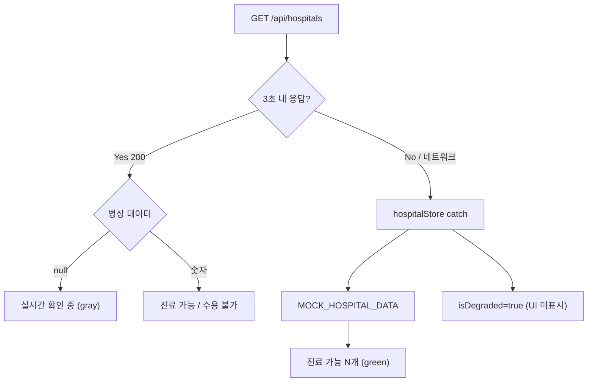
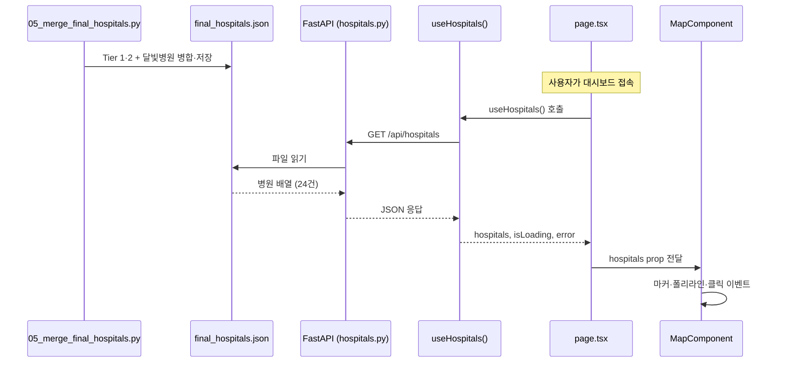

# Architecture and Tech


---
## [원본 파일명: architecture/component_file_map_20260714.md]

# 프론트엔드·백엔드 전체 파일 트리

이 문서는 "어느 기능을 고치려면 어떤 파일을 보면 되는지" 빠르게 찾기 위한 지도다.  
주석은 실제 코드의 책임 기준으로 붙였고, 캐시·빌드 산출물·`node_modules`·`__pycache__`는 제외했다.

## 1. 프론트엔드 전체 트리

```text
frontend/
├─ package.json                         # 프론트 의존성, npm scripts, 테스트/빌드 명령 정의
├─ package-lock.json                    # npm 의존성 잠금 파일
├─ index.html                           # Vite 앱의 HTML 진입점
├─ vite.config.ts                       # Vite 설정, React 플러그인과 dev/build 설정
├─ vitest.config.ts                     # Vitest 단위 테스트 설정
├─ playwright.config.ts                 # Playwright E2E 테스트 설정
├─ eslint.config.js                     # ESLint 규칙 설정
├─ tsconfig.json                        # TypeScript 루트 설정
├─ tsconfig.app.json                    # 앱 코드용 TypeScript 설정
├─ tsconfig.node.json                   # Node/Vite 설정 파일용 TypeScript 설정
├─ public/
│  ├─ favicon.svg                       # 브라우저 파비콘
│  ├─ golden_governance_clusters.png    # 랜딩/정책 설명용 클러스터 이미지
│  └─ data/
│     ├─ optimal_locations.json         # 기본 최적 입지 정적 데이터
│     ├─ optimal_locations_pediatric.json          # 소아 모드 최적 입지 데이터
│     ├─ optimal_locations_pediatric_BASELINE.json # 소아 기준선 데이터
│     ├─ optimal_locations_senior.json             # 고령 모드 최적 입지 데이터
│     ├─ optimal_locations_senior_BASELINE.json    # 고령 기준선 데이터
│     ├─ policy_monitoring_report.csv   # 정책 모니터링 정적 CSV
│     ├─ priority_targets.json          # 우선 대응 후보 지역 데이터
│     ├─ resource_recommendations.json  # 자원 배분 추천 정적 데이터
│     ├─ 사회과학_분석_보고서.pdf       # 공개 보고서 PDF
│     └─ reports/
│        ├─ daegu-golden-time-policy-analysis-report.pdf # 정책 분석 PDF
│        └─ 2026-07-11-policy-tab-cache-env-resolution.md # 정책 탭 캐시 이슈 공개 문서
├─ tests/
│  └─ e2e/
│     └─ app-smoke.spec.ts              # 앱이 기본 렌더링되는지 확인하는 E2E 스모크 테스트
└─ src/
   ├─ main.tsx                          # React 앱 마운트 진입점
   ├─ index.css                         # 전역 CSS, 레이아웃/디자인 토큰성 스타일
   ├─ app/
   │  ├─ App.tsx                        # Router와 전역 부트스트랩을 감싸는 앱 루트
   │  └─ AppPage.tsx                    # 현재 모드에 따라 랜딩/시민/관리자 화면 선택
   ├─ assets/
   │  ├─ daegu-dong.geojson             # 대구 행정동 경계 원본/번들 데이터
   │  ├─ daegu_er_hospitals.json        # 응급실 병원 정적 원본 데이터
   │  ├─ daegu_vulnerability.geojson    # 취약지 지표 번들 GeoJSON
   │  ├─ final_hospitals.json           # 최종 병원 번들 데이터
   │  └─ mock_hospitals.json            # 개발/데모용 병원 목 데이터
   ├─ data/
   │  ├─ daegu_vulnerability.geojson    # 취약지 GeoJSON 런타임 데이터
   │  ├─ final_hospitals.json           # 병원 런타임 데이터
   │  └─ api/
   │     ├─ geo.ts                      # 좌표/지오코딩 관련 API 호출
   │     ├─ hospitals.ts                # 병원 API 호출, 응답 검증, 정규화 진입점
   │     ├─ optimal-locations.ts        # 백엔드 최적 입지 API 호출
   │     └─ vulnerability.ts            # 취약지 API 호출과 정적 fallback 처리
   ├─ shared/
   │  ├─ components/
   │  │  ├─ AppDataBootstrap.tsx        # 앱 시작 시 병원/취약지 데이터를 Zustand로 로드
   │  │  └─ BaseMap.tsx                 # Kakao Map 공통 래퍼 컴포넌트
   │  ├─ config/
   │  │  ├─ api.ts                      # 백엔드 API base URL과 엔드포인트 설정
   │  │  ├─ env.ts                      # Vite 환경변수 접근/검증
   │  │  └─ kakao.ts                    # Kakao Maps/Navi 키와 설정
   │  ├─ constants/
   │  │  ├─ circuit-breaker.ts          # 외부 API 장애 제어용 상수
   │  │  ├─ daegu.ts                    # 대구 지역 좌표/행정 구역 상수
   │  │  ├─ dashboard-layout.ts         # 대시보드 레이아웃 수치 상수
   │  │  ├─ loading-messages.ts         # 로딩 문구 목록
   │  │  └─ map.ts                      # 지도 중심점, 줌, bounds 등 지도 상수
   │  ├─ data/
   │  │  ├─ hospital-er-tel.ts          # 병원 응급실 전화번호 보정 테이블
   │  │  ├─ mock-hospital-data.ts       # 개발/데모용 병원 목 데이터 변환
   │  │  └─ static-fallback-hospitals.ts # API 실패 시 사용할 정적 병원 fallback
   │  ├─ hooks/
   │  │  ├─ useSortedHospitalsByDistance.ts # 사용자 위치 기준 병원 정렬 훅
   │  │  └─ useUserLocation.ts          # 브라우저 geolocation과 위치 store 연결
   │  ├─ lib/
   │  │  ├─ bed-status.ts               # 병상 상태 계산과 표시 등급 로직
   │  │  ├─ canonical-hospitals.ts      # 병원명/좌표 정규화 기준 데이터
   │  │  ├─ daegu-bounds.ts             # 대구 영역 포함 여부 계산
   │  │  ├─ distance.ts                 # 거리 계산 유틸
   │  │  ├─ error-message.ts            # unknown error를 사용자 메시지로 변환
   │  │  ├─ fetch-with-timeout.ts       # timeout 포함 fetch 래퍼
   │  │  ├─ hospital-recommendation.ts  # 시민용 병원 추천/정렬 보조 로직
   │  │  ├─ hospital-tel.ts             # 병원 전화번호 표시/보정 유틸
   │  │  ├─ hospital-tier-visual.ts     # 병원 등급별 색상/마커 표시 규칙
   │  │  ├─ kakao-navigation.ts         # Kakao Navi URL scheme 생성
   │  │  └─ nearest-hospital.ts         # 가장 가까운 병원 계산
   │  ├─ store/
   │  │  ├─ appModeStore.ts             # 시민/관리자/소개 화면 모드와 시뮬레이션 모드 Zustand
   │  │  ├─ dashboardSummaryStore.ts    # 관리자 정책 요약 API 상태 Zustand
   │  │  ├─ hospitalStore.ts            # 병원 목록, 로딩, 오류, degraded/fallback 상태 Zustand
   │  │  ├─ locationStore.ts            # 사용자 위치, 위치 권한 오류, fallback 위치 Zustand
   │  │  └─ vulnerabilityStore.ts       # 취약지 데이터, 히트맵 표시 여부, degraded 상태 Zustand
   │  └─ types/
   │     ├─ geojson.ts                  # GeoJSON 타입
   │     ├─ hospital.ts                 # 병원 도메인 타입
   │     ├─ medical.ts                  # 의료 자원/병상 관련 타입
   │     ├─ user-location.ts            # 사용자 위치 타입
   │     └─ vulnerability.ts            # 취약지 지표 타입
   ├─ types/
   │  └─ kakao-maps.d.ts                # Kakao Maps 전역 타입 선언
   └─ widgets/
      ├─ app/
      │  ├─ AboutModal.tsx              # 서비스 소개 모달
      │  ├─ AdminHospitalSidebar.tsx    # 관리자 병원 목록/상세 사이드바
      │  ├─ AdminMobileBottomSheet.tsx  # 관리자 모바일 하단 패널
      │  ├─ AdminView.tsx               # 관리자 화면 Container
      │  ├─ CitizenView.tsx             # 시민 화면 Container
      │  ├─ GlobalNavigationBar.tsx     # 전역 상단 내비게이션, 모드 전환
      │  ├─ MobileCitizenHospitalBrowser.tsx # 시민 모바일 병원 탐색 UI
      │  ├─ PlatformIntroView.tsx       # 플랫폼 소개 화면
      │  ├─ PolicyStatusBanner.tsx      # 정책/데이터 상태 배너
      │  └─ useAdminController.ts       # 관리자 화면의 여러 store를 합치는 Controller
      ├─ landing/
      │  ├─ BedStatusBadge.tsx          # 랜딩 병원 카드의 병상 상태 뱃지
      │  ├─ HospitalListItem.tsx        # 랜딩 병원 목록 아이템
      │  ├─ KakaoNavButton.tsx          # Kakao Navi 이동 버튼
      │  ├─ LandingHeader.tsx           # 랜딩 헤더/상단 영역
      │  ├─ LandingPage.tsx             # 랜딩 페이지 Container
      │  ├─ LocationNotice.tsx          # 위치 권한/안내 문구
      │  └─ PublicAboutPage.tsx         # 공개 소개 페이지
      ├─ shared/
      │  ├─ DegradedDataBanner.tsx      # degraded/fallback 데이터 사용 안내
      │  ├─ DemoNoticeModal.tsx         # 데모 모드 안내 모달
      │  ├─ DemoWarningBanner.tsx       # 데모 경고 배너
      │  ├─ DisclaimerBanner.tsx        # 119/1339 대체 아님 고지 배너
      │  ├─ EmergencyBanner.tsx         # 응급 상황 안내 배너
      │  ├─ GovernanceFooter.tsx        # 거버넌스/문서 링크 푸터
      │  └─ PanelSidebarHeader.tsx      # 사이드 패널 공통 헤더
      └─ map-dashboard/
         ├─ AdminHospitalMapMarker.tsx  # 관리자 지도 병원 마커
         ├─ AvailableBedsBadge.tsx      # 가용 병상 수 표시 뱃지
         ├─ ChoroplethLegend.tsx        # 취약지 색상 범례
         ├─ CitizenBedLabel.tsx         # 시민용 병상 상태 라벨
         ├─ CitizenHospitalTelLink.tsx  # 시민용 병원 전화 링크
         ├─ CitizenKakaoNavLink.tsx     # 시민용 Kakao Navi 링크
         ├─ CitizenMapComponent.tsx     # 시민 화면에 특화된 지도 컴포넌트
         ├─ DashboardStatsBar.tsx       # 관리자 대시보드 상단 통계 바
         ├─ DesktopSidebar.tsx          # 데스크톱 좌측 병원/상세 사이드바
         ├─ DetailPanel.tsx             # 선택 항목 상세 패널
         ├─ DistrictHoverTooltip.tsx    # 행정구역 hover 툴팁
         ├─ DistrictPolygon.tsx         # 행정구역 폴리곤 렌더링
         ├─ EmergencyEquipmentGuide.tsx # 응급 장비 안내 UI
         ├─ HeatmapToggle.tsx           # 취약지 히트맵 토글
         ├─ HospitalActionButtons.tsx   # 병원 상세 액션 버튼 묶음
         ├─ HospitalDetailPanel.tsx     # 병원 상세 패널 Container
         ├─ HospitalDetailView.tsx      # 병원 상세 정보 화면
         ├─ HospitalEmptyPanel.tsx      # 선택 병원 없음 상태 UI
         ├─ HospitalEquipmentStatus.tsx # 장비 보유 현황 UI
         ├─ HospitalFilterBar.tsx       # 병원 필터/정렬 바
         ├─ HospitalGranularBeds.tsx    # 세부 병상 현황 UI
         ├─ HospitalHiraInfo.tsx        # HIRA 기반 병원 정보 UI
         ├─ HospitalInfrastructureSection.tsx # 의료 인프라 점수/자원 UI
         ├─ HospitalLocationMeta.tsx    # 병원 주소/거리/좌표 메타 정보
         ├─ HospitalMarkersLayer.tsx    # 병원 마커 레이어 Container
         ├─ HospitalMarkerOverlay.tsx   # 지도 위 병원 오버레이
         ├─ HospitalMoonlightInfo.tsx   # 달빛어린이병원 정보 UI
         ├─ HospitalPopupCard.tsx       # 마커 클릭 팝업 카드
         ├─ HospitalRadarChart.tsx      # 병원 역량 레이더 차트
         ├─ HospitalSidebarControls.tsx # 사이드바 필터/정렬 컨트롤
         ├─ HospitalSidebarList.tsx     # 병원 사이드바 목록
         ├─ HospitalSpecialBeds.tsx     # 특수 병상 현황 UI
         ├─ LocateMeButton.tsx          # 현재 위치 이동 버튼
         ├─ MapComponent.tsx            # 관리자/시민 지도 핵심 Container
         ├─ MapHud.tsx                  # 지도 상단 HUD
         ├─ MapInteraction.tsx          # 지도 클릭/드래그 등 상호작용 연결
         ├─ MapRelayout.tsx             # 지도 relayout 처리
         ├─ MapToolbar.tsx              # 지도 도구 버튼 묶음
         ├─ MetricsGuide.tsx            # 지표 해석 안내 UI
         ├─ MobileBottomSheet.tsx       # 모바일 하단 병원/상세 패널
         ├─ OptimalLocationMarkers.tsx  # 최적 입지 마커 레이어
         ├─ OptimalLocationsPanel.tsx   # 최적 입지 목록/모드 패널
         ├─ PolicyWelcomePanel.tsx      # 정책 관리자 첫 안내 패널
         ├─ PresetDistrictListPanel.tsx # 취약 구역 프리셋 목록
         ├─ ResourceRecommendationModal.tsx # 자원 배분 추천 모달
         ├─ ResourceRecommendationPanel.tsx # 자원 배분 추천 패널
         ├─ SelectedHospitalPin.tsx     # 선택 병원 강조 핀
         ├─ TierBadge.tsx               # 병원 등급 뱃지
         ├─ TierIcon.tsx                # 병원 등급 아이콘
         ├─ TierLegendChip.tsx          # 등급 범례 칩
         ├─ VulnerabilityDistrictView.tsx # 취약 행정구역 상세 UI
         ├─ VulnerabilityLayer.tsx      # 취약지 GeoJSON 지도 레이어
         ├─ implementation_plan.md      # map-dashboard 내부 구현 메모
         ├─ useMapComponentController.ts # 지도 상태/이벤트/선택 병원 Controller
         └─ lib/
            ├─ choropleth-colors.ts     # 취약도 색상 계산
            ├─ daegu-map-bounds.ts      # 지도 bounds 제한/계산
            ├─ geojson-to-kakao.ts      # GeoJSON을 Kakao polygon 데이터로 변환
            ├─ hospital-filter.ts       # 병원 필터링/정렬 로직
            ├─ hospital-infrastructure-score.ts # 병원 인프라 점수 계산
            ├─ kakao-marker-images.ts   # Kakao 마커 이미지 생성/캐시
            ├─ spread-hospital-markers.ts # 겹치는 병원 마커 분산
            ├─ useDashboardActions.ts   # 관리자 대시보드 액션 훅
            ├─ useEtaController.ts      # ETA 요청, fallback, 로딩 상태 Controller
            ├─ useMapController.ts      # 지도 인스턴스 제어 훅
            ├─ useOptimalLocationsStore.ts # 최적 입지 표시/모드 Zustand
            ├─ usePresetStore.ts        # 행정구역 프리셋 선택 Zustand
            ├─ useResourceSimulation.ts # 자원 배분 시뮬레이션 훅
            ├─ useReverseGeocode.ts     # 좌표를 주소로 변환하는 훅
            └─ vulnerability-choropleth-colors.ts # 취약지 전용 색상 규칙
```

## 2. 백엔드 전체 트리

```text
backend/
├─ main.py                              # uvicorn 진입점, app.main의 FastAPI app 재노출
├─ requirements.txt                     # 백엔드 Python 의존성
├─ test_hira_api.py                     # HIRA API 수동 점검 스크립트
├─ test_kakao_navi.py                   # Kakao Navi/라우팅 수동 점검 스크립트
├─ app/
│  ├─ __init__.py                       # app 패키지 초기화
│  ├─ main.py                           # FastAPI 앱 생성, CORS, 라우터 등록, scheduler lifecycle
│  ├─ api/
│  │  ├─ __init__.py                    # API 패키지 초기화
│  │  └─ routes/
│  │     ├─ __init__.py                 # route 패키지 초기화
│  │     ├─ dashboard.py                # 관리자 요약/강제 새로고침 API
│  │     ├─ hospitals.py                # 병원 목록 API, 정적/실시간 데이터 조합
│  │     ├─ indicators.py               # 지표/상태성 API
│  │     ├─ optimal_locations.py        # 최적 입지 분석 결과 API
│  │     ├─ routing.py                  # ETA/경로 계산 API
│  │     └─ vulnerability.py            # 취약지 GeoJSON/지표 API
│  ├─ config/
│  │  └─ hospital_category_mapping.json # 병원 분류/카테고리 매핑 설정
│  ├─ core/
│  │  ├─ __init__.py                    # core 패키지 초기화
│  │  ├─ cache.py                       # TTL/메모리 캐시 기반 공통 캐시 유틸
│  │  └─ env.py                         # 환경변수 로딩/설정 접근
│  ├─ db/
│  │  ├─ database.py                    # SQLite 연결, 세션, DB 초기화
│  │  └─ models.py                      # SQLAlchemy 모델 정의
│  └─ services/
│     ├─ __init__.py                    # services 패키지 초기화
│     ├─ analysis_metrics.py            # 정책/취약지/병원 분석 지표 계산
│     ├─ bed_cache.py                   # 병상 정보 캐시 저장/조회
│     ├─ bed_payload.py                 # 병상 API 응답 payload 정규화
│     ├─ bed_poller.py                  # 병상 상태 주기 갱신 작업
│     ├─ data_seed.py                   # 초기 데이터 seed/보정 로직
│     ├─ data_validation.py             # 데이터 품질 검증 로직
│     ├─ hira_client.py                 # HIRA API 클라이언트
│     ├─ hospital_category.py           # 병원 카테고리 판정
│     ├─ hospital_mapping.py            # 외부 병원 데이터와 내부 병원 매핑
│     ├─ hospital_realtime.py           # 실시간 병원/병상 데이터 조합
│     ├─ hospital_static.py             # 정적 병원 데이터 로딩
│     ├─ job_lock.py                    # 중복 작업 방지 lock
│     ├─ pipeline.py                    # 외부 데이터 수집/검증/캐시 갱신 파이프라인
│     ├─ scheduler.py                   # 백그라운드 주기 작업 스케줄러
│     ├─ api_clients/
│     │  ├─ __init__.py                 # 외부 API 클라이언트 패키지 초기화
│     │  ├─ data_go_kr_client.py        # 공공데이터포털 API 클라이언트
│     │  ├─ nemc_mediboard_client.py    # 중앙응급의료센터/mediboard 클라이언트
│     │  └─ routing_client.py           # Kakao Mobility 등 경로/ETA 클라이언트
│     └─ fetchers/
│        ├─ __init__.py                 # fetcher 패키지 초기화
│        ├─ base.py                     # DataSourceStatus, fetcher 공통 상태/실패/degraded 처리
│        ├─ hospitals_api.py            # 병원/응급의료기관 외부 데이터 수집
│        ├─ population_api.py           # 인구/취약계층 외부 데이터 수집
│        └─ sgis.py                     # SGIS 관련 데이터 수집 클라이언트
└─ scripts/
   ├─ 01_setup_mock_data.py             # 초기 목 데이터 생성
   ├─ 02_simplify_geojson_for_frontend.py # 프론트용 GeoJSON 단순화
   ├─ 03_generate_mock_medical_data.py  # 의료 자원 목 데이터 생성
   ├─ 04_fetch_daegu_er_hospitals.py    # 대구 응급실 병원 데이터 수집
   ├─ 05_merge_final_hospitals.py       # 병원 데이터 병합/최종 JSON 생성
   ├─ 06_gather_analysis_inputs.py      # 분석 입력 데이터 수집
   ├─ 06_migrate_json_to_sqlite.py      # JSON 데이터를 SQLite로 마이그레이션
   ├─ 06_migrate_to_sqlite.py           # 다른 경로의 SQLite 마이그레이션 스크립트
   ├─ 07_parse_kosis_population.py      # KOSIS 인구 데이터 파싱
   ├─ 08_compute_vulnerability_geojson.py # 취약지 GeoJSON 계산
   ├─ cli_refresh.py                    # 수동 파이프라인 refresh CLI
   ├─ data_paths.py                     # 스크립트 공통 데이터 경로 정의
   └─ spatial_analysis.py               # 공간 분석/최적 입지 계산 보조 로직
```

## 3. 자주 찾는 기능별 시작점

| 보고 싶은 것 | 먼저 볼 파일 |
|---|---|
| Zustand 처리가 어디인지 | `frontend/src/shared/store/*.ts`, `frontend/src/widgets/map-dashboard/lib/useOptimalLocationsStore.ts`, `usePresetStore.ts` |
| 병원 데이터 API 호출 | `frontend/src/data/api/hospitals.ts`, `backend/app/api/routes/hospitals.py` |
| 병원 fallback/degraded 처리 | `frontend/src/shared/store/hospitalStore.ts`, `backend/app/services/pipeline.py`, `backend/app/services/fetchers/base.py` |
| 지도 마커가 찍히는 흐름 | `MapComponent.tsx`, `useMapComponentController.ts`, `HospitalMarkersLayer.tsx`, `HospitalMarkerOverlay.tsx` |
| 시민/관리자 화면 분기 | `AppPage.tsx`, `CitizenView.tsx`, `AdminView.tsx`, `useAdminController.ts` |
| 최적 입지 표시 | `useOptimalLocationsStore.ts`, `OptimalLocationsPanel.tsx`, `OptimalLocationMarkers.tsx` |
| 최적 입지 백엔드 API | `frontend/src/data/api/optimal-locations.ts`, `backend/app/api/routes/optimal_locations.py` |
| 취약지 히트맵 | `vulnerabilityStore.ts`, `VulnerabilityLayer.tsx`, `backend/app/api/routes/vulnerability.py` |
| ETA/길찾기 | `useEtaController.ts`, `backend/app/api/routes/routing.py`, `routing_client.py` |
| 백그라운드 데이터 갱신 | `scheduler.py`, `pipeline.py`, `fetchers/*.py` |
| SQLite 저장 구조 | `backend/app/db/database.py`, `backend/app/db/models.py`, `backend/scripts/06_migrate*.py` |

## 4. 컴포넌트와 상태 흐름 한눈에 보기

```text
main.tsx
└─ App.tsx
   ├─ AppDataBootstrap.tsx
   │  ├─ useHospitalStore.fetchHospitals()
   │  └─ useVulnerabilityStore.fetchVulnerability()
   └─ AppPage.tsx
      ├─ GlobalNavigationBar.tsx
      ├─ CitizenView.tsx
      │  ├─ useHospitalStore
      │  ├─ useOptimalLocationsStore
      │  ├─ MapComponent.tsx
      │  │  ├─ useMapComponentController.ts
      │  │  ├─ HospitalMarkersLayer.tsx
      │  │  ├─ VulnerabilityLayer.tsx
      │  │  └─ OptimalLocationMarkers.tsx
      │  ├─ DesktopSidebar.tsx
      │  └─ MobileBottomSheet.tsx
      └─ AdminView.tsx
         └─ useAdminController.ts
            ├─ useHospitalStore
            ├─ useVulnerabilityStore
            ├─ useDashboardSummaryStore
            └─ useOptimalLocationsStore
```

## 5. 검색 명령

```powershell
# 특정 store를 누가 쓰는지
rg -n "useHospitalStore|useVulnerabilityStore|useOptimalLocationsStore" frontend/src

# 특정 API 경로가 어디서 연결되는지
rg -n "/api/hospitals|/api/vulnerability|/api/optimal-locations|/api/routing" frontend/src backend/app

# 지도 관련 컴포넌트와 Controller 찾기
rg -n "MapComponent|useMapComponentController|HospitalMarkersLayer|OptimalLocationMarkers" frontend/src
```


---
## [원본 파일명: architecture/Dynamic_API_Migration_Guidelines.md]

# 공공 데이터 API 스케줄러 도입 및 마이그레이션 필수 조건 (Zero Downtime Strategy)

본 문서는 정적(Static) 데이터로 구동되던 대구 골든타임 프로젝트에 실시간 **공공 API 자동 갱신(Scheduler)** 기능을 도입할 때, 기존 운영 환경의 무결성을 보호하기 위해 **반드시 지켜야 할 아키텍처 가이드라인**입니다.

## 1. 병행 운용 및 하위 호환성 유지 원칙
- **전용 기능 브랜치 사용:** 현재 작업 브랜치와 분리된 별도의 API 연동 전용 브랜치를 생성하여 작업한다.
- **기준선 보존:** 변경 전 현재 프로젝트의 빌드, 테스트, 주요 화면과 분석 결과를 기준선(Baseline)으로 저장한다.
- **기존 데이터 보존:** 기존 정적 데이터 파일(`json`)과 로컬 조회 경로를 절대 삭제하거나 훼손하지 않는다.
- **Adapter 패턴 도입:** 기존 분석 코드(도메인 로직)에 손대지 않고, 외부 API에서 수집한 데이터를 기존 분석 함수의 입력 포맷으로 맞춰주는 **Adapter(Normalization) 계층**을 추가하여 하위 호환성을 100% 유지한다.

## 2. Feature Flag (환경변수) 기반 점진적 활성화
프론트엔드와 백엔드는 처음부터 신규 API로 하드코딩 교체하지 않으며, 아래의 Feature Flag를 통해 기존 데이터와 신규 데이터를 선택할 수 있도록 구현한다. (기본값은 무조건 `false`로 설정)

```env
# 동적 대시보드 데이터 렌더링 여부 (false 시 기존 로컬 정적 데이터 표시)
USE_DYNAMIC_DASHBOARD_DATA=false

# 자동 공공 API 데이터 수집 스케줄러 가동 여부 (false 시 자동 배치 중단)
ENABLE_PUBLIC_DATA_SCHEDULER=false
```

## 3. Staging 영역 검증 및 무결성 검사 (Circuit Breaker)
외부 API 수집 결과는 절대로 운영(Production) 테이블/데이터에 바로 덮어쓰지 않고, 임시 영역(Staging)에 우선 저장한다. 운영 데이터로 승격(Promote)하기 전 다음 **무결성 조건**을 통과해야 한다.

**[운영 반영 차단 조건]**
1. 총 레코드(병원 수 등)가 비정상적으로 급감/급증한 경우
2. 행정동 코드(법정동 매칭 등) 매칭 실패율이 존재하는 경우
3. 기존 분석 함수(K-Means, 병상 계산 등) 실행 시 오류가 발생한 경우
4. 고위험 행정동(VDI) 결과가 기존 대비 비정상적으로 급변한 경우
5. 필수 좌표(lat, lng) 또는 인구 데이터가 하나라도 누락된 경우
6. API 서버 장애로 인해 페이지네이션 응답이 일부만 반환된 경우 (불완전 데이터)
7. 연관된 테스트 코드가 하나라도 실패한 경우

위 조건 중 하나라도 발동되면, 데이터 갱신을 즉시 중단하고 **기존 정적 데이터로 즉각 롤백(Fallback)** 할 수 있도록 구성한다.

## 4. 안전한 활성화 순서 (Roll-out Sequence)
기능 개발 완료 후, 다음 단계를 엄격히 거쳐 활성화한다.
1. 개발 환경에서 **수동 수집 스크립트** 실행
2. 개발 환경에서 기존 정적 분석 결과와 신규 결과 **비교 검증 (Diff)**
3. 테스트 환경에서 `USE_DYNAMIC_DASHBOARD_DATA=true` 활성화 (동적 조회)
4. 테스트 환경에서 수동 배치 정상 실행 확인
5. 운영 환경에서 동적 조회 활성화
6. 운영 환경에서 `ENABLE_PUBLIC_DATA_SCHEDULER=true` 활성화 (자동 스케줄 가동)
* **주의:** 모든 작업이 완료된 후에도 스케줄러 환경변수는 기본적으로 비활성화 상태로 남겨둔다.


---
## [원본 파일명: tech/AUDIT_STATE_AND_EXCEPTIONS.md]

# 상태 관리 · 예외 처리 점검 보고서

> **⚠️ 역사 기록:** 본 문서 §1~3은 **2026-07-07 개선 적용 전** 초기 점검 결과입니다.  
> **현재 상태·잔존 이슈**는 [MAINTENANCE_AUDIT.md](./MAINTENANCE_AUDIT.md) · [IMPROVEMENT_REPORT.md](./IMPROVEMENT_REPORT.md)를 우선 참고하세요.

> **작성 목적:** 대구 골든타임 프론트엔드·백엔드의 상태 관리, 예외 처리, Graceful Degradation 구현을 점검하고,  
> **코드를 한꺼번에 뜯지 않고** 안전하게 개선하기 위한 우선순위·단계 계획을 정리합니다.

**점검 일자:** 2026-07-07 (초기 감사)  
**관련 문서:** [MAINTENANCE_AUDIT.md](./MAINTENANCE_AUDIT.md) · [IMPROVEMENT_REPORT.md](./IMPROVEMENT_REPORT.md) · [EXCEPTION_HANDLING.md](./EXCEPTION_HANDLING.md) · [hospitals-api-flow.md](./hospitals-api-flow.md) · [LIVE_OPS_AND_EDGE_CASES.md](./LIVE_OPS_AND_EDGE_CASES.md)

---

## 1. 종합 판정

| 영역 | 상태 | 한 줄 요약 |
|------|------|-----------|
| 상태 관리 (Zustand) | 🟡 | 스토어 설계는 양호하나 `isDegraded` 미연결, 동시 fetch 경쟁 조건 존재 |
| 예외 처리 (프론트) | 🔴 | 서킷 브레이커 폴백이 **가짜 병상(초록)** 을 보여줄 수 있음 |
| 예외 처리 (백엔드) | 🟡 | 200 + `null` 병상은 안전하나, 폴러가 캐시를 null로 덮어쓸 수 있음 |
| UI 에러 화면 | 🔴 | `HospitalsErrorState` 등이 **사실상 dead code** |
| 문서 vs 코드 | 🟡 | README·EXCEPTION_HANDLING과 실제 동작 불일치 |

**결론:** 아키텍처 골격(AppDataBootstrap, Zustand, 서킷 브레이커, 거리 정렬 캐싱)은 유지할 가치가 있습니다.  
다만 **「우아한 성능 저하」가 UI까지 연결되지 않았고**, 가장 큰 리스크는 **실패 시 허위 병상 정보**입니다.  
**「전부 손봐야 한다」 ≠ 「한 번에 다 뜯어고친다」** — 단계별·작은 diff로 진행하는 것이 안전합니다.

---

## 2. 잘 되어 있는 부분

| 항목 | 위치 | 설명 |
|------|------|------|
| 앱 진입 1회 페칭 | `AppDataBootstrap.tsx` | 시민/정책/`/list` 전환 시 병원·GeoJSON 재요청 없음 |
| 거리 정렬 캐싱 | `useSortedHospitalsByDistance.ts` | GPS·병원 원본 불변 시 Haversine 재계산 생략 |
| 백엔드 요청 경로 | `hospital_realtime.py` → `bed_cache.py` | 사용자 요청마다 공공 API 9회 호출하지 않음 |
| 취약지구 폴백 | `vulnerability.ts` + `vulnerabilityStore.ts` | API 실패 시 번들 GeoJSON으로 정책 모드 유지 |
| GPS stale 방지 | `useUserLocation.ts` | `cancelled` 플래그로 언마운트 후 setState 방지 |
| 전화 걸기 | `CitizenHospitalTelLink.tsx` | `tel:` + `stopPropagation`으로 카드 선택과 분리 |
| 병상 null 안전 표시 | `bed-status.ts` | `available_beds === null` → 「실시간 확인 중」 |

---

## 3. 발견된 문제 (심각도별)

### 3.1 🔴 Critical — 시민 안전·신뢰

#### (1) 서킷 브레이커 폴백이 가짜 초록 병상을 보여줄 수 있음

| 구분 | 동작 |
|------|------|
| **백엔드** | API 실패 → `available_beds: null` → UI 「실시간 확인 중」 |
| **프론트** | 3초 타임아웃/네트워크 오류 → `MOCK_HOSPITAL_DATA` → 「진료 가능 (N개)」 |

**관련 파일**

- `frontend/src/shared/store/hospitalStore.ts` — catch 시 `MOCK_HOSPITAL_DATA` 폴백
- `frontend/src/shared/data/mock-hospital-data.ts` — 합성 `hvec`/`hvoc`/`available_beds`
- `frontend/src/shared/constants/circuit-breaker.ts` — `HOSPITALS_FETCH_TIMEOUT_MS = 3000`

**위험:** 백엔드 지연·다운 시 시민이 **허위 병상 정보**로 병원을 선택할 수 있음.

---

#### (2) `isDegraded`는 설정되지만 UI가 구독하지 않음

- `hospitalStore`에 `isDegraded: true` 설정 (`hospitalStore.ts`)
- `CitizenView`, `AdminView`, `LandingPage` 어디에서도 `isDegraded` 미사용
- README에는 폴백 플래그로 문서화되어 있으나 화면에 표시 없음

**결과:** 사용자는 실시간 데이터인지 캐시/Mock인지 알 수 없음.

---

#### (3) `HospitalsErrorState` / 「다시 시도」가 dead code

- `hospitalStore`는 실패 시 항상 `error: null` 설정
- `CitizenView.tsx`: `mapBlocked = hospitalsLoading || hospitalsError !== null` → 실패 후에도 지도 표시
- `LandingPage.tsx`: `error` 분기의 에러 카드·재시도 버튼 도달 불가

**문서 불일치:** `EXCEPTION_HANDLING.md`에는 「병원 fetch 실패 → Store error, 목록·지도 차단」으로 기술되어 있으나, 실제는 Mock 폴백 후 정상 렌더링.

---

### 3.2 🟠 High — 상태 관리·동시성·백엔드

#### (4) `fetchHospitals` 경쟁 조건 (race)

`hospitalStore.fetchHospitals`에 request ID / abort / in-flight 가드 없음.

| 시나리오 | 결과 |
|----------|------|
| 「다시 시도」 연타 | 늦게 끝난 요청이 최신 결과 덮어씀 |
| A 성공 → B 실패 | 실데이터 유지 + `isDegraded: true` (데이터·플래그 불일치) |
| B 성공 → A 실패(늦음) | 성공 데이터가 Mock으로 덮일 수 있음 |

`vulnerabilityStore.fetchVulnerability`도 동일 패턴.

---

#### (5) 프론트·백엔드 degradation 경로 이원화



프론트는 `/api/hospitals/beds-cache-status`, `/api/hospitals/runtime-config`를 circuit breaker 판단에 사용하지 않음.

---

#### (6) 백엔드 폴러가 좋은 캐시를 null로 덮어쓸 수 있음

**파일:** `backend/app/services/bed_poller.py`, `hospital_realtime.py`

- `fetch_all_beds_from_api_async`는 오류 시 예외 대신 `get_null_realtime_data()` **반환**
- `refresh_bed_cache`는 반환값을 무조건 `replace_cache(data)` 호출
- `mark_refresh_error`(캐시 유지)는 **예외가 throw될 때만** 동작

**영향:** 일시적 401·타임아웃 후 이전에 유효했던 캐시가 전부 null로 교체될 수 있음.  
`docs/EXCEPTION_HANDLING.md` §4.2 「실패 시 캐시 데이터 유지」와 불일치.

---

#### (7) 서버 cold start vs 프론트 3초 타임아웃

- `start_bed_poller()`가 lifespan에서 `await refresh_bed_cache()` 선행
- 실 API 모드: 시군구 9회 × `REQUEST_TIMEOUT = 30s` 순차 호출 → 최악 수 분
- 프론트 3초 후 Mock 폴백 → (1)번 가짜 병상 문제와 연동

---

### 3.3 🟡 Medium — UX·일관성

| # | 문제 | 관련 파일 |
|---|------|-----------|
| 8 | Mock 병상 안내가 정책 `DetailPanel`에만 있음 | `DetailPanel.tsx` vs `HospitalDetailPanel.tsx` |
| 9 | `hvec=0, hvoc>0`이면 소아 병상 무시하고 「수용 불가」 | `bed-status.ts` |
| 10 | `/list` 이동 시 `appModeStore`가 `admin` 유지 가능 | `GlobalNavigationBar.tsx`, `AppPage.tsx` |
| 11 | `CitizenView`·`LandingPage`가 GPS 각각 요청 | `useUserLocation.ts` |
| 12 | `vulnerabilityError` 시 히트맵 토글 비활성화 없음 | `AdminView.tsx`, `HeatmapToggle` |
| 13 | 프론트 병상 데이터 자동 갱신(폴링) 없음 | `AppDataBootstrap`, stores |
| 14 | `GET /api/hospitals` 요청마다 JSON 파일 재파싱 | `hospital_static.py` |
| 15 | 공공 API XML `resultCode` 미검증 (HTTP 200 + 오류 본문) | `hospital_realtime.py` |

---

## 4. 상태 관리 불일치 요약

| 항목 | hospitalStore | vulnerabilityStore | 뷰 |
|------|---------------|-------------------|-----|
| 실패 신호 | `isDegraded: true`, `error: null` | `error: string`, 데이터 비움 | 병원 뷰는 `error`만 확인 → 무효 |
| 폴백 위치 | Store (`MOCK` / previous) | API 레이어 (번들 GeoJSON) | 비대칭 |
| degraded UX | 없음 | Admin 배너 일부 | 시민 화면 공백 |
| 재시도 | 수동 버튼( dead code ) | Admin `handleRetryVulnerability` | Landing 별도 retry |
| 앱 진입 시 | 항상 fetch | 항상 fetch (시민도 로드) | citizen-only 세션 낭비 |

---

## 5. 프론트 서킷 브레이커 vs 백엔드 — 정합성 표

| 가정 | 프론트 | 백엔드 | 일치 |
|------|--------|--------|------|
| `/api/hospitals` 3초 내 완료 | `HOSPITALS_FETCH_TIMEOUT_MS` | 캐시 hit 시 빠름; cold start 시 지연 | 부분 |
| 실패 시 null/unknown 병상 | HTTP 200일 때만 | 설계상 Yes | 성공 경로만 |
| 실패 시 error UI | `hospitalsError` 게이트 | Store는 error 미설정 | **No** |
| degraded 표시 | `isDegraded` | N/A | **No (미연결)** |
| Mock vs real 구분 | Admin `DetailPanel` 푸터만 | `runtime-config` API 존재 | 부분 |
| 캐시 신선도 | 미확인 | `beds-cache-status` API | **No** |

---

## 6. 개선 로드맵 (코드 꼬임 방지용)

> **원칙:** 한 PR = 한 계약. 시민 안전(P0) → UI 연결(P1) → 동시성·백엔드(P2) → UX 정리(P3).


### 1단계 — 안전 계약 (P0, 리스크 낮음)

**목표:** 허위 초록 병상 경로 제거

| 작업 | 파일(예상) |
|------|-----------|
| Mock 폴백 시 좌표·이름·전화만 유지, 병상은 `null` | `mock-hospital-data.ts` 또는 `static-fallback-hospitals.ts` 신설 |
| `MOCK_HOSPITAL_DATA`의 합성 `hvec`/`hvoc` 제거 | `mock-hospital-data.ts` |
| 회귀: `npm test`, `npm run build` | — |

**기대 결과:** 타임아웃 시 「실시간 확인 중」만 표시, 위치·전화·길찾기는 유지.

---

### 2단계 — 상태·UI 연결 (P1, 리스크 낮음)

**목표:** `isDegraded`를 사용자에게 투명하게 공개

| 작업 | 파일(예상) |
|------|-----------|
| `DegradedDataBanner` 공통 컴포넌트 | `widgets/shared/DegradedDataBanner.tsx` |
| `isDegraded` 구독 | `CitizenView.tsx`, `LandingPage.tsx`, `AdminView.tsx` |
| `HospitalsErrorState` 역할 재정의 | 진짜 503(병원 JSON 없음)일 때만 사용 |
| `EXCEPTION_HANDLING.md` 정합 | `docs/EXCEPTION_HANDLING.md` |

---

### 3단계 — 동시성·백엔드 (P2, 리스크 중간)

| 작업 | 파일(예상) |
|------|-----------|
| `fetchId` / in-flight 가드 | `hospitalStore.ts`, `vulnerabilityStore.ts` |
| 전부 null이면 `mark_refresh_error` | `bed_poller.py` |
| poller 첫 갱신 non-blocking | `bed_poller.py`, `main.py` lifespan |
| XML `resultCode` 검증 | `hospital_realtime.py` |

프론트 1단계와 **독립 배포 가능**.

---

### 4단계 — UX·정리 (P3, 나중에 가능)

- `useUserLocation` 공유 (Zustand 또는 Context)
- GNB ↔ `/list` 시 `setViewMode('citizen')` 동기화
- `vulnerabilityError` 시 `HeatmapToggle` 비활성화
- `hvec`/`hvoc` 판정 정책 문서화·코드 반영
- README 「예정」 체크리스트 갱신
- 프론트 병상 주기적 재fetch (선택)

---

## 7. 코드 꼬임 방지 규칙

1. **한 PR = 한 계약** — 「폴백 병상 정책」과 「GPS 공유」를 섞지 않는다.
2. **dead code 삭제 전 역할 재정의** — `error` vs `isDegraded` 담당을 문서 1줄로 고정한다.
3. **테스트 최소 추가** — 폴백 null 병상, `isDegraded` 배너, fetch race 2~3케이스.
4. **시민 화면 우선** — 정책 모드·히트맵은 2단계 이후.
5. **문서와 코드 동시 갱신** — `EXCEPTION_HANDLING.md`를 실제 store 계약에 맞춘다.

---

## 8. 우선순위 체크리스트

| 순위 | 작업 | 효과 |
|------|------|------|
| **P0** | Mock 폴백 → null 병상 static 데이터 | 시민 안전 |
| **P0** | `isDegraded` 배너 (시민·랜딩·정책) | 신뢰·투명성 |
| **P1** | `fetchHospitals` request ID 가드 | race 방지 |
| **P1** | `bed_poller` null 덮어쓰기 방지 | 백엔드 캐시 보호 |
| **P1** | poller 첫 갱신 non-blocking | cold start |
| **P2** | `HospitalsErrorState` 정리 또는 `error` 복구 | dead code·문서 정합 |
| **P2** | `useUserLocation` 공유 | UX·성능 |
| **P3** | GNB 모드, 히트맵, `hvec`/`hvoc` 정책 | UX·정확도 |

---

## 9. 참고 — 주요 파일 인덱스

### 프론트엔드

| 파일 | 역할 |
|------|------|
| `shared/store/hospitalStore.ts` | 병원 상태·서킷 브레이커 폴백 |
| `shared/store/vulnerabilityStore.ts` | 취약지구 GeoJSON |
| `shared/components/AppDataBootstrap.tsx` | 앱 진입 1회 fetch |
| `shared/api/hospitals.ts` | 3초 timeout fetch |
| `shared/data/mock-hospital-data.ts` | Graceful degradation Mock |
| `shared/lib/bed-status.ts` | 병상 라벨 판정 |
| `widgets/app/CitizenView.tsx` | 시민 지도·에러 게이트 |
| `widgets/landing/LandingPage.tsx` | `/list` 목록 |

### 백엔드

| 파일 | 역할 |
|------|------|
| `app/api/routes/hospitals.py` | `GET /api/hospitals` |
| `app/services/hospital_realtime.py` | Mock / API / 캐시 분기 |
| `app/services/bed_cache.py` | 인메모리 병상 캐시 |
| `app/services/bed_poller.py` | 백그라운드 API 폴링 |
| `app/services/hospital_static.py` | `final_hospitals.json` 로드 |
| `app/core/env.py` | `USE_MOCK_API`, API 키 |

---

## 10. 변경 이력

| 일자 | 내용 |
|------|------|
| 2026-07-07 | 최초 작성 — 상태 관리·예외 처리 전수 점검 및 4단계 개선 로드맵 |
| 2026-07-07 | [IMPROVEMENT_REPORT.md](./IMPROVEMENT_REPORT.md) 기준 14건 개선 적용 완료 |

---

*점검 이후 적용 내역은 [IMPROVEMENT_REPORT.md](./IMPROVEMENT_REPORT.md)를 참고하세요.*


---
## [원본 파일명: tech/EXCEPTION_HANDLING.md]

# 예외 처리 규칙 — 대구 골든타임

> 이 문서는 **예외·오류를 어디서 잡고, 어떻게 사용자에게 보여줄지**에 대한 프로젝트 공통 규칙입니다.  
> 코드를 한 파일에 몰아두지 않고, **레이어마다 역할을 나누되 메시지·폴백 전략은 여기서 통일**합니다.

**관련 문서:** [참고서.md](./참고서.md) · [hospitals-api-flow.md](./hospitals-api-flow.md) · [LIVE_OPS_AND_EDGE_CASES.md](./LIVE_OPS_AND_EDGE_CASES.md)

---

## 1. 기본 원칙

| 원칙 | 설명 |
|------|------|
| **잡는 곳은 가깝게** | GPS·HTTP·JSON·비즈니스 로직은 각 레이어에서 처리 |
| **말하는 방식은 공통으로** | 사용자 문구는 `readErrorMessage()` 등 공통 유틸 경유 |
| **Graceful Degradation** | 전체가 죽기보다 **줄이고 대체** (병상 null, GeoJSON 폴백, 시청 좌표) |
| **재시도 폭주 금지** | fetch 실패 후 `error !== null`이면 자동 재요청하지 않음 |
| **로그는 API를 죽이지 않게** | 백엔드 `print()` 대신 `logging` 사용 (Windows cp949 인코딩 이슈 방지) |

---

## 2. 레이어 구조

```
[프론트엔드]

  UI (CitizenView, AdminView, LocationNotice)
    ↑ error 상태 · 폴백 UI · 재시도 버튼
  Store (hospitalStore, vulnerabilityStore)
    ↑ try/catch · error: string | null
  API (hospitals.ts, vulnerability.ts)
    ↑ fetch · HTTP · JSON · 스키마 검증
  공통 (error-message.ts)
    ↑ readErrorMessage(unknown, fallback)

[백엔드]

  Route (hospitals.py, vulnerability.py, indicators.py)
    ↑ HTTPException · 응답 코드
  Service (hospital_realtime.py)
    ↑ 공공 API/Mock · 예외 삼키고 null/mock 반환
  데이터 파일 (final_hospitals.json, GeoJSON, CSV)
```

**전역 `@app.exception_handler`는 현재 없음.** 라우트·서비스 단에서 처리합니다.

---

## 3. 프론트엔드 규칙

### 3.1 공통 — 에러 메시지 변환

| 파일 | 함수 | 용도 |
|------|------|------|
| `frontend/src/shared/lib/error-message.ts` | `readErrorMessage(error, fallback)` | `unknown` → 사용자용 `string` |

**규칙**

- Store의 `catch` 블록에서는 **반드시** `readErrorMessage` 사용
- `error.message`가 비어 있으면 `fallback` 문구 사용
- 새 Store/API 추가 시 동일 패턴 유지

```ts
catch (error) {
  set({
    error: readErrorMessage(error, '기본 안내 문구'),
    isLoading: false,
  });
}
```

---

### 3.2 API 레이어 — throw 지점

| 파일 | 실패 시 동작 |
|------|----------------|
| `frontend/src/shared/api/hospitals.ts` | 네트워크·非200·JSON·스키마·빈 배열 → `throw new Error(메시지)` |
| `frontend/src/shared/api/vulnerability.ts` | API 실패 → **번들 GeoJSON 폴백**; 깨진 JSON → throw (폴백 안 함) |

**규칙**

- API 함수는 **Zustand에 직접 쓰지 않음** — throw만 하고 Store가 catch
- 사용자에게 보여줄 문구는 Error `message`에 넣기 (한국어, 짧게)
- DEV에서만 `console.warn` / `console.error` (스키마 drop 등)

---

### 3.3 Store 레이어 — catch · 상태

| 파일 | 성공 | 네트워크/타임아웃 폴백 | 치명적 실패 |
|------|------|------------------------|-------------|
| `hospitalStore.ts` | `error: null`, `isDegraded: false` | `error: null`, `isDegraded: true` + `STATIC_FALLBACK_HOSPITAL_DATA` (병상 null) | `error: string`, 목록 비움 |
| `vulnerabilityStore.ts` | `error: null`, `isDegraded: false` | `error: null`, `isDegraded: true` (번들 GeoJSON) | `error: string`, features 비움 |

**규칙**

- `fetch*` 시작: `{ isLoading: true, error: null, isDegraded: false }` (해당 store)
- 성공: `isLoading: false`, 데이터 저장
- **병원 네트워크 실패:** 지도·목록은 유지, `DegradedDataBanner` 표시 — `error`로 막지 않음
- **치명적 실패** (폴백 목록 없음): `error` 설정 → `HospitalsErrorState`
- fetch 완료 시 **request ID**로 race 방지 (`hospitalFetchSeq`, `vulnerabilityFetchSeq`)
- DEV에서 `console.warn` / `console.error` (선택)

---

### 3.4 Bootstrap — 자동 재시도 방지

| 파일 | 규칙 |
|------|------|
| `frontend/src/shared/components/AppDataBootstrap.tsx` | `error === null`일 때만 최초 fetch |

**금지:** fetch 실패 후 `useEffect`가 무한 재요청하는 패턴

**허용:** 화면의 「다시 시도」 버튼으로만 재요청

---

### 3.5 UI 레이어 — 화면별 표현

| 화면/기능 | 파일 | 실패 시 UX |
|-----------|------|------------|
| 병원 네트워크/타임아웃 | `CitizenView`, `AdminView`, `LandingPage` | `DegradedDataBanner` + null 병상 (지도·목록 유지) |
| 병원 치명적 실패 | `CitizenView`, `AdminView` | 지도 영역 `HospitalsErrorState` + 다시 시도 |
| 병원 로딩 중 | 위와 동일 | 지도 대신 로딩 (`mapBlocked = loading \|\| error`) |
| 취약지구 번들 폴백 | `AdminView` | amber `DegradedDataBanner` (지도 유지) |
| 취약지구 치명적 실패 | `AdminView` | 상단 amber 배너 + 다시 시도 |
| GPS 실패/거부 | `locationStore` + `LocationNotice` | 시청 폴백 + 사유별 안내 |

**규칙**

- 시민 모드: `mapBlocked = hospitalsLoading || hospitalsError !== null` — **degraded는 막지 않음**
- `isDegraded`일 때 반드시 `DegradedDataBanner` 표시

---

### 3.6 GPS 전용 (HTTP와 별도)

| 파일 | 폴백 |
|------|------|
| `frontend/src/shared/hooks/useUserLocation.ts` | 거부·타임아웃·미지원·대구 밖 → `DAEGU_CITY_HALL` + `source: 'fallback'` |

GPS는 **서버에 저장하지 않음.** 브라우저에서만 사용.

---

## 4. 백엔드 규칙

### 4.1 라우트 — HTTPException

| 파일 | 성공 | 데이터 없음 | 읽기/파싱 실패 |
|------|------|-------------|----------------|
| `backend/app/api/routes/hospitals.py` | 200 + JSON | 503 (파일 없음) | 500/503 |
| `backend/app/api/routes/vulnerability.py` | 200 + GeoJSON 파일 | 503 | — |
| `backend/app/api/routes/indicators.py` | 200 + JSON | 503 | 500/503 |

**규칙**

- `detail`은 한국어로, **복구 방법**(스크립트 실행 등) 포함 가능
- 병원 API만 **「항상 200」** 지향 (아래 서비스 폴백과 연동)

---

### 4.2 서비스 — 병원 실시간 병상

| 파일 | 역할 |
|------|------|
| `backend/app/services/hospital_realtime.py` | Mock / `fetch_all_beds_from_api_async` (폴러 전용) |
| `backend/app/services/bed_cache.py` | 인메모리 캐시 — **사용자 요청은 여기만 읽음** |
| `backend/app/services/bed_poller.py` | lifespan 백그라운드 폴링 (기본 120초) |
| `backend/app/services/bed_payload.py` | 병상 JSON 스키마 |

**규칙**

- 사용자 `GET /api/hospitals` 경로에서 **공공 API 9회 호출 금지** — 캐시만 반환
- 폴러는 `httpx.AsyncClient` + `asyncio.sleep` (동기 `Client` / `time.sleep` 금지)
- `resolve_realtime_beds` → `resolve_realtime_beds_async` + `async def get_hospitals`
- 실패 시 캐시 데이터 **유지** (`mark_refresh_error`), 새 요청마다 null로 덮지 않음
- Mock 모드: 폴러 미시작, `get_mock_realtime_data` 즉시 반환

---

## 5. 기능별 폴백 매트릭스

| 기능 | 1차 | 실패 시 | UI |
|------|-----|---------|-----|
| 병원 목록 | `GET /api/hospitals` | Store `error`, 목록·지도 차단 | 에러 패널 + 다시 시도 |
| 실시간 병상 | Mock 또는 공공 API | `available_beds: null` | 「실시간 확인 중」 |
| 취약지구 GeoJSON | `GET /api/vulnerability` | 번들 `daegu_vulnerability.geojson` | (폴백 성공 시 정상) |
| 취약지구 (폴백도 실패) | — | Store `error` | Admin 상단 배너 |
| GPS | `navigator.geolocation` | 대구시청 좌표 | LocationNotice 안내 |
| 카카오맵 SDK | `useKakaoLoader` | `kakao.error` | 「지도를 불러오지 못했습니다」 |

---

## 6. 새 코드 작성 시 체크리스트

### 프론트 — API 추가할 때

- [ ] `fetch` try/catch로 네트워크 분리
- [ ] `response.ok` 검사
- [ ] `response.json()` try/catch
- [ ] 스키마 검증 후 throw
- [ ] Store에서 catch + `readErrorMessage`
- [ ] Bootstrap에 무한 재시도 조건 넣지 않기

### 프론트 — UI 추가할 때

- [ ] 로딩 / 에러 / 빈 상태 3가지 구분
- [ ] 응급 안내(119·1339)는 에러 화면에 유지
- [ ] 재시도는 버튼으로만

### 백엔드 — API 추가할 때

- [ ] 파일·DB 없음 → `HTTPException(503, detail=...)`
- [ ] 파싱 실패 → `HTTPException(500, detail=...)`
- [ ] 부가 기능(실시간 조회 등) 실패가 **핵심 응답을 죽이지 않게** 서비스 레이어에서 흡수
- [ ] 로그는 `logging.getLogger(__name__)`

---

## 7. 자주 하는 실수 (이 프로젝트에서 실제 발생)

| 증상 | 원인 | 조치 |
|------|------|------|
| 지도가 안 뜸 | `/api/hospitals` 500 → `mapBlocked` | 백엔드 로그·Store `error` 확인 |
| API 500 + `UnicodeEncodeError` | `print()`에 em dash 등 | `logging`으로 교체 |
| fetch 무한 반복 | `useEffect`가 `error` 무시 | `error === null` 가드 |
| 취약지구만 안 됨 | API·폴백 둘 다 실패 | `vulnerabilityStore.error` |

---

## 8. 파일 빠른 참조

```
frontend/src/shared/lib/error-message.ts      # 메시지 공통
frontend/src/shared/api/hospitals.ts
frontend/src/shared/api/vulnerability.ts
frontend/src/shared/store/hospitalStore.ts
frontend/src/shared/store/vulnerabilityStore.ts
frontend/src/shared/components/AppDataBootstrap.tsx
frontend/src/shared/hooks/useUserLocation.ts
frontend/src/widgets/app/CitizenView.tsx
frontend/src/widgets/app/AdminView.tsx
frontend/src/widgets/landing/LocationNotice.tsx

backend/app/api/routes/hospitals.py
backend/app/api/routes/vulnerability.py
backend/app/api/routes/indicators.py
backend/app/services/hospital_realtime.py
```

---

## 9. 향후 확장 (규모 커질 때)

지금 규모에서는 **필수 아님**. 팀·기능이 늘면 순서대로 검토.

1. `ApiError` 클래스 (status + message + code)
2. FastAPI 전역 exception handler (500 JSON 형식 통일)
3. React Error Boundary (렌더 크래시)
4. Sentry 등 외부 모니터링

---

*마지막 갱신: 예외 처리 레이어 정리 · 병원 API logging 전환 · Graceful Degradation 기준 반영*


---
## [원본 파일명: tech/GOLDEN_GOVERNANCE_PIPELINE.md]

# 골든 거버넌스: 공간 분석 및 AI 모델링 10단계 파이프라인 분석 보고서

본 보고서는 응급의료 사각지대 해소를 위해 설계된 **투트랙(Two-Track) 계획** 중 핵심 분석 파이프라인인 `Golden Governance Pipeline`의 단계별 목적과 의미를 다룹니다. 프론트엔드의 실시간 응급 앱과 독립적으로 구동되는 이 파이프라인은 공간 데이터(GIS)와 머신러닝 기법(K-Means)을 융합하여 새로운 의료 자원(달빛어린이병원 등)을 배치하기 위한 최적의 거점 후보지를 도출합니다.

## Phase A: 데이터 셋업 및 전처리 (Data Setup & Preprocessing)

1. **환경 설정 및 라이브러리 임포트 (Setup)**
   - `pandas`, `geopandas`, `shapely`, `scikit-learn` 등 분석 전용 라이브러리를 통해 방대한 공간 데이터를 안정적으로 연산할 환경을 구성합니다.
   
2. **원시 데이터 로드 (Ingestion)**
   - 공급(기존 소아과/응급실)과 수요(유치원 위치) 데이터를 읽어들여 결측치를 우선적으로 제거하여 데이터의 품질을 보장합니다.

3. **공간 데이터 변환 및 좌표계 투영 (CRS Projection)**
   - **가장 중요한 전처리 단계**입니다. 기본적인 위경도(EPSG:4326)를 실제 미터(m) 단위로 유클리드 기하학적 연산이 가능한 한국 표준 평면 좌표계(EPSG:5179)로 변환(Projection)합니다. 이 단계를 누락할 경우 반경 3km 계산 등 모든 공간 연산이 왜곡되며 신뢰할 수 없는 행정 데이터를 생산하게 됩니다.

## Phase B: 공간 분석 및 타겟 필터링 (Spatial Analysis & Target Filtering)

4. **공급망 버퍼 생성 (Buffer Creation)**
   - 좌표계가 변환된 병원 위치를 기준으로 반경 3,000m(3km)의 커버리지 영역(Buffer Polygon)을 도출합니다. 이는 의료 안전 지대를 시각화하는 논리적 기반입니다.

5. **공간 결합 (Spatial Join)**
   - `geopandas`의 교차(Intersects) 검증 로직을 사용하여 전체 유치원 중 어느 곳이 의료 안전망 버퍼 내에 속하는지 공간적 관계(Spatial Join)를 정의합니다.

6. **사각지대 고립화 (Target Isolation)**
   - 정책적 개입이 시급한 대상, 즉 어떠한 병원 버퍼와도 교차하지 않는 **'사각지대 유치원'만을 필터링**해 독립된 데이터셋을 구축합니다. 한정된 예산과 행정력을 집중할 타겟을 선별하는 거버넌스 의사결정의 핵심 단계입니다.

## Phase C: AI 클러스터링 모델링 (AI Clustering Modeling)

7. **특성 배열 추출 (Feature Extraction)**
   - 사각지대 유치원 데이터에서 위도(Y)와 경도(X) 값만 추출하여 scikit-learn 모델 훈련을 위한 2차원 Numpy 배열 형태로 변환합니다.

8. **K-Means 훈련 및 예측 (Model Fitting)**
   - 비지도 학습인 **K-Means 클러스터링 알고리즘(n=3)**을 통해 수요가 밀집된 거점(Cluster) 3곳을 도출합니다. 직관적이고 자의적인 행정 결정이 아닌 철저히 데이터에 기반한(Data-Driven) 최적 입지 선정의 모델을 제시합니다.

## Phase D: 결과물 추출 및 프론트엔드 인계 (Result Extraction & Handoff)

9. **군집 중심점 및 수요량 산출 (Centroid & Aggregation)**
   - 모델이 도출한 3개 클러스터의 정중앙 좌표(Centroid)를 추출합니다. 동시에 Groupby 연산을 통해 해당 거점이 커버할 사각지대 수요량(유치원 개수)을 산출함으로써 예상 정책 효과를 정량화합니다.

10. **JSON 직렬화 및 Export (Serialization)**
    - 도출된 최종 최적 입지 데이터를 카카오맵 프론트엔드에서 즉시 마커로 렌더링할 수 있는 경량화된 JSON 포맷(예: `[{"id": 1, "lat": 35.x, "lng": 128.x, "demand": 42}, ...]`)으로 출력(`optimal_locations.json`)합니다. 이를 통해 무거운 공간 연산 코어와 가벼운 서비스 뷰 계층을 완전히 분리하여 서버의 부하를 원천 차단합니다.


---
## [원본 파일명: tech/hospitals-api-flow.md]

# 병원 데이터 API 연동 — 코드 설명서

> **대상:** `GET /api/hospitals` 백엔드 + 프론트엔드 Fetch 로직  
> **목적:** 로컬 JSON import 대신, 실행 중인 백엔드에서 병원 목록을 가져와 지도·통계·상세 패널에 반영

---

## 1. 왜 이렇게 바꿨는가?

### 이전 방식 (제거됨)

```ts
// page.tsx — 더 이상 사용하지 않음
import finalHospitals from '../data/final_hospitals.json';
```

- 빌드 시점에 JSON이 번들에 고정됨
- 데이터 갱신 시 프론트를 다시 빌드해야 함
- 백엔드·스크립트 파이프라인과 프론트가 분리되어 있어 “실서비스” 흐름과 다름

### 현재 방식

```
[데이터 생성 스크립트] → final_hospitals.json → [FastAPI] → [React fetch] → 지도 UI
```

- **단일 원본:** `data/processed/final_hospitals.json`
- **API 계층:** FastAPI가 JSON을 읽어 HTTP로 제공
- **프론트:** `useEffect`로 마운트 시 1회 `fetch`, 로딩·에러 UI 처리
- 스크립트만 다시 돌리고 API를 재시작하면 프론트는 새로고침만으로 최신 데이터 반영 가능

---

## 2. 전체 흐름 (한눈에)



### 레이어별 역할

| 레이어 | 파일 | 역할 |
|--------|------|------|
| 데이터 | `backend/scripts/05_merge_final_hospitals.py` | ER API·달빛병원 병합 → JSON 생성 |
| API | `backend/app/api/routes/hospitals.py` | JSON → HTTP 응답 |
| 앱 진입 | `backend/app/main.py` | 라우터 등록, CORS |
| 설정 | `frontend/src/shared/config/api.ts` | API 베이스 URL |
| HTTP 클라이언트 | `frontend/src/shared/api/hospitals.ts` | `fetch` + 응답 검증 |
| React 훅 | `frontend/src/widgets/map-dashboard/lib/useHospitals.ts` | 상태·생명주기 |
| UI | `frontend/src/app/page.tsx` | 로딩/에러/지도 렌더 분기 |
| 타입 | `frontend/src/shared/types/hospital.ts` | `HospitalRecord` 스키마 |

---

## 3. 데이터 원본 — `final_hospitals.json`

스크립트 `05_merge_final_hospitals.py`가 만드는 최종 파일입니다.

**입력**

- `data/processed/daegu_er_hospitals.json` — 공공 API에서 수집한 대구 응급실(Tier 1·2)
- 스크립트 내 `TIER3_MOONLIGHT_HOSPITALS` — 대구 달빛어린이병원 6곳(Tier 3)

**출력**

- `data/processed/final_hospitals.json` (백엔드가 읽는 파일)
- `frontend/src/assets/`, `frontend/src/data/` (프론트 정적 복사본 — API 연동 후에는 참고·폴백용)

**레코드 형식 (`HospitalRecord`)**

```ts
{
  name: string;      // 병원명
  lat: number;       // 위도
  lng: number;       // 경도
  tier: 1 | 2 | 3;   // 1=권역·대형, 2=준종합, 3=달빛어린이
  address?: string;  // 주소 (선택)
}
```

---

## 4. 백엔드 코드

### 4-1. `backend/app/api/routes/hospitals.py`

**핵심 역할:** 디스크의 JSON을 그대로 API 응답으로 반환.

```python
PROJECT_DIR = Path(__file__).resolve().parents[4]
FINAL_HOSPITALS_JSON = PROJECT_DIR / "data" / "processed" / "final_hospitals.json"

@router.get("/api/hospitals")
def get_hospitals() -> list[dict]:
    if not FINAL_HOSPITALS_JSON.exists():
        raise HTTPException(status_code=503, detail="병원 데이터가 없습니다. ...")
    return json.loads(FINAL_HOSPITALS_JSON.read_text(encoding="utf-8"))
```

**설계 포인트**

- `parents[4]`: `routes` → `api` → `app` → `backend` → **프로젝트 루트** 로 올라가 `data/processed/` 접근
- 파일 없음 → `503` + 스크립트 실행 안내 (프론트가 `detail` 메시지를 사용자에게 표시)
- DB 없이 파일 기반 — 프로토타입·로컬 개발에 적합

### 4-2. `backend/app/main.py`

```python
from app.api.routes import hospitals, indicators

app.include_router(indicators.router)
app.include_router(hospitals.router)
```

**핵심 역할**

- `hospitals` 라우터를 FastAPI 앱에 연결
- **CORS:** `localhost:5173`(Vite)에서 브라우저 `fetch`가 막히지 않도록 허용
- 루트 `GET /` 에 `"hospitals": "/api/hospitals"` 엔드포인트 안내

---

## 5. 프론트엔드 코드

### 5-1. `shared/config/api.ts` — URL 설정

```ts
export const API_BASE_URL =
  import.meta.env.VITE_API_BASE_URL?.replace(/\/$/, '') || 'http://localhost:8000';

export const HOSPITALS_API_URL = `${API_BASE_URL}/api/hospitals`;
```

**왜 분리했는가**

- 개발: `http://localhost:8000`
- 배포: `frontend/.env`의 `VITE_API_BASE_URL`만 바꾸면 됨
- `fetch` 호출부에 URL 하드코딩 방지

### 5-2. `shared/api/hospitals.ts` — HTTP + 검증

**핵심 함수:** `fetchHospitals(): Promise<HospitalRecord[]>`

처리 순서:

1. `fetch(HOSPITALS_API_URL)` — 네트워크 실패 시 “백엔드 서버에 연결할 수 없습니다” 메시지
2. `response.ok` 확인 — FastAPI `HTTPException`의 `detail` 추출
3. JSON이 **배열**인지 확인
4. `isHospitalRecord` 타입 가드로 각 항목 검증 (`name`, `lat`, `lng`, `tier`)
5. 유효한 병원이 0개면 에러

**왜 검증하는가**

- API 스키마가 바뀌거나 잘못된 JSON이 와도 지도 컴포넌트가 깨지기 전에 명확한 에러 표시
- TypeScript 타입과 런타임 데이터 일치 보장

### 5-3. `widgets/map-dashboard/lib/useHospitals.ts` — React 훅

**핵심 패턴:** 마운트 시 1회만 요청 + 언마운트 시 취소 플래그

```ts
useEffect(() => {
  let cancelled = false;

  fetchHospitals()
    .then((data) => { if (!cancelled) setHospitals(data); })
    .catch((err) => { if (!cancelled) setError(...); })
    .finally(() => { if (!cancelled) setIsLoading(false); });

  return () => { cancelled = true; };
}, []);  // 의존성 배열 비움 → 최초 렌더 1회만
```

**반환값**

| 상태 | 타입 | 용도 |
|------|------|------|
| `hospitals` | `HospitalRecord[]` | 지도·통계바 |
| `isLoading` | `boolean` | 스피너 표시 |
| `error` | `string \| null` | 에러 배너·전체 화면 안내 |

`cancelled` 플래그는 React Strict Mode 이중 마운트나 빠른 페이지 이탈 시 **setState on unmounted component** 경고를 막습니다.

### 5-4. `app/page.tsx` — UI 조립

**데이터 소스 두 개 (병원 vs 행정동)**

```ts
const { hospitals, isLoading: hospitalsLoading, error: hospitalsError } = useHospitals();
const { data, loading: medicalLoading, error: medicalError } = useMedicalMapData();
```

- **병원:** 백엔드 API (`useHospitals`)
- **행정동 의료 지표:** 기존처럼 로컬 `mock_medical_data.json` (`useMedicalMapData`) — 이번 작업 범위 밖

**렌더 분기 (지도 영역)**

```
카카오 키 없음 → 키 설정 안내
카카오 로딩 중 → 카카오 스피너
카카오 에러   → 카카오 에러 안내
병원 로딩 중  → HospitalsLoadingState ("🚨 대구 응급의료 데이터를 불러오는 중입니다...")
병원 에러     → HospitalsErrorState (uvicorn 실행 방법 포함)
모두 OK       → MapComponent에 hospitals 전달
```

**하위 컴포넌트로의 전달**

```tsx
<MapComponent
  hospitals={hospitals}
  selectedHospital={selectedHospital}
  onHospitalSelect={setSelectedHospital}
  ...
/>

<DashboardStatsBar
  tier1Count={hospitals.filter((h) => h.tier === 1).length}
  ...
/>

<DetailPanel selectedHospital={selectedHospital} ... />
```

`MapComponent`는 데이터를 **직접 fetch하지 않음** — 상위 `page.tsx`가 props로 넘기는 **.presentational + 지도 로직** 구조를 유지합니다.

---

## 6. 파일 의존 관계도

```
page.tsx
  ├── useHospitals.ts
  │     └── shared/api/hospitals.ts
  │           ├── shared/config/api.ts  ← VITE_API_BASE_URL
  │           └── shared/types/hospital.ts
  ├── MapComponent.tsx        (hospitals prop)
  ├── DashboardStatsBar.tsx   (tier 카운트)
  └── DetailPanel.tsx         (selectedHospital)

backend/app/main.py
  └── api/routes/hospitals.py
        └── data/processed/final_hospitals.json
              ↑ 05_merge_final_hospitals.py
```

---

## 7. 실행 방법

### 1) 데이터 준비 (최초 1회 또는 갱신 시)

```bash
python backend/scripts/05_merge_final_hospitals.py
```

### 2) 백엔드

```bash
cd backend
uvicorn app.main:app --reload --host 127.0.0.1 --port 8000
```

확인:

- http://127.0.0.1:8000/ — 서비스 정보
- http://127.0.0.1:8000/api/hospitals — 병원 24건 JSON
- http://127.0.0.1:8000/docs — Swagger UI

### 3) 프론트엔드

```bash
npm run dev
```

→ http://localhost:5173 에서 API 호출 후 지도에 마커 표시

### 환경 변수 (`frontend/.env`)

```env
VITE_API_BASE_URL=http://localhost:8000
VITE_KAKAO_MAP_APP_KEY=...
```

---

## 8. 에러 시나리오와 사용자 메시지

| 상황 | 발생 위치 | 사용자에게 보이는 내용 |
|------|-----------|------------------------|
| uvicorn 미실행 | `fetch` catch | 백엔드 서버에 연결할 수 없습니다 |
| JSON 파일 없음 | API 503 | 스크립트 실행 안내 (`detail`) |
| 응답 형식 오류 | `fetchHospitals` 검증 | 병원 데이터 형식이 올바르지 않습니다 |
| 빈 배열 | `fetchHospitals` 검증 | 병원 데이터가 비어 있습니다 |

`page.tsx`의 `HospitalsErrorState`는 위 메시지 + `uvicorn` 실행 예시를 지도 영역 중앙에 표시합니다.

---

## 9. 다음 단계에서 확장하기 좋은 지점

- **행정동 데이터도 API화:** `useMedicalMapData`를 `useHospitals`와 같은 패턴으로 통일
- **Vite 프록시:** `vite.config.ts`에서 `/api` → `:8000` 프록시 시 CORS·URL 단순화
- **캐시·재시도:** `fetchHospitals`에 retry 또는 SWR/React Query 도입
- **DB 전환:** `hospitals.py`만 DB 쿼리로 교체하면 프론트는 URL·스키마 유지 시 변경 최소화

---

## 10. 관련 파일 빠른 링크

| 파일 | 경로 |
|------|------|
| API 라우트 | `backend/app/api/routes/hospitals.py` |
| FastAPI 앱 | `backend/app/main.py` |
| 병합 스크립트 | `backend/scripts/05_merge_final_hospitals.py` |
| API URL 설정 | `frontend/src/shared/config/api.ts` |
| fetch 함수 | `frontend/src/shared/api/hospitals.ts` |
| React 훅 | `frontend/src/widgets/map-dashboard/lib/useHospitals.ts` |
| 대시보드 페이지 | `frontend/src/app/page.tsx` |
| 타입 정의 | `frontend/src/shared/types/hospital.ts` |


---
## [원본 파일명: tech/LIVE_OPS_AND_EDGE_CASES.md]

# 라이브 운영 · 엣지 케이스 · 테스트 가이드

> **대상:** 기획·개발·면접 준비  
> **목적:** 강사님이 짚어주신 **「실제 라이브로 돌아가는 공공 서비스」** 관점에서,  
> 우리가 이미 구현한 방어 로직과 **앞으로 해야 할 테스트**를 한곳에 정리합니다.

**관련 문서**

- [EXCEPTION_HANDLING.md](./EXCEPTION_HANDLING.md) — 예외 처리 **코딩 규칙**
- [CODE_EXPLANATION.md](../CODE_EXPLANATION.md) — 코드가 **왜** 그렇게 짰는지 (학습·면접용)
- [hospitals-api-flow.md](./hospitals-api-flow.md) — 병원 API → 지도 마커 흐름

---

## 1. 왜 이 문서가 필요한가

응급의료 플랫폼은 평소에도 중요하지만, **재난·대형 사고 시 수만 명이 동시에 접속**할 수 있습니다.

| 관문 | 의미 |
|------|------|
| **스트레스 테스트** | 트래픽·지연·동시 요청에서도 서비스가 버티는가 |
| **완벽한 예외 처리** | 한 기능이 죽어도 전체가 붕괴하지 않는가 (Graceful Degradation) |
| **엣지 케이스 방어** | GPS 거부·API 지연·병상 0개 같은 **비정상 상황**에서도 시민이 행동할 수 있는가 |

단순히 “기능이 돌아간다”가 아니라, **“망가져도 최소한의 골든타임 정보는 준다”** — 이게 시니어급 공공 서비스 설계의 핵심입니다.

---

## 2. 우리 프로젝트가 이미 갖춘 방어 (면접 한 줄)

> “외부 공공 API 승인 지연·장애에 대비해 Mock 제너레이터를 두었고, API가 죽어도 병원 좌표는 살리고 병상만 null로 내립니다. GPS 거부·대구 외 접속은 시청 폴백으로 거리순 안내를 유지합니다.”

| 상황 | 방어 | 코드 위치 |
|------|------|-----------|
| 공공 API / Mock 실패 | 병상 `null`, 병원 목록은 200 | `hospital_realtime.py`, `hospitals.py` |
| 병원 fetch 실패 | 지도 대신 에러 + 다시 시도 | `hospitalStore.ts`, `CitizenView.tsx` |
| 취약지구 API 실패 | 번들 GeoJSON 폴백 | `vulnerability.ts` |
| GPS 거부·타임아웃 | 대구시청 좌표 폴백 | `useUserLocation.ts` |
| fetch 실패 후 | 자동 재요청 폭주 없음 | `AppDataBootstrap.tsx` |

자세한 규칙: [EXCEPTION_HANDLING.md](./EXCEPTION_HANDLING.md)

---

## 2.1 병상 API 성능 개선 (2026-07-07) — Anti-Gravity 점검 반영

**이전 문제 (치명적)**

- 사용자 요청마다 동기 `httpx.Client` + `time.sleep()`으로 **시군구 9회** 공공 API 호출
- FastAPI 스레드풀 점유 → 동시 접속 시 응답 지연·타임아웃

**개선 아키텍처**

```
[백그라운드 폴러] 2분마다 httpx.AsyncClient + asyncio.sleep
        ↓
  인메모리 bed_cache (전체 병원 병상)
        ↓
[GET /api/hospitals] async — 캐시만 읽고 즉시 200 (Mock 모드는 즉시 random)
```

| 파일 | 역할 |
|------|------|
| `bed_poller.py` | 서버 기동 시 폴링 시작, `BED_CACHE_POLL_INTERVAL_SEC` (60~300초) |
| `bed_cache.py` | 인메모리 캐시, 요청 경로는 읽기만 |
| `hospital_realtime.py` | `fetch_all_beds_from_api_async` (폴러 전용) |
| `hospitals.py` | `async def get_hospitals` |
| `app/main.py` | `lifespan` — 폴러 start/stop |

**확인**

- `GET http://localhost:8000/api/hospitals/beds-cache-status` — 캐시 갱신 시각
- Mock 모드(`USE_MOCK_API=true`)에서는 폴러 비활성, 기존처럼 즉시 Mock

**면접 멘트**

> “요청 경로에서 외부 API를 제거하고 백그라운드 비동기 폴링 + 인메모리 캐시로 바꿔, 재난 시 동시 접속에도 API 응답을 밀리초 단위로 유지합니다.”

---

## 3. IDE 이전 (Anti-Gravity 등) — Crash & Learn

코드는 **어디서든 똑같이** 돌아갑니다. IDE만 바꿔도 됩니다.

### 3.1 이전 후 최소 세팅

```bash
# 1. 백엔드
cd backend
pip install -r requirements.txt
uvicorn main:app --reload --port 8000

# 2. 프론트 (별도 터미널)
cd frontend
npm install
npm run dev
```

| 확인 URL | 기대 |
|----------|------|
| http://localhost:5173/ | 시민 구조망 + 지도 |
| http://localhost:8000/api/hospitals | JSON 200, 병원 배열 |

환경 변수: 프로젝트 루트 `.env` (`USE_MOCK_API=true`), `frontend/.env` (`VITE_KAKAO_MAP_APP_KEY`)

### 3.2 이해가 덜 되어도 괜찮은 이유

에러 메시지를 **직접 맞아보는 것**이 가장 빠른 학습입니다.

1. 서버 안 켜짐 → `Network Error` / 지도 안 뜸 → 백엔드 실행
2. 500 에러 → 터미널 로그 확인 → [EXCEPTION_HANDLING.md](./EXCEPTION_HANDLING.md) §7 사례 참고
3. 지도만 안 뜸 → 병원 API vs 카카오 키 구분 (CODE_EXPLANATION + EXCEPTION_HANDLING)

---

## 4. 예외처리 3대장 시나리오 (지금 당장 브라우저에서)

거창한 부하 테스트 전에, **아래 3가지만** 통과하면 “엣지 케이스까지 방어했다”고 말할 수 있습니다.

---

### 시나리오 ① GPS 거부

**목표:** 앱이 터지지 않고, 대구 중심(시청) 기준으로 목록·지도가 뜬다.

**방법 (Chrome 기준)**

1. 주소창 왼쪽 자물쇠 → **사이트 설정** → **위치: 차단**
2. http://localhost:5173 새로고침
3. 시민 구조망 탭 진입

**기대 결과**

| 항목 | 기대 |
|------|------|
| 크래시 | 없음 |
| 안내 | `LocationNotice` — “위치 권한이 허용되지 않아 **대구광역시청**을 기준으로…” |
| 목록 | 거리순 정렬된 병원 카드 표시 |
| 지도 | 대구 중심 + 병원 마커 |

**관련 코드:** `frontend/src/shared/hooks/useUserLocation.ts`, `LocationNotice.tsx`

**면접 멘트:** “위치 거부는 흔한 엣지 케이스라, 서버 저장 없이 브라우저만 쓰고 실패 시 행정 중심 폴백으로 **포용성**을 확보했습니다.”

---

### 시나리오 ② API 지연 (로딩 UX)

**목표:** 응답이 느려도 로딩 스피너가 보이고, 화면이 깨지지 않는다.

**방법 A — Chrome DevTools (코드 수정 없음, 추천)**

1. F12 → **Network** 탭
2. **Throttling** → `Slow 3G` 또는 `Fast 3G`
3. 새로고침 후 시민 탭 관찰

**방법 B — 백엔드 Mock에 인위 지연 (개발용)**

`backend/app/services/hospital_realtime.py`의 `resolve_realtime_beds` 안, Mock 분기 직전에 **임시로** 추가:

```python
import time
time.sleep(10)  # 테스트 후 반드시 제거
```

**기대 결과**

| 항목 | 기대 |
|------|------|
| 병원 로딩 중 | 지도 영역: 「응급실 정보를 불러오고 있습니다」 + 스피너 |
| GPS 로딩 중 | 「시민님의 현재 위치를 파악하고 있습니다 📍」 |
| 완료 후 | 지도·목록 정상 전환, 레이아웃 붕괴 없음 |

**참고:** 프론트 Mock에 `setTimeout`은 없습니다. 지연 테스트는 **네트워크 스로틀** 또는 **백엔드 sleep**이 맞습니다.

**관련 코드:** `CitizenView.tsx` (`mapBlocked`, `HospitalsLoadingState`), `HospitalSidebar.tsx`

**면접 멘트:** “로딩·에러·성공 상태를 분리해, 지연이 있어도 빈 화면이나 깨진 UI가 아니라 **명확한 피드백**을 줍니다.”

---

### 시나리오 ③ 병상 0개 (수용 불가)

**목표:** 🔴 수용 불가 배지가 보이고, 보기 설정·정렬이 의도대로 동작한다.

**방법 — Mock 병상을 0으로 고정 (개발용)**

`backend/app/services/hospital_realtime.py` → `get_mock_realtime_data`:

```python
def get_mock_realtime_data(hospital_names: list[str]) -> dict[str, dict[str, Any]]:
    result: dict[str, dict[str, Any]] = {}
    for name in hospital_names:
        # 테스트: 전원 수용 불가
        result[name] = _bed_payload(0, 0, "mock")
    return result
```

또는 특정 병원만 0으로 두고 나머지는 랜덤 — 부분 시나리오용.

백엔드 저장 후 새로고침.

**기대 결과**

| 항목 | 기대 |
|------|------|
| 카드 배지 | 🔴 **수용 불가 (이동 금지)** |
| 켜기 ON | 「🟢 진료 가능한 병원만 보기」→ 목록 비움 + 안내 문구 |
| 켜기 OFF | 🔴 병원도 거리순으로 **표시** (숨기지 않음) |
| 지도 마커 | 빨간/초록 구분 (가용성 기준) |

**관련 코드:** `bed-status.ts`, `CitizenBedLabel.tsx`, `HospitalSidebar.tsx`

**면접 멘트:** “병상 0은 **이동 금지**로 명확히 표시하고, 보기 설정으로 진료 가능 병원만 골라 볼 수 있게 했습니다.”

> **테스트 후:** `get_mock_realtime_data`를 원래 `random.randint` 버전으로 되돌리세요.

---

## 5. 체크리스트 (3대장 통과 기준)

| # | 시나리오 | 통과 기준 |
|---|----------|-----------|
| 1 | GPS 거부 | 크래시 없음, 시청 폴백, 목록·지도 동작 |
| 2 | API 지연 | 로딩 UI 표시, 완료 후 정상 전환 |
| 3 | 병상 0 | 🔴 배지, 보기 설정 필터, 지도 반영 |

통과하면 면접에서:

> “저는 단순히 돌아가는 기능이 아니라, **재난 상황의 엣지 케이스까지 방어하는 설계**를 했습니다.”

라고 말해도 됩니다.

---

## 6. 앞으로의 스트레스 테스트 로드맵 (로드맵)

지금 단계에서는 **§4 수동 시나리오**가 우선입니다. 서비스가 커지면 아래 순서로 확장합니다.

| 단계 | 도구·방법 | 검증 목표 |
|------|-----------|-----------|
| **L1** | 브라우저 3대장 (§4) | 엣지 케이스 UX |
| **L2** | k6 / Locust / `ab` | `GET /api/hospitals` 동시 100~1000 req/s |
| **L3** | 시나리오 테스트 | GPS + 병원 fetch + 지도 렌더 동시 사용자 |
| **L4** | 모니터링 | Sentry, 응답 시간 p95, 5xx 알림 |

### L2 예시 (k6 스켈레톤 — `tests/integration/`에 Python 대안 포함)

```javascript
import http from 'k6/http';
import { check } from 'k6';

export const options = { vus: 50, duration: '30s' };

export default function () {
  const res = http.get('http://127.0.0.1:8000/api/hospitals');
  check(res, { 'status is 200': (r) => r.status === 200 });
}
```

Python 대안 (k6 미설치 시):

```bash
python tests/integration/load_test.py --concurrency 100 --requests 500
```

테스트 폴더·결과 문서: [tests/README.md](../tests/README.md) · [tests/docs/TEST_RESULTS.md](../tests/docs/TEST_RESULTS.md)

**공공 서비스에서 스트레스 테스트 때 볼 것**

- p95 응답 시간 (목표: 시민 API < 500ms~1s)
- 5xx 비율 (목표: 0%에 가깝게 — 병원 API는 특히)
- Mock/캐시 없이 공공 API 직결 시 한계점 (rate limit)

---

## 7. 재난 상황 시나리오 (설계 점검용)

| 상황 | 위험 | 우리 대응 | 추가 과제 |
|------|------|-----------|-----------|
| 동시 접속 폭주 | API·서버 다운 | Mock, 정적 JSON, 200 유지 | CDN, 캐시, 오토스케일 |
| 공공 API 장애 | 병상 정보 없음 | `available_beds: null` | “실시간 확인 중” UX 유지 |
| GPS 대량 거부/실패 | 정렬 불가 | 시청 폴백 | 문구·신뢰도 안내 |
| 카카오맵 CDN 지연 | 지도 blank | 로딩/에러 UI | /list 목록-only 진입점 |
| 잘못된 병상(0인데 이동) | 생명 위험 | 🔴 수용 불가 + 119 안내 | tel: 연동, 1339 강조 |

---

## 8. 문서·코드 유지보수

| 할 일 | 문서 |
|------|------|
| 예외 처리 **규칙** 추가/변경 | [EXCEPTION_HANDLING.md](./EXCEPTION_HANDLING.md) |
| **왜** 그렇게 짰는지, 면접 스토리 | [CODE_EXPLANATION.md](../CODE_EXPLANATION.md) |
| **라이브·테스트·엣지 케이스** | 이 문서 |
| 새 시나리오 통과 | §5 체크리스트에 행 추가 |

---

## 9. 변경 이력

| 날짜 | 내용 |
|------|------|
| 2026-07-07 | §2.1 병상 API — 비동기 httpx + 백그라운드 인메모리 캐시 |
| 2026-07-07 | 초안 — 3대장 시나리오, IDE 이전, 스트레스 테스트 로드맵, 면접 멘트 |

---

*“Crash & Learn” — 안티그래비티든 Cursor든, 에러 로그를 친구로 삼으면 됩니다.*


---
## [원본 파일명: DEV_COMMANDS.md]

# 개발 명령어 모음

> **용도:** 복붙용 시작·종료·점검 코드만 모아 둔 치트시트  
> 포트 꼬임·좀비 프로세스 → [DEV_SERVERS.md](./DEV_SERVERS.md)

---

## 포트 한눈에

| 포트 | 서비스 | URL |
|------|--------|-----|
| 8000 | 백엔드 (FastAPI) | http://127.0.0.1:8000 |
| 5173 | 프론트 (Vite) | http://localhost:5173 |

---

## 최초 1회 세팅

```bash
# 백엔드 의존성
cd backend
pip install -r requirements.txt

# 프론트 의존성
cd frontend
npm install

# Playwright (E2E 최초 1회)
cd frontend
npx playwright install chromium
```

### 환경 변수

```bash
# 프로젝트 루트 — .env.example 복사 후 수정
USE_MOCK_API=false
DATA_GO_KR_API_KEY=여기에_키

# 프로젝트 루트 .env (통합됨)
VITE_KAKAO_MAP_APP_KEY=여기에_키
```

---

## 매일 — 서버 시작

**터미널 2개** 쓰세요. (하나에 백+프론트 같이 X)

### 방법 A — 직접 명령 (가장 흔함)

```bash
# 터미널 1 · 백엔드
cd backend
uvicorn main:app --reload --host 127.0.0.1 --port 8000
```

```bash
# 터미널 2 · 프론트
cd frontend
npm run dev
```

### 방법 B — PowerShell 스크립트 (Windows)

```powershell
# 꼬였을 때 먼저 정리
powershell -File scripts/dev/stop-dev-servers.ps1

# 포트 상태 확인
powershell -File scripts/dev/check-dev-ports.ps1

# 백엔드만 (8000 비었을 때)
powershell -File scripts/dev/start-backend.ps1
```

---

## 매일 — 서버 종료

```text
각 터미널에서 Ctrl + C
→ "Application shutdown complete" (백엔드) 확인 후 창 닫기
```

```powershell
# 한 번에 끄기 (Windows)
powershell -File scripts/dev/stop-dev-servers.ps1
```

---

## 동작 확인 URL

| 확인 | URL |
|------|-----|
| 시민 앱 | http://localhost:5173/ |
| API 문서 (Swagger) | http://localhost:8000/docs |
| 병원 목록 JSON | http://localhost:8000/api/hospitals |
| Mock/실 API 상태 | http://localhost:8000/api/hospitals/runtime-config |
| 병상 캐시 상태 | http://localhost:8000/api/hospitals/beds-cache-status |

**실 API 모드 기대값** (`runtime-config`):

```json
{"use_mock_api":false,"has_api_key":true,"should_use_mock_realtime":false}
```

---

## 테스트

```bash
# Unit — 프론트
cd frontend && npm test

# Unit — 백엔드 (서버 켜 둔 상태)
python -m pytest tests/unit/backend -v

# E2E (백+프론트 켜 둔 상태)
cd frontend && npm run test:e2e

# 엣지 케이스
python tests/integration/edge_cases.py

# 부하
python tests/integration/load_test.py --concurrency 100 --requests 500

# 공공 API 키 연결 확인
python tests/integration/verify_realtime_api.py
```

---

## 데이터 · 스크립트 (필요할 때만)

```bash
# 공공 API 대구 응급기관(HIRA) 수집
python backend/scripts/04_fetch_daegu_er_hospitals.py

# 병원 JSON 병합 (E-Gen 및 HIRA 데이터 병합)
python backend/scripts/05_merge_final_hospitals.py

# SQLite 로컬 캐시 DB 구축 및 마이그레이션 (필수)
python backend/scripts/06_migrate_json_to_sqlite.py
```

---

## 빌드 (배포 전 확인)

```bash
cd frontend
npm run build
```

---

## 자주 쓰는 조합 (한 줄 요약)

| 하고 싶은 것 | 명령 |
|--------------|------|
| 백엔드만 | `cd backend && uvicorn main:app --reload --host 127.0.0.1 --port 8000` |
| 프론트만 | `cd frontend && npm run dev` |
| 포트 점검 | `powershell -File scripts/dev/check-dev-ports.ps1` |
| 전부 끄기 | `powershell -File scripts/dev/stop-dev-servers.ps1` |
| API 살아있나 | 브라우저 → `http://127.0.0.1:8000/api/hospitals` |

---

## 관련 문서

| 문서 | 내용 |
|------|------|
| [DEV_SERVERS.md](./DEV_SERVERS.md) | 포트 충돌 · 좀비 프로세스 해결 |
| [LIVE_OPS_AND_EDGE_CASES.md](./LIVE_OPS_AND_EDGE_CASES.md) | GPS 거부 등 수동 테스트 |
| [tests/docs/TESTING.md](../tests/docs/TESTING.md) | 테스트 4단계 상세 |
| [README.md](../README.md) | 프로젝트 전체 소개 |

---

*복붙용 — 명령만 바꿀 때는 이 파일만 열면 됩니다.*


---
## [원본 파일명: DEV_SERVERS.md]

# 개발 서버 포트 · 좀비 프로세스 가이드

> **대상:** 기획·개발  
> **증상:** API가 Mock인데 실 API로 바꿨는데도 안 바뀜, 서버가 느려짐

---

## 1. 포트가 뭔가요?

| 포트 | 서비스 | 기본 URL |
|------|--------|----------|
| **8000** | FastAPI 백엔드 | http://127.0.0.1:8000 |
| **5173** | Vite 프론트 | http://localhost:5173 |

프론트는 `VITE_API_BASE_URL=http://localhost:8000` 으로 **8000만** 바라봅니다.  
운영 원칙은 **백엔드 8000 단일 포트**입니다.

---

## 2. 왜 프로세스가 여러 개 생기나?

### 원인 A — 좀비 프로세스 (이번 케이스)

1. `uvicorn ... --port 8000` 실행
2. 터미널을 X로 닫거나 **Ctrl+C 없이** 다시 실행
3. 이전 서버가 8000을 잡고 있음 → 새 서버 실행이 실패하거나 임시 포트로 분기됨
4. `--reload` 사용 시 **부모(reloader) + 자식(worker)** 가 쌍으로 남음

**증상:** `netstat`에 8000 LISTENING이 2~3개, 응답이 Mock / 설정이 안 바뀜

### 원인 B — 멀티 워커 (이 프로젝트 해당 없음)

`uvicorn main:app --workers 4` 처럼 **의도적으로** 4일꾼을 띄운 경우.  
우리는 `--workers`를 쓰지 않습니다. 4개 = 좀비일 가능성이 큽니다.

### 정상: `--reload`일 때 Python 2개

`uvicorn --reload`는 **부모(reloader) + 자식(worker)** 2프로세스가 보입니다.  
이건 정상입니다. **8000 LISTENING이 1개**이고, `runtime-config`가 최신이면 OK.

| 상태 | Python 개수 | 8000 LISTENING |
|------|-------------|----------------|
| 정상 (`--reload`) | 2 | 1 |
| 좀비 (이번 사례) | 4+ | 2~3 |

---

## 3. 해결 절차 (4단계)

### ① 상태 확인

```powershell
powershell -File scripts/dev/check-dev-ports.ps1
```

### ② 전부 끄기

```powershell
powershell -File scripts/dev/stop-dev-servers.ps1
```

또는 백엔드 터미널에서 **Ctrl+C** 한 번 → `Application shutdown complete` 확인 후 닫기.

### ③ 하나만 켜기

```powershell
# 터미널 1 — 백엔드
cd backend
uvicorn main:app --reload --host 127.0.0.1 --port 8000

# 터미널 2 — 프론트
cd frontend
npm run dev
```

`strictPort: true` (vite.config) 덕분에 프론트는 5173이 막히면 **5174로 안 넘어가고 에러** → 포트 꼬임을 바로 알 수 있음.

### ④ 검증

```powershell
# 포트 1개만 LISTENING
netstat -ano | findstr ":8000"

# 실 API 모드 확인 (키·.env 설정 후)
curl http://127.0.0.1:8000/api/hospitals/runtime-config
```

기대: `use_mock_api: false`, `should_use_mock_realtime: false`

---

## 4. 재발 방지 습관

| 하지 말 것 | 대신 |
|------------|------|
| 서버 안 끄고 새 터미널에서 또 실행 | 먼저 Ctrl+C 또는 `stop-dev-servers.ps1` |
| 임시 포트(8001 등) 백엔드를 계속 사용 | 항상 **8000** 하나만 사용 |
| 터미널 X로 닫기 | Ctrl+C 후 종료 |

---

## 5. 관련 파일

| 파일 | 역할 |
|------|------|
| `scripts/dev/check-dev-ports.ps1` | 포트·프로세스 진단 |
| `scripts/dev/stop-dev-servers.ps1` | 8000/5173 정리 + 8001 청소(안전장치) |
| `scripts/dev/start-backend.ps1` | 8000 비었을 때만 기동 |
| `frontend/vite.config.ts` | `strictPort: true` (5173 고정) |
| `frontend/src/shared/config/api.ts` | API 기본 `localhost:8000` |

**명령어 치트시트:** [DEV_COMMANDS.md](./DEV_COMMANDS.md)

---

*2026-07-07 — 포트 8000 좀비 3세트 사례 정리 (8001은 청소 안전장치로만 유지)*

