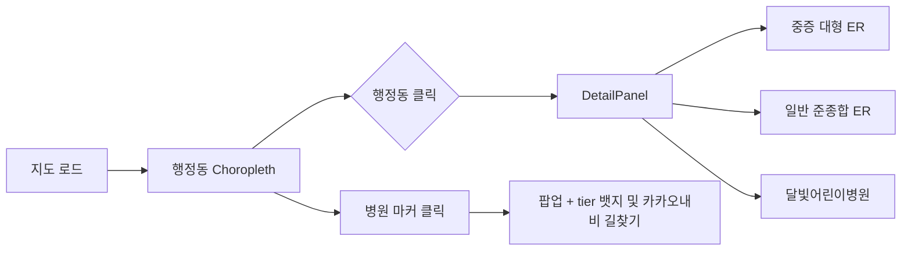

# Guides and Learning


---
## [원본 파일명: guides/accessibility_candidate_trace_study_20260715.md]

# 접근성 후보 추적 학습서

- 작성일: 2026-07-15
- 목적: 최적입지 후보 고도화 작업을 다시 볼 때, 왜 이 작업을 했고 어떤 흐름으로 이해해야 하는지 정리한다.
- 대상: 개인 프로젝트 `대구 골든타임 플랫폼`의 AI·공간분석 모델 고도화
- 예산 원칙: 현금 지출 0원, 5,000원은 비상 예비비

## 1. 한 줄 요약

기존 K-Means 결과를 버린 것이 아니라, K-Means를 "최종 정답"이 아닌 "후보 생성기"로 낮추고, 각 후보가 실제로 어느 행정동의 접근성을 얼마나 개선하는지 추적하는 구조로 바꾼 작업이다.

## 2. 왜 이 작업이 필요했나

초기 최적입지 마커는 좌표와 수요만 보여줬다. 그래서 사용자는 다음 질문을 할 수밖에 없다.

```text
이 후보가 왜 좋은가?
군위나 외곽으로 튀는 후보는 정말 좋은 후보인가?
이 위치가 실제 병원 신설 확정지처럼 보이면 위험하지 않은가?
```

이 문제를 해결하려면 후보마다 근거가 필요하다.

- 어떤 행정동이 개선되는지
- 기존 병원까지 얼마나 멀었는지
- 후보를 추가하면 얼마나 가까워지는지
- 취약인구가 얼마나 커버되는지
- 군위/외곽 후보는 메인 후보인지 별도 권역 후보인지

## 3. 핵심 개념

### K-Means

K-Means는 취약 수요가 공간적으로 어디에 모여 있는지 찾는 도구다. 하지만 K-Means 중심점 자체가 병원 신설 정답은 아니다.

이 프로젝트에서는 K-Means를 이렇게 재정의했다.

```text
K-Means = 1차 후보 생성기
접근성 개선량 = 후보 평가 근거
화면 마커 = 정책 우선 검토 후보
```

### 접근성 개선량

행정동 중심점 기준으로 계산한다.

```text
before = 행정동 중심점에서 기존 최근접 병원까지의 거리
after = 행정동 중심점에서 후보지까지의 거리
gain = before - after
```

`gain`이 0보다 크면 해당 후보가 그 행정동의 접근성을 개선한다고 본다.

### 취약인구 가중 평균

단순히 평균 거리를 줄이는 것보다, 취약인구가 많은 행정동의 개선을 더 중요하게 본다.

```text
weighted_gain = gain_km * vulnerable_population
accessibility_gain_km = sum(weighted_gain) / sum(vulnerable_population)
```

이렇게 하면 "조금 가까워졌지만 사람이 거의 없는 곳"보다 "취약인구가 많은 곳에서 의미 있게 가까워진 후보"를 더 잘 설명할 수 있다.

## 4. 데이터 흐름

현재 흐름은 다음과 같다.

```text
1. 후보 JSON
   frontend/public/data/optimal_locations_pediatric.json
   frontend/public/data/optimal_locations_senior.json

2. 취약 행정동 GeoJSON
   frontend/src/data/daegu_vulnerability.geojson

3. 병원 목록
   frontend/src/data/final_hospitals.json

4. 후보 추적 스크립트
   ai-model/build_accessibility_candidate_trace.py

5. 모델 산출물
   data/processed/accessibility_candidate_trace.json

6. 화면용 산출물
   frontend/public/data/accessibility_candidate_trace.json

7. 화면 표시
   frontend/src/widgets/map-dashboard/lib/useOptimalLocationsStore.ts
   frontend/src/widgets/map-dashboard/OptimalLocationMarkers.tsx
```

## 5. 화면에서는 무엇이 달라졌나

기존에는 후보 마커가 단순히 좌표와 수요만 보여줬다.

이제는 마커 툴팁에서 다음 근거를 보여준다.

- 분석 수요
- 평균 접근성 개선
- 개선 전후 거리
- 커버 취약인구
- 개선 행정동 수
- 최근접 기존 병원
- 설명용 점수
- 해석 문구
- 확정 위치가 아닌 정책 우선 검토 후보 안내

즉, "여기가 정답입니다"가 아니라 "이 후보는 이런 근거로 우선 검토할 만합니다"라고 말하는 구조가 됐다.

## 6. 군위 후보는 왜 지우지 않았나

군위 후보는 삭제하지 않았다. 삭제하면 데이터가 말하는 문제를 숨기는 꼴이 된다.

대신 다음처럼 분리했다.

```text
main_daegu = 메인 대구 시가지 후보
separate_region = 군위/원거리 별도 권역 후보
hold = 수요가 낮아 보류 검토가 필요한 후보
```

이 방식은 발표 때도 방어력이 있다.

```text
군위 후보는 모델 오류로 숨긴 것이 아니라, 대구 본시가지와 의료 접근 구조가 다른 별도 권역 후보로 분리했습니다.
```

## 7. 현재 한계

현재 계산은 직선거리 기반 1차 프록시다.

- 3km 버퍼는 실제 도로망이 아니다.
- Haversine 거리는 대원거리이지만 실제 이동 경로가 아니다.
- 하천, 산지, 교량, 고속도로 진출입, 시간대별 정체를 반영하지 못한다.

따라서 현재 결과는 최종 입지 결정 모델이 아니라, 접근성 개선 근거를 붙인 1차 후보 평가 모델이다.

## 8. 돈이 드는 고도화는 어떻게 다루나

예산은 5,000원이므로 현금 지출 0원 원칙을 지킨다.

하지 않는다.

- 유료 내비게이션 API 반복 호출
- 유료 등시선 API 사용
- 유료 데이터셋 구매
- 신용카드 등록이 필요한 무료 체험
- 새 서버/도메인/호스팅 결제

대신 한다.

- 로컬 스크립트 계산
- 공개 데이터 기반 분석
- EPSG:5179 좌표계 전환
- K-Means 민감도 분석
- 직선거리 대비 우회계수 프록시
- 보고서와 발표 문구 강화

## 9. 내가 설명할 수 있어야 하는 문장

```text
이 모델은 K-Means를 최종 정답으로 쓰지 않고, 후보 생성기로만 사용합니다.
후보별로 기존 병원 접근거리와 후보 접근거리를 비교해 접근성 개선량을 계산하고,
취약인구 가중 평균으로 어떤 후보가 더 많은 취약계층에게 도움이 되는지 설명합니다.
현재는 직선거리 기반 1차 프록시이며, 도로망·교통시간 기반 등시선 분석은 비용 통제상 3단계 고도화 과제로 분리했습니다.
```

## 10. 다음 학습 포인트

1. EPSG:5179 좌표계가 왜 필요한지 이해한다.
2. 위경도 K-Means와 투영좌표 K-Means 결과를 비교한다.
3. K, seed, 거리 상한을 바꾸면 후보가 얼마나 흔들리는지 본다.
4. 군위 포함/분리/제외 조건에 따른 결과 차이를 표로 만든다.
5. 직선거리 기반 모델의 한계를 도로망 프록시로 어떻게 보완할지 정리한다.

## 11. 최종 후보지와 위험 주요권역은 바뀔 수 있나

바뀔 수 있다. 특히 좌표계, K값, random seed, 거리 상한, 군위 처리 조건을 바꾸면 후보 좌표와 순위가 달라질 수 있다.

하지만 모든 것이 무작위로 뒤집힌다는 뜻은 아니다.

바뀔 수 있는 것:

- 최종 후보지 좌표
- 후보 순위
- 후보 개수 K
- 군위/외곽 후보의 분류
- 후보가 커버하는 행정동 목록
- 접근성 개선량

상대적으로 덜 바뀌는 것:

- 취약인구가 많은 큰 권역
- 기존 병원 접근성이 낮은 구조적 방향성
- 동부권, 달성·달서권, 군위권처럼 반복적으로 나타나는 큰 공간 패턴

따라서 중요한 것은 후보가 바뀌는지 자체가 아니라, 조건을 바꿔도 계속 살아남는 후보와 쉽게 흔들리는 후보를 구분하는 것이다.

```text
조건을 바꿔도 계속 비슷한 권역에 나오는 후보 = 안정 후보
조건을 조금만 바꿔도 크게 튀는 후보 = 검토/보류 후보
```

## 12. Step 6 EPSG:5179 K-Means 실험에서 배운 점

실험 산출물:

- `ai-model/compare_projected_kmeans_candidates.py`
- `data/processed/projected_kmeans_candidate_comparison.json`
- `docs/reports/projected_kmeans_candidate_comparison_report_20260715.md`

결과 요약:

| 모드 | K | 사각지대 입력 수 | EPSG:5179 후보와 현재 공개 후보 거리 | EPSG:5179 후보와 WGS84 재계산 후보 거리 |
|---|---:|---:|---|---|
| pediatric | 2 | 385 | 1.093~2.050km | 0.162~0.886km |
| senior | 3 | 39 | 3.125~4.253km | 0.001~0.006km |

해석:

- 좌표계를 EPSG:5179로 바꾸는 것만으로 후보가 크게 폭발하지는 않았다.
- WGS84 재계산 후보와 EPSG:5179 후보의 차이는 작았다.
- 현재 화면용 공개 후보와 재계산 후보 사이에는 차이가 있으므로, 공개 JSON의 산출 시점과 재현 파이프라인의 입력 기준을 계속 맞춰야 한다.
- 이번 결과만으로 화면 후보를 바로 교체하지 않고, Step 7 민감도 분석까지 본 뒤 안정 후보를 판단한다.

발표 문장:

```text
좌표계를 실제 거리 계산에 더 적합한 EPSG:5179로 바꿔 재실험했습니다.
좌표계 변경만으로 후보가 크게 붕괴되지는 않았지만,
현재 공개 후보와 재현 파이프라인 후보 사이에는 1~4km 수준의 차이가 있어
다음 단계에서 K값, seed, 군위 처리 조건까지 포함한 민감도 분석으로 안정 후보를 선별할 계획입니다.
```

## 13. Step 7 민감도 분석에서 배운 점

실험 산출물:

- `ai-model/run_candidate_sensitivity_analysis.py`
- `data/processed/candidate_sensitivity_analysis.json`
- `docs/reports/candidate_sensitivity_analysis_report_20260715.md`

실험 조건:

| 조건 | 값 |
|---|---|
| K | 2, 3, 4, 5 |
| seed | 0, 7, 21, 42, 100 |
| 거리 상한 | 없음, 10km, 15km, 20km |
| 군위 처리 | 포함, 별도 권역, 제외 |
| 후보 근접 그룹 | 3km 이내를 같은 후보권으로 묶음 |

핵심 결과:

| 모드 | 안정 후보권 | 시나리오 커버율 | 해석 |
|---|---|---:|---|
| pediatric | 35.887683, 128.548218 | 0.750 | 소아 메인 안정 후보 |
| pediatric | 35.705094, 128.431675 | 0.750 | 소아 남서부 안정 후보 |
| senior | 35.826276, 128.649296 | 0.708 | 어르신 동부권 안정 후보 |
| senior | 35.749237, 128.470437 | 0.533 | 어르신 보류/남서부 검토 후보 |
| senior | 36.161737, 128.654469 | 0.125 | 군위/원거리 별도 권역 후보 |

해석:

- 소아 후보는 조건을 바꿔도 메인 대구권의 두 후보권이 강하게 반복 등장했다.
- 어르신 후보는 동부권 후보가 가장 안정적이었다.
- 군위 후보는 완전히 사라지는 후보가 아니라 별도 권역 후보로 반복 등장한다.
- 하지만 군위 후보의 커버율은 낮으므로 메인 추천 후보가 아니라 분리 표시가 맞다.
- 이 결과는 정책탭/관리자 분석 화면의 후보 선별 근거이며 시민탭에는 반영하지 않는다.

내가 설명할 수 있어야 하는 문장:

```text
민감도 분석에서는 K값, seed, 거리 상한, 군위 처리 조건을 바꿔도 반복적으로 나타나는 후보권을 안정 후보로 봤습니다.
소아는 두 개의 메인 후보권이 안정적으로 반복됐고, 어르신은 동부권 후보가 가장 안정적이었습니다.
군위 후보는 삭제하지 않고 별도 권역 후보로 분리했습니다.
이 결과는 시민 행동 안내가 아니라 정책탭의 의사결정 근거로만 사용합니다.
```

## 14. AI 인프라 확충 시뮬레이션은 왜 추가했나

민감도 분석까지는 "어느 후보지가 조건을 바꿔도 계속 살아남는가"를 보는 단계다. 하지만 정책탭 사용자 입장에서는 여기서 한 번 더 질문이 생긴다.

```text
그럼 이 후보 주변에는 실제 의료 인프라가 충분한가?
부족하다면 병원을 새로 세워야 하나, 기존 병원 자원을 보강해야 하나?
전문의, MRI, CT 중 무엇이 먼저 문제인가?
```

그래서 안정 후보만 대상으로 AI 인프라 확충 시뮬레이션을 추가했다.

현재 방식은 유료 API나 실시간 병원 인력표를 쓰지 않는다. 기존 로컬 HIRA 오프라인 샘플과 후보 분석 산출물을 이용해 반경 5km 주변 병원의 전문의 수, MRI, CT 보유 여부를 1차로 읽는다.

산출물 흐름은 다음과 같다.

```text
candidate_sensitivity_analysis.json
  -> ai-model/build_stable_resource_recommendations.py
  -> frontend/public/data/stable_policy_candidates.json
  -> frontend/public/data/resource_recommendations.json
  -> 정책탭 최적입지 마커와 AI 인프라 확충 모달
```

중요한 점은 이것이 예산 배정 확정안이 아니라는 것이다. 현재 결과는 "정책 우선검토후보를 더 잘 설명하기 위한 1차 시뮬레이션"이다.

## 15. 화면 용어 해설

### 우선검토후보

확정 입지가 아니다. 민감도 분석, 접근성 개선량, 주변 인프라 상태를 고려했을 때 정책적으로 먼저 검토할 만한 후보라는 뜻이다.

```text
이 좌표는 병원 신설 확정지가 아니라, 여러 조건에서 반복 등장한 정책 우선검토후보입니다.
```

### 분석 수요

실제 환자 수나 병원 방문자 수가 아니다. 후보를 만들 때 사용한 취약 수요 묶음의 규모다.

소아 후보에서는 보육시설·소아 취약 수요처럼 모델 입력으로 들어간 수요 집합을 뜻하고, 어르신 후보에서는 고령 취약 수요권을 뜻한다. 따라서 화면의 `분석 수요 111건` 같은 표현은 "111명의 환자가 온다"가 아니라 "후보 산출 과정에서 이 후보가 대표하는 취약 수요 묶음의 크기"로 읽어야 한다.

발표에서는 이렇게 말하면 된다.

```text
분석 수요는 실제 환자 수가 아니라, 모델이 후보를 계산할 때 사용한 취약 수요 묶음의 규모입니다.
```

### 민감도 반복률

K 값, random seed, 거리 상한, 군위 처리 방식을 바꿔도 비슷한 위치가 다시 등장한 비율이다.

예를 들어 75.0%라면 "조건을 꽤 많이 바꿔도 이 후보권이 반복적으로 살아남았다"로 해석한다. 낮은 값은 "검토는 가능하지만 흔들리는 후보"로 본다.

### 반경 5km

후보 주변의 기존 병원 인프라를 보는 1차 탐색 범위다. 실제 생활권이나 구급차 이동시간과 완전히 같지는 않다.

현재는 비용 0원 원칙 때문에 도로망 API 대신 Haversine 직선거리 기반으로 계산한다. 따라서 발표에서는 "실제 이동시간 기반 등시선 분석은 후속 고도화 과제"라고 말해야 한다.

### 전문의 보강

반경 5km 주변 병원의 전문의 수가 수요 대비 부족해 보일 때 필요한 추가 전문의 수를 거칠게 추정한 값이다.

이 값은 실제 채용 계획이 아니다. 당직표, 진료과목, 병원 운영시간, 예산은 아직 반영하지 않는다.

### MRI/CT 보강

주변 참조 병원에 MRI 또는 CT 보유 신호가 부족할 때 "필요"로 표시한다.

이 역시 장비 구매 확정안이 아니다. 정책 검토에서 "장비 접근성도 같이 확인해야 한다"는 경고등에 가깝다.

### 별도 권역

군위처럼 대구 본시가지와 공간 구조가 다른 후보를 메인 후보와 섞지 않기 위한 분류다.

삭제가 아니다. 오히려 모델이 "여기는 별도 생활권으로 따로 봐야 한다"고 알려주는 신호다.

### 설명용 점수

후보의 최종 정답 점수나 예측 정확도가 아니다. 화면에서 후보를 설명하기 위해 만든 보조점수다.

현재 계산식은 다음과 같다.

```text
설명용 점수 = 평균 접근성 개선 km × log(1 + 커버 취약인구)
```

의미는 단순하다.

- 평균 접근성 개선 km가 클수록 점수가 오른다.
- 개선 효과를 받는 취약인구가 많을수록 점수가 오른다.
- 다만 인구를 그대로 곱하면 큰 지역이 너무 유리해지므로 `log(1 + 인구)`로 눌러서 반영한다.

이 점수는 후보 간 설명을 돕는 보조 지표다. 병원 신설 여부, 예산 배정, 최종 순위를 단독으로 결정하는 지표가 아니다.

발표에서는 이렇게 말하면 된다.

```text
설명용 점수는 접근성 개선량과 커버 취약인구를 합친 보조 지표입니다.
최종 입지 결정 점수가 아니라, 왜 이 후보를 먼저 검토할 수 있는지 설명하기 위한 참고값입니다.
```

## 16. 이번 단계에서 지킨 원칙

- 돈 쓰지 않기: 유료 내비게이션 API, 유료 등시선 API, 유료 데이터 구매를 쓰지 않았다.
- 정책탭 한정: 시민탭에는 최적입지 후보와 위험권역을 반영하지 않았다.
- 안정 후보 우선: 민감도 분석에서 살아남은 후보만 프론트 우선 후보로 승격했다.
- 해설 포함: 사용자가 헷갈리는 용어를 모달과 마커 툴팁에 함께 표시했다.
- 한계 명시: 반경 5km와 Haversine 직선거리의 한계를 보고서와 화면 문구에 남겼다.

## 17. 이번에 고친 화면 오류에서 배운 점

### 긴 설명은 지도 오버레이 안에 넣지 않는다

최적입지 후보 설명을 `CustomOverlayMap` 안의 hover 툴팁으로 길게 표시했더니, 카카오맵 pane 또는 지도 컨테이너 경계에서 설명이 잘렸다.

해결은 긴 설명을 지도 오버레이 밖의 `fixed` 상세 패널로 분리하는 것이었다. 지도 위 마커에는 짧은 라벨만 남기고, 긴 해설은 화면 레벨 패널에서 스크롤되게 해야 한다.

### 모달은 화면 높이에 맞춰 유동적으로 떠야 한다

AI 인프라 확충 모달은 내용이 길어지면서 작은 화면에서 잘릴 수 있었다. 그래서 모바일에서는 바텀시트처럼, 데스크톱에서는 중앙 모달처럼 보이게 하고, 본문은 내부 스크롤되도록 바꿨다.

앞으로 모달을 만들 때는 `vh`보다 실제 모바일 주소창 변동에 강한 `dvh` 계열 높이와 내부 스크롤을 우선 고려한다.

### 숫자 지표는 반드시 해설을 붙인다

`설명용 점수`, `분석 수요`, `민감도 반복률`은 개발자가 봐도 헷갈릴 수 있는 표현이다.

따라서 숫자만 보여주면 안 된다. 화면 안에서 "무엇이 아니고, 무엇인지"를 같이 말해야 한다.

정리하면 다음과 같다.

| 용어 | 오해 | 올바른 해석 |
|---|---|---|
| 분석 수요 | 실제 환자 수 | 후보 산출에 사용한 취약 수요 묶음 규모 |
| 설명용 점수 | 최종 입지 결정 점수 | 접근성 개선과 커버 인구를 합친 보조 설명값 |
| 민감도 반복률 | 정확도 | 조건을 바꿔도 후보가 반복 등장한 비율 |

### 이번 오류 수정 보고서

자세한 오류-원인-수정-검증 기록은 아래 보고서에 정리했다.

- `docs/reports/ai_model_frontend_corrections_report_20260715.md`


---
## [원본 파일명: guides/accessibility_model_upgrade_guide_20260715.md]

# 접근성 기반 최적입지 모델 고도화 설명서

- 작성일: 2026-07-15
- 목적: 기존 K-Means 최적입지 분석을 왜, 어떻게 고도화하는지 설명한다.
- 연결 계획: `docs/plans/roadmaps/accessibility_model_upgrade_roadmap_20260715.md`

## 1. 지금 K-Means의 의미

기존 K-Means는 헛수고가 아니다. 다만 역할을 바꿔야 한다.

기존 해석:

```text
K-Means 중심점 = 최적입지
```

개선 해석:

```text
K-Means 중심점 = 취약 수요가 모이는 1차 후보 권역
```

K-Means는 취약 수요가 어디에 모여 있는지 찾는 데 유용하다. 그러나 병원 입지는 도로, 기존 병원, 접근 시간, 수요 규모, 권역 특성까지 함께 봐야 한다. 따라서 K-Means 결과를 최종 정답으로 쓰지 않고, 후보를 만드는 첫 단계로 사용한다.

## 2. 왜 모델을 고도화해야 하는가

현재 최적입지 후보는 군위군이나 외곽으로 튀는 경향이 있다. 이 현상은 단순 오류라기보다 모델 구조에서 자연스럽게 생길 수 있는 편향이다.

주요 원인:

- 위경도 좌표를 직접 K-Means에 넣으면 실제 거리와 다른 공간 왜곡이 생길 수 있다.
- 병원까지 먼 지역은 취약도가 크게 계산되어 외곽 후보가 과대표현될 수 있다.
- 군위군은 행정구역상 대구지만 도시권 의료 접근성과 공간 구조가 다르다.
- K-Means는 기존 병원과 후보가 얼마나 중복되는지 판단하지 못한다.
- 후보가 실제로 접근성을 얼마나 개선하는지 직접 계산하지 않는다.

그래서 모델의 질문을 바꿔야 한다.

```text
기존 질문:
취약 수요를 묶으면 중심이 어디인가?

개선 질문:
이 후보를 추가하면 어느 취약지역의 접근성이 얼마나 개선되는가?
```

## 3. 새 모델 구조

새 구조는 3단계다.

### 1단계: 후보 생성

검토할 후보군을 만든다.

- 가중 K-Means 후보
- 행정동 중심 후보
- 격자 후보
- 군위 권역 별도 후보

이 단계의 목적은 정답을 내는 것이 아니라 "검토할 만한 후보 목록"을 만드는 것이다.

### 2단계: 후보 평가

각 후보를 같은 기준으로 평가한다.

평가 항목:

- 접근성 개선량
- 커버 취약인구
- 기존 병원과의 중복도
- 의료 인프라 부족도
- 군위·외곽 저수요 패널티

예시 점수 구조:

```text
candidate_score =
  accessibility_gain_score
+ vulnerable_population_score
+ infrastructure_gap_score
- existing_hospital_overlap_penalty
- remote_low_demand_penalty
```

### 3단계: 후보 해석

후보를 한 줄로 섞지 않는다.

- 도시권 주요 후보
- 군위/원거리 별도 권역 후보
- 수요가 작아 보류할 후보

이렇게 분리하면 외곽 사각지대를 숨기지 않으면서도, 메인 화면에서 "여기가 최종 신설지"처럼 오해되는 위험을 줄일 수 있다.

## 4. 접근성 개선량이란 무엇인가

후보가 추가되기 전후를 비교한다.

```text
현재 상태:
행정동 A -> 가장 가까운 기존 병원 8.0km

후보 추가 후:
행정동 A -> 후보 3.0km

개선량:
8.0km - 3.0km = 5.0km
```

이 개선량을 취약인구로 가중한다.

```text
가중 개선량 = 개선 거리 x 취약인구
```

이 방식은 "후보가 지도상 그럴듯한가"보다 "후보가 실제로 누구에게 도움이 되는가"를 묻는다.

## 5. 교통·도로 구조 반영 방법

처음부터 실제 교통 API를 모두 붙이면 복잡하다. 단계적으로 간다.

### P0: 빠른 프록시

- 직선거리 사용
- 외곽/산지/군위 보정계수 적용
- 기존 병원 5km 이내 중복 패널티 적용

### P1: 재현 가능한 도로망 실험

- OSRM 또는 도로망 기반 네트워크 거리 사용
- 후보와 행정동 중심 간 거리 행렬 생성

### P2: 실제 이동시간 샘플링

- Kakao API 등으로 일부 후보의 실제 이동시간 샘플링
- API 호출 제한과 재현성 문제를 문서화

## 6. 발표 때 설명하는 방식

추천 표현:

```text
초기에는 가중 K-Means로 취약 수요의 공간 군집을 찾았습니다.
그 과정에서 외곽과 군위 권역이 거리 가중치 때문에 과대표현되는 한계를 확인했습니다.
그래서 K-Means를 최종 입지 결정 모델이 아니라 후보 생성기로 낮추고,
후보별 접근성 개선량과 기존 병원 중복도를 추가 평가하는 구조로 고도화했습니다.
```

피해야 할 표현:

- AI가 최적 병원 위치를 정했다.
- 여기가 병원 신설지다.
- 이 후보가 정답이다.

사용할 표현:

- 분석상 우선 검토 후보
- 접근성 개선 후보
- 정책 검토 후보
- 별도 권역 검토 대상

## 7. 첫 번째 구현 목표

가장 먼저 할 일은 후보 JSON을 확장하는 것이다.

기존:

```json
{
  "id": 1,
  "lat": 35.8992,
  "lng": 128.6372,
  "demand": 320
}
```

목표:

```json
{
  "id": 1,
  "mode": "pediatric",
  "candidate_type": "kmeans_centroid",
  "lat": 35.8992,
  "lng": 128.6372,
  "demand": 320,
  "candidate_group": "main_daegu",
  "before_avg_distance_km": 6.8,
  "after_avg_distance_km": 3.1,
  "accessibility_gain_km": 3.7,
  "vulnerable_population": 12400,
  "nearest_existing_hospital": "강남종합병원",
  "interpretation": "소아 취약인구가 많고 기존 달빛·소아 기관 접근성이 낮은 도시권 후보"
}
```

이 JSON이 생기면 화면은 단순 마커가 아니라 설명 가능한 후보 카드가 된다.


---
## [원본 파일명: guides/daily_error_debugging_study_20260715.md]

# 2026-07-15 오류 학습서

- 작성일: 2026-07-15
- 목적: 오늘 발생한 오류를 다음에 스스로 진단할 수 있도록 개념과 점검 순서를 정리한다.

## 1. 외부 API 오류는 화면 오류와 분리해서 본다

외부 API가 실패했다고 해서 서비스 전체가 실패해야 하는 것은 아니다. 특히 이 프로젝트는 응급 접근성 플랫폼이므로, 외부 API가 느리거나 제한되어도 사용자는 최소한의 판단 정보를 볼 수 있어야 한다.

구분 기준은 다음과 같다.

| 상황 | 의미 | 화면 처리 |
|---|---|---|
| ReadTimeout | 외부 서버가 제한 시간 안에 응답하지 않음 | 저장된 데이터 사용, 최근 정보 안내 |
| HTTPStatusError | 외부 서버가 오류 상태 코드를 반환 | 해당 부가 정보만 실패 처리 |
| API quota exceeded | 호출량 제한 초과 | 이후 호출 중단, 저장된 이동시간 사용 |
| 네트워크 실패 | 연결 자체 실패 | 재시도 버튼 또는 대체값 표시 |

핵심은 "오류를 숨기지 않되, 사용자 화면을 멈추지 않는 것"이다.

## 2. Kakao `code: -10`은 무한 재시도하면 안 된다

`code: -10`은 Kakao API 호출 제한 초과를 의미한다. 이 상태에서 계속 요청을 보내면 성공 가능성은 낮고, 로그만 폭증한다.

올바른 대응 순서는 다음과 같다.

```text
1. 전체 병원에 실시간 길찾기를 호출하지 않는다.
2. 저장된 이동시간 또는 추정 이동시간으로 먼저 정렬한다.
3. 상위 3~5개만 실시간 길찾기를 호출한다.
4. code -10이 나오면 즉시 회로 차단 상태로 전환한다.
5. 이후 요청은 저장된 이동시간으로 대체한다.
6. 사용자에게는 쉬운 문장으로만 안내한다.
```

사용자 안내 예시는 다음과 같다.

```text
실시간 교통 정보를 불러오지 못해 저장된 이동시간을 사용합니다.
```

개발자 콘솔에는 원인을 자세히 남기되, 사용자에게 `code: -10` 같은 내부 오류 문구를 그대로 보여주면 안 된다.

## 3. 캐시와 중복 요청 방지의 차이

캐시는 이미 끝난 요청 결과를 재사용하는 것이다. 중복 요청 방지는 아직 끝나지 않은 같은 요청을 하나로 합치는 것이다.

| 개념 | 설명 | 필요한 이유 |
|---|---|---|
| Cache | 같은 출발지·목적지 결과를 일정 시간 저장 | 반복 클릭·화면 재진입 시 호출 절감 |
| In-flight dedupe | 진행 중인 같은 요청을 공유 | React Strict Mode 또는 빠른 재렌더 중복 호출 방지 |
| Circuit breaker | 실패가 명확한 상태에서 호출 중단 | 쿼터 초과 후 무한 호출 방지 |

길찾기 API처럼 호출 제한이 있는 기능은 세 가지를 같이 써야 안정적이다.

## 4. 버튼이 눌리는데 화면이 안 바뀔 때 보는 순서

정책탭 중증 질환 버튼 문제는 버튼 컴포넌트 자체보다 상태 연결 문제였다. 이런 경우 아래 순서로 확인한다.

```text
1. 버튼 onClick이 실행되는가?
2. 선택 상태가 상위 컴포넌트에 저장되는가?
3. 그 상태가 실제 데이터 필터 함수에 들어가는가?
4. 필터된 배열이 목록 컴포넌트에 전달되는가?
5. 같은 배열이 지도 컴포넌트에도 전달되는가?
6. 기존 선택 병원이 남아서 변화가 가려지지는 않는가?
7. 서로 충돌하는 필터가 동시에 켜져 빈 교집합이 되지는 않는가?
```

이번 정책탭의 정답 흐름은 다음과 같다.

```text
HospitalSidebarControls
-> onSevereConditionChange
-> AdminView.severeCondition
-> filterByCareTarget
-> AdminHospitalSidebar hospitals
-> MapComponent hospitals
```

## 5. 한글 버튼은 최소 폭을 보장해야 한다

한글 UI에서 버튼 폭이 너무 좁으면 글자가 한 글자씩 세로로 떨어져 보인다. 이것은 기능 오류는 아니지만 사용자가 보기에는 심각한 품질 오류다.

피해야 할 패턴:

```text
좁은 패널 + grid-cols-3 + 긴 한글 버튼
```

권장 패턴:

```text
좁은 패널 + flex + overflow-x-auto + whitespace-nowrap
```

중증 질환처럼 선택지가 많은 필터는 모든 버튼을 한 화면에 억지로 넣기보다, 가로로 넘기는 칩 UI가 더 안전하다.

## 6. 정책탭과 사용자 추천탭은 같은 필터라도 목적이 다르다

사용자 추천탭은 "내가 지금 어디로 가야 하는가"가 중심이다. 정책탭은 "어느 지역과 어떤 의료자원이 취약한가"가 중심이다.

따라서 정책탭 필터는 다음을 같이 바꿔야 한다.

| 대상 | 이유 |
|---|---|
| 병원 목록 | 현재 조건에 맞는 기관 수를 바로 확인 |
| 지도 마커 | 공간 분포 변화 확인 |
| 상세 선택 상태 | 이전 병원 선택이 남아 혼동되는 것 방지 |
| 요약 문구 | 현재 적용된 필터를 사용자가 이해 |

버튼 색만 바뀌고 병원 목록과 지도 마커가 그대로면, 사용자는 "아무 반응이 없다"고 느낀다.

반대로 수치가 갑자기 모두 0이 되면 데이터가 사라진 것이 아니라 필터 교집합이 비어 있는지 먼저 봐야 한다. 예를 들어 `소아` 필터가 켜진 상태에서 `화상`을 누르면 "달빛어린이병원 중 중증화상 진료 가능 기관"을 찾게 되어 0개가 될 수 있다. 이런 조합은 사용자 의도와 다르므로 UI에서 자동으로 충돌을 풀어주는 편이 안전하다.

## 7. 오늘 오류에서 얻은 개발 원칙

| 원칙 | 설명 |
|---|---|
| 외부 API는 보조값으로 둔다 | 대량 계산은 저장된 데이터로 하고, 실시간 API는 최종 확인에만 사용 |
| 실패는 즉시 분기한다 | 쿼터 초과 같은 확정 실패는 계속 호출하지 않는다 |
| 상태는 화면 최상위에서 관리한다 | 여러 컴포넌트가 같은 필터 결과를 써야 하면 상위 상태로 올린다 |
| 좁은 화면은 버튼 가독성이 우선이다 | 버튼을 억지로 여러 열에 넣지 않는다 |
| 개발자 오류와 사용자 안내를 분리한다 | 로그는 자세히, 화면 문구는 쉽게 |

## 8. 다음 점검 체크리스트

```text
[ ] 정책탭에서 중증 질환 버튼 클릭 시 선택 색이 바뀐다.
[ ] 병원 목록 수가 바뀐다.
[ ] 지도 마커 수 또는 종류가 바뀐다.
[ ] 소아 모드에서 성인 중증질환을 눌러도 전체 수치가 0으로 고정되지 않는다.
[ ] 좁은 사이드바에서 버튼 글자가 세로로 꺾이지 않는다.
[ ] Kakao code -10 발생 후 추가 호출이 멈춘다.
[ ] 실시간 ETA 실패 시 저장된 이동시간 안내가 표시된다.
[ ] HIRA 장비 실패가 병원 기본 목록 전체 실패로 번지지 않는다.
```


---
## [원본 파일명: guides/data_status_and_static_lineage_study_20260714.md]

# 데이터 상태와 정적 계보 학습서

- 작성일: 2026-07-14
- 주제: `data-status.sources`가 비어 있던 이유와 정적 정본 기반 서비스에서 데이터 출처를 설명하는 방법

## 1. 이번 문제를 한 문장으로 보면

화면과 API는 정상 동작했지만, `GET /api/dashboard/data-status`의 `sources`가 빈 배열이라 “이 숫자가 어디서 왔는가”를 설명할 근거가 부족했다.

이 문제는 병원 목록이나 취약지역 데이터가 없어서 생긴 장애가 아니었다. 정적 정본 파일과 대시보드 스냅샷은 있었지만, 출처 상태를 담는 `DataSourceStatus` 테이블이 정적 시드 단계에서 채워지지 않았기 때문에 생긴 계보 공백이었다.

## 2. 관련 개념

### DashboardSnapshot

`DashboardSnapshot`은 화면에 보여줄 요약 숫자를 저장한다.

- 행정동 수
- 응급의료기관 수
- 중증·일반·달빛소아 분류 수
- 고위험 행정동 수
- 인구 기준월
- 분석 버전

즉 “현재 대시보드 숫자”의 저장소다.

### DataSourceStatus

`DataSourceStatus`는 각 데이터가 어디서 왔고 언제 확인됐는지를 저장한다.

- `source_name`: 출처 이름
- `source_version`: 기준 파일 또는 기준월
- `data_hash`: 데이터 파일 해시
- `record_count`: 레코드 수
- `last_checked_at`: 서비스가 출처를 확인한 시점
- `last_updated_at`: 원천 파일 또는 수집 결과의 수정 시점
- `last_success_at`: 정상 출처로 인정된 시점
- `status`: `static`, `updated`, `unchanged`, `failed`, `degraded` 등

즉 “이 숫자를 믿을 근거”의 저장소다.

## 3. 왜 빈 배열이었나

백엔드의 `get_data_status`는 `ensure_seeded(db)`를 먼저 호출한 뒤 `DataSourceStatus`를 조회한다.

기존 `ensure_seeded`는 다음 정적 데이터를 DB에 넣었다.

- 행정동
- 의료기관
- 인구
- 대시보드 스냅샷

하지만 `DataSourceStatus`는 수집 파이프라인이 성공했을 때만 채워지는 구조였다. 그래서 로컬이나 데모처럼 정적 정본으로 시작한 환경에서는 스냅샷은 있는데 출처 상태는 없는 상태가 됐다.

## 4. 해결 원리

정적 정본으로도 화면을 운영한다면, 정적 정본 역시 명시적인 데이터 출처로 취급해야 한다.

이번 수정은 `ensure_seeded`에 정적 출처 상태 생성을 추가했다. 이제 앱이 시작되거나 `data-status`가 호출될 때 다음 출처가 `DataSourceStatus`에 기록된다.

| 출처 | 기준 |
|---|---|
| `static_hospitals` | `data/processed/final_hospitals.json` |
| `static_vulnerability_geojson` | `data/processed/daegu_vulnerability.geojson` |
| `static_population` | `data/raw/population/daegu_population_real.csv` |
| `static_optimal_locations_pediatric` | `frontend/public/data/optimal_locations_pediatric.json` |
| `static_optimal_locations_senior` | `frontend/public/data/optimal_locations_senior.json` |

각 출처에는 파일 해시, 레코드 수, 파일 수정 시각, 확인 시각이 함께 들어간다.

## 5. 최적 입지 데이터 경로 정리

기존에는 두 경로가 공존했다.

- 화면 스토어: `frontend/public/data/optimal_locations_*.json`
- 미사용 API 클라이언트: `frontend/src/data/api/optimal-locations.ts`

실제 화면은 정적 JSON을 사용하고 있었으므로, 시연 기준도 정적 JSON으로 확정했다. 미사용 API 클라이언트는 제거해 설명 경로를 하나로 줄였다.

백엔드 `GET /api/optimal-locations` 자체는 남아 있지만, 현재 방문 시연에서 화면이 의존하는 주 경로는 정적 JSON이다.

## 6. 검증 방법

### 백엔드 테스트

```powershell
Set-Location backend
python -m pytest ..\tests\integration\backend\test_pipeline_integration.py ..\tests\unit\backend\test_dynamic_dashboard.py -q
```

기대 결과:

- 정적 시드가 `DashboardSnapshot`을 만든다.
- 정적 시드가 `DataSourceStatus`를 만든다.
- 병원 25곳, 취약지역 150개, 인구 기준월 2026.06이 검증된다.

### 프런트 타입 검사

```powershell
npm.cmd run typecheck --prefix frontend
```

기대 결과:

- 삭제한 미사용 최적 입지 API 클라이언트 때문에 깨지는 import가 없어야 한다.

### 실제 API 확인

```powershell
Invoke-WebRequest -UseBasicParsing -Uri http://127.0.0.1:8000/api/dashboard/data-status
```

기대 결과:

- `sources`가 빈 배열이 아니다.
- `static_hospitals`, `static_vulnerability_geojson`, `static_population`, `static_optimal_locations_pediatric`, `static_optimal_locations_senior`가 보인다.

## 7. 이번 작업에서 배운 점

- API가 200을 반환해도 데이터 계보가 비어 있으면 시연 설명에서는 리스크다.
- 정적 데모 데이터도 “출처 없음”이 아니라 “정적 정본 출처”로 기록해야 한다.
- 화면이 실제로 쓰지 않는 API 클라이언트는 시연 설명을 흐리므로 제거하거나 명확히 분리해야 한다.
- `DashboardSnapshot`은 요약값, `DataSourceStatus`는 신뢰 근거다. 둘은 함께 있어야 한다.


---
## [원본 파일명: guides/emergency_room_recommendation_study_20260713.md]

# 응급실 병상 상태와 추천 로직 학습서

## 1. 이 기능이 해결하는 문제

가장 가까운 병원이 항상 가장 빠르게 진료받을 수 있는 병원은 아니다. 가까운 병원의 일반응급실 가용 병상이 0이고 조금 먼 병원에 병상 여유가 있다면, 사용자는 거리와 병상 상태를 함께 봐야 한다. 이 기능은 그 판단을 대신 확정하는 것이 아니라 비교 순서를 더 유용하게 만드는 기능이다.

## 2. 데이터가 말할 수 있는 범위

- `hvec`: 일반응급실 가용 병상
- `total_hvec`: 일반응급실 전체 병상
- `available_beds`: 일반·소아 병상 합계 폴백
- `eta_seconds`: 일반 차량 기준 예상 이동시간
- `distanceKm`: 사용자 위치와 병원 사이의 직선거리

가용 병상은 실제 대기 인원, 환자의 중증도별 수용 가능 여부, 의료진 가용성까지 보장하지 않는다. 따라서 화면에서는 “대기 없음” 대신 “병상 여유 우선 추천”을 사용한다.

## 3. 상태 분류 원리

`resolveBedStatus`가 상태와 혼잡도를 한 번만 계산하는 단일 기준점이다.

```text
hvec <= 0                         -> 여유 없음
hvec > 0, total_hvec 없음         -> 원활(가용 병상 존재만 확인)
hvec / total_hvec >= 0.8          -> 원활, 초록
0.5 <= hvec / total_hvec < 0.8    -> 지연, 노랑
0 < hvec / total_hvec < 0.5       -> 혼잡, 빨강
병상 데이터 없음                  -> 확인 중, 회색
```

“지연”은 측정된 대기시간이 아니라 병상 가용률 중간 구간을 사용자에게 설명하기 위한 상태명이다. 화면 안내에서 병상 기준 추정임을 함께 밝혀야 한다.

## 4. 추천 비교 함수

추천 로직은 `shared/lib/hospital-recommendation.ts`에 있다. React 컴포넌트는 정렬 공식을 직접 갖지 않고 결과를 표시한다.

```text
병상 상태 등급 비교
  -> 같으면 ETA 비교
    -> ETA가 없거나 같으면 직선거리 비교
```

이 구조의 장점은 다음과 같다.

- 데스크톱, 모바일, 지도 없는 페이지가 같은 규칙을 사용한다.
- GitHub Pages에서 백엔드 ETA 호출이 실패해도 직선거리로 작동한다.
- 정렬 함수를 React와 분리해 작은 단위 테스트로 검증할 수 있다.
- 추천 근거 문구도 공용 함수에서 만들어 화면별 표현 불일치를 줄인다.

## 5. ETA가 있어도 병상 상태를 먼저 보는 이유

기존 구현은 ETA 응답이 도착하면 목록 전체를 ETA 순으로 다시 정렬했다. 그러면 가용 병상이 없는 가까운 병원이 다시 첫 번째가 될 수 있다. 변경된 비교 함수는 병상 상태가 같은 병원끼리만 ETA를 비교해 피드백의 의도를 보존한다.

## 6. GitHub Pages와 백엔드의 역할

GitHub Pages는 정적 파일만 호스팅한다. 브라우저에 노출하면 안 되는 Kakao REST API 키와 서버 측 ETA 요청은 FastAPI가 담당해야 한다.

- 정적 데모: 병상 상태 + 직선거리
- 백엔드 연결 환경: 병상 상태 + Kakao 일반 차량 ETA + 직선거리 폴백

정적 배포에서 기능이 사라지지 않도록 ETA는 필수값이 아니라 보조값이다.

## 7. 응급차 특수경로를 만들지 않는 이유

일반 지도 API가 반환하는 도로망은 일반 차량용이다. 역주행, 신호 특례, 현장 통제, 관제 지시는 공개 경로 계산만으로 안전하게 재현할 수 없다. 임의의 응급차 전용 경로를 표시하면 실제 운행 가능한 경로로 오인될 수 있다.

현재 구현은 일반 차량 길찾기임을 명시하고 실제 긴급 이송 병원과 경로는 119 및 의료기관의 수용 확인을 따르도록 안내한다. 공식 기관 연계가 가능해질 때 별도 권한·데이터·책임 범위로 설계해야 한다.

## 8. 테스트에서 배울 점

추천 테스트는 다음 네 가지를 고정한다.

1. 가까운 병상이 없는 병원보다 먼 병상 여유 병원이 먼저다.
2. 같은 상태에서는 ETA가 짧은 병원이 먼저다.
3. ETA가 없으면 직선거리를 사용한다.
4. 추천 문구가 “대기 없음”이나 “수용 확정”을 단정하지 않는다.

정렬 공식만 테스트하는 것이 아니라 제품 문구의 안전 경계도 회귀 테스트의 대상으로 본다.


---
## [원본 파일명: guides/exception_handling_study_20260714.md]

# 예외 처리 학습서: 오류를 숨기지 않는 폴백 설계

## 핵심 원칙

예외 처리는 오류를 없애는 코드가 아니라 오류를 어떤 상태로 호출자에게 전달할지 결정하는 코드다. 화면이나 배치 작업을 계속 실행하는 폴백은 유용하지만, 실패 사실과 데이터 출처까지 지우면 정상 상태와 장애 상태를 구분할 수 없다.

예외를 처리할 때는 다음 질문에 답할 수 있어야 한다.

1. 호출자는 성공, 부분 실패, 전체 실패를 구분할 수 있는가?
2. 빈 배열이 실제 빈 데이터인지 조회 실패인지 구분되는가?
3. 폴백 데이터가 캐시, 정적 파일, 기본값 중 무엇인지 드러나는가?
4. `lastUpdatedAt`은 실제 데이터 갱신 시각인가, 조회를 시도한 시각인가?
5. 로그뿐 아니라 반환값, 상태값, HTTP 상태 코드, 프로세스 종료 코드에도 실패가 남는가?

## 이번 프로젝트에서 발견한 패턴

### 1. 오류를 빈 배열로 바꾸기

최적 입지 파일의 부재, JSON 손상, 권한 오류를 모두 `200 []`로 반환하면 사용자는 “추천 결과가 0개”라고 해석한다. 파일이 아직 생성되지 않은 경우는 `503`, 파일이 손상된 경우는 `500`, 유효한 분석 결과가 정말 비어 있는 경우만 `200 []`로 구분한다.

적용 파일: `backend/app/api/routes/optimal_locations.py`

### 2. 부분적으로 깨진 응답을 성공으로 처리하기

병원 응답 중 스키마가 맞지 않는 행을 조용히 제거하면 운영 환경에서 병원이 사라져도 정상처럼 보인다. 현재는 한 건이라도 스키마가 맞지 않으면 요청을 실패시키고 Store의 명시적인 폴백 경로를 사용한다.

적용 파일: `frontend/src/data/api/hospitals.ts`

추가 학습: `[fetchHospitals] 병원 응답 데이터 검증 실패: N건` 경고는 사용자 안내 문구가 아니라 개발자용 원인 추적 로그다. 이 경고는 `/api/hospitals` 응답 중 `name`, `lat`, `lng`, `tier`, `available_beds`, `hvec`, `hvoc`, `tel` 중 하나가 프런트의 `HospitalRecord` 런타임 검증을 통과하지 못할 때만 발생한다. 2026-07-14 재검증에서는 실제 API 응답 25건 모두 JS 기준 검증을 통과했으므로, 이전 경고는 오래된 개발 서버 번들, 이전 콘솔 로그, 또는 수정 전 응답 검증 시점의 잔여 로그로 판단했다.

사용자에게 보여줄 문구는 내부 원인보다 앱의 대응을 말해야 한다. 예를 들어 "스키마 불일치로 N건 제외됨" 대신 "일부 병원 정보가 예상과 달라 최근 확인된 정보를 먼저 보여드립니다"처럼 현재 화면이 어떤 데이터로 유지되는지 설명한다.

### 3. 폴백 시각을 갱신 시각으로 기록하기

이전 캐시를 다시 보여준 시각은 원본 데이터가 갱신된 시각이 아니다. 폴백에서는 기존 `lastUpdatedAt`을 보존하고 `isDegraded`와 `degradedMode`로 현재 조회 상태를 표현한다.

적용 파일: `frontend/src/shared/store/hospitalStore.ts`

### 4. 일부 수집 실패를 전체 성공으로 반환하기

수집기는 `DataSourceStatus`에 `failed` 또는 `degraded`를 기록하고 파이프라인은 이를 모아 `partial_failure`로 반환한다. 관리자 강제 갱신 API는 이 상태를 `502`로 전달하며 스케줄러도 오류 로그를 남긴다.

적용 파일: `backend/app/services/pipeline.py`, `backend/app/api/routes/dashboard.py`, `backend/app/services/scheduler.py`

### 5. API 실패 후 폴백을 성공으로 덮어쓰기

인구 API 실패 후 로컬 CSV가 사용 가능하더라도 외부 원천은 실패한 상태다. 데이터는 계속 제공하되 `degraded` 상태와 원인을 보존한다.

적용 파일: `backend/app/services/fetchers/base.py`, `backend/app/services/fetchers/population_api.py`

### 6. 가짜 좌표로 분석을 계속하기

지오코딩 실패 행에 대구시청 좌표를 넣으면 분석은 완료되지만 군집 결과가 왜곡된다. 좌표를 비워 두고 후속 파이프라인의 `dropna`에서 제외하여 데이터 부족을 데이터 오류로 바꾸지 않는다.

적용 파일: `ai-model/pipeline_utils.py`

### 7. 오류를 출력하고 성공 종료하기

마이그레이션 스크립트가 롤백 후 예외를 삼키면 자동화 도구는 종료 코드 `0`을 성공으로 판단한다. 복구 작업을 수행한 뒤 예외를 다시 발생시켜 호출자에게 실패를 전달한다.

적용 파일: `backend/scripts/06_migrate_json_to_sqlite.py`, `backend/scripts/06_migrate_to_sqlite.py`

### 8. timezone-aware 컬럼을 맹신하기

SQLAlchemy 모델에 `DateTime(timezone=True)`를 선언했더라도, SQLite나 시드 데이터, 과거 적재 레코드를 거치면 런타임 값이 offset-naive `datetime`으로 들어올 수 있다. 이 값을 `datetime.now(timezone.utc)`와 바로 계산하면 정책 요약 API처럼 요청 전체가 `500`으로 무너진다.

적용 파일: `backend/app/api/routes/dashboard.py`

추가 학습: 시간 비교 직전에는 DB 모델 선언을 믿지 말고, API 경계에서 `tzinfo`를 확인해 UTC 기준으로 정규화하는 방어 코드가 필요하다. 특히 `max()`로 여러 시각을 모은 뒤 stale 여부를 계산하는 로직은 하나의 naive 값만 섞여도 전체 응답을 죽일 수 있으므로 회귀 테스트까지 함께 남겨야 한다.

## 권장 응답 모델

폴백 가능한 조회는 데이터와 상태를 함께 표현하는 방식이 가장 명확하다.

```json
{
  "data": [],
  "status": "degraded",
  "source": "stale-cache",
  "lastUpdatedAt": "2026-07-14T01:00:00Z",
  "errorCode": "UPSTREAM_TIMEOUT"
}
```

HTTP 상태 코드는 다음 기준으로 선택한다.

- `200`: 요청과 데이터 해석이 정상적으로 완료됨
- `409`: 동일 작업이 이미 실행 중이라 현재 요청을 수행할 수 없음
- `500`: 내부 파일 손상, 스키마 불변식 위반 등 서버 내부 오류
- `502`: 외부 데이터 원천 실패로 요청 목적을 완전히 달성하지 못함
- `503`: 필요한 분석 산출물이나 외부 서비스가 아직 사용 불가능함

## 코드 리뷰 체크리스트

- `except Exception` 또는 `catch`가 반환값을 정상값으로 바꾸는가?
- 빈 배열, `None`, `False`가 정상 결과와 실패 결과에 동시에 사용되는가?
- 폴백 후 `error`가 `null`이 되더라도 별도의 degraded 상태가 있는가?
- 부분 실패가 상위 Controller와 API까지 전달되는가?
- 비동기 작업을 먼저 생성한 뒤 조기 반환할 때 취소하거나 회수하는가?
- 배치 스크립트가 실패 시 0이 아닌 종료 코드를 반환하는가?
- 임시 기본값이 실제 데이터처럼 DB나 캐시에 저장되는가?

## 한 문장으로 기억하기

> 폴백으로 기능은 살리되, 실패 사실과 데이터 출처는 지우지 않는다.


---
## [원본 파일명: guides/kakao_mobile_map_embed_study_20260716.md]

# 카카오맵 모바일 임베드 학습서

작성일: 2026-07-16  
최종 갱신: 2026-07-16 (상세+지도 · 스크롤 셸)  
관련 통합본: [모바일 시민용 지도+목록 계획·보고 통합본](../reports/mobile_citizen_map_list_integrated_20260716.md)  
관련 학습: [모바일 브라우저 히스토리·상세 UX 학습서](./mobile_browser_history_ux_study_20260716.md)

## 핵심 원칙

1. **UX 레퍼런스와 지도 SDK는 다르다.**  
   “네이버처럼”은 마커+목록 동시 UX이고, 구현은 **카카오맵**이다.
2. **카카오맵은 부모 높이 없이 `height: 100%`면 빈 패널**이 된다.
3. 컨테이너 크기가 나중에 잡히면 **`relayout()`**이 필요하다.
4. 모바일/데스크톱에 지도를 동시에 마운트하지 않는다.
5. **상세에서도 지도를 유지**한다. 위치 감각이 상세에서 끊기면 피드백이 다시 난다.
6. **직선 Polyline ≠ 도로 경로.** Directions API 없이 방향만 보여 준다.
7. **스크롤 박스는 확정된 높이 안에서만** 생긴다. flex `flex-1`만으로는 부족할 수 있다 → 상세는 **fixed 뷰포트 셸**.

## 1. 왜 빈 패널만 보였는가

### 잘못된 가정

```text
flex 부모
  └─ basis-[42%] + min-h-[12rem]   ← “높이 있을 것”
       └─ 자식 h-full / Map 100%   ← 타일이 그려질 것
```

플렉스 `basis`는 부모의 **확정 높이**에 의존한다.  
조상이 `min-h-0` + 남은 공간 분배 중이면 `%` 높이가 0에 가까워지고,  
카카오맵은 그 순간 픽셀로 캔버스를 만들어 **회색/흰 박스만** 남긴다.

### 안전한 패턴

```text
명시적 픽셀/dvh 높이 래퍼
  └─ absolute inset-0
       └─ Map width/height 100%
       └─ onCreate → relayout()
       └─ ResizeObserver → relayout()  (드래그·프리셋)
```

## 2. mobileEmbed variant

| | default | mobileEmbed |
|--|---------|-------------|
| 최소 높이 | `min-h-[50vh]` 등 | 부모 명시 높이에 맞춤 |
| 범례 | 일반 | 더 작게 |
| 선택 팬 오프셋 | 바텀시트 가정 | 상세 하단 패널 고려 |
| 키보드 숏컷 | 켜기 | 끄기(터치 우선) |
| 직선 경로 | 없음 | 선택(또는 포커스) 병원 `Polyline` |

## 3. 높이 조절: 프리셋 + 드래그 (탐색 화면)

```text
보기 버튼 (균형 / 지도 크게 / 목록 크게)
  → mapHeightPx = 프리셋 픽셀

드래그 핸들 (pointer capture)
  → mapHeightPx = clamp(start + Δy, 120px, 뷰포트 65%)
  → MapRelayout → map.relayout()
```

상세 화면의 지도 높이는 별도 `getDetailMapHeight()`(~38vh, clamp)로 고정해  
하단 정보 패널 공간을 확보한다.

## 4. 탐색 ↔ 상세 (현재 모델)

```text
목록 카드 / 마커 탭
  → selectedHospital
  → fixed 셸: [목록으로] + 지도 + HospitalDetailPanel(layout=panel)

목록으로 / 물리 Back
  → closeDetail / popstate
  → 탐색 화면 (지도+목록)
```

| | 탐색 | 상세 (지도 OK) | 상세 (지도 실패) |
|--|------|----------------|------------------|
| 지도 | 있음 (드래그·프리셋) | 있음 (고정 높이) | 없음 |
| 하단 | 목록 | 상세 패널 스크롤 | 상세 패널 스크롤 |
| history | 없음 | `pushState` 1단 | 동일 |

초기에 마커=미리보기 칩 / 목록=상세로 나눈 적 있으나,  
“상세에 지도도 같이” 피드백 후 **둘 다 상세+지도**로 통일했다.  
미리보기 전용 `previewHospital` 상태는 셸에서 제거했고,  
Polyline은 `selectedHospital` 기준으로 그린다.

## 5. 상세 스크롤이 또 멈춘 이유

### 증상

상세+지도를 flex `flex-1` 섹션으로 넣으면, 본문에 `overflow-y-auto`가 있어도  
**스크롤이 생기지 않거나 터치가 먹히지 않는** 경우가 있다.

### 원인

`overflow-y-auto`는 부모에 **유한한 높이**가 있을 때만 스크롤 박스가 된다.  
문서 흐름 + `min-h-dvh` 체인 + 푸터 등이 섞이면 `flex-1`이 “남은 공간”을  
제대로 못 받아 패널이 콘텐츠만큼 늘어나고, 스크롤이 바깥으로 새거나 멈춘다.

### 해결 패턴 (현재)

```text
fixed inset-x-0 bottom-0
  top: var(--mobile-nav-height)   ← 뷰포트 높이 확정
  overflow-hidden
  ├─ 목록으로 버튼 (shrink-0)
  ├─ 지도 (명시 px 높이)
  └─ min-h-0 flex-1 overflow-hidden
       └─ HospitalDetailPanel layout="panel"
            └─ 본문 overflow-y-auto touch-pan-y
```

체크 질문:

- 상세 셸이 **뷰포트에 고정**되어 있는가?
- 스크롤 컨테이너 조상에 **`min-h-0`**이 있는가?
- 스크롤은 **패널 본문 한곳**만 담당하는가?

자세한 History·닫기 단일화는 [히스토리·상세 UX 학습서](./mobile_browser_history_ux_study_20260716.md)를 본다.

## 6. 직선 경로

`/api/routing/eta`는 ETA·거리만 주고 **도로 좌표열은 없다**.  
카카오 `Polyline`으로 내 위치 → 병원 직선을 그린다.

- 장점: 추가 SDK 없이 방향 감각
- 한계: 실제 도로와 다를 수 있음
- 도로 폴리라인은 별도 Directions 계획으로 둔다

## 7. 폴백

```text
kakao.configured && !loading && !error
  → 탐색: 지도+목록 / 상세: 지도+패널
그 외
  → 탐색: 안내+목록 / 상세: 패널만 (같은 fixed 셸)
```

구버전 문구 `지도 없이 목록으로 확인`이 보이면 **옛 번들/미배포 데모** 가능성이 크다.

## 8. 로컬 확인 절차

1. 백엔드 `8000`, 프론트 `5173` 기동
2. 모바일 폭으로 http://127.0.0.1:5173
3. 탐색: 마커·목록·프리셋·드래그
4. 목록/마커 → 상세: **지도가 위에 남는지**, 본문 **스크롤**되는지
5. 다른 마커 → 병원 전환 후 Back 한 번에 탐색 복귀
6. 길찾기·전화 영역까지 스크롤 가능한지

## 9. 관련 코드

| 개념 | 파일 |
|------|------|
| 모바일 셸 | `MobileCitizenHospitalBrowser.tsx` |
| 카카오맵 | `CitizenMapComponent.tsx` |
| 상세 패널 | `HospitalDetailPanel.tsx` |
| relayout | `MapRelayout.tsx` |
| Back | `useMobileHospitalDetailHistory.ts` |
| 키 | `shared/config/kakao.ts`, `VITE_KAKAO_MAP_APP_KEY` |

## 한 줄 요약

모바일 카카오맵은 **명시적 높이 + relayout + 목록 폴백**이 기본이고,  
상세는 **fixed 셸 + 지도 + 패널 내부 스크롤**로 위치와 정보를 같이 유지한다.


---
## [원본 파일명: guides/mobile_browser_history_ux_study_20260716.md]

# 모바일 브라우저 히스토리·상세 UX 학습서

작성일: 2026-07-16  
최종 갱신: 2026-07-16 (상세+지도 fixed 셸 · 스크롤 복구)  
관련 보고서: [모바일 병원 상세 UX 개선 보고서](../reports/mobile_hospital_detail_ux_report_20260716.md)  
관련 통합본: [지도+목록 계획·보고 통합본](../reports/mobile_citizen_map_list_integrated_20260716.md)

## 핵심 원칙

모바일 웹에서 “화면”이 바뀌어도 URL이 그대로면, 브라우저는 앱 내부 상태를 모른다.  
사용자는 물리 Back을 누르면 **이전 앱 화면**으로 돌아갈 거라 기대하지만, 히스토리에 없으면 **이전 사이트·탭 종료**로 해석한다.

SPA 상세를 만들 때 함께 설계한다.

1. 이 상태가 Back으로 닫혀야 하는가?
2. 닫기 버튼과 물리 Back이 **같은 결과**인가?
3. 상세를 여러 번 열 때 히스토리가 무한히 쌓이지 않는가?
4. 긴 콘텐츠의 스크롤은 **어느 컨테이너**가 담당하는가? (높이는 확정됐는가?)
5. 고정 헤더가 반투명이면 가독성이 깨지지 않는가?
6. 상세에서 **지도(위치)가 함께** 필요한가?

## 1. History API로 “가상 화면”을 만들기

### 기본 패턴

```text
목록 (기존 히스토리 엔트리)
  └─ pushState(상세 플래그)  →  상세 UI (지도+패널)
        └─ Back / history.back()  →  popstate  →  목록 UI
```

- 플래그 키: `mobileCitizenHospitalDetail`
- 파일: `frontend/src/shared/hooks/useMobileHospitalDetailHistory.ts`

### 중복 push 방지

병원 A → B로 바꾸면 UI만 바꾸고 **히스토리는 추가하지 않는다**.  
이미 상세 플래그가 있으면 `pushState`를 건너뛴다. Back 한 번으로 목록 복귀.

### 닫기 단일화

| 사용자 행동 | 처리 |
|-------------|------|
| 「병원 목록으로」 | `closeDetail()` → 플래그 있으면 `history.back()` |
| 물리 / 브라우저 Back | `popstate` → `selectedHospital = null` |
| 필터 등으로 상세 강제 해제 | state null + `replaceState`로 플래그 정리 |

버튼이 state만 닫고 Back만 `history.back()`을 쓰면 히스토리와 UI가 어긋난다.

## 2. 스크롤 소유권 — 높이부터 확정한다

### 권장 구조 (현재 모바일 상세)

```text
fixed 셸 (top: --mobile-nav-height, bottom: 0)
  overflow-hidden          ← 바깥은 고정, 높이 = 뷰포트
  ├─ 「목록으로」 (shrink-0, 불투명)
  ├─ 지도 (명시 px 높이)     ← 선택 사항이지만 피드백상 권장
  └─ min-h-0 flex-1 overflow-hidden
       └─ HospitalDetailPanel layout="panel"
            ├─ 헤더 (shrink-0)
            └─ 본문 overflow-y-auto overscroll-contain touch-pan-y
                 hospital 변경 시 scrollTop = 0 (rAF)
```

### 흔한 실패

| 잘못된 패턴 | 결과 |
|-------------|------|
| 문서 흐름 `flex-1`만으로 상세 전체 | 높이 미확정 → 스크롤 없음 |
| 바깥 `overflow-y-auto` + 안쪽도 auto | 이중 스크롤·터치 뺏김 |
| `layout="page"`로 부모에만 스크롤 맡김 + 부모 높이 없음 | 스크롤 멈춤 |

### 스크롤 초기화

`requestAnimationFrame` 후 `scrollTop = 0`. 키는 병원명 등 식별값.

### body scroll lock

최후 수단. 먼저 컨테이너 `overflow-hidden` / 내부 `overflow-y-auto`로 해결한다.

카카오맵 임베드·빈 패널 이슈는 [카카오맵 모바일 임베드 학습서](./kakao_mobile_map_embed_study_20260716.md)를 본다.

## 3. 반투명 헤더와 가독성

공공·의료 화면에서는 정보 위계가 장식보다 우선이다.

- 상세 핸들·목록 복귀·GNB: **불투명 `bg-white`**
- `bg-white/50` + blur는 스크롤 중 본문이 비쳐 읽기 어렵다

## 4. 상세와 지도의 관계

히스토리만 잘 되어도, 상세가 **정보만 전체 화면**이면  
“병원마다 들어가서 지도를 본다” 불편이 일부 남는다.

현재 시민 모바일:

- 상세 진입 = **지도(선택·직선) + 상세 정보**
- Back = 탐색(지도+목록)

History는 **상세 여부**만 담당하고, 지도 표시 여부는 `kakao` 폴백이 담당한다.

## 5. 데스크톱과 모바일

히스토리 훅은 `MobileCitizenHospitalBrowser`에만 연결한다.  
데스크톱은 지도+사이드 패널 분할이라 Back으로 패널만 닫는 UX가 다를 수 있다.

## 6. 점검 체크리스트

- [ ] 상세에서 물리 Back → 목록 (탭 종료 아님)
- [ ] 「목록으로」와 Back 결과 동일
- [ ] 병원 A → B 후 Back 한 번에 목록
- [ ] 새 상세는 상단부터 + 본문 스크롤 가능
- [ ] 상세에 지도가 보이면 선택 핀·직선이 맞는지
- [ ] 스크롤 중 상단 UI 뒤로 본문이 비치지 않음
- [ ] 목록에서 Back은 사이트 기본 동작

## 7. 관련 코드

| 개념 | 파일 |
|------|------|
| History | `useMobileHospitalDetailHistory.ts` |
| 모바일 셸 | `MobileCitizenHospitalBrowser.tsx` |
| 상세 패널 | `HospitalDetailPanel.tsx` |
| 시민 상위 | `CitizenView.tsx` |
| GNB | `GlobalNavigationBar.tsx` |
| 테스트 | `tests/unit/frontend/mobile-hospital-detail-history.test.ts` |

## 한 줄 요약

모바일 SPA 상세는 **UI state + History state + 확정 높이 스크롤 셸**을 같이 설계하고,  
가능하면 **지도와 정보를 한 화면에** 둔다.


---
## [원본 파일명: guides/mobile_scroll_android_ios_study_20260716.md]

# 모바일 스크롤 · 갤럭시/아이폰 학습서

작성일: 2026-07-16  
대상: 시민 모바일 화면 (GitHub Pages 데모 포함)  
관련 보고서: [모바일 시민 UX 일일 보고서](../reports/mobile_ux_scroll_map_daily_report_20260716.md)

> 데이터분석·기획 역할이면 **용어를 외울 필요 없다.**  
> 증상만 알면 되고, 아래는 AI/프론트가 고칠 때 보는 참고서다.

---

## 0. 한 줄 원칙

```text
바깥(화면 전체) = 스크롤 금지
안쪽(목록 또는 상세 본문) = 딱 한 곳에서만 스크롤
그 안쪽 박스에는 반드시 “줄어들 수 있는 높이”(min-h-0)가 있어야 한다
```

이게 깨지면:

- 스크롤이 **아예 안 되거나**
- 글자가 **찌그러지거나**
- 지도/헤더가 **겹친다**

---

## 1. 갤럭시(Chrome) vs 아이폰(Safari)

| | 갤럭시 · Android Chrome | 아이폰 · Safari |
|--|------------------------|-----------------|
| 핵심 | `min-h-0` + `overflow-y-auto` | 왼쪽과 동일 + 터치 스크롤 힌트 |
| 추가 | 비교적 관대 | `-webkit-overflow-scrolling: touch`, `touch-pan-y` |
| 주소창 | 높이 변화 적음 | `visualViewport`로 GNB 높이 다시 재야 함 |
| 카카오맵 | transform 레이어 | absolute 오버레이가 **헤더에 떠서 겹치기** 쉬움 |

공통 클래스 (코드):

`frontend/src/shared/lib/mobile-scroll.ts` → `MOBILE_SCROLL_Y_CLASS`

기기 판별 헬퍼: `isAppleTouchDevice()` — **필요할 때만** 쓰고, 기본은 공통 패턴으로 해결한다.

---

## 2. 오늘 실제로 터진 패턴 5개

### ① “스크롤이 안 떠요” (목록·상세)

**잘못된 조합**

```text
body/html overflow: hidden   ← 바깥 잠금
+ 목록에 min-h-0 없음        ← 안쪽 스크롤 박스 미생성
= 아무 것도 안 움직임
```

**올바른 조합**

```text
모바일: html/body 바깥 잠금 (CSS 미디어쿼리)
앱 셸: h-[100dvh] overflow-hidden
목록 ul / 상세 본문: min-h-0 flex-1 overflow-y-auto (+ 아이폰 터치 힌트)
```

### ② “글자가 찌그러져요”

스크롤 본문을 `flex-col`로 두면, 높이 부족할 때 **자식이 세로로 압축**된다.  
→ 본문은 **블록 + 간격(space-y)**, flex로 자식 줄이지 말 것.

### ③ “아이폰에서 점이랑 글자가 헤더에 붙어요”

지도 위 `absolute` 범례 + 카카오맵 내부 transform.  
→ 모바일에서는 범례를 **지도 아래 일반 줄**로 둔다.

### ④ “상세는 지도만 크고 내용은 안 보여요”

상세용 지도 비율이 너무 큼(예: 38%).  
→ 상세 지도는 작게(약 22%, 최대 ~200px), **병상·전화가 먼저** 보이게.

### ⑤ “고쳤다는데 Pages에선 그대로예요”

GitHub Pages는 `main` 푸시 후 Actions로 배포.  
폰에서는 **강력 새로고침**(캐시 무시)이 필요할 때가 많다.

---

## 3. 오늘 기준 스크롤 소유자

| 화면 | 스크롤 담당 |
|------|-------------|
| 탐색 · 병원 목록 | `HospitalSidebarList`의 `<ul>` |
| 상세 · 병원 정보 | `HospitalDetailPanel` 본문 div |
| 앱 바깥 / body | 스크롤하면 안 됨 (모바일) |
| 지도 | 스크롤 아님 (팬/줌만) |

체크 질문:

1. 지금 손가락으로 움직이는 게 **어느 박스**인가?  
2. 그 박스에 `min-h-0`이 있는가?  
3. 조상이 `overflow-hidden`으로 높이를 가뒀는가?

---

## 4. 관련 코드 지도

| 목적 | 파일 |
|------|------|
| 앱 셸 · GNB 높이 | `AppPage.tsx` |
| 모바일 바깥 잠금 CSS | `index.css` (`max-width: 1023px`) |
| 탐색/상세 셸 | `MobileCitizenHospitalBrowser.tsx` |
| 목록 스크롤 | `HospitalSidebarList.tsx` |
| 상세 스크롤 | `HospitalDetailPanel.tsx` |
| 지도 임베드 | `CitizenMapComponent.tsx` (`mobileEmbed`) |
| 공통 스크롤 유틸 | `shared/lib/mobile-scroll.ts` |
| Back 히스토리 | `useMobileHospitalDetailHistory.ts` |

PC는 `CitizenView` + `DesktopSidebar`. 모바일 셸과 **파일로 분리**, 지도/상세는 **옵션으로 공용**.

---

## 5. 요청할 때 (용어 몰라도 됨)

이렇게만 말해도 된다.

- “목록이 안 내려가”
- “상세 들어가면 글자가 찌그러져”
- “아이폰에서 헤더에 겹쳐”
- “Pages 링크인데 갤럭시에서 스크롤이 안 돼”
- + **스크린샷**

---

## 6. 하지 말 것 (꼬이는 길)

1. `body` overflow를 JS로 잠그고, 안쪽 `min-h-0`은 안 넣기  
2. 스크롤 본문에 `flex-col` + 긴 내용  
3. 카카오맵 위에 높은 z-index absolute UI를 막 올리기 (특히 iOS)  
4. 패치 여러 번 겹친 뒤 **잠금만 남기고 스크롤 복구를 빼먹기**  
5. 로컬 독스를 실수로 GitHub에 올림 (이 문서는 **로컬 전용**)

---

## 한 줄 요약

모바일 스크롤은 **바깥 잠금 + 안쪽 한 박스(`min-h-0`)** 이고,  
아이폰은 **터치 스크롤·주소창·맵 오버레이**만 추가로 조심하면 된다.


---
## [원본 파일명: guides/policy_data_model_terms_study_20260715.md]

# 정책 데이터·모델 용어 학습서

- 작성일: 2026-07-15
- 목적: 프론트 화면에서는 쉬운 말로 숨긴 기술 용어를 개발자·면접·보고서 설명용으로 정확히 이해한다.
- 관련 화면: 정책·분석 모니터링 탭, 병원 상세 HIRA 정보, 정책 우선 검토 후보 마커

## 1. 왜 화면과 학습서의 용어를 나누는가

사용자 화면은 "지금 무엇을 믿고 어떻게 행동하면 되는지"를 알려줘야 한다. 그래서 화면에는 `사전 검토 자료`, `기준일 자료`, `참고 후보`, `마지막 정상 자료`처럼 쉬운 말을 쓴다.

반대로 개발자·면접·보고서에서는 내부 구조를 설명해야 한다. 이때는 `PoC`, `K-Means`, `fallback`, `snapshot`, `degraded state`, `p-median`, `MCLP` 같은 정확한 용어를 알아야 한다.

정리하면 다음 원칙이다.

| 상황 | 써야 하는 말 | 피해야 하는 말 |
| --- | --- | --- |
| 시민·정책 화면 | 기준일 자료, 참고 후보, 마지막 정상 자료 | PoC, 덤프, API endpoint |
| README | 쉬운 설명 뒤 기술 용어 병기 | 용어만 나열 |
| 면접·기술 설명 | 정확한 기술 용어와 한계 | 과장된 정책 확정 표현 |
| 코드 주석 | 구현 원인과 경계 조건 | 사용자 홍보 문구 |

## 2. 이번 프로젝트 핵심 용어

### PoC

Proof of Concept의 약자다. 실제 운영 정책 시스템이 아니라 "이 접근이 가능한지 보여주는 검증용 구현"이라는 뜻이다.

이 프로젝트에서는 의료·행정 전문가가 확정한 정책 모델이 아니라, 공공데이터와 대시보드 구현 역량을 바탕으로 응급의료 접근성 문제를 탐색한 PoC라고 설명하는 것이 정확하다.

면접 답변:

> 이 프로젝트는 정책 결정 시스템이 아니라 PoC입니다. 실제 정책 도입 전에는 의료 전문가 검토, 최신 병원 인프라 데이터, 교통망 기반 이동시간 검증이 필요합니다.

화면 표현:

> 사전 검토 자료

### K-Means

데이터를 K개의 묶음으로 나누는 군집화 알고리즘이다. 이 프로젝트에서는 최종 입지를 결정하는 모델이 아니라, 취약 수요가 몰리는 후보 위치를 빠르게 찾는 후보 생성기로 사용했다.

중요한 한계:

- 도로망, 교통 시간, 부지 가능성, 예산을 직접 고려하지 않는다.
- 중심점은 실제 설치 가능한 주소가 아닐 수 있다.
- K 값과 seed에 따라 결과가 달라질 수 있다.

면접 답변:

> K-Means를 최종 입지 최적화 모델로 쓰지는 않았습니다. 취약 수요가 몰리는 후보를 생성한 뒤, 민감도 분석으로 반복 등장하는 후보만 정책탭에 표시했습니다.

화면 표현:

> 수요가 몰리는 곳을 먼저 찾기 위한 참고 위치

### p-median

후보 시설을 어디에 두면 전체 수요자의 평균 이동거리 또는 이동비용이 줄어드는지 찾는 입지 최적화 모델이다.

K-Means와의 차이:

| 구분 | K-Means | p-median |
| --- | --- | --- |
| 목적 | 비슷한 점들을 군집화 | 시설 위치를 최적화 |
| 거리 해석 | 군집 중심까지의 거리 | 수요지에서 시설까지의 비용 |
| 정책 적합성 | 후보 생성에 적합 | 실제 입지 분석에 더 직접적 |

면접 답변:

> 후속 연구에서는 K-Means 후보를 p-median 결과와 비교해 후보의 정책적 안정성을 검증할 계획입니다.

화면 표현:

> 실제 교통망과 설치 가능성을 함께 검토해야 합니다.

### MCLP

Maximal Covering Location Problem의 약자다. 제한된 시설 수로 일정 거리 또는 시간 안에 가장 많은 수요를 커버하는 위치를 찾는 모델이다.

예시:

- 3개 거점을 추가할 수 있다.
- 각 거점 반경 10분 안에 들어오는 취약인구를 최대화한다.
- 가장 많은 인구를 커버하는 조합을 찾는다.

이 프로젝트와의 관계:

현재 프로젝트는 K-Means로 후보를 만들고, 각 후보가 15분/30분 안에 커버하는 취약인구를 MCLP식 커버리지 지표로 계산한다. 다만 모든 후보 조합 중 최적 조합을 푸는 완전한 MCLP 최적화까지 수행한 것은 아니므로 "최대 커버를 보장한다"고 말하면 안 된다.

면접 답변:

> 현재는 후보별 15분/30분 커버 취약인구를 계산해 MCLP식 비교 지표로 사용합니다. 다만 최적 후보 조합을 푸는 완전한 MCLP 보장 모델은 아닙니다.

### location-allocation

수요지와 공급시설을 연결해 어떤 시설이 어느 수요를 담당할지 배분하는 입지 분석 방법이다.

이 프로젝트에서 앞으로 연결할 수 있는 부분:

- 후보 병원 또는 신규 거점
- 행정동별 취약인구
- 도로망 기반 이동시간
- 병원별 수용 가능량

면접 답변:

> 지금은 후보 위치와 취약 수요를 지도에 표시하는 단계이고, 다음 단계는 병원별 수용량과 이동시간을 반영한 location-allocation 분석입니다.

## 3. 데이터 수집·장애 대응 용어

### API

다른 시스템에서 데이터를 받아오기 위한 약속된 호출 방식이다. 이 프로젝트에서는 공공데이터포털, HIRA, NEMC, Kakao API를 사용한다.

화면에서는 `API`보다 `데이터 조회`, `공공데이터 연결`, `장비 상세 조회`처럼 말하는 것이 좋다.

### endpoint

API의 특정 주소다. 예를 들어 `/api/hospitals`는 우리 백엔드에서 병원 목록을 제공하는 endpoint다.

면접 답변:

> 프론트는 공공 API를 직접 호출하지 않고 FastAPI endpoint를 통해 정규화된 병원 데이터를 받습니다. 이렇게 해서 키 노출과 응답 형식 차이를 줄였습니다.

화면 표현:

> 병원 정보를 불러오지 못했습니다.

### fallback

주 경로가 실패했을 때 대체 경로로 계속 동작하게 하는 방식이다.

이 프로젝트의 예:

- 실시간 병상 조회 실패 시 이전 병상 데이터 또는 정적 병원 목록 표시
- HIRA 장비 상세 조회 실패 시 기준일이 확인된 장비 자료 표시
- 취약지 API 실패 시 번들 GeoJSON 사용

면접 답변:

> 외부 공공 API는 지연과 실패 가능성이 있어 fallback 경로를 분리했습니다. 단, fallback을 성공처럼 숨기지 않고 degraded 상태나 기준일 문구로 사용자에게 알리도록 설계했습니다.

화면 표현:

> 마지막 정상 자료를 표시 중입니다.

### snapshot

특정 시점에 저장해 둔 데이터다. 실시간은 아니지만 기준 시점이 명확하고 안정적으로 재사용할 수 있다.

이 프로젝트의 예:

- `data/processed/daegu_hira_infrastructure.csv`
- 2026.03 기준 HIRA 장비 정보
- 대시보드 요약의 마지막 정상 자료

화면 표현:

> 기준일 자료

면접 답변:

> HIRA 장비 상세 API가 500을 반환해 실시간 조회가 불안정했습니다. 그래서 기준 시점이 확인된 HIRA snapshot을 주 경로로 사용하고, 화면에는 기준일 자료라고 표시했습니다.

### offline dump

외부 서비스에서 받은 데이터를 로컬 파일로 저장해 둔 것이다. 개발자 용어로는 dump라고 부르지만 사용자 화면에는 쓰지 않는다.

이 프로젝트의 예:

> `data/processed/daegu_hira_infrastructure.csv`는 HIRA 장비·의사 수 정보를 담은 오프라인 덤프다.

화면 표현:

> 기준일이 확인된 자료

### degraded state

서비스 전체는 동작하지만 일부 원천 데이터가 최신이 아니거나 대체 자료를 쓰는 상태다.

예시:

- 병원 목록은 표시되지만 실시간 병상은 이전 값
- 장비 정보는 표시되지만 기준일 자료
- 정책 요약은 표시되지만 공공데이터 갱신 지연

면접 답변:

> 장애를 단순 성공으로 덮지 않기 위해 degraded state를 별도로 두었습니다. 사용자는 서비스를 계속 볼 수 있지만, 데이터 기준과 한계를 함께 확인할 수 있습니다.

화면 표현:

> 공공데이터 갱신이 지연되어 마지막 정상 자료를 표시 중입니다.

### circuit breaker

외부 API가 너무 오래 걸리거나 실패할 때 계속 기다리지 않고 빠르게 대체 경로로 넘기는 보호 장치다.

이 프로젝트의 예:

- 병원 API fetch timeout
- 병상 데이터 조회 지연 시 fallback
- HIRA 장비 상세 API 실패 시 기준일 자료 사용

면접 답변:

> 공공 API 지연이 프론트 전체 렌더링을 막지 않도록 timeout과 fallback을 둔 일종의 circuit breaker 패턴을 적용했습니다.

## 4. 데이터 품질 용어

### stale data

최신은 아니지만 마지막으로 정상 확인된 데이터다.

화면 표현:

> 마지막 정상 자료

### source of truth

여러 데이터가 있을 때 가장 기준으로 삼는 원천이다.

이 프로젝트의 예:

- 병원 위치 기본값: 정제된 병원 JSON 또는 DB
- CT/MRI 장비 보유 여부: HIRA 기준일 자료
- 실시간 병상: NEMC mediboard 응답

면접 답변:

> 데이터가 여러 경로로 들어오기 때문에 source of truth를 분리했습니다. 병원 위치, 병상, 장비, 취약도는 각각 기준 원천이 다릅니다.

### data lineage

데이터가 어디서 와서 어떤 가공을 거쳐 화면에 표시되는지 추적하는 계보다.

예:

> 공공데이터 원천 -> 정제 CSV -> 분석 JSON -> FastAPI 응답 -> React 지도 마커

면접 답변:

> 정책 데이터는 숫자 하나도 출처가 중요하기 때문에 data lineage를 문서화했습니다. 화면의 지표가 어떤 원천과 가공 과정을 거쳤는지 추적할 수 있습니다.

### schema validation

응답 데이터가 기대한 모양인지 확인하는 과정이다.

이 프로젝트의 예:

- 병원 데이터에 `name`, `lat`, `lng`, `tier`가 있는지 확인
- 취약지 GeoJSON 형식 확인
- 최적 후보 JSON이 배열인지 확인

면접 답변:

> 외부 API 응답을 그대로 믿지 않고 프론트와 백엔드 경계에서 schema validation을 두었습니다. 잘못된 응답을 조용히 화면에 섞지 않기 위해서입니다.

## 5. 정책 분석 용어

### VDI

Vulnerability Distance Index의 의미로 사용하는 프로젝트 내부 지표다. 취약인구와 병원 접근성 부담을 함께 보기 위한 참고 점수다.

주의:

- 공식 국가 지표가 아니다.
- 절대 점수보다 지역 간 비교와 우선 검토에 쓴다.
- 산식과 기준월을 함께 설명해야 한다.

화면 표현:

> 응급의료 접근성 정책지표

### sensitivity analysis

조건을 바꿔도 결과가 크게 흔들리지 않는지 확인하는 분석이다.

이 프로젝트의 예:

- K 값 변경
- 난수 seed 변경
- 거리 상한 변경
- 군위 포함·분리·제외 조건 변경

면접 답변:

> 단일 실행 결과를 그대로 믿지 않기 위해 민감도 분석을 수행했습니다. 여러 조건에서 반복 등장한 후보만 정책탭에 표시했습니다.

### scenario

정책 결정을 위한 가정 묶음이다. 정답이 아니라 "이 조건이면 어떻게 달라지는가"를 보는 틀이다.

이 프로젝트의 예:

- 3km 접근 기준
- 5km 주변 병원 인프라 확인
- 전문의 보강 추정
- MRI/CT 보강 검토

화면 표현:

> 검토 기준

## 6. 면접에서 바로 쓰는 답변 세트

### Q. 왜 K-Means를 썼나요?

> 초기 PoC 단계에서 취약 수요가 어디에 몰리는지 빠르게 파악하기 위해 K-Means를 사용했습니다. 다만 K-Means는 최종 입지 최적화 모델이 아니므로, 결과를 확정 입지로 표현하지 않고 정책 우선 검토 후보로 낮춰 표시했습니다.

### Q. 실제 정책에 바로 쓸 수 있나요?

> 바로 쓰기는 어렵습니다. 이 프로젝트는 PoC이고, 실제 정책 도입에는 최신 병원 인프라 데이터, 도로망 기반 이동시간, 부지 가능성, 예산, 의료·행정 전문가 검토가 필요합니다.

### Q. HIRA 장비 API가 500이면 데이터는 어떻게 확보했나요?

> HIRA 병원 기본목록 API는 정상 동작했지만 장비 상세 API는 500을 반환했습니다. 그래서 기준 시점이 확인된 HIRA 장비 snapshot을 주 경로로 사용하고, 프론트에는 "기준일 자료"라고 표시했습니다.

### Q. fallback을 쓰면 사용자가 오해하지 않나요?

> 그래서 fallback을 성공처럼 숨기지 않았습니다. 프론트에는 "마지막 정상 자료", "기준일 자료"처럼 현재 데이터 상태를 사용자용 문구로 표시하고, 내부적으로는 degraded state로 구분합니다.

### Q. 다음 모델 개선은 무엇인가요?

> K-Means 후보를 p-median, MCLP, location-allocation 같은 입지 최적화 모델과 비교하는 것입니다. 특히 도로망 이동시간과 병원별 수용량을 반영하면 정책 설명력이 더 좋아집니다.

## 7. 외워둘 한 문장

> 화면에는 쉬운 말을 쓰고, 기술 설명에는 정확한 말을 쓴다. K-Means는 정답 생성기가 아니라 후보 생성기이고, fallback은 실패를 숨기는 장치가 아니라 서비스를 유지하면서 데이터 상태를 드러내는 장치다.


---
## [원본 파일명: guides/React_Kakao_Maps_Centering_Guide.md]

# 🗺️ React Kakao Maps SDK 중심축 관리 가이드 (Declarative vs Imperative)

본 문서는 `react-kakao-maps-sdk`를 활용하여 지도를 렌더링할 때 발생하는 흔한 안티 패턴인 **"지도 원위치 튕김(Bouncing) 버그"**의 원인과 올바른 설계 패턴을 정리한 기술 가이드입니다.

## 1. 문제 현상 (The Bouncing Bug)
사용자가 마커나 리스트 항목을 클릭하여 지도를 특정 위치로 이동(`panTo`)시켰음에도 불구하고, 화면 내 다른 상태(State)가 변경되어 컴포넌트가 리렌더링될 때 **지도가 원래 위치(초기 위치)로 강제로 튕겨 돌아가는 현상**입니다.

## 2. 근본 원인 (Root Cause)
이는 React의 **선언적(Declarative)** 렌더링 방식과 지도 조작의 **명령적(Imperative)** 제어 방식이 충돌하기 때문에 발생합니다.

### ❌ 잘못된 안티 패턴 (Anti-Pattern)
```tsx
const mapCenter = userLocation ? { lat: userLocation.lat, lng: userLocation.lng } : DEFAULT_CENTER;

// ... 마커 클릭 시
map.panTo(new kakao.maps.LatLng(hospital.lat, hospital.lng)); // 1. 명령적으로 지도 이동시킴

// ... 렌더링
<Map center={mapCenter}> // 2. 렌더링 시 선언된 center를 보고 다시 원래 위치(userLocation)로 지도를 튕겨냄
```
- 컴포넌트가 리렌더링될 때마다 `mapCenter` 객체가 새로 생성됩니다.
- `<Map>` 컴포넌트는 `center` Prop이 변경된 것으로 인식하고, 개발자가 "이 지도의 중심은 무조건 `mapCenter`여야 해!"라고 선언한 것으로 받아들입니다.
- 결과적으로 `panTo()`로 아무리 이동시켜봤자, 다음 렌더링 사이클에 즉시 `center` Prop의 좌표(원위치)로 지도를 돌려버립니다.

## 3. 올바른 설계 패턴 (Best Practice)
**지도의 선언적 `center` Prop은 정적인 초기값 전용으로만 사용**하고, 런타임에 발생하는 모든 동적인 지도 이동은 철저히 **명령적 API(`panTo`)로만 제어**해야 합니다.

### ✅ 올바른 패턴 (Correct Pattern)
```tsx
// 1. 선언적: 초기 렌더링 시의 중심축은 상수(정적 데이터)로 고정합니다.
<Map center={DEFAULT_CENTER}>

// 2. 명령적: 내 위치 찾기, 병원 클릭 등 모든 동적 이동은 Effect와 panTo로만 처리합니다.
useEffect(() => {
  if (userLocation) {
    panMapTo(userLocation.lat, userLocation.lng); // 최초 1회만 이동되도록 ref 등으로 중복 방지
  }
}, [userLocation]);

useEffect(() => {
  if (selectedHospital) {
    panMapTo(selectedHospital.lat, selectedHospital.lng);
  }
}, [selectedHospital]);
```

### 요약
- `<Map center={...}>` 에는 절대 렌더링 시마다 재생성되는 동적인 상태 객체(State)를 넣지 마십시오.
- 초기 로드, 사용자 액션 등 지도가 움직여야 할 때는 오직 `map.panTo()`만 사용하십시오.


---
## [원본 파일명: guides/travel_time_accessibility_study_20260715.md]

# 교통망 기반 이동시간 학습서
- 작성일: 2026-07-15
- 목적: 직선거리, 도로망 거리, ETA의 차이를 이해하고 현재 구현 범위를 설명한다.

## 1. 직선거리란?

직선거리는 두 좌표 사이를 곧게 이은 거리다. 계산이 빠르고 API가 필요 없어서 취약지 분석의 기본값으로 쓰기 좋다. 하지만 실제 이동 경로와는 다를 수 있다.

예시:

```text
행정동 중심점 -> 병원 좌표
두 점 사이의 Haversine 거리 = 직선거리
```

## 2. 도로망 거리란?

도로망 거리는 실제 도로를 따라 이동했을 때의 거리다. 강, 산, 고속도로 진출입, 우회로가 반영되므로 직선거리보다 현실에 가깝다.

## 3. ETA란?

ETA는 Estimated Time of Arrival, 즉 예상 도착 시간이다. 이번 구현에서는 Kakao Mobility directions API가 반환하는 일반 차량 기준 이동시간을 사용한다.

## 4. 현재 프로젝트의 적용 방식

현재 적용 방식은 두 층으로 나뉜다.

```text
정책 모델:
행정동 중심점 -> 응급관련 기관/후보지
-> 직선거리 계산
-> 도로 우회계수와 평균속도 기반 추정 이동시간 변환
-> 이동시간 VDI, p-median, MCLP 산출
-> 정적 JSON/GeoJSON 저장

상세 화면:
행정동 선택
-> 최근접 응급관련 기관 선택
-> 백엔드 /api/routing/eta 호출
-> Kakao ETA와 도로망 기준 거리 표시
```

## 5. 왜 보조 지표인가?

ETA는 외부 API, API 키, 네트워크 상태, 호출 제한의 영향을 받는다. 그래서 정책 모델 전체는 대량 API 호출 대신 재현 가능한 로컬 추정 이동시간 행렬을 사용한다. 화면의 Kakao ETA는 선택 행정동을 확인하는 보조 검증값으로 사용한다.

## 6. 발표 답변 예시

```text
기존에는 행정동 중심점과 응급관련 기관 사이의 직선거리를 기준으로 접근성을 표시했습니다.
이번 개선에서는 행정동-응급기관 이동시간 행렬을 생성해 VDI를 이동시간 기반으로 재계산했고,
후보지에는 p-median 가중 ETA와 MCLP 15분/30분 커버리지를 추가했습니다.
외부 API 대량 호출은 쿼터와 재현성 문제가 있어 사용하지 않고,
Kakao ETA는 상세 화면에서 선택 행정동을 확인하는 보조 값으로 분리했습니다.
```


---
## [원본 파일명: learning/flexbox_independent_scroll_layout.md]

# 학습서: 네이버 지도 방식 독립 스크롤 레이아웃 구현

## 이 문서의 목적
이 프로젝트에서 데스크탑 시민 뷰에 "네이버 지도처럼 각 패널이 독립적으로 스크롤되는" 레이아웃을 도입하는 과정에서 겪은 실수와 교훈을 정리합니다. 앞으로 비슷한 작업을 할 때 반드시 이 문서를 먼저 읽어야 합니다.

---

## 1. "네이버 지도 방식"이란 무엇인가?

### Before (일반 페이지 스크롤)
```
[브라우저 창]
  ┌──────────────────────────────┐
  │ 헤더 (스크롤로 위로 사라짐)   │
  │ ┌──────┬────────┬──────────┐ │
  │ │목록  │ 지 도  │  상세    │ │
  │ │(일반)│        │  패널    │ │
  │ └──────┴────────┴──────────┘ │
  │ 푸터 (스크롤로 나타남)        │
  └──────────────────────────────┘
  ↕ 전체 페이지가 위아래로 스크롤됨
```

### After (네이버 지도 방식)
```
[브라우저 창 — 100dvh 고정, 페이지 스크롤 없음]
  ┌──────────────────────────────┐
  │ 헤더 (항상 고정)              │
  ├──────┬────────┬──────────────┤
  │목록  │        │              │
  │↕내부 │ 지 도  │  상세 패널   │
  │스크롤│(휠=줌) │  ↕내부 스크롤│
  │      │        │              │
  └──────┴────────┴──────────────┘
  전체 페이지 스크롤 없음, 각 패널만 독립 스크롤
```

---

## 2. 핵심 Flexbox 원리

### 독립 스크롤 패널 만들기 3단계 공식

#### Step 1. 부모: `overflow: hidden` + `flex`
부모가 자식의 크기를 자르지 않으면 독립 스크롤이 작동하지 않습니다.
```css
/* 부모 */
display: flex;
overflow: hidden;   /* ← 필수! 이것이 없으면 자식이 삐져나감 */
```

#### Step 2. 래퍼: `min-h-0` + `self-stretch`
Flexbox의 교차 축 높이를 받아야 하므로 두 속성이 모두 필요합니다.
```css
/* 래퍼 (사이드바를 감싸는 div) */
min-height: 0;       /* ← flex 아이템의 기본 min-height: auto를 무력화 */
align-self: stretch; /* ← 부모의 items-stretch를 명시적으로 받음 */
display: flex;
flex-direction: column;
```

> ⚠️ **이것이 이 프로젝트에서 발생한 버그의 원인이었습니다**
> `min-h-0`만 있고 `self-stretch`가 없으면, 부모가 `items-stretch`를 선언해도
> 자식의 높이가 0px으로 계산되어 **화면에서 완전히 사라질 수 있습니다.**

#### Step 3. 패널: `flex-1` + `overflow-y: auto`
```css
/* 실제 내용이 들어가는 패널 */
flex: 1 1 0%;       /* ← 래퍼가 주는 공간을 모두 점유 */
min-height: 0;
overflow-y: auto;   /* ← 내용이 넘치면 스크롤 */
```

---

## 3. 이 프로젝트에서의 적용 구조

### 공유 상수 vs 뷰 전용 상수 분리 원칙

이 프로젝트는 시민 뷰와 관리자 뷰가 `dashboard-layout.ts`의 레이아웃 상수를 **공유**합니다.
두 뷰의 레이아웃이 다를 때는 **공유 상수를 절대 수정하지 말고** 뷰 전용 상수를 만들어야 합니다.

```
dashboard-layout.ts
├── DESKTOP_SIDEBAR_WRAPPER_CLASS  ← AdminView에서 사용 (sticky 방식)
├── DASHBOARD_DETAIL_COL_CLASS     ← AdminView에서 사용
│
├── CITIZEN_SIDEBAR_WRAPPER_CLASS  ← CitizenView 전용 (독립 스크롤)
├── CITIZEN_SIDEBAR_PANEL_CLASS    ← CitizenView 전용
├── CITIZEN_DETAIL_COL_CLASS       ← CitizenView 전용
└── CITIZEN_DETAIL_INNER_CLASS     ← CitizenView 전용
```

### 관리자 뷰와 다른 이유
관리자 뷰는 상단에 통계 바, 가이드 패널, 버튼 영역이 쌓이므로 `100dvh - 고정 높이` 방식의 `max-h` 계산이 필요합니다.
시민 뷰는 상단 요소가 단순하여 flex-1로 높이를 자동 분배할 수 있습니다.

---

## 4. 새 패널을 추가할 때 체크리스트

레이아웃 관련 변경 전에 반드시 이 체크리스트를 확인합니다.

- [ ] 수정하려는 상수가 어떤 뷰에서 사용되는지 `grep`으로 먼저 검색했는가?
- [ ] 시민 뷰와 관리자 뷰 **양쪽**에서 육안으로 레이아웃을 확인했는가?
- [ ] 독립 스크롤 구조에서 래퍼에 `min-h-0`과 `self-stretch`가 **모두** 있는가?
- [ ] 내용 패널에 `flex-1`과 `overflow-hidden` 또는 `overflow-y-auto`가 있는가?
- [ ] Push 전에 `npm run typecheck`를 통과했는가?

---

## 5. 안티패턴 (하지 말 것)

```tsx
// ❌ 잘못된 예: min-h-0만 있고 self-stretch가 없음
// → 높이가 0이 되어 내용이 화면에서 완전히 사라질 수 있음
<div className="flex flex-col min-h-0">
  <SomeSidebar />
</div>

// ✅ 올바른 예
<div className="flex flex-col min-h-0 self-stretch">
  <SomeSidebar />
</div>
```

```tsx
// ❌ 잘못된 예: 공유 상수를 직접 수정
// → 다른 뷰에서 의도치 않은 레이아웃 파괴 발생
export const DESKTOP_SIDEBAR_WRAPPER_CLASS = '... 수정 ...'; // AdminView에도 영향!

// ✅ 올바른 예: 뷰 전용 상수를 새로 만들어 사용
export const CITIZEN_SIDEBAR_WRAPPER_CLASS = '... 시민 전용 ...';
```

```tsx
// ❌ 잘못된 예: 부모 높이가 h-auto인 상태에서 내부 overflow-y-auto
// → 부모가 무한 확장되므로 스크롤 조건(콘텐츠 > 부모 높이)이 절대 성립하지 않음
<div className="lg:h-auto lg:min-h-dvh">  {/* 부모: 높이 무한 */}
  <div className="flex-1 overflow-hidden">
    <ul className="overflow-y-auto">  {/* 절대 스크롤 안 됨 */}
```

```tsx
// ✅ 올바른 예: 루트를 100dvh로 고정해야 높이 체인이 완성됨
<div className="h-[100dvh] max-h-[100dvh]">  {/* 루트 고정 */}
  <div className="flex-1 overflow-hidden min-h-0">
    <ul className="overflow-y-auto min-h-0 flex-1">  {/* 스크롤 정상 작동 */}
```

```tsx
// ❌ 잘못된 예: calc() 하드코딩으로 높이 고정
// → 상단 요소가 늘어나면 지도/패널이 화면 밖으로 밀려나 잘림
lg:min-h-[calc(100dvh-8.5rem)]  // GNB만 계산, 통계바 등 무시

// ✅ 올바른 예: flex 자동 분배
lg:min-h-0 lg:flex-[1_1_auto]  // 부모가 주는 공간을 자동으로 채움
```


---
## [원본 파일명: codex/README.md]

# Codex 작성 문서 색인

Codex가 작성하거나 작업 과정에서 갱신한 학습서와 보고서를 주제별로 분리한 폴더입니다. 기존 프로젝트 공식 문서와 다른 에이전트 문서는 원래 위치에 유지합니다.

## 학습서

- `guides/database`: SQLite·DBeaver 연결, 조회와 안전한 데이터 관리 학습서
- `guides/mobile-ux`: 모바일 바텀시트, 스크롤·드래그 제스처와 실제 기기 검증 학습서
- `guides/medical-infrastructure`: 심평원·국립중앙의료원 데이터, 의료 인프라 사용자 화면 학습서
- `guides/testing`: 단위·통합·E2E 테스트 개념, 프로젝트 사례와 실행 방법
- `guides/troubleshooting`: 서버·데이터·사용자 화면 문제 해결 학습서

## 보고서

- `reports/data-api`: 병원 좌표, API, 캐시, 심평원·의료 인프라 데이터
- `reports/frontend-ui`: 시민 화면, 지도 상호작용, 공공의료 포털 사용자 화면
- `reports/engineering`: 코드 검토, 빌드 산출물, 장애 회고
- `reports/research-integration`: 사회과학 보고서와 웹 서비스 연계

새 Codex 문서는 이 구조에 맞춰 저장합니다. 문서를 이동할 때는 코드나 다른 문서에 기존 경로가 남아 있지 않은지 함께 확인합니다.


---
## [원본 파일명: PORTFOLIO.md]

# 대구 골든타임 — 포트폴리오

> **응급의료 거버넌스 플랫폼** — 대구 150개 행정동의 응급·소아 응급 접근성을 지도로 진단하는 의료행정 데이터 시각화 프로젝트

| 항목 | 내용 |
|------|------|
| **프로젝트명** | 대구 골든타임 (Daegu Golden Time) |
| **부제** | 응급의료 거버넌스 플랫폼 |
| **유형** | 공공의료 접근성 BI · GIS 웹 대시보드 |
| **분석 지역** | 대구광역시 행정동 150개 |
| **기술 스택** | React 19 · TypeScript · Vite · **react-kakao-maps-sdk** · Tailwind CSS v4 · FastAPI (실시간 폴링 및 캐싱) · SQLite |
| **저장소** | [프로젝트 루트](../) · 시민용 안내는 [README.md](../README.md) · [문서 모음](./README.md) |

---

## 1. 한 줄 요약

응급 상황에서 **골든타임(결정적 시간)** 안에 적절한 의료기관에 닿을 수 있는지를, 행정동 단위로 **정량화·시각화**하여 **시민 정보 제공**과 **의료행정·정책 의사결정**을 동시에 지원하는 지도 기반 BI 프로젝트입니다.

---

## 2. 문제 정의 (Why)

### 배경
- 기존 지도 서비스는 **병원 위치·진료과목** 중심이며, **응급·필수의료 정책**에 필요한 질문에는 답하기 어렵습니다.
- “가장 가까운 응급실은 어디인가?”만으로는 부족합니다. **중증(권역·대형)** 과 **일반(준종합)** 응급, **소아 야간·휴일(달빛어린이병원)** 은 목적과 접근성이 다릅니다.
- 통계표만으로는 **달성군 구지면** 같은 **필수의료 사각지대**가 직관적으로 드러나지 않습니다.

### 핵심 질문
> *“이 행정동에 사는 주민은 응급 상황에서 골든타임 안에 적절한 의료기관에 닿을 수 있는가?”*

### 타깃 사용자
| 사용자 | 활용 |
|--------|------|
| 일반 시민·보호자 | 거주·이사 전 응급·소아 응급 접근성 참고 및 **카카오내비 앱 연동** 즉시 경로 안내 |
| 지역 보건·행정 | 사각지대 진단, 병상·이송 정책 논의 근거 |
| 연구·포트폴리오 | 행정학 × 보건의료 행정 × GIS 분석 사례 |

---

## 3. 솔루션 (What)

### 핵심 기능

1. **행정동 Choropleth** — 사각지대 지수(병상 부족 등)를 색상으로 표현
2. **3단계 응급기관 tier 모델**
   - **tier 1** 권역·대형 (중증 응급) — 🚨 빨간 뱃지 (`CustomOverlayMap`)
   - **tier 2** 준종합 (일반 응급) — 🏥 파란 뱃지
   - **tier 3** 달빛어린이병원 (소아 야간·휴일) — 👶 노란 뱃지
3. **행정동 클릭 → DetailPanel** — 중증·일반 응급 거리를 **나란히 비교**
4. **실시간 병상 연동 및 길안내** — 국립중앙의료원(E-Gen) 실시간 데이터 표시 및 카카오내비 URL Scheme 연동
5. **소아응급 공백 배지** — 달빛어린이병원까지 10km 초과 시 경고

### UI 흐름



### 차별점
- **단일 최근접 ER**이 아닌 **중증 vs 일반 응급 이원 비교** — 실제 의료행정·이송 판단에 가까운 UX
- **시민 친화 카피**와 **정책 BI 스키마**를 한 제품 안에서 분리 설계 (README 이원화)
- **대구 행정 경계 제한** (`minLevel`/`maxLevel` + 드래그 경계 보정) — 분석 권역에 맞는 지도 UX

---

## 4. 데이터 설계

### 공간 단위
- **행정동 150개** (대구광역시, GeoJSON 단순화본)

### 의료기관 tier (실시간 공공 API 연동)

| tier | 구분 | 대구 반영 예시 |
|------|------|----------------|
| 1 | 권역·대형 | 경북대병원, 계명 동산, 영남대, 가톨릭대, 칠곡경북대 |
| 2 | 준종합 | 곽병원, 구병원, 삼일병원, 파티마병원 |
| 3 | 달빛어린이병원 | **공식 지정 6개소** (아래 표) |

### 달빛어린이병원 검증 (2026.06 기준)

[대구광역시 보건 — 소아 야간·휴일 진료기관](https://www.daegu.go.kr/health/index.do?menu_id=00936060) 공식 목록과 대조하여 **6개소 전부** 정적 데이터베이스에 완벽히 반영했습니다.

| # | 기관명 | 소재 시군구 | 비고 |
|---|--------|-------------|------|
| 1 | 한영한마음아동병원 | 남구 | 2025.1~ 지정 |
| 2 | 율하연합소아청소년과의원 | 동구 | |
| 3 | 우리허브병원 | 달성군 현풍읍 | 24시 외래 |
| 4 | 열린아동병원 | 달서구 | 2025.3~ 지정 |
| 5 | 우리아이아동병원 | 북구 | 2025.3~ 지정 |
| 6 | 바른연합소아청소년과의원 | 달서구 | **2026.3 신규 지정** (6곳 체계 완성) |

> **검증 결과**: 이전 버전에 있던 「경북대·영남대 달빛어린이병원」은 **공식 지정 명칭이 아니어서 제거**하고, 위 6곳으로 교체 완료했습니다.  
> 좌표는 공개 주소 기준 OpenStreetMap Nominatim 지오코딩으로 산출했습니다.

### 행정동별 필드 (실시간 데이터 기반)

| 필드 | 설명 |
|------|------|
| `nearest_tier1_er` / `distance_tier1` | 최근접 권역·대형 응급 |
| `nearest_tier2_er` / `distance_tier2` | 최근접 준종합 응급 |
| `nearest_pediatric_er` / `pediatric_er_distance_km` | 최근접 달빛어린이병원 |
| `is_golden_time_missed` | tier1 기준 15분 이내 도달 어려움 여부 |
| `bed_shortage_index` | 실시간 HIRA/E-Gen 데이터를 조합한 인구 대비 병상 부족 지수 |

---

## 5. 기술 구현

### 지도 스택: 카카오맵 + react-kakao-maps-sdk

행정동 **Choropleth**와 **클릭 상세 패널**이 핵심이므로, 국내 도로·지명 인지도가 높은 **카카오맵 JavaScript SDK**를 React 래퍼와 함께 채택했습니다. 나아가, **카카오내비 앱 연동(URL Scheme)** 기능을 추가하여 사용자가 실제 이동할 때 즉각적인 내비게이션을 켤 수 있도록 했습니다.

| 관점 | react-kakao-maps-sdk + 카카오맵 |
|------|--------------------------------|
| **국내 지도 품질** | 한국 도로·지명·POI 네이티브 타일 |
| **React 통합** | `<Map>`, `<Polygon>`, `<CustomOverlayMap>`, `<Polyline>` 선언적 구성 |
| **실제 내비게이션** | 카카오내비 앱 연동 (URL Scheme 기반 즉시 길안내) |
| **커스텀 UI** | `CustomOverlayMap` + Tailwind tier별 병원 뱃지 |
| **정책 BI UX** | `ZoomControl`, `minLevel`/`maxLevel`, 드래그 경계 보정 |

### 아키텍처

```
[FastAPI 백엔드 실시간 API (E-Gen/HIRA) + SQLite 캐시]
        ↓
  useKakaoLoader (page.tsx) — SDK 로드·에러 게이트
        ↓
  API 통신 및 프론트엔드 상태 관리 병합
        ↓
  MapComponent (카카오 <Map>)
    ├── DistrictPolygon — Choropleth·선택 (memo)
    ├── HospitalMarkerOverlay — CustomOverlayMap tier 뱃지
    └── Polyline — 동 선택 시 tier 1·2·3 연결선
        ↓
  DetailPanel (행정동 상세 비교 UI 및 카카오내비 연동 버튼)
```

### 주요 모듈

| 경로 | 역할 |
|------|------|
| `frontend/src/app/page.tsx` | `useKakaoLoader` + 지도·패널 2열 레이아웃 |
| `frontend/src/widgets/map-dashboard/MapComponent.tsx` | 카카오 `<Map>` · Polygon · Polyline · pan/locate |
| `frontend/src/shared/lib/kakao-navigation.ts` | 카카오내비 실시간 앱 연동 URL Scheme |
| `frontend/src/widgets/map-dashboard/HospitalGranularBeds.tsx` | E-Gen 데이터 기반 병실 세분화(6개 항목) 및 혼잡도 UI |
| `backend/app/services/bed_poller.py` | 국립중앙의료원(E-Gen) API 실시간 병상 정보 Background Polling |
| `backend/app/services/hira_client.py` | 심평원(HIRA) 인프라 현황 비동기 API 통신 |
| `backend/app/api/routes/hospitals.py` | 3초 서킷 브레이커가 적용된 캐싱 API 엔드포인트 |

---

## 6. 역할 및 기여 (작성 시 본인에 맞게 수정)

> 아래는 **작성 템플릿**입니다. 지원 서류에 맞게 문장만 조정해 사용하세요.

- **기획**: 응급 tier 모델(대형·준종합·달빛) 정의, DetailPanel 이원 비교 UX 설계
- **데이터**: 대구 달빛어린이병원 공식 6곳 대조 및 E-Gen 실시간 6종 병실(음압격리, 코호트 등) 매핑
- **백엔드**: FastAPI 기반의 비동기 API 폴링(Polling) 아키텍처 및 3초 서킷 브레이커 도입
- **프론트엔드**: 카카오맵 + react-kakao-maps-sdk 통합, 카카오내비 URL Scheme 딥링크 기능 구현

---

## 7. 실행 방법

### 백엔드 (API 서버)
```bash
cd backend
python -m venv venv
source venv/Scripts/activate # Windows
pip install -r requirements.txt
uvicorn app.main:app --host 0.0.0.0 --port 8000
```

### 프론트엔드 (지도 UI)
```bash
cd frontend
npm install
npm run dev
```

브라우저: http://localhost:5173/

> **카카오맵 API 키**: `frontend/.env`에 `VITE_KAKAO_MAP_APP_KEY=발급키` 설정. 카카오 개발자 콘솔에서 `http://localhost:5173` 도메인 등록 필수. 

---

## 8. 한계 및 고도화 계획

| 기능 | 현재 상태 | 고도화 예정 |
|------|-----------|-------------|
| **실제 병상 데이터** | 국립중앙의료원 공개 상황판의 실시간 병상과 HIRA 기관 현황을 구분 연동 | 119 구급대 폐쇄망 데이터 추가 연동 |
| **경로 탐색** | 반경(직선) 검색 + 카카오내비 URL 실시간 앱 연동 | 인앱(In-app) OSRM 기반 폴리곤 렌더링 |
| **API 아키텍처** | FastAPI 서킷브레이커 및 백그라운드 캐싱 | Redis 분산 캐싱 도입 |
| **배포 환경** | 로컬 개발 서버(uvicorn/Vite) 기준 실데이터 통신 프로토타입 | E2E·부하 테스트 통과 후 클라우드 배포 예정 |

---

## 9. 포트폴리오 어필 포인트

| 강점 | 설명 |
|------|------|
| **도메인 결합** | 행정구역·공공서비스 배분 + 응급의료체계·필수의료 |
| **Real-time 데이터 검증**| 국립중앙의료원 공식 간편조회 6종 필드와 대구 응급의료기관 19곳을 2026-07-12 기준 대조 |
| **강력한 방어 기제** | 3초 서킷 브레이커 적용으로 공공 API 지연 시에도 서비스 무중단 보장 |
| **실행 가능한 액션 유도** | 카카오내비 URL 연동으로 즉시 현장 이동을 돕는 UX 구현 |

---

## 10. 면접·서류용 예상 질문 & 답변 포인트

**Q. 왜 응급실을 하나만 보여주지 않았나요?**  
A. 중증 환자는 권역·대형으로, 일반 응급은 준종합으로 이송·내원 패턴이 다릅니다. 동일 동에서 **거리 차이**를 나란히 보여주면 시민·정책 담당자 모두 판단 근거가 됩니다.

**Q. 직선거리를 기반으로 대시보드를 구축했는데, 부정확하지 않나요?**  
A. 거시적인 150개 행정동 사각지대 분석을 위해서는 OSRM보다 직관적인 반경 거리가 효과적이라고 판단했습니다. 다만 시민이 실제로 병원을 방문할 때의 실질 이동 시간을 보장하기 위해, UI 상에서 **카카오내비 앱을 즉시 실행(Deep Link)**하여 실시간 트래픽 기반의 정확한 ETA와 길안내를 받을 수 있도록 이원화 설계했습니다.

**Q. 공공 API 지연이 심한데, 화면 렌더링 속도는 어떻게 보장했나요?**  
A. 클라이언트가 API를 직접 호출하지 않고, 백엔드에 FastAPI `BackgroundTasks`를 이용한 1~2분 주기의 비동기 폴링 봇을 구축했습니다. 또한 클라이언트 요청 시 3초 이내에 데이터가 병합되지 않으면 과감하게 캐시 데이터 혹은 Fallback UI(전화 확인 요망 등)로 응답하는 **서킷 브레이커(Circuit Breaker)** 패턴을 도입하여 무중단 서비스를 실현했습니다.

---

## 11. 관련 링크

- [시민·서비스 안내 README](../README.md)
- [대구광역시 달빛어린이병원 지정기관](https://www.daegu.go.kr/health/index.do?menu_id=00936060)
- [응급의료포털 달빛어린이병원](https://www.e-gen.or.kr/moonlight/main.do)

---

## 12. 스크린샷 (제출 전 추가)

> 배포 URL 또는 `npm run dev` 실행 후 캡처를 아래에 붙이세요.

| 화면 | 설명 |
|------|------|
| `docs/screenshots/map-overview.png` | 전체 Choropleth + tier 마커 |
| `docs/screenshots/detail-panel.png` | 6칸 세분화 병상 및 카카오내비 연동 UI |
| `docs/screenshots/hospital-popup.png` | 병원 CustomOverlayMap + tier 뱃지 |

---

*본 문서는 채용·학과 포트폴리오 제출용입니다. 응급 상황에서는 119 또는 1339를 이용하세요.*


---
## [원본 파일명: CASE_STUDY_PORTFOLIO.md]

# [Case Study] 대구 골든타임 프로젝트: AI 공간 분석을 활용한 응급의료 사각지대 도출 및 프론트엔드 연동 파이프라인

## 1. Situation & Task (문제 제기 및 목표)
* **Situation:** 대구시의 소아 야간 응급의료 인프라는 심각한 불균형을 겪고 있습니다. 하지만 기존 행정 시스템은 '행정동 단위의 인구 통계'에만 의존하여, 실제 아이들이 생활하는 공간(어린이집)과 병원 간의 '물리적 거리 한계'를 정량적으로 증명하지 못했습니다.
* **Task:** 실질적인 의료 불평등을 해결하기 위해, 단순 정보 제공용 지도 앱을 넘어 '지자체 정책 입안자'가 직관적으로 사각지대를 파악하고 신규 자원을 투입할 수 있도록 돕는 **데이터 주도형 거버넌스 대시보드(Track 2)**를 설계해야 했습니다.

## 2. Action - Data/AI Pipeline (기술적 해결 과정)
단순 거리 계산의 오류를 잡고, 실질적인 거점을 도출하기 위해 파이썬 기반의 공간 분석 파이프라인(Golden Governance Pipeline)을 자체 구축했습니다.
* **데이터 정제 및 지오코딩:** 대구시 유치원 텍스트 주소 데이터를 Geopy(Nominatim API)로 좌표화하고, 공공 API 트래픽 제한을 고려해 백그라운드 캐싱(CSV) 로직을 설계했습니다.
* **공간계 투영 및 버퍼링:** 위경도를 그대로 쓰면 거리 왜곡이 발생하므로 Geopandas를 활용해 한국 표준 평면 좌표계(EPSG:5179)로 투영한 뒤, 달빛어린이병원 반경 3km의 정밀 버퍼 기하학(Geometry)을 생성했습니다.
* **공간 결합(Spatial Join) & K-Means 최적화:** 3km 안전 버퍼와 교차(Intersects)하지 않는 '사각지대 유치원'만 필터링한 후, Scikit-Learn의 K-Means 알고리즘(n=3)을 돌려 신규 인프라가 투입되어야 할 최적의 중심점(Centroid) 3곳을 도출했습니다.

## 3. Action - Frontend Architecture (서비스 연동 및 최적화)
복잡한 공간 연산을 사용자 단에서 매번 수행하면 브라우저에 과부하가 걸리는 문제를 구조적으로 해결했습니다.
* **Two-Track 아키텍처:** 무거운 공간 연산(Clustering)은 로컬/백엔드 파이프라인 스크립트로 격리하고, 결과물을 가벼운 정적 파일(`optimal_locations.json`)로 추출(Export)하는 방식을 채택했습니다.
* **React & Kakao Map 렌더링:** AdminView 대시보드에서 해당 JSON을 비동기 패칭하여, 카카오맵 CustomOverlay API로 '✨ AI 분석 거점' 마커를 렌더링했습니다. 마커 오버 시 배후 수요(커버하는 유치원 수)를 툴팁으로 띄워 UX를 극대화했습니다.

## 4. Result (비즈니스 및 공공 임팩트)
* 본 파이프라인을 통해 지자체 담당자는 **직관이나 민원이 아닌, 정확한 데이터 알고리즘에 근거하여 예산을 집행**할 수 있는 명확한 근거(이동형 진료 버스 투입 우선순위 등)를 확보하게 되었습니다. 
* 기술적으로는 백엔드의 무거운 GIS 연산과 프론트엔드의 렌더링을 완전히 분리하여, **대용량 공간 데이터에서도 프론트엔드 성능 렌더링을 300ms 이내로 쾌적하게 유지**하는 아키텍처를 증명해 냈습니다.


---
## [원본 파일명: README.md]

# 📚 문서 모음 — 대구 골든타임

## 최신 개발 안내

- [아키텍처 및 컴포넌트 파일 지도](./architecture/component_file_map_20260714.md)
- [예외 처리 학습서](./guides/exception_handling_study_20260714.md)
- [예외 처리 개선 보고서](./reports/exception_handling_improvement_report_20260714.md)
- [AI 모델 EDA 계획](./plans/ai_model_eda_plan_20260713.md)

프로젝트(**대구 골든타임 · 응급의료 거버넌스 플랫폼**) 관련 **설명·기획·개발 참고 문서**를 이 폴더에 모아 두었습니다.  
코드와 데이터 폴더와 분리해, 문서만 빠르게 찾을 수 있습니다.

| 문서 | 누가 보나요 | 내용 |
|------|------------|------|
| [기획서.md](./기획서.md) | 시민·기획 | 서비스가 왜 필요한지, 무엇을 보여 주는지 (쉬운 설명) |
| [참고서.md](./참고서.md) | 개발 | 코드·데이터 파이프라인·API·프론트 구조 전체 참고 |
| [hospitals-api-flow.md](./hospitals-api-flow.md) | 개발 | 병원 API → 지도 마커까지 데이터 흐름 |
| [EXCEPTION_HANDLING.md](./EXCEPTION_HANDLING.md) | 개발 | 예외·폴백·에러 메시지 **공통 규칙** |
| [AUDIT_STATE_AND_EXCEPTIONS.md](./AUDIT_STATE_AND_EXCEPTIONS.md) | 개발·기획 | **상태 관리·예외 처리 점검 보고서** 및 개선 로드맵 |
| [IMPROVEMENT_REPORT.md](./IMPROVEMENT_REPORT.md) | 개발·유지보수 | 점검 항목별 **적용 완료 개선 보고서** (수정 이력) |
| [MAINTENANCE_AUDIT.md](./MAINTENANCE_AUDIT.md) | 개발·유지보수 | 개선 적용 **후 재감사** — 잔존 이슈·triage·수정 우선순위 |
| [LIVE_OPS_AND_EDGE_CASES.md](./LIVE_OPS_AND_EDGE_CASES.md) | 기획·개발·면접 | **라이브 운영** · 3대장 테스트 · 스트레스 테스트 로드맵 |
| [UX_QA_CHECKLIST.md](./UX_QA_CHECKLIST.md) | 개발·QA | 최근 UX/UI 개선 5개 검증 체크리스트 |
| [../tests/docs/TESTING.md](../tests/docs/TESTING.md) | 개발·QA | **테스트 실행 절차** (Unit · E2E · Edge · Load) |
| [../tests/docs/TEST_RESULTS.md](../tests/docs/TEST_RESULTS.md) | 개발·QA·면접 | **최근 테스트 결과** 보고서 |
| [DEV_SERVERS.md](./DEV_SERVERS.md) | 개발 | **포트·좀비 프로세스** 정리 (8000/5173) |
| [DEV_COMMANDS.md](./DEV_COMMANDS.md) | 개발 | **시작·종료·테스트 명령어** 모음 (복붙용) |
| [PORTFOLIO.md](./PORTFOLIO.md) | 채용·발표 | 포트폴리오·프로젝트 소개용 정리 |

---

## 빠른 길잡이

- **처음 와 봤어요** → [기획서.md](./기획서.md) → 프로젝트 루트 [README.md](../README.md)
- **코드 수정할 거예요** → [참고서.md](./참고서.md)
- **예외·에러 처리 규칙** → [EXCEPTION_HANDLING.md](./EXCEPTION_HANDLING.md)
- **상태·예외 점검 보고서** → [AUDIT_STATE_AND_EXCEPTIONS.md](./AUDIT_STATE_AND_EXCEPTIONS.md)
- **개선 적용 이력 (유지보수)** → [IMPROVEMENT_REPORT.md](./IMPROVEMENT_REPORT.md)
- **개선 후 재감사·잔존 이슈** → [MAINTENANCE_AUDIT.md](./MAINTENANCE_AUDIT.md)
- **라이브·엣지 케이스 테스트** → [LIVE_OPS_AND_EDGE_CASES.md](./LIVE_OPS_AND_EDGE_CASES.md)
- **최근 UX/UI 개선 검증** → [UX_QA_CHECKLIST.md](./UX_QA_CHECKLIST.md)
- **테스트 실행·결과** → [tests/docs/TESTING.md](../tests/docs/TESTING.md) · [TEST_RESULTS.md](../tests/docs/TEST_RESULTS.md)
- **서버 포트 꼬임 / 좀비 프로세스** → [DEV_SERVERS.md](./DEV_SERVERS.md)
- **시작·종료 명령어 복붙** → [DEV_COMMANDS.md](./DEV_COMMANDS.md)
- **병원 API만 볼 거예요** → [hospitals-api-flow.md](./hospitals-api-flow.md)
- **제출·발표 자료** → [PORTFOLIO.md](./PORTFOLIO.md)

---

*문서 추가 시 이 README 표에 한 줄만 더해 주면 됩니다.*


---
## [원본 파일명: DYNAMIC_DASHBOARD.md]

# Dynamic Dashboard Auto-Refresh

정적 대시보드 숫자를 공공 API + DB 스냅샷 기반 자동 갱신 구조로 확장한 문서입니다.

## 아키텍처

1. **Fetchers** (`backend/app/services/fetchers/`)
   - SGIS 행정동
   - 국립중앙의료원 응급의료기관 + 달빛·소아
   - 행정안전부 주민등록 인구 (실패 시 CSV 폴백)
2. **Staging/검증** — SHA-256 해시 변경 감지 후 `data_validation.py` 품질 검증
3. **Adapter** — DB → `final_hospitals.json`, `daegu_population_real.csv`
4. **Analysis** — 기존 `spatial_analysis.py` 재사용 (공식·산식 변경 없음)
5. **Dashboard Snapshot** — 상위 25% 고위험 기준 (`useAdminController`와 동일)
6. **API** — `GET /api/dashboard/summary`, `GET /api/dashboard/data-status`
7. **Frontend** — `VITE_USE_DYNAMIC_DASHBOARD_DATA=true` 시 60초 polling

## 환경변수

| 변수 | 설명 |
|------|------|
| `DATA_GO_KR_API_KEY` | 응급의료기관·인구 API |
| `SGIS_CONSUMER_KEY/SECRET` | SGIS 행정동 |
| `VITE_USE_DYNAMIC_DASHBOARD_DATA` | 프론트 동적 요약 사용 (기본 false) |
| `ENABLE_PUBLIC_DATA_SCHEDULER` | APScheduler (기본 false) |
| `DATA_REFRESH_ADMIN_TOKEN` | `POST /api/dashboard/refresh` 헤더 `X-Admin-Token` |
| `POPULATION_API_BASE_URL` | 인구 API base (선택) |
| `APP_TIMEZONE` | 스케줄 시간대 (기본 Asia/Seoul) |

## 수동 갱신 CLI

```bash
cd backend
python scripts/cli_refresh.py all
python scripts/cli_refresh.py emergency
python scripts/cli_refresh.py moonlight
python scripts/cli_refresh.py population
python scripts/cli_refresh.py admin-boundary
python scripts/cli_refresh.py rebuild-analysis
python scripts/cli_refresh.py rebuild-dashboard-summary
```

## 스케줄 (ENABLE_PUBLIC_DATA_SCHEDULER=true)

| 시각 (KST) | 작업 |
|------------|------|
| 03:00 | 응급의료기관 |
| 03:15 | 달빛·소아 |
| 04:00 | 인구 |
| 매월 1일 05:00 | 행정구역 |

## 테스트

```bash
cd backend
pytest ../tests/unit/backend ../tests/integration/backend -q
```

## 롤백

1. `VITE_USE_DYNAMIC_DASHBOARD_DATA=false`
2. `ENABLE_PUBLIC_DATA_SCHEDULER=false`
3. 기존 정적 GeoJSON/JSON 경로 유지 — 삭제하지 않음

## 고위험 기준

기존 프론트와 동일하게 **vulnerability_index 상위 25%** (`>= 75th percentile`)입니다.
예시 fallback 값 189는 사용하지 않습니다.

## 회귀 기준 (정적 정본)

- 행정동 150
- 응급의료기관 24 (6/12/6)
- 인구 기준월 2026.06
- 고위험 행정동 ~38 (상위 25%, GeoJSON 기준)

