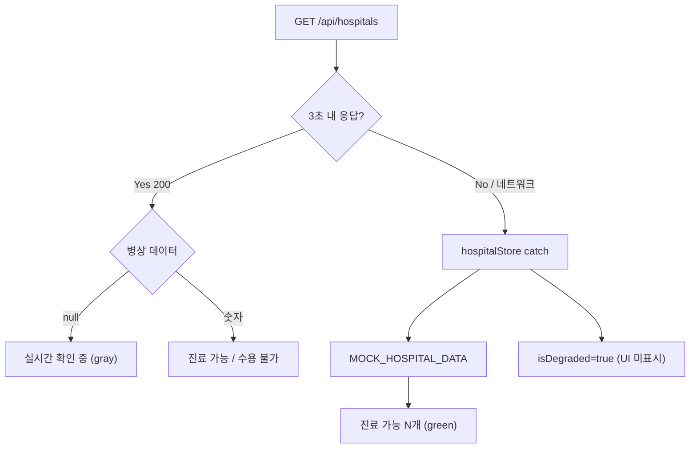

# 상태 관리 · 예외 처리 점검 보고서

> **⚠️ 역사 기록:** 본 문서 §1~3은 **2026-07-07 개선 적용 전** 초기 점검 결과입니다.  
> **현재 상태·잔존 이슈**는 [MAINTENANCE_AUDIT.md](./MAINTENANCE_AUDIT.md) · [IMPROVEMENT_REPORT.md](./IMPROVEMENT_REPORT.md)를 우선 참고하세요.

> **작성 목적:** 대구 골든타임 프론트엔드·백엔드의 상태 관리, 예외 처리, Graceful Degradation 구현을 점검하고,  
> **코드를 한꺼번에 뜯지 않고** 안전하게 개선하기 위한 우선순위·단계 계획을 정리합니다.

**점검 일자:** 2026-07-07 (초기 감사)  
**관련 문서:** [MAINTENANCE_AUDIT.md](./MAINTENANCE_AUDIT.md) · [IMPROVEMENT_REPORT.md](./IMPROVEMENT_REPORT.md) · [EXCEPTION_HANDLING.md](./EXCEPTION_HANDLING.md) · [hospitals-api-flow.md](./hospitals-api-flow.md) · [LIVE_OPS_AND_EDGE_CASES.md](./LIVE_OPS_AND_EDGE_CASES.md)

---

## 1. 종합 판정

| 영역 | 상태 | 한 줄 요약 |
|------|------|-----------|
| 상태 관리 (Zustand) | 🟡 | 스토어 설계는 양호하나 `isDegraded` 미연결, 동시 fetch 경쟁 조건 존재 |
| 예외 처리 (프론트) | 🔴 | 서킷 브레이커 폴백이 **가짜 병상(초록)** 을 보여줄 수 있음 |
| 예외 처리 (백엔드) | 🟡 | 200 + `null` 병상은 안전하나, 폴러가 캐시를 null로 덮어쓸 수 있음 |
| UI 에러 화면 | 🔴 | `HospitalsErrorState` 등이 **사실상 dead code** |
| 문서 vs 코드 | 🟡 | README·EXCEPTION_HANDLING과 실제 동작 불일치 |

**결론:** 아키텍처 골격(AppDataBootstrap, Zustand, 서킷 브레이커, 거리 정렬 캐싱)은 유지할 가치가 있습니다.  
다만 **「우아한 성능 저하」가 UI까지 연결되지 않았고**, 가장 큰 리스크는 **실패 시 허위 병상 정보**입니다.  
**「전부 손봐야 한다」 ≠ 「한 번에 다 뜯어고친다」** — 단계별·작은 diff로 진행하는 것이 안전합니다.

---

## 2. 잘 되어 있는 부분

| 항목 | 위치 | 설명 |
|------|------|------|
| 앱 진입 1회 페칭 | `AppDataBootstrap.tsx` | 시민/정책/`/list` 전환 시 병원·GeoJSON 재요청 없음 |
| 거리 정렬 캐싱 | `useSortedHospitalsByDistance.ts` | GPS·병원 원본 불변 시 Haversine 재계산 생략 |
| 백엔드 요청 경로 | `hospital_realtime.py` → `bed_cache.py` | 사용자 요청마다 공공 API 9회 호출하지 않음 |
| 취약지구 폴백 | `vulnerability.ts` + `vulnerabilityStore.ts` | API 실패 시 번들 GeoJSON으로 정책 모드 유지 |
| GPS stale 방지 | `useUserLocation.ts` | `cancelled` 플래그로 언마운트 후 setState 방지 |
| 전화 걸기 | `CitizenHospitalTelLink.tsx` | `tel:` + `stopPropagation`으로 카드 선택과 분리 |
| 병상 null 안전 표시 | `bed-status.ts` | `available_beds === null` → 「실시간 확인 중」 |

---

## 3. 발견된 문제 (심각도별)

### 3.1 🔴 Critical — 시민 안전·신뢰

#### (1) 서킷 브레이커 폴백이 가짜 초록 병상을 보여줄 수 있음

| 구분 | 동작 |
|------|------|
| **백엔드** | API 실패 → `available_beds: null` → UI 「실시간 확인 중」 |
| **프론트** | 3초 타임아웃/네트워크 오류 → `MOCK_HOSPITAL_DATA` → 「진료 가능 (N개)」 |

**관련 파일**

- `frontend/src/shared/store/hospitalStore.ts` — catch 시 `MOCK_HOSPITAL_DATA` 폴백
- `frontend/src/shared/data/mock-hospital-data.ts` — 합성 `hvec`/`hvoc`/`available_beds`
- `frontend/src/shared/constants/circuit-breaker.ts` — `HOSPITALS_FETCH_TIMEOUT_MS = 3000`

**위험:** 백엔드 지연·다운 시 시민이 **허위 병상 정보**로 병원을 선택할 수 있음.

---

#### (2) `isDegraded`는 설정되지만 UI가 구독하지 않음

- `hospitalStore`에 `isDegraded: true` 설정 (`hospitalStore.ts`)
- `CitizenView`, `AdminView`, `LandingPage` 어디에서도 `isDegraded` 미사용
- README에는 폴백 플래그로 문서화되어 있으나 화면에 표시 없음

**결과:** 사용자는 실시간 데이터인지 캐시/Mock인지 알 수 없음.

---

#### (3) `HospitalsErrorState` / 「다시 시도」가 dead code

- `hospitalStore`는 실패 시 항상 `error: null` 설정
- `CitizenView.tsx`: `mapBlocked = hospitalsLoading || hospitalsError !== null` → 실패 후에도 지도 표시
- `LandingPage.tsx`: `error` 분기의 에러 카드·재시도 버튼 도달 불가

**문서 불일치:** `EXCEPTION_HANDLING.md`에는 「병원 fetch 실패 → Store error, 목록·지도 차단」으로 기술되어 있으나, 실제는 Mock 폴백 후 정상 렌더링.

---

### 3.2 🟠 High — 상태 관리·동시성·백엔드

#### (4) `fetchHospitals` 경쟁 조건 (race)

`hospitalStore.fetchHospitals`에 request ID / abort / in-flight 가드 없음.

| 시나리오 | 결과 |
|----------|------|
| 「다시 시도」 연타 | 늦게 끝난 요청이 최신 결과 덮어씀 |
| A 성공 → B 실패 | 실데이터 유지 + `isDegraded: true` (데이터·플래그 불일치) |
| B 성공 → A 실패(늦음) | 성공 데이터가 Mock으로 덮일 수 있음 |

`vulnerabilityStore.fetchVulnerability`도 동일 패턴.

---

#### (5) 프론트·백엔드 degradation 경로 이원화

프론트는 `/api/hospitals/beds-cache-status`, `/api/hospitals/runtime-config`를 circuit breaker 판단에 사용하지 않음.

---

#### (6) 백엔드 폴러가 좋은 캐시를 null로 덮어쓸 수 있음

**파일:** `backend/app/services/bed_poller.py`, `hospital_realtime.py`

- `fetch_all_beds_from_api_async`는 오류 시 예외 대신 `get_null_realtime_data()` **반환**
- `refresh_bed_cache`는 반환값을 무조건 `replace_cache(data)` 호출
- `mark_refresh_error`(캐시 유지)는 **예외가 throw될 때만** 동작

**영향:** 일시적 401·타임아웃 후 이전에 유효했던 캐시가 전부 null로 교체될 수 있음.  
`docs/EXCEPTION_HANDLING.md` §4.2 「실패 시 캐시 데이터 유지」와 불일치.

---

#### (7) 서버 cold start vs 프론트 3초 타임아웃

- `start_bed_poller()`가 lifespan에서 `await refresh_bed_cache()` 선행
- 실 API 모드: 시군구 9회 × `REQUEST_TIMEOUT = 30s` 순차 호출 → 최악 수 분
- 프론트 3초 후 Mock 폴백 → (1)번 가짜 병상 문제와 연동

---

### 3.3 🟡 Medium — UX·일관성

| # | 문제 | 관련 파일 |
|---|------|-----------|
| 8 | Mock 병상 안내가 정책 `DetailPanel`에만 있음 | `DetailPanel.tsx` vs `HospitalDetailPanel.tsx` |
| 9 | `hvec=0, hvoc>0`이면 소아 병상 무시하고 「수용 불가」 | `bed-status.ts` |
| 10 | `/list` 이동 시 `appModeStore`가 `admin` 유지 가능 | `GlobalNavigationBar.tsx`, `AppPage.tsx` |
| 11 | `CitizenView`·`LandingPage`가 GPS 각각 요청 | `useUserLocation.ts` |
| 12 | `vulnerabilityError` 시 히트맵 토글 비활성화 없음 | `AdminView.tsx`, `HeatmapToggle` |
| 13 | 프론트 병상 데이터 자동 갱신(폴링) 없음 | `AppDataBootstrap`, stores |
| 14 | `GET /api/hospitals` 요청마다 JSON 파일 재파싱 | `hospital_static.py` |
| 15 | 공공 API XML `resultCode` 미검증 (HTTP 200 + 오류 본문) | `hospital_realtime.py` |

---

## 4. 상태 관리 불일치 요약

| 항목 | hospitalStore | vulnerabilityStore | 뷰 |
|------|---------------|-------------------|-----|
| 실패 신호 | `isDegraded: true`, `error: null` | `error: string`, 데이터 비움 | 병원 뷰는 `error`만 확인 → 무효 |
| 폴백 위치 | Store (`MOCK` / previous) | API 레이어 (번들 GeoJSON) | 비대칭 |
| degraded UX | 없음 | Admin 배너 일부 | 시민 화면 공백 |
| 재시도 | 수동 버튼( dead code ) | Admin `handleRetryVulnerability` | Landing 별도 retry |
| 앱 진입 시 | 항상 fetch | 항상 fetch (시민도 로드) | citizen-only 세션 낭비 |

---

## 5. 프론트 서킷 브레이커 vs 백엔드 — 정합성 표

| 가정 | 프론트 | 백엔드 | 일치 |
|------|--------|--------|------|
| `/api/hospitals` 3초 내 완료 | `HOSPITALS_FETCH_TIMEOUT_MS` | 캐시 hit 시 빠름; cold start 시 지연 | 부분 |
| 실패 시 null/unknown 병상 | HTTP 200일 때만 | 설계상 Yes | 성공 경로만 |
| 실패 시 error UI | `hospitalsError` 게이트 | Store는 error 미설정 | **No** |
| degraded 표시 | `isDegraded` | N/A | **No (미연결)** |
| Mock vs real 구분 | Admin `DetailPanel` 푸터만 | `runtime-config` API 존재 | 부분 |
| 캐시 신선도 | 미확인 | `beds-cache-status` API | **No** |

---

## 6. 개선 로드맵 (코드 꼬임 방지용)

> **원칙:** 한 PR = 한 계약. 시민 안전(P0) → UI 연결(P1) → 동시성·백엔드(P2) → UX 정리(P3).

### 1단계 — 안전 계약 (P0, 리스크 낮음)

**목표:** 허위 초록 병상 경로 제거

| 작업 | 파일(예상) |
|------|-----------|
| Mock 폴백 시 좌표·이름·전화만 유지, 병상은 `null` | `mock-hospital-data.ts` 또는 `static-fallback-hospitals.ts` 신설 |
| `MOCK_HOSPITAL_DATA`의 합성 `hvec`/`hvoc` 제거 | `mock-hospital-data.ts` |
| 회귀: `npm test`, `npm run build` | — |

**기대 결과:** 타임아웃 시 「실시간 확인 중」만 표시, 위치·전화·길찾기는 유지.

---

### 2단계 — 상태·UI 연결 (P1, 리스크 낮음)

**목표:** `isDegraded`를 사용자에게 투명하게 공개

| 작업 | 파일(예상) |
|------|-----------|
| `DegradedDataBanner` 공통 컴포넌트 | `widgets/shared/DegradedDataBanner.tsx` |
| `isDegraded` 구독 | `CitizenView.tsx`, `LandingPage.tsx`, `AdminView.tsx` |
| `HospitalsErrorState` 역할 재정의 | 진짜 503(병원 JSON 없음)일 때만 사용 |
| `EXCEPTION_HANDLING.md` 정합 | `docs/EXCEPTION_HANDLING.md` |

---

### 3단계 — 동시성·백엔드 (P2, 리스크 중간)

| 작업 | 파일(예상) |
|------|-----------|
| `fetchId` / in-flight 가드 | `hospitalStore.ts`, `vulnerabilityStore.ts` |
| 전부 null이면 `mark_refresh_error` | `bed_poller.py` |
| poller 첫 갱신 non-blocking | `bed_poller.py`, `main.py` lifespan |
| XML `resultCode` 검증 | `hospital_realtime.py` |

프론트 1단계와 **독립 배포 가능**.

---

### 4단계 — UX·정리 (P3, 나중에 가능)

- `useUserLocation` 공유 (Zustand 또는 Context)
- GNB ↔ `/list` 시 `setViewMode('citizen')` 동기화
- `vulnerabilityError` 시 `HeatmapToggle` 비활성화
- `hvec`/`hvoc` 판정 정책 문서화·코드 반영
- README 「예정」 체크리스트 갱신
- 프론트 병상 주기적 재fetch (선택)

---

## 7. 코드 꼬임 방지 규칙

1. **한 PR = 한 계약** — 「폴백 병상 정책」과 「GPS 공유」를 섞지 않는다.
2. **dead code 삭제 전 역할 재정의** — `error` vs `isDegraded` 담당을 문서 1줄로 고정한다.
3. **테스트 최소 추가** — 폴백 null 병상, `isDegraded` 배너, fetch race 2~3케이스.
4. **시민 화면 우선** — 정책 모드·히트맵은 2단계 이후.
5. **문서와 코드 동시 갱신** — `EXCEPTION_HANDLING.md`를 실제 store 계약에 맞춘다.

---

## 8. 우선순위 체크리스트

| 순위 | 작업 | 효과 |
|------|------|------|
| **P0** | Mock 폴백 → null 병상 static 데이터 | 시민 안전 |
| **P0** | `isDegraded` 배너 (시민·랜딩·정책) | 신뢰·투명성 |
| **P1** | `fetchHospitals` request ID 가드 | race 방지 |
| **P1** | `bed_poller` null 덮어쓰기 방지 | 백엔드 캐시 보호 |
| **P1** | poller 첫 갱신 non-blocking | cold start |
| **P2** | `HospitalsErrorState` 정리 또는 `error` 복구 | dead code·문서 정합 |
| **P2** | `useUserLocation` 공유 | UX·성능 |
| **P3** | GNB 모드, 히트맵, `hvec`/`hvoc` 정책 | UX·정확도 |

---

## 9. 참고 — 주요 파일 인덱스

### 프론트엔드

| 파일 | 역할 |
|------|------|
| `shared/store/hospitalStore.ts` | 병원 상태·서킷 브레이커 폴백 |
| `shared/store/vulnerabilityStore.ts` | 취약지구 GeoJSON |
| `shared/components/AppDataBootstrap.tsx` | 앱 진입 1회 fetch |
| `shared/api/hospitals.ts` | 3초 timeout fetch |
| `shared/data/mock-hospital-data.ts` | Graceful degradation Mock |
| `shared/lib/bed-status.ts` | 병상 라벨 판정 |
| `widgets/app/CitizenView.tsx` | 시민 지도·에러 게이트 |
| `widgets/landing/LandingPage.tsx` | `/list` 목록 |

### 백엔드

| 파일 | 역할 |
|------|------|
| `app/api/routes/hospitals.py` | `GET /api/hospitals` |
| `app/services/hospital_realtime.py` | Mock / API / 캐시 분기 |
| `app/services/bed_cache.py` | 인메모리 병상 캐시 |
| `app/services/bed_poller.py` | 백그라운드 API 폴링 |
| `app/services/hospital_static.py` | `final_hospitals.json` 로드 |
| `app/core/env.py` | `USE_MOCK_API`, API 키 |

---

## 10. 변경 이력

| 일자 | 내용 |
|------|------|
| 2026-07-07 | 최초 작성 — 상태 관리·예외 처리 전수 점검 및 4단계 개선 로드맵 |
| 2026-07-07 | [IMPROVEMENT_REPORT.md](./IMPROVEMENT_REPORT.md) 기준 14건 개선 적용 완료 |

---

*점검 이후 적용 내역은 [IMPROVEMENT_REPORT.md](./IMPROVEMENT_REPORT.md)를 참고하세요.*
