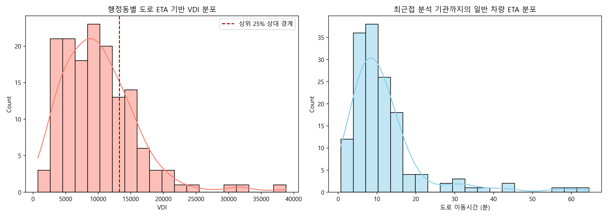
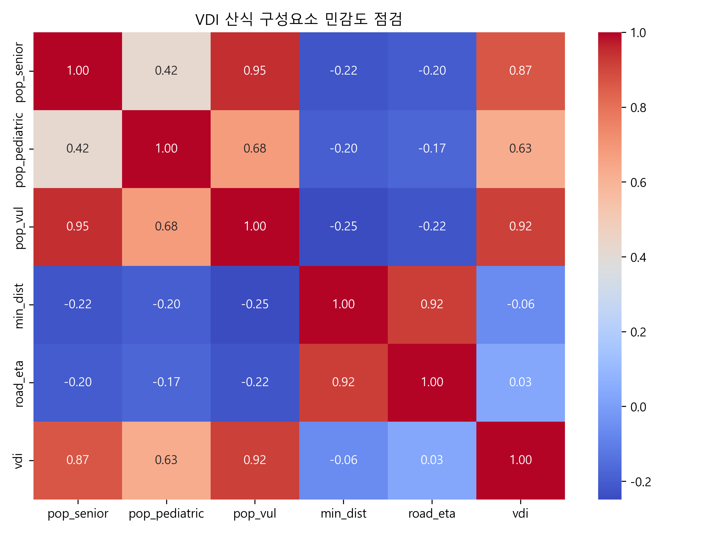
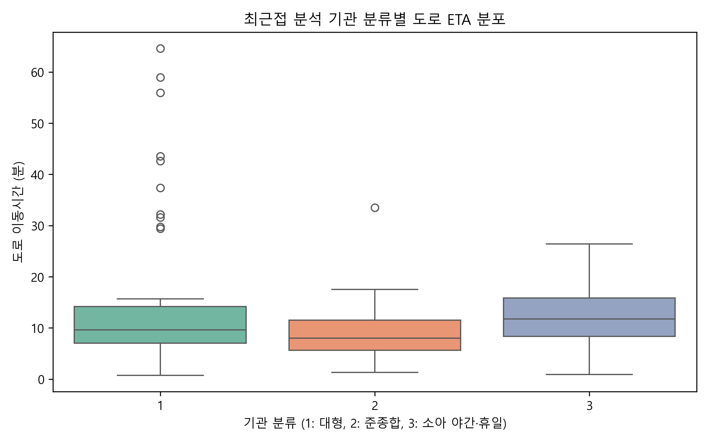
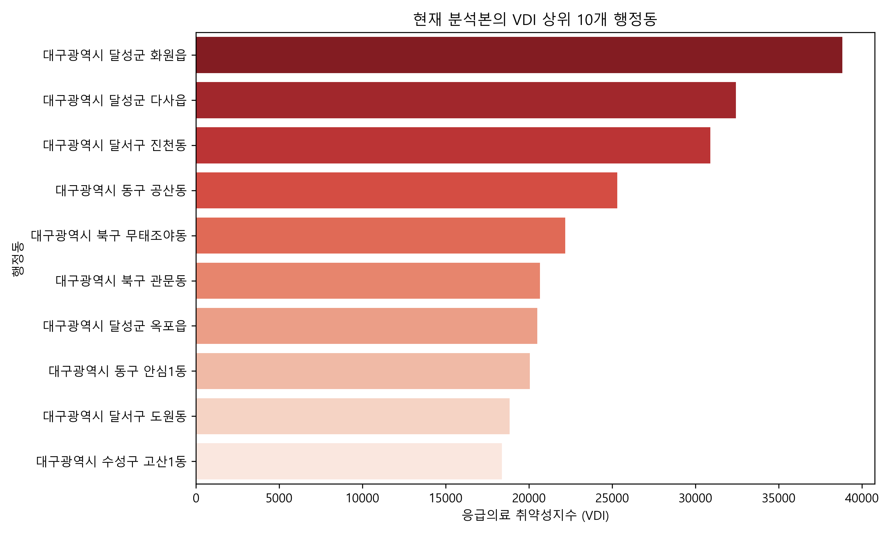
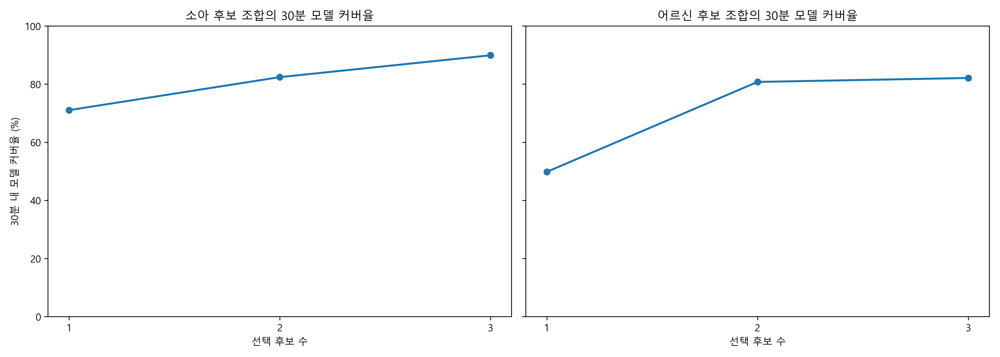

# 대구 골든타임 정책분석 탐색적 데이터 분석(EDA)

이 문서는 `2026-07-18-r2` 내부 분석 식별자에 해당하는 **2026.07.18 검증본**을 탐색적으로 점검합니다. EDA는 현재 데이터의 분포와 변수 관계를 설명하며 의료적 위험 임계값이나 시설 신설 효과를 확정하지 않습니다.

## 1. 데이터 개요 및 기초 구조
- **분석 대상 행정동 수**: 150개
- **고려된 응급의료기관 수**: 25개
- **정책 후보 수**: 9개
- **검증된 도로 경로**: 5,100건 / 누락 0건
- **인구 기준월**: 2026.06
- **취약 인구 평균**: 4372.7명 / 행정동

분석본 생성 단계에서 행정동 150개, 기관 25개, 후보 9개와 경로 5,100개의 계약을 검사합니다. 병원·행정동·후보·후보 추적·최적화 자료의 SHA-256도 단일 릴리스 메타데이터와 대조합니다. 이 검사는 구조적 완전성과 파일 계보를 의미하며 원천자료의 임상적 타당성이나 최신성을 자동으로 보증하지는 않습니다.

## 2. 응급의료 접근성 및 VDI 분포
행정동별 취약성 지표의 기초 분포를 파악합니다.

**해석(Insights)**:
- 도로 ETA 기반 VDI는 749.83~38,827.48, 평균 10,155.58, 중앙값 9,438.26입니다.
- 현재 분석본은 VDI 상위 25%를 우선 확인 대상으로 구분하며 상대 경계값은 13,261.43, 해당 행정동은 38개입니다.
- 일반 차량 ETA는 0.73~64.58분입니다. 이는 수집 시점의 분석용 경로이며 119 구급차 이송시간이 아닙니다.

## 3. VDI 산식 구성요소와 민감도 점검
현재 VDI는 `ln(1 + 일반 차량 ETA) × 취약인구`로 정의됩니다. 따라서 VDI와 취약인구·ETA의 상관은 독립적인 발견이 아니라 산식에 포함된 구성요소가 결과에 미치는 구조적 민감도를 점검하는 값입니다.

**해석(Insights)**:
- 현재 VDI와 취약인구의 피어슨 상관계수는 0.915, 도로 ETA와의 상관계수는 0.034입니다.
- 이 값은 현행 산식의 구성요소 민감도와 현재 150개 행정동의 분포를 함께 반영합니다. 인과관계, 지표의 외부 타당성 또는 개별 지역의 의료적 위험을 증명하지 않습니다.

## 4. 병원 티어별 접근성 비교

**해석(Insights)**:
- 분류별 상자그림은 행정동별 최근접 분석 기관의 도로 ETA 분포를 비교합니다.
- 기관 분류는 서비스·분석을 위한 프로젝트 내부 분류이며 개별 환자의 진료 가능성이나 병원의 실제 수용 역량 순위를 뜻하지 않습니다.

## 5. 최우선 취약 지역 (Top 10) 파악

**해석(Insights)**:
- 현재 상위 3개는 달성군 화원읍, 달성군 다사읍, 달서구 진천동입니다.
- 상위 지역은 취약인구와 일반 차량 ETA가 결합된 결과입니다. 순위만으로 시설 신설·이동형 진료·예산 투입을 확정할 수 없습니다.

## 6. 후보 조합별 접근성 모델 비교
p-median과 MCLP를 사용해 분류된 후보군 안에서 1~3개 후보 조합을 비교합니다.

**해석(Insights)**:
- 소아 후보 3개 조합의 MCLP 30분 모델 커버율은 89.9%, 어르신 후보 3개 조합은 82.1%입니다.
- 결과는 후보군 내부의 수학적 비교이며 대구 전역의 전역 최적해, 시설 건립 효과, 실제 환자 수용 성과를 의미하지 않습니다.

## 결론 및 후속 과제 (Next Steps)
- **결론**: 현재 분석은 인구가 많은 도시권과 이동시간이 긴 외곽권을 함께 확인해야 함을 보여줍니다.
- **데이터 한계**: ETA는 수집 시점의 일반 차량 경로이며 병상·의료진·구급차 우선통행·실제 환자 흐름을 반영하지 않습니다.
- **후속 과제**: 원천 수집일 확정, 시간대별 반복 수집, 실제 이송자료를 이용한 외부 타당성 검증이 필요합니다. 검증 전 후보는 현장조사 우선순위로만 해석합니다.
