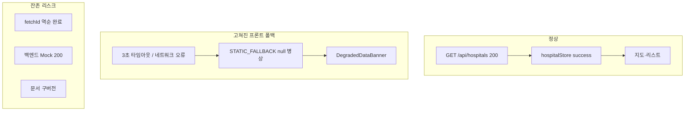

# 유지보수 점검 보고서 — 2026-07-07 재감사

> **작성 목적:** [IMPROVEMENT_REPORT.md](./IMPROVEMENT_REPORT.md) 14건 개선 적용 **이후**, 유지보수 관점에서 코드·운영·문서를 다시 점검한 결과입니다.  
> **선행 문서:** [AUDIT_STATE_AND_EXCEPTIONS.md](./AUDIT_STATE_AND_EXCEPTIONS.md) (개선 **전** 초기 점검) · [IMPROVEMENT_REPORT.md](./IMPROVEMENT_REPORT.md) (적용 완료 이력) · [EXCEPTION_HANDLING.md](./EXCEPTION_HANDLING.md) (Store/UI 계약)

**점검 일자:** 2026-07-07  
**테스트 기준선:** 프론트 Vitest 16 passed · 백엔드 pytest 8 passed

---

## 1. 종합 판정

| 항목 | 개선 전 (AUDIT) | 현재 (재감사) |
|------|-----------------|---------------|
| 구조·레이어 분리 | 🟡 | 🟢 양호 |
| 시민 안전 (가짜 병상) | 🔴 | 🟢 프론트 폴백 경로 해결 |
| 상태/UI 계약 | 🔴 | 🟢 `error` / `isDegraded` / 배너 정리 |
| 동시성 | 🔴 | 🟡 `fetchId` guard 추가, **역순 완료 버그** 잔존 |
| 문서 정합성 | 🟡 | 🟡 AUDIT·README 일부 구버전 |

**한 줄 결론:** 코드가 심하게 꼬인 **치명적 사태는 없음**. P0 안전 이슈(프론트 폴백 가짜 병상)는 해결됐고 구조는 유지보수 가능한 수준이다. 다만 **`fetchId` 역순 완료 버그**는 재시도 UX에서 실데이터를 놓칠 수 있어 **다음 수정 1순위**이며, **문서 동기화**가 필요하다.

---

## 2. 잘 정리된 부분 (유지보수 OK)

| 영역 | 위치 | 설명 |
|------|------|------|
| null 병상 정적 폴백 | `static-fallback-hospitals.ts` | 서킷 브레이커 실패 시 `available_beds: null`, `realtime_source: 'unavailable'` |
| degraded 배너 | `DegradedDataBanner.tsx` | 시민·랜딩·정책 화면 연결 |
| Store 계약 | `hospitalStore.ts`, `EXCEPTION_HANDLING.md` | `error`(치명) vs `isDegraded`(폴백) 분리 |
| GPS 공유 | `locationStore.ts` | `/` ↔ `/list` 위치 중복 요청 제거 |
| 백엔드 폴러 | `bed_poller.py` | null 캐시 덮어쓰기 방지, non-blocking cold start |
| API 응답 검증 | `hospital_realtime.py` | `_is_api_response_ok`, `has_any_live_beds` |
| 소아 병상 | `bed-status.ts` | `hvec=0, hvoc>0` 반영 |
| 히트맵 | `HeatmapToggle.tsx` | 로딩·에러·빈 데이터 시 disabled |
| 시민 전화 | `CitizenHospitalTelLink.tsx`, `HospitalDetailPanel.tsx` | `tel:` 링크 |
| 테스트 | `tests/unit/frontend/`, `tests/unit/backend/` | 폴백·bed-status·realtime helper 회귀 기본선 |

---

## 3. 발견된 문제 (심각도별)

### 3.1 🔴 High — 코드 수정 권장

#### (1) `fetchId` race — 역순 완료(out-of-order) 시 성공 응답 폐기

**영향 파일:**
- `frontend/src/shared/store/hospitalStore.ts`
- `frontend/src/shared/store/vulnerabilityStore.ts`

**현재 패턴:**

```typescript
const fetchId = ++hospitalFetchSeq;
// ...
const data = await fetchHospitalsApi();
if (fetchId !== hospitalFetchSeq) return;  // 이전 요청 성공도 버림
```

**재현 시나리오 (병원 store):**

1. 요청 A(느림) 시작  
2. 사용자 「다시 시도」→ 요청 B(빠름) 시작, `hospitalFetchSeq` 증가  
3. B가 먼저 실패 → `isDegraded: true` + null 병상(또는 이전 캐시)  
4. A가 나중에 성공 → `fetchId !== hospitalFetchSeq`로 **무시**  
5. **결과:** API 데이터가 있는데도 degraded 상태에 머무름

「다시 시도」 연타 시에도 동일 패턴이 발생할 수 있다.  
`fetchId` guard는 **stale 응답이 최신 상태를 덮는 것**은 막지만, **늦게 도착한 성공이 최신 실패를 복구하지 못하는** 반대 케이스는 막지 못한다.

**권장 수정 (택 1):**

| 방안 | 설명 |
|------|------|
| **AbortController** | 새 `fetchHospitals` 시작 시 이전 HTTP 요청 abort (권장) |
| **last-wins-success** | 성공 시 `fetchId >= hospitalFetchSeq` 또는 완료 시점 최신 seq 비교로 역순 성공 허용 |
| **요청 직렬화** | 진행 중이면 새 요청 대기/무시 (UX 단순, 연타 시 불편) |

**테스트:** 현재 race 시나리오 단위 테스트 없음 → 수정 시 추가 권장.

---

### 3.2 🟠 Medium — 운영·설계 (버그는 아니나 혼동 주의)

#### (2) 백엔드 Mock 모드 — HTTP 200 + 가짜 병상

**위치:** `backend/app/services/hospital_realtime.py` → `get_mock_realtime_data()`  
**환경:** `USE_MOCK_API=true` (`.env.example` 기본값) 또는 API 키 없음

프론트 서킷 브레이커 폴백은 `STATIC_FALLBACK_HOSPITAL_DATA`(null 병상)로 고쳤지만, 백엔드가 **200 OK + `realtime_source: mock` + 랜덤 병상**을 반환하면 프론트는 **성공 경로**로 처리한다 (`isDegraded: false`, 배너 없음).

**유지보수 시:** 「폴백 고쳤는데 로컬에서 초록 병상이 보인다」 → 먼저 `.env`의 `USE_MOCK_API` / API 키 / `verify_realtime_api.py` 결과를 확인한다.

#### (3) 이전 캐시 유지 + `isDegraded: true` 문구 불일치

**위치:** `hospitalStore.ts` → `pickFallbackHospitals(previous)`

네트워크 실패 시 `previous.length > 0`이면 **이전 병원 목록(실병상 숫자 포함)을 유지**하면서 `isDegraded: true`를 켠다.

| UI 요소 | 사용자가 보는 것 |
|---------|------------------|
| `DegradedDataBanner` | 「실시간 병상 정보를 확인하지 못했습니다」 |
| 리스트·배지 | 이전에 받은 **실병상 숫자**가 그대로 보일 수 있음 |

의도된 동작(지도·거리·전화는 유지)이지만, 배너 문구를 **「이전에 불러온 병상일 수 있음」** 과 구분하는 개선 여지가 있다.

#### (4) `locationStore` 병렬 `ensureLocation` race

GPS `ensureLocation()`이 동시에 두 번 호출되면 중복 `getCurrentPosition` 가능성이 있다. 발생 빈도는 낮으나, `/`와 `/list` 동시 마운트 등에서 이론상 존재한다.

---

### 3.3 🟡 Low — 문서·UX 정리

#### (5) 문서 구버전 (코드와 어긋남)

| 파일 | 문제 |
|------|------|
| `docs/AUDIT_STATE_AND_EXCEPTIONS.md` | §1~3이 **개선 전** 상태 (`MOCK_HOSPITAL_DATA` 가짜 병상, `isDegraded` 미연결 등) |
| `README.md` | `MOCK_HOSPITAL_DATA` 폴백·가짜 병상 관련 표현 잔존 |
| `docs/IMPROVEMENT_REPORT.md` §「아직 하지 않은 것」 | `EXCEPTION_HANDLING.md` 미반영 문구 — 실제로 §3.3·§3.5 일부 반영됨 |

**권장:** 신규 담당자는 **본 문서 + IMPROVEMENT_REPORT**를 먼저 읽고, AUDIT §1~3은 역사 기록으로만 참고한다.

#### (6) 전화 UX 불일치

| 위치 | 동작 |
|------|------|
| `CitizenHospitalTelLink.tsx`, `HospitalDetailPanel.tsx` | `tel:` 링크 ✅ |
| `HospitalActionButtons.tsx` | 📞 `alert('전화 연결 기능 준비 중')` |
| `DetailPanel.tsx` (정책) | mock 푸터만, `unavailable` 안내 없음 |

#### (7) 선택 과제 (미구현, 치명 아님)

| 항목 | 비고 |
|------|------|
| 프론트 병상 주기적 재fetch | 백엔드 `bed_poller` 주기와 협의 필요 |
| `runtime-config` / `beds-cache-status` UI | 운영 디버그용 |
| 백엔드 mock을 null-bed로 통일 | dev에서 production-like 동작 원할 때 |

---

## 4. 데이터·상태 흐름 (현재)



### Store 계약 요약 (`hospitalStore`)

| 상태 | `error` | `isDegraded` | `hospitals` | UI |
|------|---------|--------------|-------------|-----|
| 정상 API | `null` | `false` | API 데이터 | 일반 화면 |
| 네트워크/타임아웃 폴백 | `null` | `true` | 이전 캐시 또는 `STATIC_FALLBACK` | 배너 + null/스테일 병상 |
| 치명적 실패 (폴백 0건) | `string` | `false` | `[]` | `HospitalsErrorState` |

**지도 차단:** `mapBlocked = hospitalsLoading || hospitalsError` — **degraded만으로는 지도를 막지 않음**.

---

## 5. 장애 triage 체크리스트

증상이 보고되면 아래 순서로 확인한다.

### 5.1 환경

1. 프로젝트 루트 `.env` → `USE_MOCK_API`, `DATA_GO_KR_API_KEY`
2. `python tests/integration/verify_realtime_api.py`
3. 백엔드 로그 — `[hospitals] USE_MOCK_API=true` / poller disabled 메시지

### 5.2 브라우저

1. Network 탭 → `GET /api/hospitals` 응답의 `realtime_source` (`api` | `mock` | `unavailable`)
2. `available_beds`가 `null`인지 숫자인지
3. `DegradedDataBanner` 노출 여부

### 5.3 증상별 판단

| 증상 | 가능 원인 | 조치 |
|------|-----------|------|
| 배너 + 「실시간 확인 중」 | 프론트 degraded 또는 백엔드 null 병상 | 정상 폴백. API 키·네트워크 확인 후 재시도 |
| 배너 없이 초록 병상 | 백엔드 Mock 200 또는 실 API 성공 | `.env` Mock 여부 확인 |
| 지도 전체 막힘 + 에러 화면 | `hospitalsError` (치명적) | 백엔드 다운·정적 JSON 누락 등 |
| 재시도 후에도 배너 유지 (API는 살아 있음) | **§3.1 fetchId 역순 완료 버그** | 새로고침 또는 코드 수정 전 임시 회피 |

### 5.4 개발 서버

- 포트 충돌·좀비 uvicorn: [DEV_SERVERS.md](./DEV_SERVERS.md)
- 시작/종료 명령: [DEV_COMMANDS.md](./DEV_COMMANDS.md)

---

## 6. 수정 우선순위 로드맵

| 순위 | 항목 | 유형 | 예상 diff |
|------|------|------|-----------|
| **P1** | `fetchId` 역순 완료 — AbortController 또는 last-wins-success | 버그 | `hospitalStore`, `vulnerabilityStore`, `hospitals.ts` API 레이어 |
| **P2** | `AUDIT_STATE_AND_EXCEPTIONS.md` 상단 「개선 적용됨」 배너 + §1 요약 갱신 | 문서 | 1파일 |
| **P2** | `README.md` — `STATIC_FALLBACK` / `isDegraded` 용어 정리 | 문서 | 1파일 |
| **P3** | degraded 배너 — 스테일 캐시 vs 정적 폴백 문구 구분 | UX | `DegradedDataBanner`, `hospitalStore` |
| **P3** | `HospitalActionButtons` → `tel:` 또는 공통 컴포넌트 | UX | 2~3파일 |
| **선택** | 프론트 병상 polling, mock null-bed 백엔드 모드 | 기능 | 별도 기획 |

---

## 7. 관련 파일 인덱스

### 프론트엔드 (점검·수정 시 자주 보는 경로)

```
frontend/src/shared/
  store/hospitalStore.ts          ← fetchId race (P1)
  store/vulnerabilityStore.ts     ← 동일 패턴
  store/locationStore.ts
  data/static-fallback-hospitals.ts
  api/hospitals.ts
  lib/fetch-with-timeout.ts
  lib/bed-status.ts

frontend/src/widgets/
  shared/DegradedDataBanner.tsx
  app/CitizenView.tsx, AdminView.tsx
  landing/LandingPage.tsx
  map-dashboard/HospitalActionButtons.tsx
  map-dashboard/HospitalDetailPanel.tsx, DetailPanel.tsx
```

### 백엔드

```
backend/app/services/
  hospital_realtime.py    ← mock / API / null 병상
  bed_poller.py
  bed_cache.py
  hospital_static.py

backend/app/core/env.py   ← USE_MOCK_API
```

### 테스트

```
tests/unit/frontend/static-fallback-hospitals.test.ts
tests/unit/frontend/bed-status.test.ts
tests/unit/backend/test_hospital_realtime_helpers.py
tests/integration/verify_realtime_api.py
```

---

## 8. 변경 이력

| 일자 | 내용 |
|------|------|
| 2026-07-07 | IMPROVEMENT_REPORT 14건 적용 후 유지보수 재감사 — 본 문서 작성 |

---

*다음 재점검 또는 P1 수정 완료 시 §1 표·§6 로드맵·§8 이력을 갱신하세요.*
