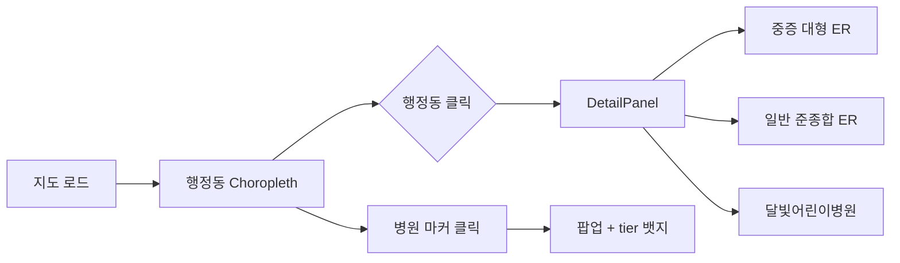

# 대구 골든타임 — 포트폴리오

> **응급의료 거버넌스 플랫폼** — 대구 150개 행정동의 응급·소아 응급 접근성을 지도로 진단하는 의료행정 데이터 시각화 프로젝트

| 항목 | 내용 |
|------|------|
| **프로젝트명** | 대구 골든타임 (Daegu Golden Time) |
| **부제** | 응급의료 거버넌스 플랫폼 |
| **유형** | 공공의료 접근성 BI · GIS 웹 대시보드 |
| **분석 지역** | 대구광역시 행정동 150개 |
| **기술 스택** | React 19 · TypeScript · Vite · **react-kakao-maps-sdk** · Tailwind CSS v4 · FastAPI (골격) · Python (데이터 스크립트) |
| **저장소** | [프로젝트 루트](../) · 시민용 안내는 [README.md](../README.md) · [문서 모음](./README.md) |

---

## 1. 한 줄 요약

응급 상황에서 **골든타임(결정적 시간)** 안에 적절한 의료기관에 닿을 수 있는지를, 행정동 단위로 **정량화·시각화**하여 **시민 정보 제공**과 **의료행정·정책 의사결정**을 동시에 지원하는 지도 기반 BI 프로젝트입니다.

---

## 2. 문제 정의 (Why)

### 배경
- 기존 지도 서비스는 **병원 위치·진료과목** 중심이며, **응급·필수의료 정책**에 필요한 질문에는 답하기 어렵습니다.
- “가장 가까운 응급실은 어디인가?”만으로는 부족합니다. **중증(권역·대형)** 과 **일반(준종합)** 응급, **소아 야간·휴일(달빛어린이병원)** 은 목적과 접근성이 다릅니다.
- 통계표만으로는 **달성군 구지면** 같은 **필수의료 사각지대**가 직관적으로 드러나지 않습니다.

### 핵심 질문
> *“이 행정동에 사는 주민은 응급 상황에서 골든타임 안에 적절한 의료기관에 닿을 수 있는가?”*

### 타깃 사용자
| 사용자 | 활용 |
|--------|------|
| 일반 시민·보호자 | 거주·이사 전 응급·소아 응급 접근성 참고 |
| 지역 보건·행정 | 사각지대 진단, 병상·이송 정책 논의 근거 |
| 연구·포트폴리오 | 행정학 × 보건의료 행정 × GIS 분석 사례 |

---

## 3. 솔루션 (What)

### 핵심 기능

1. **행정동 Choropleth** — 사각지대 지수(병상 부족 등)를 색상으로 표현
2. **3단계 응급기관 tier 모델**
   - **tier 1** 권역·대형 (중증 응급) — 🚨 빨간 뱃지 (`CustomOverlayMap`)
   - **tier 2** 준종합 (일반 응급) — 🏥 파란 뱃지
   - **tier 3** 달빛어린이병원 (소아 야간·휴일) — 👶 노란 뱃지
3. **행정동 클릭 → DetailPanel** — 중증·일반 응급 거리를 **나란히 비교**
4. **동 선택 시 연결선** — tier 1·2·3까지 `<Polyline>` 3색 점선
5. **소아응급 공백 배지** — 달빛어린이병원까지 10km 초과 시 경고

### UI 흐름



### 차별점
- **단일 최근접 ER**이 아닌 **중증 vs 일반 응급 이원 비교** — 실제 의료행정·이송 판단에 가까운 UX
- **시민 친화 카피**와 **정책 BI 스키마**를 한 제품 안에서 분리 설계 (README 이원화)
- **대구 행정 경계 제한** (`minLevel`/`maxLevel` + 드래그 경계 보정) — 분석 권역에 맞는 지도 UX

---

## 4. 데이터 설계

### 공간 단위
- **행정동 150개** (대구광역시, GeoJSON 단순화본)

### 의료기관 tier (목업)

| tier | 구분 | 대구 반영 예시 |
|------|------|----------------|
| 1 | 권역·대형 | 경북대병원, 계명 동산, 영남대, 가톨릭대, 칠곡경북대 |
| 2 | 준종합 | 곽병원, 구병원, 삼일병원, 파티마병원 |
| 3 | 달빛어린이병원 | **공식 지정 6개소** (아래 표) |

### 달빛어린이병원 검증 (2026.06 기준)

[대구광역시 보건 — 소아 야간·휴일 진료기관](https://www.daegu.go.kr/health/index.do?menu_id=00936060) 공식 목록과 대조하여 **6개소 전부** `mock_hospitals.json` tier 3에 반영했습니다.

| # | 기관명 | 소재 시군구 | 비고 |
|---|--------|-------------|------|
| 1 | 한영한마음아동병원 | 남구 | 2025.1~ 지정 |
| 2 | 율하연합소아청소년과의원 | 동구 | |
| 3 | 우리허브병원 | 달성군 현풍읍 | 24시 외래 |
| 4 | 열린아동병원 | 달서구 | 2025.3~ 지정 |
| 5 | 우리아이아동병원 | 북구 | 2025.3~ 지정 |
| 6 | 바른연합소아청소년과의원 | 달서구 | **2026.3 신규 지정** (6곳 체계 완성) |

> **검증 결과**: 이전 목업에 있던 「경북대·영남대 달빛어린이병원」은 **공식 지정 명칭이 아니어서 제거**하고, 위 6곳으로 교체했습니다.  
> 좌표는 공개 주소 기준 OpenStreetMap Nominatim 지오코딩으로 산출했습니다.

**별도 참고** — 대구시는 **중증응급소아환자 진료기관**으로 칠곡경북대학교병원(24시간)을, **취약지 소아 야간·휴일**로 21세기연합소아과의원(수성구)을 별도 운영합니다. 본 프로젝트 tier 3는 **보건복지부 달빛어린이병원 제도**에 맞춰 위 6곳만 마커로 표시합니다.

### 행정동별 필드 (`mock_medical_data.json`)

| 필드 | 설명 |
|------|------|
| `nearest_tier1_er` / `distance_tier1` | 최근접 권역·대형 응급 |
| `nearest_tier2_er` / `distance_tier2` | 최근접 준종합 응급 |
| `nearest_pediatric_er` / `pediatric_er_distance_km` | 최근접 달빛어린이병원 |
| `is_golden_time_missed` | tier1 기준 15분 이내 도달 어려움 여부 |
| `bed_shortage_index` | 인구 대비 병상 부족 지수 (0~100, 목업) |

### 지역별 목업 규칙
- **도심** (수성·중구): 대형·준종합 거리 &lt; 3km, 골든타임 미초과
- **외곽** (달성·군위): 대형 ≥ 15km, 준종합은 대형보다 가깝게, 골든타임 초과
- **쇼케이스**: 달성군 구지면 — 대형 18km, 준종합 11.5km, 달빛(우리허브) 32.5km

---

## 5. 기술 구현

### 지도 스택: 카카오맵 + react-kakao-maps-sdk

행정동 **Choropleth**와 **클릭 상세 패널**이 핵심이므로, 국내 도로·지명 인지도가 높은 **카카오맵 JavaScript SDK**를 React 래퍼와 함께 채택했습니다.

| 관점 | react-kakao-maps-sdk + 카카오맵 |
|------|--------------------------------|
| **국내 지도 품질** | 한국 도로·지명·POI 네이티브 타일 |
| **React 통합** | `<Map>`, `<Polygon>`, `<CustomOverlayMap>`, `<Polyline>` 선언적 구성 |
| **GeoJSON** | `geojson-to-kakao.ts`로 `[lng, lat]` → `{ lat, lng }` 변환 후 `<Polygon>` |
| **커스텀 UI** | `CustomOverlayMap` + Tailwind tier별 병원 뱃지 |
| **정책 BI UX** | `ZoomControl`, `minLevel`/`maxLevel`, 드래그 경계 보정 |

### 아키텍처

```
[daegu-dong.geojson] + [mock_medical_data.json] + [final_hospitals.json]
        ↓
  useKakaoLoader (page.tsx) — SDK 로드·에러 게이트
        ↓
  useMedicalMapData — GeoJSON·의료 mock 병합
        ↓
  MapComponent (카카오 <Map>)
    ├── DistrictPolygon — Choropleth·선택 (memo)
    ├── HospitalMarkerOverlay — CustomOverlayMap tier 뱃지
    └── Polyline — 동 선택 시 tier 1·2·3 연결선
        ↓
  DetailPanel (행정동 상세 비교 UI)
```

### 주요 모듈

| 경로 | 역할 |
|------|------|
| `frontend/src/app/page.tsx` | `useKakaoLoader` + 지도·패널 2열 레이아웃 |
| `frontend/src/shared/config/kakao.ts` | `VITE_KAKAO_MAP_APP_KEY` |
| `frontend/src/widgets/map-dashboard/MapComponent.tsx` | 카카오 `<Map>` · Polygon · Polyline · pan/locate |
| `frontend/src/widgets/map-dashboard/DistrictPolygon.tsx` | 행정동 Polygon (hover·선택, memo) |
| `frontend/src/widgets/map-dashboard/HospitalMarkerOverlay.tsx` | tier별 `CustomOverlayMap` 뱃지 |
| `frontend/src/widgets/map-dashboard/DetailPanel.tsx` | 중증·일반·달빛 3축 상세 패널 |
| `frontend/src/widgets/map-dashboard/lib/geojson-to-kakao.ts` | GeoJSON → 카카오 path |
| `frontend/src/widgets/map-dashboard/lib/choropleth-colors.ts` | `bed_shortage_index` → 색상 |
| `frontend/src/widgets/map-dashboard/lib/daegu-map-bounds.ts` | 대구 드래그 경계 보정 |
| `frontend/src/assets/final_hospitals.json` | 지도 병원 마커 (ER tier 1·2 + 달빛 tier 3) |
| `backend/scripts/03_generate_mock_medical_data.py` | 150동 목업 데이터 생성·검증 |
| `backend/scripts/04_fetch_daegu_er_hospitals.py` | 공공 API 대구 응급기관 수집 |

### 카카오맵 선정 이유
- 국내 주소·도로·POI 품질이 정책 BI·시민 안내에 적합
- GeoJSON Choropleth·커스텀 오버레이·연결선을 **React 컴포넌트**로 일관 구성
- `mapRef.panTo`·`setLevel`로 선택 동 이동, `minLevel`/`maxLevel`로 대구 권역 고정

---

## 6. 역할 및 기여 (작성 시 본인에 맞게 수정)

> 아래는 **작성 템플릿**입니다. 지원 서류에 맞게 문장만 조정해 사용하세요.

- **기획**: 응급 tier 모델(대형·준종합·달빛) 정의, DetailPanel 이원 비교 UX 설계
- **데이터**: 대구 달빛어린이병원 공식 6곳 대조·좌표 반영, 행정동 목업 스키마 설계
- **프론트엔드**: 카카오맵 + react-kakao-maps-sdk, Choropleth Polygon, CustomOverlayMap tier 뱃지, Polyline, DetailPanel 구현
- **문서**: 시민용 README / 제출용 PORTFOLIO 이원화

---

## 7. 실행 방법

### 프론트엔드 (지도 UI)

```bash
cd frontend
npm install
npm run dev
```

브라우저: http://localhost:5173/

> **카카오맵 API 키**: `frontend/.env`에 `VITE_KAKAO_MAP_APP_KEY=발급키` 설정. 카카오 개발자 콘솔에서 `http://localhost:5173` 도메인 등록 필수. 미설정 시 `src/shared/config/kakao.ts` 기본값 사용.

### 목업 데이터 재생성

```bash
python backend/scripts/03_generate_mock_medical_data.py
```

### 프로덕션 빌드

```bash
cd frontend
npm run build
```

---

## 8. 한계 및 고도화 계획

| 현재 (MVP) | 고도화 |
|------------|--------|
| 직선거리 기반 목업 | 도로망·OSRM 이동시간 |
| Mock 병상 지수 | HIRA·e-Gen 실제 병상·인구 연동 |
| 정적 JSON | FastAPI `/medical-access` API |
| 직선 Polyline 연결선 | 실제 도로망 경로·이송시간 시각화 |

---

## 9. 포트폴리오 어필 포인트

| 강점 | 설명 |
|------|------|
| **도메인 결합** | 행정구역·공공서비스 배분 + 응급의료체계·필수의료 |
| **정책 질문 명확** | “어디가 사각지대인가” — 실무 언어와 일치 |
| **정량·시각 통합** | 표가 아닌 **지도 BI**로 스토리 전달 |
| **데이터 검증 습관** | 공식 지정기관 대조 후 목업 수정 (달빛 6곳) |
| **확장성** | 필수의료·요양·약국 접근성으로 주제 확장 가능 |

---

## 10. 면접·서류용 예상 질문 & 답변 포인트

**Q. 왜 응급실을 하나만 보여주지 않았나요?**  
A. 중증 환자는 권역·대형으로, 일반 응급은 준종합으로 이송·내원 패턴이 다릅니다. 동일 동에서 **거리 차이**를 나란히 보여주면 시민·정책 담당자 모두 판단 근거가 됩니다.

**Q. 병상의 개수만 표시하고, 실제 전문의 상주 여부 같은 임상 데이터는 왜 없나요?**  
A. 좋은 지적입니다. 본 플랫폼은 병원 전 단계(Pre-hospital)의 **물리적 이송 효율화**에 초점을 맞추었습니다. 전문의 상주 여부 같은 세부 임상 변수를 실시간으로 대중에게 완전 개방할 경우, 특정 병원으로의 환자 쏠림이나 법적 책임 문제 등 예기치 않은 리스크가 발생할 수 있습니다. 따라서 본 버전에서는 의도적으로 임상 변수를 제외하여 시스템의 안전성을 확보했으며, 이 부분은 향후 119 상황실 내부 폐쇄망(인트라넷)과의 연계를 통한 2차 검증 과제로 남겨두는 설계를 채택했습니다.

**Q. 달빛어린이병원 데이터는 어떻게 검증했나요?**  
A. 대구시 보건 누리집 지정기관 6곳 목록과 1:1 대조했고, 잘못 들어가 있던 대학병원 명칭을 제거한 뒤 주소 지오코딩으로 좌표를 반영했습니다.

**Q. 직선거리만 쓰면 부정확하지 않나요?**  
A. MVP에서는 공개 데이터·구현 복잡도를 고려해 직선거리를 썼고, README·화면에 **참고용**임을 명시했습니다. 2단계에서 도로망 API로 고도화할 계획입니다.

---

## 11. 관련 링크

- [시민·서비스 안내 README](../README.md)
- [문서 모음 (docs)](./README.md)
- [대구광역시 달빛어린이병원 지정기관](https://www.daegu.go.kr/health/index.do?menu_id=00936060)
- [응급의료포털 달빛어린이병원](https://www.e-gen.or.kr/moonlight/main.do)

---

## 12. 스크린샷 (제출 전 추가)

> 배포 URL 또는 `npm run dev` 실행 후 캡처를 아래에 붙이세요.

| 화면 | 설명 |
|------|------|
| `docs/screenshots/map-overview.png` | 전체 Choropleth + tier 마커 |
| `docs/screenshots/detail-panel.png` | 구지면 등 DetailPanel 비교 UI |
| `docs/screenshots/hospital-popup.png` | 병원 CustomOverlayMap + tier 뱃지 |

---

*본 문서는 채용·학과 포트폴리오 제출용입니다. 응급 상황에서는 119 또는 1339를 이용하세요.*
