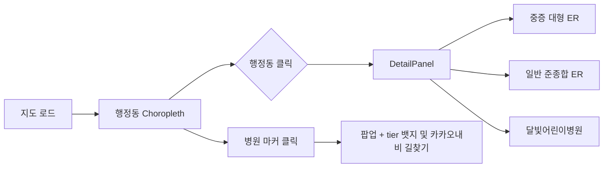

# 대구 골든타임 — 포트폴리오

> **응급의료 거버넌스 플랫폼** — 대구 150개 행정동의 응급·소아 응급 접근성을 지도로 진단하는 의료행정 데이터 시각화 프로젝트

| 항목 | 내용 |
|------|------|
| **프로젝트명** | 대구 골든타임 (Daegu Golden Time) |
| **부제** | 응급의료 거버넌스 플랫폼 |
| **유형** | 공공의료 접근성 BI · GIS 웹 대시보드 |
| **분석 지역** | 대구광역시 행정동 150개 |
| **기술 스택** | React 19 · TypeScript · Vite · **react-kakao-maps-sdk** · Tailwind CSS v4 · FastAPI (실시간 폴링 및 캐싱) · SQLite |
| **저장소** | [프로젝트 루트](../) · 시민용 안내는 [README.md](../README.md) · [문서 모음](./README.md) |

---

## 1. 한 줄 요약

응급 상황에서 **골든타임(결정적 시간)** 안에 적절한 의료기관에 닿을 수 있는지를, 행정동 단위로 **정량화·시각화**하여 **시민 정보 제공**과 **의료행정·정책 의사결정**을 동시에 지원하는 지도 기반 BI 프로젝트입니다.

---

## 2. 문제 정의 (Why)

### 배경
- 기존 지도 서비스는 **병원 위치·진료과목** 중심이며, **응급·필수의료 정책**에 필요한 질문에는 답하기 어렵습니다.
- “가장 가까운 응급실은 어디인가?”만으로는 부족합니다. **중증(권역·대형)** 과 **일반(준종합)** 응급, **소아 야간·휴일(달빛어린이병원)** 은 목적과 접근성이 다릅니다.
- 통계표만으로는 **달성군 구지면** 같은 **필수의료 사각지대**가 직관적으로 드러나지 않습니다.

### 핵심 질문
> *“이 행정동에 사는 주민은 응급 상황에서 골든타임 안에 적절한 의료기관에 닿을 수 있는가?”*

### 타깃 사용자
| 사용자 | 활용 |
|--------|------|
| 일반 시민·보호자 | 거주·이사 전 응급·소아 응급 접근성 참고 및 **카카오내비 앱 연동** 즉시 경로 안내 |
| 지역 보건·행정 | 사각지대 진단, 병상·이송 정책 논의 근거 |
| 연구·포트폴리오 | 행정학 × 보건의료 행정 × GIS 분석 사례 |

---

## 3. 솔루션 (What)

### 핵심 기능

1. **행정동 Choropleth** — 사각지대 지수(병상 부족 등)를 색상으로 표현
2. **3단계 응급기관 tier 모델**
   - **tier 1** 권역·대형 (중증 응급) — 🚨 빨간 뱃지 (`CustomOverlayMap`)
   - **tier 2** 준종합 (일반 응급) — 🏥 파란 뱃지
   - **tier 3** 달빛어린이병원 (소아 야간·휴일) — 👶 노란 뱃지
3. **행정동 클릭 → DetailPanel** — 중증·일반 응급 거리를 **나란히 비교**
4. **실시간 병상 연동 및 길안내** — 국립중앙의료원(E-Gen) 실시간 데이터 표시 및 카카오내비 URL Scheme 연동
5. **소아응급 공백 배지** — 달빛어린이병원까지 10km 초과 시 경고

### UI 흐름



### 차별점
- **단일 최근접 ER**이 아닌 **중증 vs 일반 응급 이원 비교** — 실제 의료행정·이송 판단에 가까운 UX
- **시민 친화 카피**와 **정책 BI 스키마**를 한 제품 안에서 분리 설계 (README 이원화)
- **대구 행정 경계 제한** (`minLevel`/`maxLevel` + 드래그 경계 보정) — 분석 권역에 맞는 지도 UX

---

## 4. 데이터 설계

### 공간 단위
- **행정동 150개** (대구광역시, GeoJSON 단순화본)

### 의료기관 tier (실시간 공공 API 연동)

| tier | 구분 | 대구 반영 예시 |
|------|------|----------------|
| 1 | 권역·대형 | 경북대병원, 계명 동산, 영남대, 가톨릭대, 칠곡경북대 |
| 2 | 준종합 | 곽병원, 구병원, 삼일병원, 파티마병원 |
| 3 | 달빛어린이병원 | **공식 지정 6개소** (아래 표) |

### 달빛어린이병원 검증 (2026.06 기준)

[대구광역시 보건 — 소아 야간·휴일 진료기관](https://www.daegu.go.kr/health/index.do?menu_id=00936060) 공식 목록과 대조하여 **6개소 전부** 정적 데이터베이스에 완벽히 반영했습니다.

| # | 기관명 | 소재 시군구 | 비고 |
|---|--------|-------------|------|
| 1 | 한영한마음아동병원 | 남구 | 2025.1~ 지정 |
| 2 | 율하연합소아청소년과의원 | 동구 | |
| 3 | 우리허브병원 | 달성군 현풍읍 | 24시 외래 |
| 4 | 열린아동병원 | 달서구 | 2025.3~ 지정 |
| 5 | 우리아이아동병원 | 북구 | 2025.3~ 지정 |
| 6 | 바른연합소아청소년과의원 | 달서구 | **2026.3 신규 지정** (6곳 체계 완성) |

> **검증 결과**: 이전 버전에 있던 「경북대·영남대 달빛어린이병원」은 **공식 지정 명칭이 아니어서 제거**하고, 위 6곳으로 교체 완료했습니다.  
> 좌표는 공개 주소 기준 OpenStreetMap Nominatim 지오코딩으로 산출했습니다.

### 행정동별 필드 (실시간 데이터 기반)

| 필드 | 설명 |
|------|------|
| `nearest_tier1_er` / `distance_tier1` | 최근접 권역·대형 응급 |
| `nearest_tier2_er` / `distance_tier2` | 최근접 준종합 응급 |
| `nearest_pediatric_er` / `pediatric_er_distance_km` | 최근접 달빛어린이병원 |
| `is_golden_time_missed` | tier1 기준 15분 이내 도달 어려움 여부 |
| `bed_shortage_index` | 실시간 HIRA/E-Gen 데이터를 조합한 인구 대비 병상 부족 지수 |

---

## 5. 기술 구현

### 지도 스택: 카카오맵 + react-kakao-maps-sdk

행정동 **Choropleth**와 **클릭 상세 패널**이 핵심이므로, 국내 도로·지명 인지도가 높은 **카카오맵 JavaScript SDK**를 React 래퍼와 함께 채택했습니다. 나아가, **카카오내비 앱 연동(URL Scheme)** 기능을 추가하여 사용자가 실제 이동할 때 즉각적인 내비게이션을 켤 수 있도록 했습니다.

| 관점 | react-kakao-maps-sdk + 카카오맵 |
|------|--------------------------------|
| **국내 지도 품질** | 한국 도로·지명·POI 네이티브 타일 |
| **React 통합** | `<Map>`, `<Polygon>`, `<CustomOverlayMap>`, `<Polyline>` 선언적 구성 |
| **실제 내비게이션** | 카카오내비 앱 연동 (URL Scheme 기반 즉시 길안내) |
| **커스텀 UI** | `CustomOverlayMap` + Tailwind tier별 병원 뱃지 |
| **정책 BI UX** | `ZoomControl`, `minLevel`/`maxLevel`, 드래그 경계 보정 |

### 아키텍처

```
[FastAPI 백엔드 실시간 API (E-Gen/HIRA) + SQLite 캐시]
        ↓
  useKakaoLoader (page.tsx) — SDK 로드·에러 게이트
        ↓
  API 통신 및 프론트엔드 상태 관리 병합
        ↓
  MapComponent (카카오 <Map>)
    ├── DistrictPolygon — Choropleth·선택 (memo)
    ├── HospitalMarkerOverlay — CustomOverlayMap tier 뱃지
    └── Polyline — 동 선택 시 tier 1·2·3 연결선
        ↓
  DetailPanel (행정동 상세 비교 UI 및 카카오내비 연동 버튼)
```

### 주요 모듈

| 경로 | 역할 |
|------|------|
| `frontend/src/app/page.tsx` | `useKakaoLoader` + 지도·패널 2열 레이아웃 |
| `frontend/src/widgets/map-dashboard/MapComponent.tsx` | 카카오 `<Map>` · Polygon · Polyline · pan/locate |
| `frontend/src/shared/lib/kakao-navigation.ts` | 카카오내비 실시간 앱 연동 URL Scheme |
| `frontend/src/widgets/map-dashboard/HospitalGranularBeds.tsx` | E-Gen 데이터 기반 병실 세분화(6개 항목) 및 혼잡도 UI |
| `backend/app/services/bed_poller.py` | 국립중앙의료원(E-Gen) API 실시간 병상 정보 Background Polling |
| `backend/app/services/hira_client.py` | 심평원(HIRA) 인프라 현황 비동기 API 통신 |
| `backend/app/api/routes/hospitals.py` | 3초 서킷 브레이커가 적용된 캐싱 API 엔드포인트 |

---

## 6. 역할 및 기여 (작성 시 본인에 맞게 수정)

> 아래는 **작성 템플릿**입니다. 지원 서류에 맞게 문장만 조정해 사용하세요.

- **기획**: 응급 tier 모델(대형·준종합·달빛) 정의, DetailPanel 이원 비교 UX 설계
- **데이터**: 대구 달빛어린이병원 공식 6곳 대조 및 E-Gen 실시간 6종 병실(음압격리, 코호트 등) 매핑
- **백엔드**: FastAPI 기반의 비동기 API 폴링(Polling) 아키텍처 및 3초 서킷 브레이커 도입
- **프론트엔드**: 카카오맵 + react-kakao-maps-sdk 통합, 카카오내비 URL Scheme 딥링크 기능 구현

---

## 7. 실행 방법

### 백엔드 (API 서버)
```bash
cd backend
python -m venv venv
source venv/Scripts/activate # Windows
pip install -r requirements.txt
uvicorn app.main:app --host 0.0.0.0 --port 8000
```

### 프론트엔드 (지도 UI)
```bash
cd frontend
npm install
npm run dev
```

브라우저: http://localhost:5173/

> **카카오맵 API 키**: `frontend/.env`에 `VITE_KAKAO_MAP_APP_KEY=발급키` 설정. 카카오 개발자 콘솔에서 `http://localhost:5173` 도메인 등록 필수. 

---

## 8. 한계 및 고도화 계획

| 기능 | 현재 상태 | 고도화 예정 |
|------|-----------|-------------|
| **실제 병상 데이터** | 국립중앙의료원 공개 상황판의 실시간 병상과 HIRA 기관 현황을 구분 연동 | 119 구급대 폐쇄망 데이터 추가 연동 |
| **경로 탐색** | 반경(직선) 검색 + 카카오내비 URL 실시간 앱 연동 | 인앱(In-app) OSRM 기반 폴리곤 렌더링 |
| **API 아키텍처** | FastAPI 서킷브레이커 및 백그라운드 캐싱 | Redis 분산 캐싱 도입 |
| **배포 환경** | 로컬 개발 서버(uvicorn/Vite) 기준 실데이터 통신 프로토타입 | E2E·부하 테스트 통과 후 클라우드 배포 예정 |

---

## 9. 포트폴리오 어필 포인트

| 강점 | 설명 |
|------|------|
| **도메인 결합** | 행정구역·공공서비스 배분 + 응급의료체계·필수의료 |
| **Real-time 데이터 검증**| 국립중앙의료원 공식 간편조회 6종 필드와 대구 응급의료기관 19곳을 2026-07-12 기준 대조 |
| **강력한 방어 기제** | 3초 서킷 브레이커 적용으로 공공 API 지연 시에도 서비스 무중단 보장 |
| **실행 가능한 액션 유도** | 카카오내비 URL 연동으로 즉시 현장 이동을 돕는 UX 구현 |

---

## 10. 면접·서류용 예상 질문 & 답변 포인트

**Q. 왜 응급실을 하나만 보여주지 않았나요?**  
A. 중증 환자는 권역·대형으로, 일반 응급은 준종합으로 이송·내원 패턴이 다릅니다. 동일 동에서 **거리 차이**를 나란히 보여주면 시민·정책 담당자 모두 판단 근거가 됩니다.

**Q. 직선거리를 기반으로 대시보드를 구축했는데, 부정확하지 않나요?**  
A. 거시적인 150개 행정동 사각지대 분석을 위해서는 OSRM보다 직관적인 반경 거리가 효과적이라고 판단했습니다. 다만 시민이 실제로 병원을 방문할 때의 실질 이동 시간을 보장하기 위해, UI 상에서 **카카오내비 앱을 즉시 실행(Deep Link)**하여 실시간 트래픽 기반의 정확한 ETA와 길안내를 받을 수 있도록 이원화 설계했습니다.

**Q. 공공 API 지연이 심한데, 화면 렌더링 속도는 어떻게 보장했나요?**  
A. 클라이언트가 API를 직접 호출하지 않고, 백엔드에 FastAPI `BackgroundTasks`를 이용한 1~2분 주기의 비동기 폴링 봇을 구축했습니다. 또한 클라이언트 요청 시 3초 이내에 데이터가 병합되지 않으면 과감하게 캐시 데이터 혹은 Fallback UI(전화 확인 요망 등)로 응답하는 **서킷 브레이커(Circuit Breaker)** 패턴을 도입하여 무중단 서비스를 실현했습니다.

---

## 11. 관련 링크

- [시민·서비스 안내 README](../README.md)
- [대구광역시 달빛어린이병원 지정기관](https://www.daegu.go.kr/health/index.do?menu_id=00936060)
- [응급의료포털 달빛어린이병원](https://www.e-gen.or.kr/moonlight/main.do)

---

## 12. 스크린샷 (제출 전 추가)

> 배포 URL 또는 `npm run dev` 실행 후 캡처를 아래에 붙이세요.

| 화면 | 설명 |
|------|------|
| `docs/screenshots/map-overview.png` | 전체 Choropleth + tier 마커 |
| `docs/screenshots/detail-panel.png` | 6칸 세분화 병상 및 카카오내비 연동 UI |
| `docs/screenshots/hospital-popup.png` | 병원 CustomOverlayMap + tier 뱃지 |

---

*본 문서는 채용·학과 포트폴리오 제출용입니다. 응급 상황에서는 119 또는 1339를 이용하세요.*
