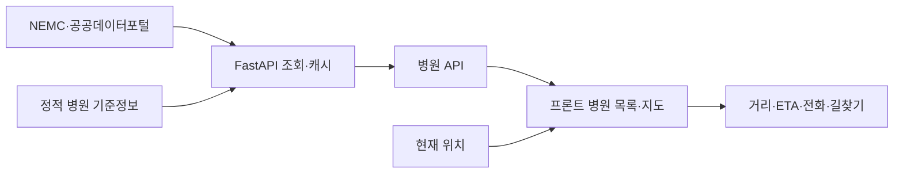

# 대구 골든타임 프로젝트 구조

최종 갱신: 2026-07-19

이 문서는 저장소의 모든 파일명을 나열하지 않고, 실제 실행·분석·검증·배포 흐름을 이해하는 데 필요한 구조만 설명합니다. 과거 구현 기록은 `docs/01_Architecture_and_Tech.md`부터 `docs/07_Uncategorized.md`까지의 보관 문서를 참고하되, 현재 동작은 이 문서와 README, 활성 코드, 테스트를 우선합니다.

## 1. 전체 구조

```text
golden-project/
├─ frontend/                 React 시민·정책 화면
│  ├─ src/
│  │  ├─ app/               앱 진입점과 최상위 화면 조합
│  │  ├─ data/              정적 GeoJSON·병원 데이터 접근 모듈
│  │  ├─ shared/            타입·상태·API·안전 상태 변환
│  │  └─ widgets/           시민 화면·정책 화면·지도 UI
│  └─ public/data/          GitHub Pages가 읽는 정책 공개본과 PDF
├─ backend/                  FastAPI 공개 API와 데이터 갱신
│  ├─ app/
│  │  ├─ api/routes/        병원·취약성·후보·경로·상태 API
│  │  ├─ core/              환경변수·캐시
│  │  ├─ db/                SQLite 연결과 모델
│  │  └─ services/          병상·기관·스케줄러·갱신 파이프라인
│  └─ scripts/              수집·정제·마이그레이션 CLI
├─ ai-model/                 정책 후보·도로 접근성·릴리스 생성
├─ analysis/                 EDA 노트북
├─ data/
│  ├─ raw/                  수집 원본과 manifest
│  ├─ analysis/             초기·중간 분석 입력
│  ├─ processed/            검증된 처리 산출물과 정책 정본
│  └─ hospitals.db          병원 기준정보 SQLite
├─ scripts/                  EDA·추출·로컬 개발 보조 명령
├─ tests/                    프론트·백엔드·분석 테스트
├─ docs/                     방법론·데이터 사전·검증·회고 문서
├─ .github/workflows/        CI 검증과 GitHub Pages 배포
├─ README.md                 프로젝트 대표 설명
├─ Dockerfile                Render용 백엔드 컨테이너
└─ docker-compose.yml        로컬 통합 실행 보조
```

## 2. 서비스 실행 경로

### 프론트엔드

| 역할 | 핵심 경로 |
|---|---|
| 앱 시작 | `frontend/src/main.tsx`, `frontend/src/app/App.tsx` |
| 시민·정책 화면 전환 | `frontend/src/app/AppPage.tsx` |
| 시민용 응급의료 화면 | `frontend/src/widgets/app/CitizenView.tsx` |
| 정책분석 화면 | `frontend/src/widgets/app/AdminView.tsx` |
| 지도와 병원 탐색 | `frontend/src/widgets/map-dashboard/` |
| 병상 상태 의미 | `frontend/src/shared/lib/bed-status.ts` |
| 병원·정책 상태 | `frontend/src/shared/store/` |
| 외부 API 주소 | `frontend/src/shared/config/api.ts` |

프론트엔드는 개발 시 `/`, GitHub Pages 빌드 시 `/golden-project/`를 base path로 사용합니다. 정책 화면의 최종 PDF도 `import.meta.env.BASE_URL`을 기준으로 연결합니다.

### 백엔드

| 역할 | 핵심 경로 |
|---|---|
| FastAPI 시작 | `backend/app/main.py` |
| 병원 목록 | `backend/app/api/routes/hospitals.py` |
| 정책 상태 | `backend/app/api/routes/dashboard.py` |
| 취약성·후보 | `backend/app/api/routes/vulnerability.py`, `optimal_locations.py` |
| 도로 ETA | `backend/app/api/routes/routing.py` |
| 병상 조회·캐시 | `backend/app/services/bed_poller.py`, `bed_cache.py` |
| 공공 API 클라이언트 | `backend/app/services/api_clients/` |
| 원천 갱신·승격 | `backend/app/services/pipeline.py`, `scheduler.py` |
| DB 연결 | `backend/app/db/database.py` |

현행 백엔드와 정책분석은 HIRA 전문의·등록 장비 데이터를 사용하지 않습니다. 국립중앙의료원·공공데이터포털에서 조회한 응급정보는 별도 원천으로 유지합니다.

## 3. 시민 서비스 데이터 흐름



- 병상 값은 `양수`, `0 보고`, `미확인`을 구분합니다.
- 병상 값만으로 진료 가능이나 실제 수용 가능을 확정하지 않습니다.
- 외부 API가 실패해도 병원 위치·전화·길찾기용 정적 기준정보는 유지합니다.

## 4. 정책분석 파이프라인

정책분석의 주 실행점은 `ai-model/run_integrated_policy_pipeline.py`입니다.

```text
행정동·인구·기관 원천
  → 공간 전처리와 입력 계약 검증
  → 후보 민감도 분석
  → 안정 후보 생성
  → 후보 추적 데이터 생성
  → 5,100개 실제 도로 경로 행렬 검증
  → p-median·MCLP 후보 비교
  → 단일 policy_release.json 생성
  → 프론트 공개본과 결정성 비교
```

| 단계 | 핵심 파일 |
|---|---|
| 후보 민감도 | `ai-model/run_candidate_sensitivity_analysis.py` |
| 안정 후보 | `ai-model/build_stable_policy_candidates.py` |
| 후보 추적 | `ai-model/build_accessibility_candidate_trace.py` |
| 도로 접근성 | `ai-model/build_actual_road_accessibility.py` |
| 단일 정책 릴리스 | `ai-model/build_policy_release.py` |
| 전체 오케스트레이션 | `ai-model/run_integrated_policy_pipeline.py` |

현재 공개 계약은 행정동 150개, 기관 25개, 후보 9개, 요청·성공 경로 5,100개, 누락 0개입니다.

## 5. 데이터 계층

| 계층 | 목적 | 예시 |
|---|---|---|
| `data/raw/` | 수집 원본과 기준월·해시 보존 | 인구 CSV, manifest, 행정동 GeoJSON |
| `data/analysis/` | 초기 또는 호환 분석 입력 | 행정동·인구·병원 분석 파일 |
| `data/processed/` | 검증된 처리 결과와 정책 정본 | 후보, 도로 행렬, 최적화, `policy_release.json` |
| `frontend/public/data/` | GitHub Pages 공개 산출물 | 정책 릴리스, 후보·도로 결과, 최종 PDF |
| `frontend/src/assets/`, `src/data/` | 번들에 포함되는 정적 fallback | 병원·취약성 GeoJSON |

### 의도적으로 유지하는 사본

다음 파일은 단순 백업이 아니라 소비 경로가 다른 검증 사본입니다.

- `data/processed/policy_release.json`
- `frontend/public/data/policy_release.json`
- 처리용 후보·도로·최적화 JSON과 프론트 공개 사본
- 분석용 GeoJSON과 프론트 번들 fallback

CI는 핵심 정책 릴리스를 재생성한 뒤 처리용·공개용 사본의 결정성을 확인합니다. 따라서 경로가 중복돼 보인다는 이유만으로 삭제하지 않습니다.

## 6. 최종 정책보고서

공개 정책 PDF는 다음 한 파일만 유지합니다.

```text
frontend/public/data/reports/daegu-golden-time-policy-analysis-report.pdf
```

정책 화면의 `최종 정책보고서 보기 (PDF)` 링크와 GitHub Pages 빌드가 이 파일을 사용합니다. 이전 PDF와 전달용 복사본은 활성 트리에서 제거했습니다.

## 7. 테스트와 자동 검증

| 검증 | 경로·명령 |
|---|---|
| 프론트 단위 테스트 | `frontend/`에서 `npm test` |
| ESLint | `frontend/`에서 `npm run lint` |
| TypeScript | `frontend/`에서 `npm run typecheck` |
| 프로덕션 빌드 | `frontend/`에서 `npm run build` |
| 백엔드 테스트 | `tests/unit/backend`, `tests/integration/backend` |
| 분석 테스트 | `tests/unit/ai_model` |
| CI | `.github/workflows/verify.yml` |
| Pages 배포 | `.github/workflows/deploy.yml` |

GitHub Actions의 CI는 커밋된 정책 정본의 계약과 결정성을 검증합니다. Kakao API에서 모든 경로를 새로 수집하는 온라인 전체 재분석은 승인된 키·호출 한도·캐시가 있는 별도 환경의 책임입니다.

## 8. 문서 구조

| 문서 | 역할 |
|---|---|
| `README.md` | 프로젝트 정체성과 실행·배포·안전 안내 |
| `docs/methodology.md` | VDI·K-Means·도로 접근성·후보 방법론 |
| `docs/data_dictionary.md` | 데이터 필드와 안전한 해석 범위 |
| `docs/EDA_REPORT.md` | 탐색적 데이터 분석 결과 |
| `docs/DATA_INTEGRITY_AND_REFRESH_HARDENING_20260718.md` | 갱신·승격·복원 계약 |
| `docs/FINAL_PORTFOLIO_FREEZE_REPORT_20260718.md` | 최종 개선·검증·동결 기록 |
| `docs/REPOSITORY_CLEANUP_PLAN_20260719.md` | 저장소 정리 기준과 단계 |
| `docs/GOLDEN_DATA_LAB_SEPARATION_REPORT_20260719.md` | 데이터랩 독립 저장소 분리 계획·검증·진행 상태 |
| `docs/01`~`07` | 현재와 다른 내용이 포함된 과거 개발·회고 기록 |

## 9. 저장소에 두지 않는 파일

다음은 `.gitignore` 대상으로 로컬에서만 생성합니다.

- `.env`, `frontend/.env`
- `node_modules/`, `dist/`, `.vite/`
- `__pycache__/`, `.pytest_cache/`
- `test-results/`, `playwright-report/`
- `tmp/`, `data/cache/`, 로그
- 실행 중 생성되는 보조 DB 사본

## 10. 별도 데이터분석 저장소

SQL·Python EDA·Power BI 학습 로드맵은 제품 런타임과 분리해 [`ssg-sak/golden-data-lab`](https://github.com/ssg-sak/golden-data-lab)에서 관리합니다. 이 저장소는 시민 서비스와 정책분석 엔진의 실행·검증·배포에 집중합니다. 분리 근거와 이력 검증은 `docs/GOLDEN_DATA_LAB_SEPARATION_REPORT_20260719.md`를 따릅니다.
