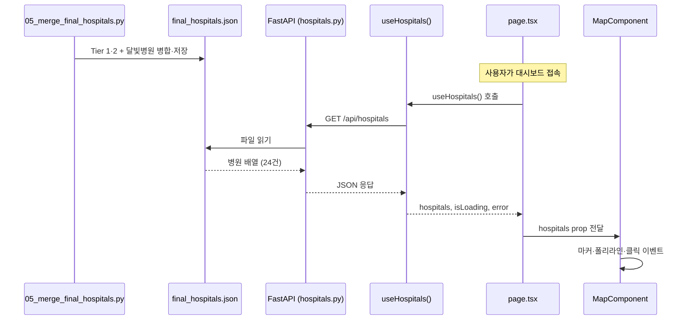

# 병원 데이터 API 연동 — 코드 설명서

> **대상:** `GET /api/hospitals` 백엔드 + 프론트엔드 Fetch 로직  
> **목적:** 로컬 JSON import 대신, 실행 중인 백엔드에서 병원 목록을 가져와 지도·통계·상세 패널에 반영

---

## 1. 왜 이렇게 바꿨는가?

### 이전 방식 (제거됨)

```ts
// page.tsx — 더 이상 사용하지 않음
import finalHospitals from '../data/final_hospitals.json';
```

- 빌드 시점에 JSON이 번들에 고정됨
- 데이터 갱신 시 프론트를 다시 빌드해야 함
- 백엔드·스크립트 파이프라인과 프론트가 분리되어 있어 “실서비스” 흐름과 다름

### 현재 방식

```
[데이터 생성 스크립트] → final_hospitals.json → [FastAPI] → [React fetch] → 지도 UI
```

- **단일 원본:** `data/processed/final_hospitals.json`
- **API 계층:** FastAPI가 JSON을 읽어 HTTP로 제공
- **프론트:** `useEffect`로 마운트 시 1회 `fetch`, 로딩·에러 UI 처리
- 스크립트만 다시 돌리고 API를 재시작하면 프론트는 새로고침만으로 최신 데이터 반영 가능

---

## 2. 전체 흐름 (한눈에)



### 레이어별 역할

| 레이어 | 파일 | 역할 |
|--------|------|------|
| 데이터 | `backend/scripts/05_merge_final_hospitals.py` | ER API·달빛병원 병합 → JSON 생성 |
| API | `backend/app/api/routes/hospitals.py` | JSON → HTTP 응답 |
| 앱 진입 | `backend/app/main.py` | 라우터 등록, CORS |
| 설정 | `frontend/src/shared/config/api.ts` | API 베이스 URL |
| HTTP 클라이언트 | `frontend/src/shared/api/hospitals.ts` | `fetch` + 응답 검증 |
| React 훅 | `frontend/src/widgets/map-dashboard/lib/useHospitals.ts` | 상태·생명주기 |
| UI | `frontend/src/app/page.tsx` | 로딩/에러/지도 렌더 분기 |
| 타입 | `frontend/src/shared/types/hospital.ts` | `HospitalRecord` 스키마 |

---

## 3. 데이터 원본 — `final_hospitals.json`

스크립트 `05_merge_final_hospitals.py`가 만드는 최종 파일입니다.

**입력**

- `data/processed/daegu_er_hospitals.json` — 공공 API에서 수집한 대구 응급실(Tier 1·2)
- 스크립트 내 `TIER3_MOONLIGHT_HOSPITALS` — 대구 달빛어린이병원 6곳(Tier 3)

**출력**

- `data/processed/final_hospitals.json` (백엔드가 읽는 파일)
- `frontend/src/assets/`, `frontend/src/data/` (프론트 정적 복사본 — API 연동 후에는 참고·폴백용)

**레코드 형식 (`HospitalRecord`)**

```ts
{
  name: string;      // 병원명
  lat: number;       // 위도
  lng: number;       // 경도
  tier: 1 | 2 | 3;   // 1=권역·대형, 2=준종합, 3=달빛어린이
  address?: string;  // 주소 (선택)
}
```

---

## 4. 백엔드 코드

### 4-1. `backend/app/api/routes/hospitals.py`

**핵심 역할:** 디스크의 JSON을 그대로 API 응답으로 반환.

```python
PROJECT_DIR = Path(__file__).resolve().parents[4]
FINAL_HOSPITALS_JSON = PROJECT_DIR / "data" / "processed" / "final_hospitals.json"

@router.get("/api/hospitals")
def get_hospitals() -> list[dict]:
    if not FINAL_HOSPITALS_JSON.exists():
        raise HTTPException(status_code=503, detail="병원 데이터가 없습니다. ...")
    return json.loads(FINAL_HOSPITALS_JSON.read_text(encoding="utf-8"))
```

**설계 포인트**

- `parents[4]`: `routes` → `api` → `app` → `backend` → **프로젝트 루트** 로 올라가 `data/processed/` 접근
- 파일 없음 → `503` + 스크립트 실행 안내 (프론트가 `detail` 메시지를 사용자에게 표시)
- DB 없이 파일 기반 — 프로토타입·로컬 개발에 적합

### 4-2. `backend/app/main.py`

```python
from app.api.routes import hospitals, indicators

app.include_router(indicators.router)
app.include_router(hospitals.router)
```

**핵심 역할**

- `hospitals` 라우터를 FastAPI 앱에 연결
- **CORS:** `localhost:5173`(Vite)에서 브라우저 `fetch`가 막히지 않도록 허용
- 루트 `GET /` 에 `"hospitals": "/api/hospitals"` 엔드포인트 안내

---

## 5. 프론트엔드 코드

### 5-1. `shared/config/api.ts` — URL 설정

```ts
export const API_BASE_URL =
  import.meta.env.VITE_API_BASE_URL?.replace(/\/$/, '') || 'http://localhost:8000';

export const HOSPITALS_API_URL = `${API_BASE_URL}/api/hospitals`;
```

**왜 분리했는가**

- 개발: `http://localhost:8000`
- 배포: `frontend/.env`의 `VITE_API_BASE_URL`만 바꾸면 됨
- `fetch` 호출부에 URL 하드코딩 방지

### 5-2. `shared/api/hospitals.ts` — HTTP + 검증

**핵심 함수:** `fetchHospitals(): Promise<HospitalRecord[]>`

처리 순서:

1. `fetch(HOSPITALS_API_URL)` — 네트워크 실패 시 “백엔드 서버에 연결할 수 없습니다” 메시지
2. `response.ok` 확인 — FastAPI `HTTPException`의 `detail` 추출
3. JSON이 **배열**인지 확인
4. `isHospitalRecord` 타입 가드로 각 항목 검증 (`name`, `lat`, `lng`, `tier`)
5. 유효한 병원이 0개면 에러

**왜 검증하는가**

- API 스키마가 바뀌거나 잘못된 JSON이 와도 지도 컴포넌트가 깨지기 전에 명확한 에러 표시
- TypeScript 타입과 런타임 데이터 일치 보장

### 5-3. `widgets/map-dashboard/lib/useHospitals.ts` — React 훅

**핵심 패턴:** 마운트 시 1회만 요청 + 언마운트 시 취소 플래그

```ts
useEffect(() => {
  let cancelled = false;

  fetchHospitals()
    .then((data) => { if (!cancelled) setHospitals(data); })
    .catch((err) => { if (!cancelled) setError(...); })
    .finally(() => { if (!cancelled) setIsLoading(false); });

  return () => { cancelled = true; };
}, []);  // 의존성 배열 비움 → 최초 렌더 1회만
```

**반환값**

| 상태 | 타입 | 용도 |
|------|------|------|
| `hospitals` | `HospitalRecord[]` | 지도·통계바 |
| `isLoading` | `boolean` | 스피너 표시 |
| `error` | `string \| null` | 에러 배너·전체 화면 안내 |

`cancelled` 플래그는 React Strict Mode 이중 마운트나 빠른 페이지 이탈 시 **setState on unmounted component** 경고를 막습니다.

### 5-4. `app/page.tsx` — UI 조립

**데이터 소스 두 개 (병원 vs 행정동)**

```ts
const { hospitals, isLoading: hospitalsLoading, error: hospitalsError } = useHospitals();
const { data, loading: medicalLoading, error: medicalError } = useMedicalMapData();
```

- **병원:** 백엔드 API (`useHospitals`)
- **행정동 의료 지표:** 기존처럼 로컬 `mock_medical_data.json` (`useMedicalMapData`) — 이번 작업 범위 밖

**렌더 분기 (지도 영역)**

```
카카오 키 없음 → 키 설정 안내
카카오 로딩 중 → 카카오 스피너
카카오 에러   → 카카오 에러 안내
병원 로딩 중  → HospitalsLoadingState ("🚨 대구 응급의료 데이터를 불러오는 중입니다...")
병원 에러     → HospitalsErrorState (uvicorn 실행 방법 포함)
모두 OK       → MapComponent에 hospitals 전달
```

**하위 컴포넌트로의 전달**

```tsx
<MapComponent
  hospitals={hospitals}
  selectedHospital={selectedHospital}
  onHospitalSelect={setSelectedHospital}
  ...
/>

<DashboardStatsBar
  tier1Count={hospitals.filter((h) => h.tier === 1).length}
  ...
/>

<DetailPanel selectedHospital={selectedHospital} ... />
```

`MapComponent`는 데이터를 **직접 fetch하지 않음** — 상위 `page.tsx`가 props로 넘기는 **.presentational + 지도 로직** 구조를 유지합니다.

---

## 6. 파일 의존 관계도

```
page.tsx
  ├── useHospitals.ts
  │     └── shared/api/hospitals.ts
  │           ├── shared/config/api.ts  ← VITE_API_BASE_URL
  │           └── shared/types/hospital.ts
  ├── MapComponent.tsx        (hospitals prop)
  ├── DashboardStatsBar.tsx   (tier 카운트)
  └── DetailPanel.tsx         (selectedHospital)

backend/app/main.py
  └── api/routes/hospitals.py
        └── data/processed/final_hospitals.json
              ↑ 05_merge_final_hospitals.py
```

---

## 7. 실행 방법

### 1) 데이터 준비 (최초 1회 또는 갱신 시)

```bash
python backend/scripts/05_merge_final_hospitals.py
```

### 2) 백엔드

```bash
cd backend
uvicorn app.main:app --reload --host 127.0.0.1 --port 8000
```

확인:

- http://127.0.0.1:8000/ — 서비스 정보
- http://127.0.0.1:8000/api/hospitals — 병원 24건 JSON
- http://127.0.0.1:8000/docs — Swagger UI

### 3) 프론트엔드

```bash
npm run dev
```

→ http://localhost:5173 에서 API 호출 후 지도에 마커 표시

### 환경 변수 (`frontend/.env`)

```env
VITE_API_BASE_URL=http://localhost:8000
VITE_KAKAO_MAP_APP_KEY=...
```

---

## 8. 에러 시나리오와 사용자 메시지

| 상황 | 발생 위치 | 사용자에게 보이는 내용 |
|------|-----------|------------------------|
| uvicorn 미실행 | `fetch` catch | 백엔드 서버에 연결할 수 없습니다 |
| JSON 파일 없음 | API 503 | 스크립트 실행 안내 (`detail`) |
| 응답 형식 오류 | `fetchHospitals` 검증 | 병원 데이터 형식이 올바르지 않습니다 |
| 빈 배열 | `fetchHospitals` 검증 | 병원 데이터가 비어 있습니다 |

`page.tsx`의 `HospitalsErrorState`는 위 메시지 + `uvicorn` 실행 예시를 지도 영역 중앙에 표시합니다.

---

## 9. 다음 단계에서 확장하기 좋은 지점

- **행정동 데이터도 API화:** `useMedicalMapData`를 `useHospitals`와 같은 패턴으로 통일
- **Vite 프록시:** `vite.config.ts`에서 `/api` → `:8000` 프록시 시 CORS·URL 단순화
- **캐시·재시도:** `fetchHospitals`에 retry 또는 SWR/React Query 도입
- **DB 전환:** `hospitals.py`만 DB 쿼리로 교체하면 프론트는 URL·스키마 유지 시 변경 최소화

---

## 10. 관련 파일 빠른 링크

| 파일 | 경로 |
|------|------|
| API 라우트 | `backend/app/api/routes/hospitals.py` |
| FastAPI 앱 | `backend/app/main.py` |
| 병합 스크립트 | `backend/scripts/05_merge_final_hospitals.py` |
| API URL 설정 | `frontend/src/shared/config/api.ts` |
| fetch 함수 | `frontend/src/shared/api/hospitals.ts` |
| React 훅 | `frontend/src/widgets/map-dashboard/lib/useHospitals.ts` |
| 대시보드 페이지 | `frontend/src/app/page.tsx` |
| 타입 정의 | `frontend/src/shared/types/hospital.ts` |
