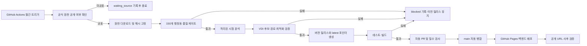

# 월간 정책 분석 결과 완전자동화 설계

- 문서 상태: `ACTIVE`
- 작성일: 2026-08-03
- 대상 프로젝트: 대구 골든타임 · Golden Governance
- 목표: 공식 월간 인구가 검증되면 별도 요청 없이 VDI, 화면 지표, 정책 후보와 최적 조합을 다시 계산하고 공개 화면까지 안전하게 갱신한다.
- 구현 상태: 공식 자료 확인·시험 실행·정식 반영 코드와 예약 워크플로 구현 완료, 한 달 시험 운영 및 GitHub App 비밀값 등록 전

## 1. 문제 분석

기존 구현은 월별 총인구 API 조회, 변경 감지, DB 적재와 `analysis_pending` 표시까지만 수행했다. 이번 구현에서 공식 연령별 자료 확인, 격리 작업공간 분석, 결과 버전 생성, 프론트 자동 교체와 예약 CI를 추가했다.

기존 구조에서 보완한 문제는 다음과 같다.

1. 총인구 API와 VDI용 연령별 인구 원천이 분리되어 있다.
2. 일반 스케줄 작업은 원천 변경 시 재분석을 실행하지 않고 `analysis_pending`만 설정한다.
3. 분석 버전과 발행 시각이 코드에 고정되어 있다.
4. 프론트의 정책 릴리스 저장소는 최초 로딩 후 새 버전을 다시 확인하지 않는다.
5. GitHub Pages는 `main` 푸시에만 배포되므로 앱 서버의 로컬 파일 변경만으로 공개 화면이 바뀌지 않는다.

따라서 자동 수집 작업에 분석 명령 하나를 이어 붙이는 것만으로는 부족하다. 원천 검증, 릴리스 후보 격리, 원자적 승격, Git 기반 배포와 열린 브라우저의 버전 교체까지 하나의 상태 머신으로 묶어야 한다.

## 2. 목표와 비목표

### 2.1 목표

- 매월 첫 공표 가능일 18:00부터 공식 전월 자료 공개 여부를 자동 확인하고, 지연 시 후속 예약일에 계속 재확인한다.
- VDI에 필요한 `65세 이상`과 `0~9세` 공식 인구가 모두 준비된 달만 분석 기준월로 승격한다.
- 150개 행정동, 25개 정책 분석 기관, 9개 안정 후보와 전체 도로 경로 계약을 자동 검증한다.
- VDI, 고위험 행정동 수, 위험 경계, 후보 좌표, p-median 및 MCLP 최적 조합을 재계산한다.
- 검증된 결과만 정본과 프론트 배포 복사본에 원자적으로 승격한다.
- 같은 월·같은 해시의 재실행은 `no_change`로 종료하고 불필요한 배포를 만들지 않는다.
- 실패 시 이전 검증 릴리스와 공개 화면을 그대로 유지한다.
- 실행 상태와 실패 원인을 프론트 및 운영 기록에서 확인할 수 있게 한다.

### 2.2 비목표

- 총인구를 연령 비율로 나눠 `65세 이상` 또는 `0~9세` 인구를 추정하지 않는다.
- VDI를 임상 위험, 구급차 출동 시간 또는 실제 응급 반응 시간으로 해석하지 않는다.
- 현재 단계에서 대구 전역의 모든 좌표를 후보로 탐색하지 않는다. 최적화는 월별로 다시 선정된 9개 안정 후보 안에서 1~3곳 조합을 비교한다.
- 병상 실시간 변동마다 정책 분석본을 재생성하지 않는다.
- 검증 실패를 숨기기 위해 이전 달과 새 달의 일부 파일을 섞지 않는다.

## 3. 설계 결정

### 3.1 권위 실행기

월간 정책 릴리스의 권위 실행기는 GitHub Actions로 둔다.

- 앱 서버 APScheduler: 운영 DB의 인구·병원·행정경계 최신성 확인
- GitHub Actions: 월간 연령별 원천 수집, 전체 분석, 검증, Git 승격, 공개 배포

이 분리는 앱 서버의 재시작·유휴·임시 파일시스템과 무관하게 월간 공개 릴리스를 실행하기 위해 필요하다.

### 3.2 승격 원칙

`공식 원천 확인 → 후보 릴리스 생성 → 전체 검증 → Git 승격 → 배포 검증` 순서를 강제한다. 중간 단계는 현재 정본을 수정하지 않는다.

### 3.3 기준월 원칙

다음 세 값은 구분한다.

- `operational_population_month`: 총인구·성별·세대수 운영 스냅샷의 최신 월
- `analysis_population_month`: VDI에 실제 사용한 연령별 인구 월
- `release_version`: 해당 분석 결과를 구분하는 불변 버전

총인구가 먼저 공개돼도 연령별 원천이 없으면 운영 기준월만 앞으로 갈 수 있고, VDI와 정책 릴리스 기준월은 이전 검증월을 유지한다.

### 3.4 월간 전환일 정책

행정안전부 주민등록 인구통계의 공식 공표 기준은 매월 1일 12시 이후이며, 1일이 주말·공휴일이면 다음 평일이다. 서비스의 정상 전환 목표는 다음처럼 고정한다.

| 구분 | 운영 기준 |
|---|---|
| 대상 자료 | 직전 달 공식 연령별 인구 |
| 정상 확인 시각 | 매월 1일 또는 다음 평일 18:00 KST |
| 정상 확인 범위 | 매월 1~7일 매일 18:00 KST |
| 지연 재확인 | 매월 10일·15일·20일·25일 18:00 KST |
| 실제 화면 교체 | 원천·분석·테스트·배포 검증이 모두 끝난 직후 |
| 지연 경보 | 7일 18:00 실행에도 새 공식 월이 없을 때 |
| 실패 처리 | 이전 검증 릴리스 유지 및 `waiting_source` 또는 `blocked` 표시 |

따라서 달력상 무조건 1일에 숫자를 바꾸지 않는다. 18:00 예약 실행은 전환을 시도하는 시각이고, 실제 전환 조건은 `새 공식 연령별 월 확인 + 전체 품질 게이트 통과`다. 이미 해당 월이 발행됐으면 후속 예약 실행은 빠르게 `no_change`로 끝난다.

## 4. 목표 아키텍처



## 5. 월간 상태 머신

| 상태 | 의미 | 다음 동작 |
|---|---|---|
| `waiting_source` | 대상 월의 공식 연령별 원천이 아직 없음 | 다음 예약일에 재확인 |
| `collecting` | 원천 파일과 메타데이터 수집 중 | 수집 완료 후 검증 |
| `validating_source` | 스키마·행정동·합계·해시 검증 중 | 통과 시 분석 |
| `analyzing` | VDI·후보·도로·최적화 계산 중 | 산출물 검증 |
| `validating_release` | 모든 산출물의 상호 계약 검증 중 | 통과 시 승격 준비 |
| `ready_to_publish` | 후보 릴리스가 완전하고 테스트를 통과함 | 자동 PR 생성 |
| `publishing` | 병합 및 배포 진행 중 | 공개 URL 검증 |
| `published` | 정본·프론트·공개 URL이 같은 버전 | 종료 |
| `no_change` | 대상 월과 입력 해시가 현재 릴리스와 같음 | 배포 없이 종료 |
| `blocked` | 인증, 데이터 품질, 분석 또는 배포 검증 실패 | 이전 릴리스 유지·알림 |

상태 변경은 앞으로만 진행한다. 실패한 실행이 `published`로 바뀌거나 부분 산출물을 현재 정본으로 덮어쓰지 못하게 한다.

## 6. 원천 계약과 품질 게이트

### 6.1 인구 원천

| 검사 | 통과 조건 | 실패 처리 |
|---|---|---|
| 대상 월 | 전월 공식 공표월과 일치 | `waiting_source` |
| 행정동 수 | 출장소 합산 후 정확히 150개 | `blocked` |
| 행정동 키 | 정본 GeoJSON과 150/150 결합 | `blocked` |
| 중복 | 행정동·기준월 복합키 중복 0건 | `blocked` |
| 필수값 | 코드, 명칭, 0~9세, 65세 이상 모두 존재 | `blocked` |
| 값 범위 | 인구는 정수이며 음수 없음 | `blocked` |
| 전체 0값 | 총인구 합계 또는 취약인구 합계가 0이 아님 | `waiting_source` |
| 총인구 계약 | 남+여=계가 제공될 경우 전 행정동 일치 | `blocked` |
| 연령 원천 | 공식 연령별 자료만 허용 | 추정 금지·`blocked` |
| 재현성 | 원천 SHA-256과 manifest SHA-256 기록 | `blocked` |

현재 총인구 API는 운영 스냅샷용이다. VDI 갱신은 별도 `AgePopulationClient`가 행정안전부 주민등록 인구통계의 구·군별 공식 CSV를 수집해 아래 표준 CSV와 manifest를 생성한다.

- `data/raw/population/daegu_population_real.csv`
- `data/raw/population/daegu_population_real.manifest.json`
- `data/raw/population/mois_age_population_YYYYMM.csv`

공식 다운로드 폼의 1세 단위 CSV를 대구 9개 구·군별로 요청한다. 별도 인증키는 필요하지 않는다. 화면과 CSV 머리글에 새 기준월이 먼저 나타나더라도 총인구와 연령값이 모두 0이면 공표 완료로 판단하지 않고 `waiting_source`로 유지한다. 2026년 7월 자료에서 이 중간 상태가 실제 확인됐으며, 시험 실행은 공개본을 변경하기 전에 이를 차단했다.

### 6.2 행정경계와 기관 원천

- SGIS 행정동 경계 및 행정동 코드는 인구 키와 150/150 결합되어야 한다.
- 정책 분석 기관은 현재 계약인 25개를 충족해야 한다.
- 기관명 중복, 0 좌표, 대구 범위 밖 좌표가 있으면 릴리스를 차단한다.
- 실시간 병상 수치는 정책 릴리스의 기관 존재·입지 계약과 분리한다.
- 월중 기관 구성의 중대한 변화는 자동 월간 릴리스와 별도로 `r2`와 같은 수정 릴리스 후보가 될 수 있다.

### 6.3 분석 산출물 계약

- 취약성 GeoJSON: 150개, 행정동명 중복 0건, VDI 결측 0건
- 안정 후보: 소아·고령 모드를 포함한 정확히 9개
- 후보 민감도: 모드별 240/240 조건 완료
- 도로 행렬: 현재 계약 기준 5,100/5,100 성공, 누락 0건
- 최적화: p-median, 15분 MCLP, 30분 MCLP가 같은 행렬 해시 사용
- 후보 추적: 9개 후보의 mode·id·좌표가 정책 후보와 일치
- 정본과 프론트 복사본: SHA-256 일치
- VDI 정의: `ln(1 + 일반 차량 ETA 분) × 취약인구`

## 7. 실행 명령과 자동 진행 관리자

새 CLI를 월간 자동화의 단일 진입점으로 둔다.

```powershell
python -X utf8 backend/scripts/monthly_policy_release.py --mode check
python -X utf8 backend/scripts/monthly_policy_release.py --mode test
python -X utf8 backend/scripts/monthly_policy_release.py --mode publish
```

지원 옵션은 다음과 같다.

- `--source-month YYYYMM`: 재현·복구용 명시적 기준월
- `--mode check`: 공식 자료 공개 여부와 구조만 확인
- `--mode test`: 격리된 작업공간에서 분석하되 현재 공개본은 변경하지 않는 시험 실행
- `--mode publish`: 검증된 분석 결과를 정본과 프론트에 정식 반영
- `--offline`: 이미 검증된 도로 캐시만 사용하고 누락 시 실패
- `--run-id`: 외부 워크플로와 로그를 연결하는 식별자
- `--confirm-reviewed-change`: 변화 요약을 사람이 확인한 뒤 큰 변화의 정식 반영을 계속

기존 `cli_refresh.py population`과 `rebuild-analysis`는 유지하되, 월간 자동 배포는 새 CLI만 사용한다. 두 경로 모두 기존 `job_lock`을 사용해 중복 실행을 막는다.

## 8. 버전과 불변 릴리스

### 8.1 버전 규칙

- 최초 월간 릴리스: `YYYY-MM-r1`
- 같은 인구월의 원천 교정 또는 기관 계약 수정: `YYYY-MM-r2`, `r3`
- `released_at`: 실제 승격 시각의 Asia/Seoul ISO 8601

현재 기준월이 최신 공표 대상월과 같아도 공식 파일을 다시 확인한다. 정규화된 입력 SHA-256이 같으면 `공식 자료 변경 없음`으로 끝내고, 달라지면 같은 달의 다음 수정 버전 후보로 분석해 사람 검토를 요구한다.

예시:

```json
{
  "version": "2026-07-r1",
  "released_at": "2026-08-04T13:42:00+09:00",
  "population_base_month": "2026.07"
}
```

`build_policy_release.py`와 도로 분석 코드의 고정 상수를 제거하고, 후보 릴리스 manifest가 버전과 발행시각을 제공한다. CI에서 같은 커밋을 다시 빌드하면 동일한 JSON이 생성되도록 발행 메타데이터도 커밋된 manifest에서 읽는다.

### 8.2 파일 구조

현재 정본 경로는 호환성을 위해 유지한다.

- `data/processed/policy_release.json`: 백엔드와 분석의 현재 정본
- `frontend/public/data/policy_release.json`: 현재 공개본 호환 별칭

캐시와 부분 배포를 방지하기 위해 버전 파일과 포인터를 추가한다.

- `frontend/public/data/releases/{version}/policy_release.json`: 불변 번들
- `frontend/public/data/policy_release.latest.json`: 현재 버전·해시·번들 URL 포인터

`latest` 포인터는 모든 산출물과 테스트가 준비된 뒤 마지막에 갱신한다.

## 9. 격리 작업공간, 정식 반영과 되돌리기

### 9.1 격리 작업공간

모든 후보 산출물은 실행별 격리 디렉터리에 생성한다.

```text
tmp/policy-release/{run_id}/
├─ inputs/
├─ processed/
├─ public/
├─ reports/
└─ release_candidate.json
```

자동화 관리자는 비밀 설정과 설치 폴더를 제외한 프로젝트 복사본을 실행별 작업공간에 만들고 그 안에서만 후보 결과를 생성한다. 현재 정본 파일을 먼저 덮어쓴 뒤 복구하는 방식은 자동화 경로에서 사용하지 않는다.

### 9.2 정식 반영

1. 후보 디렉터리 안에서 JSON 파싱과 해시 검증
2. 백엔드·분석·프론트 테스트
3. 프로덕션 프론트 빌드
4. 허용된 산출물 경로만 Git stage
5. 자동화 브랜치에 커밋
6. PR 생성 및 필수 검사 통과
7. 자동 병합
8. `main` 푸시 기반 Pages 배포
9. 공개 URL의 버전·해시 확인

### 9.3 롤백

- 검증 실패: 현재 정본과 `latest` 포인터를 변경하지 않는다.
- PR 검사 실패: 병합하지 않고 `blocked` 기록을 남긴다.
- 배포 후 검증 실패: 직전 릴리스 커밋으로 자동 되돌리기 PR을 생성한다.
- 열린 프론트 화면: 새 번들 검증 실패 시 메모리의 기존 번들을 계속 표시한다.

Git 커밋과 불변 버전 파일을 롤백의 기준으로 사용한다. 임시 폴더는 성공·실패 보고서 작성 후 정리한다.

## 10. GitHub Actions 설계

새 워크플로 파일은 `.github/workflows/monthly-policy-release.yml`로 둔다.

### 10.1 트리거

- 매월 1~7일 09:00 UTC(Asia/Seoul 18:00) 예약 실행
- 지연 복구를 위해 매월 10일·15일·20일·25일 09:00 UTC 예약 실행
- `workflow_dispatch` 수동 재현
- 동시성 그룹 `monthly-policy-release`, `cancel-in-progress: false`

GitHub 예약 실행은 지연될 수 있으므로 정확한 분 단위 SLA로 간주하지 않는다.

```yaml
on:
  schedule:
    - cron: '0 9 1-7 * *'
    - cron: '0 9 10,15,20,25 * *'
  workflow_dispatch:
```

### 10.2 작업 순서

1. 저장소 checkout 및 Python·Node 고정 버전 설치
2. 현재 릴리스보다 최신인 공식 원천 월 탐색
3. 공식 원천 공개 여부 확인
4. 미공표면 성공적인 `waiting_source`로 종료
5. 원천 수집과 manifest 생성
6. 시험 실행과 데이터 품질 검사
7. 전체 Python·프론트 테스트와 빌드
8. 변경이 없으면 `no_change` 종료
9. 후보 릴리스 보고서와 산출물만 커밋
10. 자동 PR 생성 및 auto-merge 설정
11. 병합 후 기존 `deploy.yml`이 Pages 배포
12. 공개 URL과 백엔드 분석 버전 일치 확인

기본 `GITHUB_TOKEN`으로 만든 푸시가 후속 워크플로를 시작하지 않는 제약을 피하기 위해 최소 권한의 GitHub App 설치 토큰을 권장한다. 필요한 권한은 `contents: write`, `pull_requests: write`, Actions 읽기 범위로 제한한다.

정식 반영 작업은 짧게 발급되는 GitHub App 토큰이 없으면 자동 변경 제안을 만들기 전에 실패하도록 구성한다. 자료 확인과 시험 실행은 토큰 없이도 가능하다.

### 10.3 비밀값

- `DATA_GO_KR_API_KEY`
- `SGIS_CONSUMER_KEY`
- `SGIS_CONSUMER_SECRET`
- `KAKAO_REST_API_KEY`
- `POLICY_RELEASE_BOT_APP_ID` 및 private key 또는 동등한 단기 토큰 설정
- 백엔드 자동 배포가 별도라면 제한된 deploy hook

비밀값은 GitHub Secrets와 백엔드 환경변수에만 두며 URL, 예외 메시지, 테스트 fixture와 산출물에 포함하지 않는다.

## 11. 프론트 자동 반영

현재 정책 릴리스 저장소는 한 번 읽은 번들을 메모리에 유지한다. 다음 방식으로 변경한다.

1. 앱 시작 시 `policy_release.latest.json` 조회
2. 현재 버전과 다르면 버전 URL에 `cache: no-store`로 요청
3. 기존 `validateRelease` 계약 통과 후 상태를 한 번에 교체
4. 5분 간격 및 브라우저 포커스 복귀 시 `latest` 재확인
5. 새 번들 실패 시 이전 번들 유지, 상단에 갱신 실패 안내

화면 표시를 다음과 같이 분리한다.

- 운영 인구 최신월
- VDI 분석 인구 기준월
- 정책 릴리스 버전과 발행시각
- 새 원천 공표 대기·분석 중·배포 실패 상태

프론트는 개별 GeoJSON이나 후보 JSON을 서로 다른 시점에 가져오지 않고 단일 정책 릴리스 번들만 교체한다. 따라서 숫자, 지도 색상, 후보와 최적 조합이 같은 버전으로 동시에 바뀐다.

## 12. 백엔드 API와 상태 표시

기존 `/api/dashboard/data-status`의 `analysis`에 다음 필드를 추가한다.

```json
{
  "release": {
    "state": "published",
    "currentVersion": "2026-07-r1",
    "analysisPopulationMonth": "2026.07",
    "operationalPopulationMonth": "2026.07",
    "lastAttemptAt": "2026-08-04T13:42:00+09:00",
    "lastPublishedAt": "2026-08-04T13:48:00+09:00",
    "nextRetryAt": null,
    "failureCode": null
  }
}
```

초기 구현은 기존 `DataSourceStatus`와 `DashboardSnapshot`을 재사용하고, 실행 보고서는 JSON으로 보존한다. 다중 실행 이력 조회가 실제 요구가 될 때만 별도 `policy_release_run` 테이블을 추가한다.

## 13. 알림과 운영 기록

모든 실행은 `docs/reports/monthly-policy-release/` 또는 Actions artifact에 다음 요약을 남긴다.

- run ID, 트리거, 시작·종료시각
- 요청월, 발견월, 이전·후보 릴리스 버전
- 원천 URL 식별자와 SHA-256
- 행정동·기관·후보·경로 수
- VDI 최소·최대·경계와 고위험 행정동 수
- 이전 릴리스 대비 점수 변화 행정동 수와 최대 변화량
- 후보 좌표·최적 조합 변경 요약
- 테스트·빌드·배포 결과
- 실패 단계와 안전하게 유지된 이전 버전

구현된 `change_summary.json`은 인구 합계, VDI 변화 행정동 수와 최대 변화, 고위험 경계, 후보 좌표, 최적 조합의 이전·후보 차이를 기록한다. 같은 기준월 보정, 대상 인구 합계 10% 초과, 고위험 경계 20% 초과, 또는 이전 VDI가 1,000 이상인 행정동에서 5,000점·30%를 함께 넘는 변화는 자동 정식 반영을 멈춘다. 사람이 요약을 확인한 뒤에만 `--confirm-reviewed-change`로 계속할 수 있다.

알림 정책은 다음과 같다.

- 1~6일 `NODATA`: 정상 대기, 이슈 생성하지 않음
- 7일까지 미공표: 정보성 GitHub Issue 1건 생성 또는 기존 이슈 갱신
- 인증·권한 오류: 즉시 `blocked`와 보안 알림
- 데이터 품질·분석·배포 실패: 즉시 실패 이슈 생성
- 성공: PR과 월간 실행 보고서만 남기고 별도 경보 없음

## 14. 비용과 외부 API 보호

- 도로 경로는 기존 캐시를 우선 재사용한다.
- 입력 해시가 같으면 도로 행렬을 다시 호출하지 않는다.
- 후보 또는 기관 좌표가 바뀐 목적지에 대해서만 경로를 증분 수집한다.
- 요청 예산과 동시성 상한을 유지하고 초과 시 릴리스를 차단한다.
- 누락 경로를 직선거리나 0분으로 대체해 승격하지 않는다.
- GitHub Actions 실행 시간과 API 호출 수를 월간 보고서에 기록한다.

## 15. 보안 설계

- 키는 프론트 번들, Git diff, Actions artifact와 로그에 포함하지 않는다.
- SGIS는 리디렉션 주소가 아니라 현재 직접 인증 도메인을 사용한다.
- HTTP 예외에는 요청 URL 전체나 query string을 기록하지 않는다.
- 자동 PR은 허용 경로 목록을 통과한 파일만 포함한다.
- `.env`, 임시 응답, 다운로드 원문 중 민감값 포함 파일을 stage하지 않는다.
- GitHub App 또는 배포 토큰은 저장소 단위 최소 권한으로 발급하고 주기적으로 회전한다.
- 자동 병합 전에 secret scan과 `git diff --check`를 실행한다.

## 16. 구현 단계

### 1단계: 원천 계약과 시험 실행

- 공식 연령별 원천의 자동 수집 계약·이용조건 재확인
- `AgePopulationFetcher`와 fixture 작성
- 총인구와 분석 인구월 분리
- 월간 CLI의 `check`, `test`, `publish` 구현
- 실제 공개본을 바꾸지 않는 시험 실행

완료 기준: 새 월 fixture로 150개 연령별 CSV와 manifest를 재현하고, 미공표 시 기존 릴리스에 diff가 없어야 한다.

### 2단계: 동적 버전과 격리 작업공간 분석

- 분석 버전·발행시각 고정 상수 제거
- 실행별 격리 작업공간 지원
- 전체 산출물 계약·해시 검사 통합
- `no_change`, `blocked`, `ready_to_publish` 상태 구현

완료 기준: 후보 분석 실패를 주입해도 현재 `policy_release.json` 해시가 바뀌지 않아야 한다.

### 3단계: 프론트 버전 포인터

- `policy_release.latest.json` 생성
- 불변 버전 번들 추가
- 버전 폴링, 포커스 갱신, 실패 시 이전 번들 유지
- 운영월과 분석월 분리 표시

완료 기준: 테스트 서버에서 포인터 버전을 바꾸면 새로고침 없이 5분 이내 숫자·VDI·후보가 같은 번들로 교체되어야 한다.

### 4단계: 예약 CI와 자동 PR

- `monthly-policy-release.yml` 추가
- Secrets와 GitHub App 최소 권한 설정
- 자동 PR, 필수 검사와 auto-merge 구성
- `main` 병합 후 Pages 및 백엔드 배포 연계

완료 기준: 동일 월 재실행은 PR을 만들지 않고, 새 검증월은 사람의 별도 요청 없이 PR·검사·병합·배포까지 진행해야 한다.

### 5단계: 운영 전환

- 한 달 시험 운영
- 다음 한 달 자동 PR·수동 병합
- 품질 게이트와 롤백을 확인한 뒤 auto-merge 활성화
- 공개 URL 사후 검증과 실패 이슈 자동화

완료 기준: 미공표, 정상 공표, 품질 실패, 분석 실패, 배포 실패, 재실행의 여섯 시나리오를 모두 재현한다.

## 17. 변경 대상 파일

| 영역 | 주요 파일 | 변경 목적 |
|---|---|---|
| 수집 | `backend/app/services/fetchers/age_population.py` | 공식 연령별 인구 수집·정규화 |
| 자동 진행 관리 | `backend/app/services/monthly_release.py` | 상태 전환·품질 검사·격리 작업공간·정식 반영 |
| CLI | `backend/scripts/monthly_policy_release.py` | CI와 수동 재현의 단일 진입점 |
| 기존 파이프라인 | `backend/app/services/pipeline.py` | 운영 갱신과 정책 릴리스 경계 분리 |
| 분석 버전 | `ai-model/build_actual_road_accessibility.py` | 고정 버전 제거 |
| 릴리스 | `ai-model/build_policy_release.py` | 동적 메타데이터·포인터 생성 |
| 통합 실행 | `ai-model/run_integrated_policy_pipeline.py` | 격리 작업공간의 전체 분석 지원 |
| 프론트 | `frontend/src/shared/store/policyReleaseStore.ts` | 버전 확인·원자적 교체 |
| 상태 화면 | `frontend/src/widgets/map-dashboard/PolicyDataPipeline.tsx` | 운영월·분석월·자동화 상태 표시 |
| CI | `.github/workflows/monthly-policy-release.yml` | 예약 실행·자동 변경 제안·정식 반영 |
| 배포 | `.github/workflows/deploy.yml` | 배포 후 버전·해시 검증 |
| 설정 | `.env.example` | 자동화 설정과 비밀값 설명 |
| 테스트 | `tests/unit`, `tests/integration`, E2E | 실패 차단과 자동 교체 검증 |

새 라이브러리는 기본 설계에 필요하지 않다. 기존 Python 표준 라이브러리, httpx, pandas, APScheduler, GitHub Actions와 프론트 fetch를 재사용한다.

## 18. 테스트 설계

### 18.1 단위 테스트

- 대상 월 계산과 1~7일 재시도
- `NODATA`와 인증 오류 구분
- 출장소 2개 부모 읍 합산과 총합 보존
- 150개 행정동 키·중복·결측·음수 검사
- 연령대 집계와 원천 해시
- `r1`, `r2` 버전 결정
- 입력 해시 동일 시 `no_change`
- 후보·기관·경로 계약 실패 시 `blocked`
- 프론트 포인터 버전 비교와 이전 번들 유지

### 18.2 통합 테스트

- 새 월 시험자료 → 격리 작업공간 → 전체 분석 → 후보 결과
- 분석 중간 실패 → 모든 정본 해시 유지
- 같은 월 두 번 실행 → 두 번째 실행 무변경
- DB dashboard snapshot과 정적 릴리스 메타데이터 일치
- 정본과 `frontend/public` 복사본 SHA-256 일치
- 9개 후보와 최적 조합의 버전·행렬 해시 일치

### 18.3 E2E 및 워크플로 테스트

- `workflow_dispatch`의 시험 실행
- 자동화 브랜치와 허용 경로 검사
- 필수 CI 실패 시 auto-merge 차단
- Pages 배포 후 `latest` 버전과 번들 SHA-256 확인
- 열린 브라우저에서 새로고침 없이 번들 교체
- 배포본과 백엔드 `/api/dashboard/data-status` 버전 일치

## 19. 완료 조건

- 사용자의 별도 요청 없이 월간 예약 실행이 시작된다.
- 미공표 월에는 이전 분석 기준월과 공개본이 유지된다.
- 공식 연령별 새 월이 검증되면 인구 기준월, VDI, 고위험 수, 후보와 최적 조합이 같은 릴리스로 변경된다.
- 150개 행정동, 25개 기관, 9개 후보와 전체 경로 계약을 통과한 결과만 정식 반영된다.
- 새 월이 같은 입력이면 분석과 배포를 반복하지 않는다.
- 실패한 실행은 현재 정본의 SHA-256을 변경하지 않는다.
- GitHub Pages와 백엔드가 같은 릴리스 버전을 반환한다.
- 이미 열린 프론트도 5분 이내 새 릴리스를 검증 후 반영한다.
- 월간 실행 보고서에서 원천, 해시, 변화량, 테스트와 배포 결과를 추적할 수 있다.

## 20. 개선점과 후속 확장

1. 9개 후보 내부 비교가 안정화된 뒤에만 토지이용·입지제한을 포함한 대구 전역 후보 탐색을 별도 모델로 확장한다.
2. 월간 실행 이력이 많아지면 `policy_release_run` 테이블과 관리자 이력 화면을 추가한다.
3. 후보·기관 좌표 변화분만 계산하는 증분 경로 캐시를 강화한다.
4. 구현된 분포 변화 게이트의 임계값을 실제 월간 이력으로 교정하고 오탐률을 기록한다.
5. 자동 배포가 안정화된 뒤 성공률, 공표 후 반영시간, 검토 중단·롤백 횟수를 운영 KPI로 계측한다.

이 설계의 핵심은 자동으로 자주 바꾸는 것이 아니라, 새 공식 월이 완전하다는 증거가 있을 때만 모든 숫자와 지도를 한 버전으로 함께 바꾸는 것이다.
