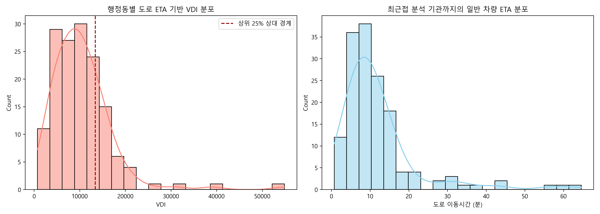
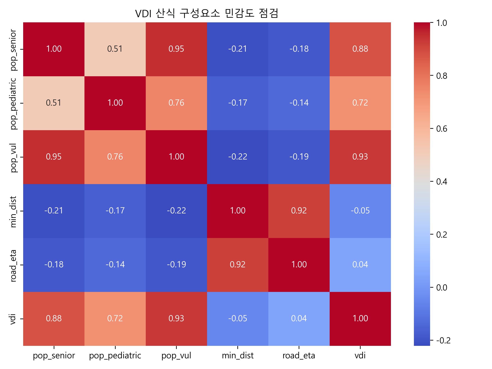
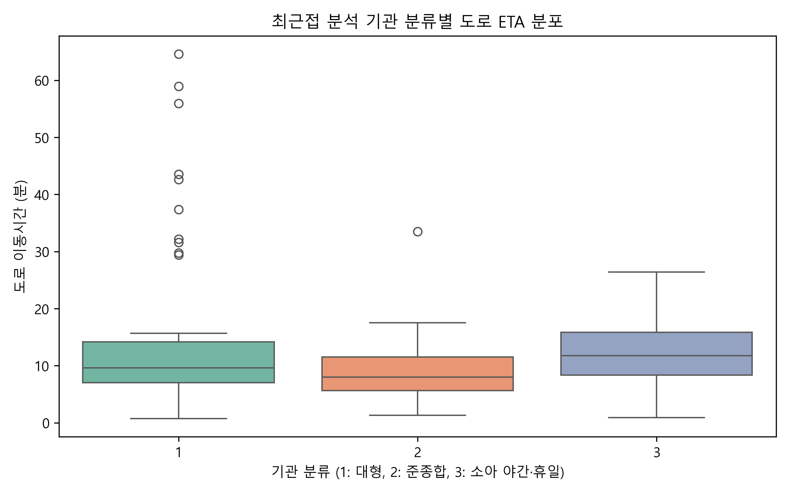
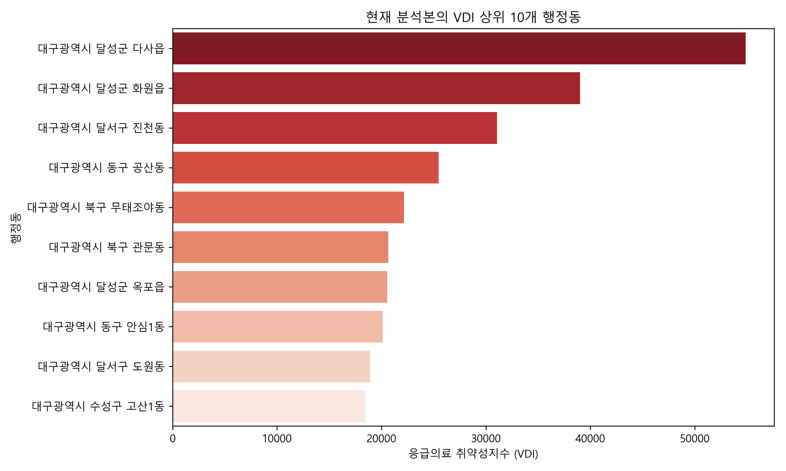
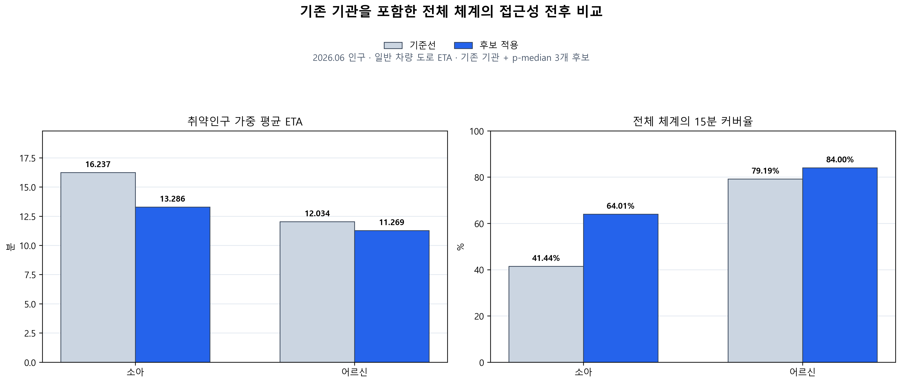

# 대구 골든타임 정책분석 탐색적 데이터 분석(EDA)

이 문서는 `2026-07-18-r2` 내부 분석 식별자에 해당하는 **2026.07.18 검증본**을 탐색적으로 점검합니다. EDA는 현재 데이터의 분포와 변수 관계를 설명하며 의료적 위험 임계값이나 시설 신설 효과를 확정하지 않습니다.

## 1. 데이터 개요 및 기초 구조
- **분석 대상 행정동 수**: 150개
- **고려된 응급의료기관 수**: 25개
- **정책 후보 수**: 9개
- **검증된 도로 경로**: 5,100건 / 누락 0건
- **인구 기준월**: 2026.06
- **취약 인구 평균**: 4372.7명 / 행정동

분석본 생성 단계에서 행정동 150개, 기관 25개, 후보 9개와 경로 5,100개의 계약을 검사합니다. 병원·행정동·후보·후보 추적·최적화 자료의 SHA-256도 단일 릴리스 메타데이터와 대조합니다. 이 검사는 구조적 완전성과 파일 계보를 의미하며 원천자료의 임상적 타당성이나 최신성을 자동으로 보증하지는 않습니다.

## 2. 데이터 품질 관리와 실패 안전성
검증본의 품질 처리는 실제 코드와 산출물에 기록된 다음 규칙으로 한정합니다.

- **도로 연결 좌표 재시도**: Kakao Mobility가 원 좌표의 경로를 반환하지 못하면 출발지 또는 목적지 주변의 작은 좌표 오프셋을 순차적으로 시도합니다. 보정 오프셋은 경로별로 기록하며, 현재 5,100건 중 460건에 보정 기록이 있습니다. 보정 거리의 평균은 0.311km, 최댓값은 0.573km이고 허용 한도 0.75km를 넘으면 생성기가 실패합니다.
- **좌표 보정 집중도**: 보정 460건은 전체 경로의 9.02%지만 출발지 5곳·목적지 33곳에 집중됩니다. 특히 `candidate:pediatric:6`과 `candidate:senior:2`는 목적지 보정이 각각 150건이므로, 460건을 서로 독립적인 460개 위치 문제로 해석하지 않습니다.
- **경로 누락 처리**: 누락 경로를 임의 ETA로 대치하지 않습니다. 현재 검증본은 성공 5,100건·누락 0건이며, 누락이 하나라도 있으면 도로 행렬 검증을 통과하지 못합니다.
- **최근접 기관 동률 처리**: ETA 최솟값과 저장 기관이 일치하는지 검사합니다. 현재 ETA 동률 행정동은 1곳이며 수치 영향은 없지만, 재생성 시에는 ETA와 기관 키를 함께 정렬해 이름 표시를 고정합니다.
- **최근 조회 병상 결측 처리**: 시민 서비스에서 병상 조회 실패를 `0`이나 진료 가능으로 바꾸지 않습니다. 이전 캐시 또는 기본 기관정보는 유지하되 병상값은 미확인으로 표시하고 전화 확인을 안내합니다. 이 운영 데이터는 고정된 정책분석 ETA와 별개입니다.

전체 점검 결과와 기준일·원천별 최신성은 [데이터 품질 보고서](DATA_QUALITY_REPORT.md)를 정본으로 사용합니다.

## 3. 응급의료 접근성 및 VDI 분포
행정동별 취약성 지표의 기초 분포를 파악합니다.

**해석(Insights)**:
- 도로 ETA 기반 VDI는 749.83~38,827.48, 평균 10,155.58, 중앙값 9,438.26입니다.
- 현재 분석본은 VDI 상위 25%를 우선 확인 대상으로 구분하며 상대 경계값은 13,261.43, 해당 행정동은 38개입니다.
- 일반 차량 ETA는 0.73~64.58분입니다. 이는 수집 시점의 분석용 경로이며 119 구급차 이송시간이 아닙니다.

## 4. VDI 산식 구성요소와 민감도 점검
현재 VDI는 `ln(1 + 일반 차량 ETA) × 취약인구`로 정의됩니다. 따라서 VDI와 취약인구·ETA의 상관은 독립적인 발견이 아니라 산식에 포함된 구성요소가 결과에 미치는 구조적 민감도를 점검하는 값입니다.

**해석(Insights)**:
- 현재 VDI와 취약인구의 피어슨 상관계수는 0.915, 도로 ETA와의 상관계수는 0.034입니다.
- **통계적 의미**: 두 변수는 모두 VDI 산식의 구성요소이므로 이 상관은 독립적인 외부 타당성 검증이나 인과 효과가 아닙니다. 현재 150개 행정동의 값 범위와 `ln` 변환을 적용한 산식 안에서 취약인구가 ETA보다 결과에 더 강하게 결합돼 있음을 보여주는 구성요소 민감도 점검입니다.

| 대안 산식 | 기준선과 Spearman 순위상관 | 상위 10개 겹침 | 중앙 순위 이동 | 최대 순위 이동 |
|---|---:|---:|---:|---:|
| `ln(1+ETA) × ln(1+취약인구)` | 0.518 | 2/10 | 19.0위 | 134위 |
| 로그 구성요소 Min-Max 정규화 후 동일가중 합 | 0.935 | 7/10 | 7.0위 | 70위 |

- **정책적 시사점**: 인구 로그 곱셈 대안은 상위 10개 중 2개만 유지되고 순위상관이 0.518이어서 현재 우선순위가 산식 선택에 민감합니다. 동일가중 정규화 대안은 상위 10개 중 7개를 유지하지만 최대 70위 이동이 남습니다. 따라서 현재 VDI는 확정 서열이 아니라 한 가지 내부 우선순위 기준으로만 사용하고, 가중 ETA·15분 커버율과 함께 판단해야 합니다.

## 5. 병원 티어별 접근성 비교

**해석(Insights)**:
- 분류별 상자그림은 행정동별 최근접 분석 기관의 도로 ETA 분포를 비교합니다.
- 기관 분류는 서비스·분석을 위한 프로젝트 내부 분류이며 개별 환자의 진료 가능성이나 병원의 실제 수용 역량 순위를 뜻하지 않습니다.

## 6. 최우선 취약 지역 (Top 10) 파악

**해석(Insights)**:
- 현재 상위 3개는 달성군 화원읍, 달성군 다사읍, 달서구 진천동입니다.
- 상위 지역은 취약인구와 일반 차량 ETA가 결합된 결과입니다. 순위만으로 시설 신설·이동형 진료·예산 투입을 확정할 수 없습니다.

## 7. 기존 기관 포함 전체 체계의 접근성 전후 비교
p-median의 3개 후보 조합을 적용하되 기존 기관을 제거하지 않고, 행정동별로 기존 기관과 선택 후보 중 더 짧은 ETA를 사용해 전후를 비교합니다.

**해석(Insights)**:
- 소아 후보 1, 3, 4 적용 시 취약인구 가중 평균 ETA는 15.932분에서 12.969분으로 줄고, 전체 체계의 15분 커버율은 42.94%에서 66.25%로 증가합니다.
- 어르신 후보 1, 2, 3 적용 시 취약인구 가중 평균 ETA는 11.890분에서 11.155분으로 줄고, 전체 체계의 15분 커버율은 79.37%에서 84.24%로 증가합니다.
- 전체 체계의 30분 커버율은 소아 97.86%→98.72%, 어르신 94.16%→95.30%입니다. 기준선부터 높아 주 KPI가 아니라 외곽권 누락 감시용 보조 지표로 둡니다.
- 결과는 후보군 내부의 수학적 비교이며 대구 전역의 전역 최적해, 시설 건립 효과, 실제 환자 수용 성과를 의미하지 않습니다.

## 결론 및 후속 과제 (Next Steps)
- **결론**: 현재 분석은 인구가 많은 도시권과 이동시간이 긴 외곽권을 함께 확인해야 함을 보여줍니다.
- **후보지 도출 근거(9곳)**: 정책 후보 9곳은 `K=9`로 한 번 실행한 결과가 아닙니다. K=2~5·난수 시드·거리 상한·군위 처리 조건을 조합해 소아 240회와 어르신 240회를 실행하고, 반경 3km 안에서 반복 출현한 중심점을 병합해 안정·보류·별도 권역 후보로 구성한 결과입니다.
- **데이터 한계**: ETA는 수집 시점의 일반 차량 경로이며 병상·의료진·구급차 우선통행·실제 환자 흐름을 반영하지 않습니다.
- **후속 과제**: 원천 수집일 확정, 시간대별 반복 수집, 실제 이송자료를 이용한 외부 타당성 검증이 필요합니다. 검증 전 후보는 현장조사 우선순위로만 해석합니다.
